# ГЛАВА 2. ЧИСЛЕННОЕ МОДЕЛИРОВАНИЕ И ИССЛЕДОВАНИЕ ВОЗМОЖНОСТЕЙ РЕГРЕССИОННОГО АНАЛИЗА ДЛЯ ИДЕНТИФИКАЦИИ НЕЛИНЕЙНЫХ ПРОЦЕССОВ

## 2.1. Постановка задачи и методология вычислительного эксперимента

### Введение и цель эксперимента
Теоретический анализ, проведенный в первой части работы, показал, что социально-экономические системы развиваются в условиях ограниченных ресурсов и часто демонстрируют нелинейное поведение. Традиционным инструментом анализа таких процессов в эконометрике являются линейные регрессионные модели (в частности, авторегрессия). Однако возникает фундаментальный вопрос: насколько корректно линейные методы способны описывать, идентифицировать и прогнозировать сложные нелинейные режимы, такие как цикличность, бифуркации и динамический хаос?

Целью данной главы является проведение вычислительного эксперимента для верификации гипотезы о применимости линейных регрессионных моделей к анализу детерминированных нелинейных процессов.

В отличие от работы с реальными статистическими данными, где истинный закон генерации данных неизвестен и зашумлен, вычислительный эксперимент позволяет использовать **синтетические данные**. Это дает возможность сравнивать результаты эконометрического моделирования с «истиной» (генерирующим уравнением) и объективно оценивать качество идентификации параметров и точность прогноза.

### Объекты исследования: Типология нелинейных моделей
В рамках эксперимента исследуются три класса дискретных отображений, описывающих различные типы реакции системы на ограничения роста. Все модели рассматриваются в нормированном виде, где ограничение ресурса $K$ принято за единицу масштаба.

**1. Базовая модель (Мгновенная реакция)**
Основана на логистическом отображении Ферхюльста. Предполагается, что темп прироста зависит исключительно от текущего размера системы.
$$ X_{n+1} = X_n + A X_n (K - X_n) $$
Где $A$ — параметр интенсивности. Эта модель описывает безынерционные системы.

**2. Модель с запаздыванием (Глубокая память)**
Описывает ситуации, когда доступность ресурса определяется состоянием системы в предыдущий период (лаговая зависимость). Это характерно для инвестиционных циклов, сельскохозяйственных рынков и демографии.
$$ X_{n+1} = X_n + g X_n (K - X_{n-1}) $$
Где $g$ — параметр интенсивности. Ключевая особенность — зависимость от $X_{n-1}$.

**3. Смешанная (Комбинированная) модель**
Наиболее общий случай, учитывающий как текущее давление ограничений, так и инерцию прошлого.
$$ X_{n+1} = X_n + q X_n (K - X_n - \gamma X_{n-1}) $$
Где $q$ — интенсивность, а $\gamma$ — коэффициент памяти, определяющий вес предыстории.

### Алгоритм проведения эксперимента
Для каждого типа модели реализуется унифицированный протокол исследования, включающий четыре этапа. Реализация выполнена в среде **Jupyter Notebook** с использованием библиотек научного программирования на языке **Python** (`NumPy`, `Pandas`, `Statsmodels`, `Scikit-learn`).

**Этап 1. Генерация временных рядов**
Для каждого типа модели формируются наборы данных (сценарии) с различными значениями управляющих параметров ($A, g, q$). Значения параметров подбираются таким образом, чтобы охватить все динамические режимы согласно сценарию Фейгенбаума:
*   Монотонный рост (устойчивое равновесие);
*   Затухающие колебания;
*   Предельные циклы (бифуркации удвоения периода);
*   Переходные процессы на границе устойчивости;
*   Развитый динамический хаос.

**Этап 2. Фазовый анализ**
Для визуальной диагностики типа динамики строятся фазовые портреты (зависимость $X_{n+1}$ от $X_n$). Это позволяет оценить топологию аттрактора: является ли он точкой, линией (параболой) или сложной структурой (инвариантной окружностью, странным аттрактором).

**Этап 3. Эконометрическое моделирование (Авторегрессия)**
К сгенерированным временным рядам применяются методы линейного регрессионного анализа для построения модели вида:
$$ \omega_{n+1} = const + \sum_{i=0}^{k} \beta_i \cdot Lag_i + \xi_n $$
Где $\omega$ — темп прироста. Используются два метода отбора предикторов (аналогично пакетам SPSS/Statistica):
1.  **Принудительное включение (Method Enter):** Включение всех лагов для оценки мультиколлинеарности.
2.  **Пошаговый отбор (Stepwise Selection):** Автоматический отбор значимых переменных для проверки способности алгоритма выявить истинную структуру лагов (отличить $X_n$ от $X_{n-1}$).

Особое внимание уделяется анализу стандартизированных **Бета-коэффициентов**, которые позволяют ранжировать факторы по силе влияния, и коэффициенту детерминации $R^2$ как мере объясняющей способности модели.

**Этап 4. Сравнительное прогнозирование (Решение обратной задачи)**
На финальном этапе проводится проверка прогностической силы полученных регрессионных уравнений. Строится итеративный прогноз на 100–150 шагов вперед, который сравнивается с истинной траекторией системы. Это позволяет выявить «горизонт прогнозирования» в условиях хаоса и проверить устойчивость линейной аппроксимации.

## 2.2 Описание базовой модели и сценариев эксперимента

В данной главе представлены результаты численного моделирования и регрессионного анализа процессов, порождаемых базовым логистическим отображением. Исследование направлено на выявление возможностей и ограничений линейных эконометрических методов при идентификации параметров и прогнозировании динамики безынерционных нелинейных систем.

В качестве объекта исследования рассматривается дискретное логистическое уравнение (отображение Ферхюльста), описывающее развитие системы в условиях ограниченных ресурсов при отсутствии запаздывания реакции:

$$ X_{n+1} = X_n + A X_n (K - X_n) $$

Где $X_n$ — состояние системы в момент времени $n$, $K$ — предельная емкость среды (потенциал роста), $A$ — параметр интенсивности процесса. Для унификации расчетов принято значение $K=1$. Ключевым управляющим параметром, определяющим динамический режим системы, является произведение $AK$ (нормированная интенсивность).

В ходе эксперимента были исследованы пять сценариев, соответствующих различным этапам сценария удвоения периода (сценария Фейгенбаума):
1.  **$AK = 0.8$**: Монотонный рост к устойчивому состоянию равновесия (S-образная кривая).
2.  **$AK = 1.5$**: Затухающие колебания вблизи точки равновесия.
3.  **$AK = 2.2$**: Устойчивый предельный цикл периода 2 (бифуркация удвоения периода).
4.  **$AK = 2.52$**: Сложный цикл периода 4 (граница перехода к хаосу).
5.  **$AK = 2.8$**: Развитый динамический хаос (странный аттрактор).

Для каждого сценария проводился анализ временных рядов, построение фазовых портретов и оценка параметров авторегрессионных моделей вида $\omega_{n+1} = f(X_n, X_{n-1}, \dots)$, где $\omega$ — темп прироста.

### Режимы устойчивого равновесия ($AK = 0.8$ и $AK = 1.5$)

В сценариях с низкой интенсивностью система демонстрирует стремление к стационарному состоянию (аттрактору типа «фиксированная точка»).

**Фазовый анализ:** Фазовые портреты представляют собой набор точек, идеально ложащихся на параболическую кривую $X_{n+1} = f(X_n)$, что подтверждает детерминированный характер процесса и отсутствие скрытых переменных.

**Регрессионный анализ:**
Применение метода пошагового отбора (Stepwise) показало высокую эффективность линейной авторегрессии в данных режимах.
*   **Коэффициент детерминации ($R^2$):** Равен $1.000$, что свидетельствует о полной объясняющей способности модели.
*   **Структурная идентификация:** Алгоритм корректно выделил единственную значимую переменную — текущее состояние $X_n$. Влияние лаговых переменных ($X_{n-1}, X_{n-2}$ и др.) признано статистически незначимым.
*   **Параметрическая идентификация:** Значения стандартизированных Бета-коэффициентов при $X_n$ ($-0.8$ и $-1.5$ соответственно) с высокой точностью совпадают с теоретическими значениями параметра $-AK$, следующими из линеаризации исходного уравнения.

**Сравнительное прогнозирование:**
Итеративный прогноз на 150 шагов вперед полностью совпадает с истинной траекторией процесса.

**Вывод:** В условиях стабильной динамики линейные регрессионные модели являются адекватным инструментом описания и прогнозирования нелинейных процессов логистического типа.

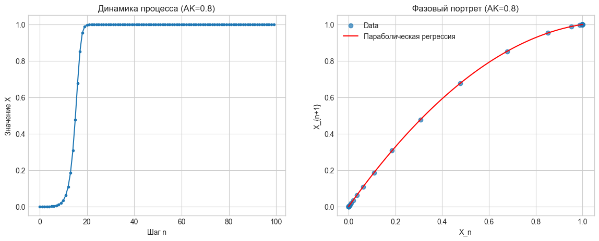
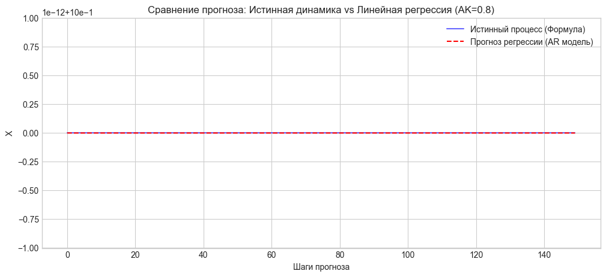
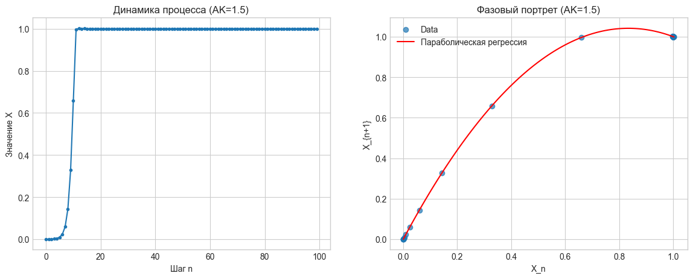
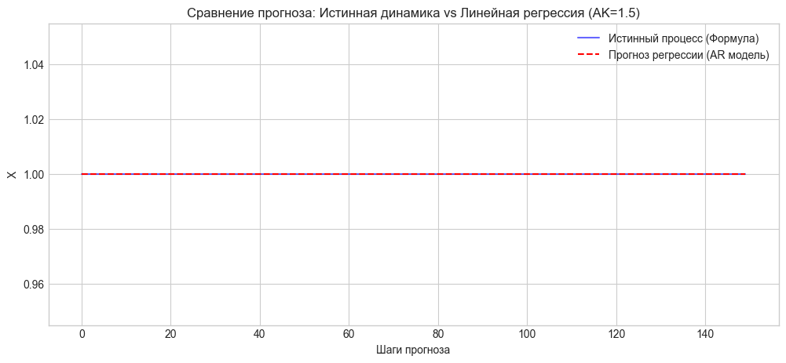

### Режим циклической динамики ($AK = 2.2$)

При переходе через точку первой бифуркации система попадает в режим устойчивых автоколебаний с периодом 2.

**Динамика и фазовый портрет:** Временной ряд демонстрирует пилообразную структуру («высокое — низкое» значение). На фазовом портрете точки группируются в два кластера, лежащие на параболе.

**Аномалии регрессионного анализа:**
Несмотря на сохранение высокого качества подгонки ($R^2 = 1.0$), алгоритм пошагового отбора выявил в качестве значимых предикторов не только $X_n$, но и переменную **$Lag\_2$ ($X_{n-2}$)**.

*Интерпретация:* С физической точки зрения зависимость текущего состояния от состояния два шага назад в уравнении отсутствует. Появление переменной $Lag\_2$ в модели является следствием периодичности процесса ($X_n \approx X_{n-2}$). Статистический алгоритм интерпретировал цикличность как причинно-следственную связь, что является примером **ложной корреляции** (spurious correlation).

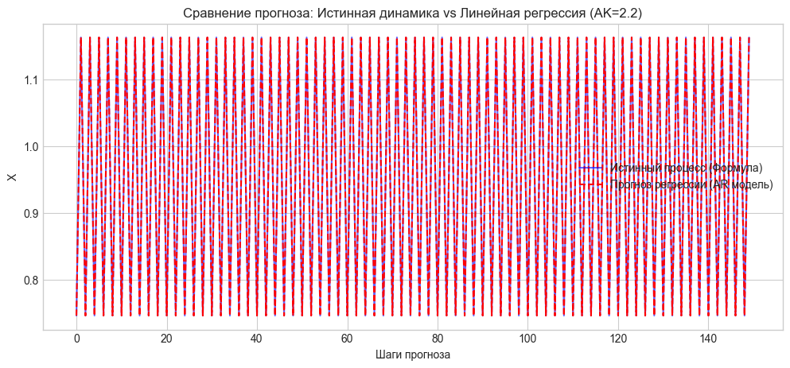

### Граница хаоса и проблема мультиколлинеарности ($AK = 2.52$)

В режиме сложного цикла (период 4) наблюдаются существенные затруднения в работе алгоритмов автоматического отбора переменных.

**Результаты моделирования:** Алгоритм Stepwise столкнулся с проблемой сходимости (зацикливанием) и выделил набор переменных: `['X_n', 'Lag_4', 'Lag_10']`.
*   Появление переменной **$Lag\_4$** обусловлено периодом цикла (значения повторяются каждые 4 такта).
*   Появление переменной **$Lag\_10$** объясняется арифметикой цикла: $10 \equiv 2 \pmod 4$. Таким образом, $Lag\_10$ несет ту же информацию, что и $Lag\_2$, выступая статистическим дублером.

**Вывод:** В точках бифуркации и сложных циклов стандартные эконометрические методы склонны к переобучению и включению в модель избыточных переменных, не имеющих физического смысла, из-за высокой мультиколлинеарности лаговых значений.

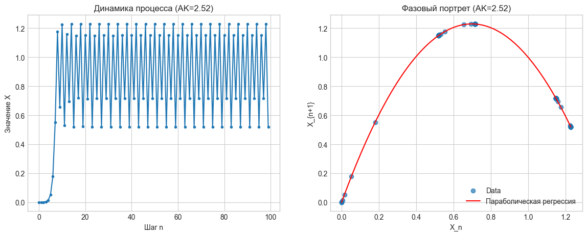
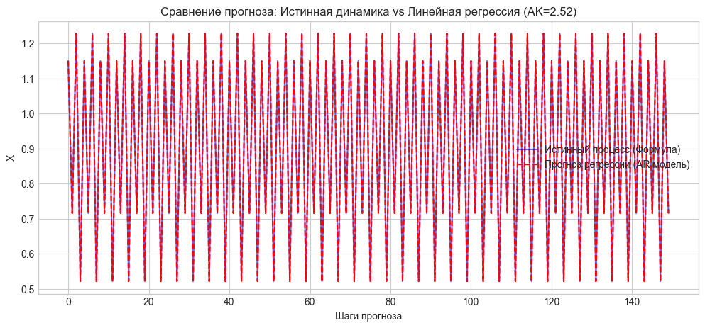

### Режим развитого динамического хаоса ($AK = 2.8$)

Данный сценарий является наиболее критичным для оценки границ применимости линейных моделей.

**Визуальный анализ:** Динамика процесса визуально неотличима от стохастического шума. Однако фазовый портрет сохраняет четкую структуру параболы, что доказывает детерминированную природу наблюдаемого хаоса.

**Парадокс качества модели ($R^2 = 1.000$):**
Линейная регрессия продемонстрировала идеальное качество аппроксимации на обучающей выборке. Это объясняется спецификой логистического отображения: зависимость темпа прироста $\omega$ от $X_n$ является строго линейной ($\omega = A - A X_n$). Таким образом, регрессия смогла точно восстановить закон эволюции системы.

**Сравнительное прогнозирование и «Эффект бабочки»:**
Несмотря на идеальное описание прошлого, прогностическая способность модели оказалась ограниченной. График сравнения прогнозов показывает, что траектория, построенная регрессионной моделью, совпадает с истинной лишь на горизонте около 70–80 шагов. В дальнейшем наблюдается **расхождение траекторий**: прогноз теряет фазовую синхронизацию с истинным процессом, хотя и сохраняет схожие статистические характеристики (амплитуду и дисперсию).

**Причина расхождения:** Явление чувствительности к начальным условиям, характерное для странных аттракторов. Микроскопические погрешности в оценке коэффициентов регрессии или округлении данных экспоненциально нарастают в ходе итеративного прогнозирования, что делает долгосрочный точечный прогноз принципиально невозможным за пределами горизонта Ляпунова.

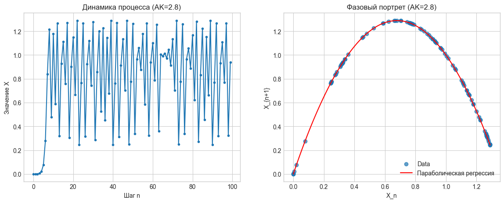
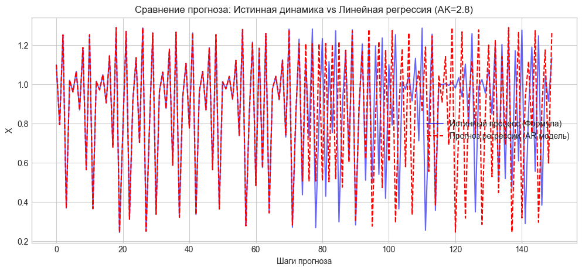

### Выводы по базовой модели

Проведенное исследование базовой модели позволило сформулировать следующие выводы:

1.  **Диагностическая ценность фазовых портретов.** В условиях сложной динамики, визуально напоминающей хаос, построение фазовых портретов является необходимым этапом анализа, позволяющим выявить скрытый детерминированный закон (аттрактор) и отличить его от случайного шума.
2.  **Риск ложных корреляций.** В циклических режимах алгоритмы автоматического отбора переменных склонны находить несуществующие зависимости от дальних лагов, принимая периодичность процесса за наличие «глубокой памяти».
3.  **Ограниченность прогноза в хаосе.** Высокие статистические показатели качества модели ($R^2 \approx 1$) являются необходимым, но не достаточным условием для точности долгосрочного прогнозирования. В режиме динамического хаоса горизонт прогноза ограничен внутренней неустойчивостью системы к малым возмущениям, что требует перехода от точечных прогнозов к сценарным или вероятностным оценкам.

### Детализация динамики (стадии жизненного цикла + короткие окна) и сравнение с хаосом 

#### 1. Постановка задачи и методология

В соответствии с рекомендацией научного руководителя выполнена детализация исследования базовой логистической модели Ферхюльста в форме:

$$
X_{n+1}=X_n + A X_n (K - X_n), \qquad K=1.
$$

Цель дополнения — проверить применимость регрессионного анализа **в условиях коротких выборок**, поскольку в реальной социально-экономической практике исследователь чаще наблюдает **не всю траекторию**, а лишь **локальные фрагменты**, соответствующие отдельным этапам развития процесса.

Чтобы связать “классическое” исследование режимов (стабильность/цикл/хаос) с практикой коротких рядов, использованы два взаимодополняющих подхода:

1. **Стадийная сегментация (жизненный цикл)** — выделение на S-кривой четырёх стадий по уровню освоения потенциала $X/K$:

* Зарождение: $X < 0.1K$
* Активный рост: $0.1K \le X < 0.5K$
* Насыщение: $0.5K \le X < 0.95K$
* Плато: $X \ge 0.95K$

2. **Скользящее окно фиксированной длины** ($window=25$) — моделирование ситуации, когда доступен лишь короткий временной отрезок; в каждом окне оцениваются параметры авторегрессионной модели темпов прироста с лагами до 10 (как в ТЗ).

Рассматривалась зависимость темпа прироста:

$$
\omega_{n+1}=\frac{X_{n+1}-X_n}{X_n}
$$

от текущего уровня $X_n$ и лагов $X_{n-1},...,X_{n-10}$. Оценивание выполнено двумя способами (терминология SPSS):

* **ENTER**: принудительное включение всех регрессоров;
* **STEPWISE**: пошаговый отбор значимых переменных.

Дополнительно рассчитаны **стандартизированные Beta-коэффициенты**, позволяющие сравнивать влияние факторов на общей шкале и выявлять доминирующие переменные в условиях мультиколлинеарности.

#### Визуальная диагностика объектов исследования

S-кривая и стадии жизненного цикла ($A=0.1$)

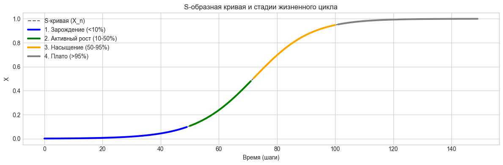

**S-образная кривая и стадии жизненного цикла.**

График демонстрирует классический S-образный рост с выходом на насыщение. Цветовая разметка подчёркивает, что одна и та же траектория может быть интерпретирована как последовательность **локально однородных фаз**, каждая из которых потенциально доступна для наблюдения в реальных данных.

Сравнение с хаосом ($A=2.8$)

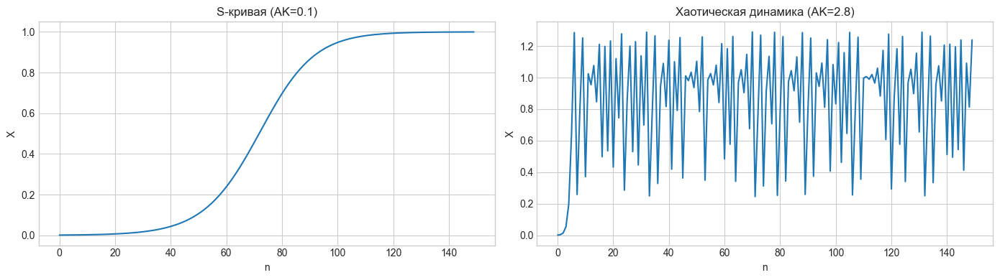

**Сравнение: S-кривая ($A=0.1$) vs хаотическая динамика ($A=2.8$).**

В отличие от S-кривой, хаотический режим не демонстрирует последовательных стадий роста/насыщения: колебания возникают почти сразу, а динамика визуально напоминает шум. Следовательно, **сегментация “жизненного цикла” применима именно к S-траекториям**, тогда как для хаоса “короткие данные” интерпретируются иначе — как тест устойчивости оценок и ложных корреляций.

#### Результаты локального анализа по стадиям (жизненный цикл)

##### Табличные результаты (ENTER и STEPWISE, lags=10)

Полученные оценки для четырёх стадий приведены в таблице (на основе вывода кода):

| Стадия        | Инт.   | n  | ENTER R² | STEP R² | B(X_n)    | Beta(X_n)  |
|--------------|-------:|---:|---------:|--------:|----------:|-----------:|
| Зарождение   | 0–50   | 39 | 1.000000 | 1.00    | −0.099676 | −0.994135  |
| Активный рост| 50–72  | 11 | 1.000000 | 1.00    | −0.099873 | −1.004154  |
| Насыщение    | 72–101 | 18 | 0.999971 | 1.00    | −0.100010 | −1.000580  |
| Плато        | 101–150| 38 | 1.000000 | 1.00    | −0.070943 | −0.640854  |

где  
Инт. — интервал наблюдений,  
n — число точек в окне.

**Ключевые наблюдения:**

1. **Структурная идентификация устойчива:** алгоритм Stepwise **во всех стадиях** выбирает только $X_n$. Ни один лаг $X_{n-1}...X_{n-10}$ не признан значимым, что согласуется с отсутствием памяти в базовой модели.

2. **Качество подгонки максимальное:** $R^2\approx 1$ во всех сегментах (и для ENTER, и для STEPWISE). Это соответствует тому факту, что связь $\omega$ и $X_n$ в логистическом отображении имеет точную линейную форму:
   $$
   \omega = A(K - X_n) = A - A X_n \quad (K=1).
   $$

3. **Интерпретация Beta-коэффициентов:** на стадиях зарождения/роста/насыщения $\text{Beta}(X_n)\approx -1$, то есть вклад $X_n$ доминирует и полностью определяет динамику $\omega$. Это удобно для ранжирования факторов в более сложных моделях (когда присутствуют лаги и мультиколлинеарность), и служит “эталоном” для сравнения.

4. **Особенность стадии “Плато”:** в отличие от первых трёх стадий, на стадии насыщения и плато вариативность $X_n$ падает (ряд становится почти константой), поэтому стандартизированный вклад $\text{Beta}(X_n)$ уменьшается по модулю (≈ -0.64). Это **не означает** изменения физического закона, а отражает снижение информативности регрессора в условиях малой дисперсии на плато.

#### Анализ “коротких данных” через скользящее окно

##### Дрейф оценок B(X_n) по окнам (ENTER)

&nbsp;

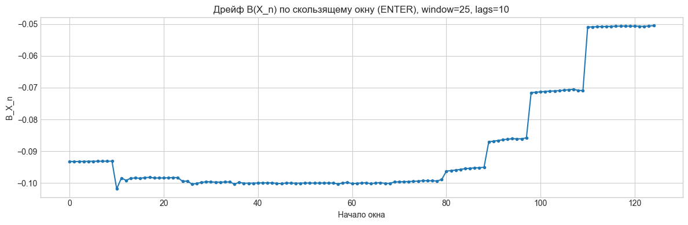

Несмотря на то, что закон генерации данных неизменен, оценка коэффициента $B(X_n)$ демонстрирует **ступенчатый дрейф** при перемещении окна вдоль траектории. Этот эффект интерпретируется следующим образом:

* при переходе окна через разные области S-кривой меняется диапазон наблюдаемых значений $X_n$ и его дисперсия;
* в условиях коротких рядов (25 точек) это приводит к “локальной” перестройке оценок коэффициентов;
* наблюдаемый дрейф — это **методический эффект ограниченности данных**, а не реальный структурный сдвиг процесса.

Таким образом, даже для простого детерминированного процесса возникает важный практический вывод:

> **при коротких выборках параметры регрессии могут “плыть” без изменения закона динамики**, что требует осторожной интерпретации коэффициентов на реальных данных.

#### Частота выбора переменных Stepwise (короткие окна)

   
&nbsp;

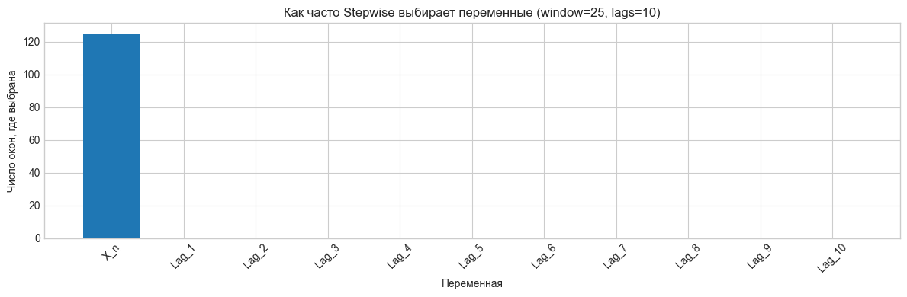

На S-кривой Stepwise **почти во всех окнах** выбирает только $X_n$, а лаговые переменные не появляются. Это подтверждает робастность структурной идентификации при отсутствии памяти.

#### Сопряжение с предыдущими результатами и общий вывод

Полученные результаты дополняют основную часть главы о режимах (стабильность/цикл/хаос) следующим образом:

1. **Для S-образной траектории** (рост и насыщение) сегментация жизненного цикла корректна и позволяет имитировать практику анализа компаний на разных стадиях.

2. **Регрессионный анализ устойчив на коротких сегментах:** даже при ограниченном числе наблюдений модель корректно выявляет структуру зависимости $\omega=f(X_n)$, не “вытягивая” ложные лаги.

3. **Однако коэффициенты на коротких данных демонстрируют дрейф:** это принципиально важная оговорка для практики — изменение оценок может быть следствием ограниченности выборки и смены диапазона переменной, а не структурного сдвига.

4. **Сравнение с хаосом показывает границы интерпретации стадий:** в хаотическом режиме отсутствует смысловая последовательность “зарождение-рост-плато”, поэтому “жизненный цикл” относится к S-траекториям, а для хаоса уместны другие формы локального анализа (скользящее окно как тест нестабильности и ложных корреляций).

### Итоговый вывод

> Проведённая детализация подтвердила, что линейные регрессионные модели темпов прироста способны корректно идентифицировать базовый логистический закон даже на коротких временных фрагментах, соответствующих различным стадиям S-образного роста.
> Вместе с тем показано, что при анализе коротких окон возможно наблюдать дрейф оценок коэффициентов вследствие смены диапазона и дисперсии данных, что требует осторожной интерпретации параметров в прикладных социально-экономических задачах.
> Сравнение с хаотическим режимом подчёркивает, что стадийная интерпретация применима к траекториям роста и насыщения, тогда как для хаоса короткие окна служат инструментом методической диагностики ограничений линейной аппроксимации.

## 2.3. Описание модели с запаздыванием и сценариев эксперимента

В данной главе рассматриваются особенности идентификации и прогнозирования процессов, обладающих «глубокой памятью», где текущая динамика определяется не текущим состоянием системы, а ее предысторией. Исследование проводится на базе логистического отображения с запаздывающим аргументом.

Модель с запаздыванием описывает эволюцию системы, в которой ограничение ресурсов (или реакция рынка) действует с задержкой в один такт времени. Математически это выражается дискретным уравнением:

$$ X_{n+1} = X_n + g X_n (K - X_{n-1}) $$

В нормированном виде ($K=1$) единственным управляющим параметром является $g$ (нормированная интенсивность). Принципиальное отличие от базовой модели заключается в том, что темп прироста зависит от $X_{n-1}$, а не от $X_n$. Это превращает систему из одномерной в двумерную (для описания состояния требуется вектор $[X_n, X_{n-1}]$).

Для анализа были выбраны пять сценариев, охватывающих основные динамические режимы согласно теории устойчивости дифференциально-разностных уравнений:
1.  **$g = 0.2$**: Монотонный (апериодический) рост к состоянию равновесия.
2.  **$g = 0.8$**: Колебательный переходный процесс (затухающие колебания).
3.  **$g = 1.05$**: Потеря устойчивости равновесия через бифуркацию Андронова-Хопфа (возникновение квазипериодических колебаний).
4.  **$g = 1.25$**: Режим хаотических биений (слабый хаос).
5.  **$g = 1.6$**: Критический режим («жесткий хаос»), приводящий к коллапсу системы из-за перерегулирования.

### Режим монотонного роста ($g = 0.2$)

**Фазовый анализ:** Фазовый портрет ($X_{n+1}$ vs $X_n$) представляет собой линию с небольшим изгибом, визуально схожую с параболой базовой модели, что свидетельствует о доминировании линейной составляющей динамики на этапе роста.

**Регрессионный анализ:**
Метод пошагового отбора продемонстрировал способность алгоритма различать типы динамики.
*   **Выбор переменных:** В отличие от базовой модели, где выбирался $X_n$, здесь алгоритм Stepwise корректно отобрал переменную **$Lag\_1$ ($X_{n-1}$)** как единственный значимый предиктор.
*   **Параметрическая идентификация:** Коэффициент регрессии составил $-0.2$, что точно соответствует теоретическому значению $-g$.
*   **Качество модели:** $R^2 = 1.000$. Прогноз полностью совпадает с истинной траекторией.

**Вывод:** Линейная регрессия успешно диагностирует наличие запаздывания в системе в условиях стабильного роста.

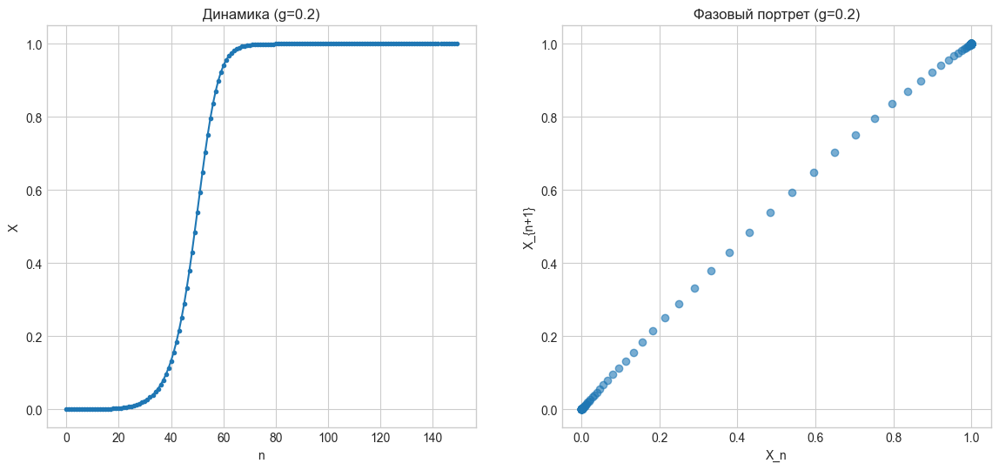
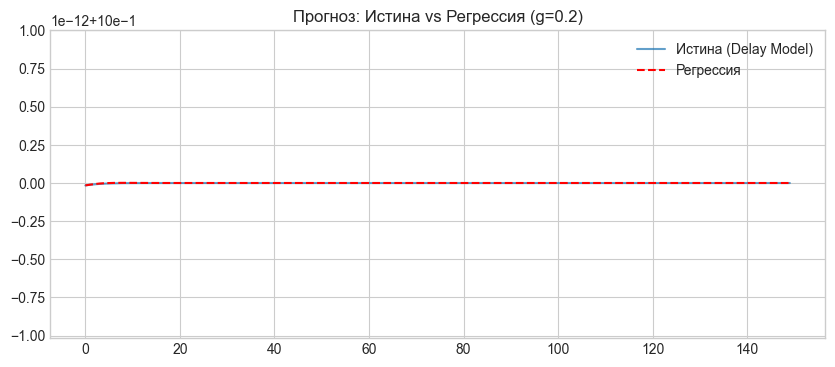

### Режим затухающих колебаний ($g = 0.8$) и эффект «вычислительного шума»

В данном сценарии процесс сходится к равновесию через серию затухающих колебаний.

**Аномалия отбора переменных:**
При сохранении идеального $R^2=1.000$, алгоритм Stepwise включил в модель наряду со значимым $Lag\_1$ также переменные **$Lag\_3$ и $Lag\_9$**. Коэффициенты при этих переменных оказались ничтожно малы ($\sim 10^{-16}$), что соответствует уровню машинного нуля (machine epsilon) для типа данных `float64`.

**Проблема устойчивости прогноза:**
График сравнительного прогнозирования выявил серьезный дефект: после 100 шагов стабильности траектория регрессионной модели начинает **самопроизвольно раскачиваться**, расходясь с истинным процессом.
*   *Причина:* Эффект переобучения на шуме. Включение в рекуррентную формулу прогноза «мусорных» коэффициентов привело к накоплению ошибок округления и появлению паразитных собственных частот в линейной модели.

**Вывод:** Стремление статистических алгоритмов к максимизации $R^2$ может приводить к включению в модель вычислительных артефактов, что снижает робастность модели на длительных горизонтах прогнозирования.

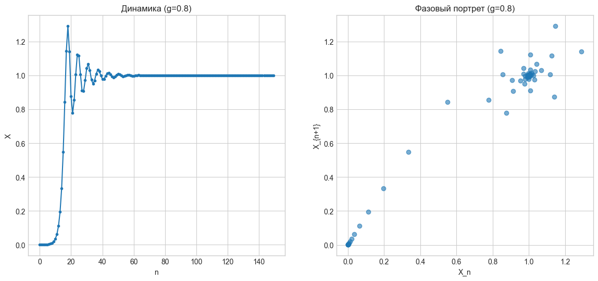
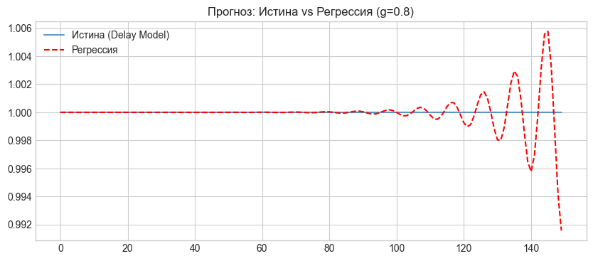

### Бифуркация и возникновение инвариантной кривой ($g = 1.05$)

При переходе параметра $g$ через критическое значение $1.0$ система теряет устойчивость.

**Топологический анализ:**
Фазовый портрет кардинально меняет структуру: вместо линии точки формируют **замкнутую петлю (инвариантную окружность)**.
*   *Значение:* Это визуальный признак увеличения размерности аттрактора. Система переходит в режим квазипериодического движения, характерного для систем с запаздыванием. Наличие петли на фазовом портрете однозначно указывает на инерционность процесса.

**Катастрофа линейного прогноза:**
Регрессионная модель показала $R^2 = 1.000$ на обучающей выборке, определив коэффициент при $Lag\_1$ равным $-1.05$. Однако прогнозная траектория продемонстрировала **резонансное разрушение**:
*   Поскольку коэффициент обратной связи $|-1.05| > 1$, линейная модель действует как усилитель отклонений.
*   В отсутствие нелинейного сдерживающего фактора (множителя $X_n$ в исходном уравнении), амплитуда колебаний в прогнозе начала экспоненциально расти, что привело к математическому коллапсу модели (выходу за пределы области определения) уже на 15-м шаге.

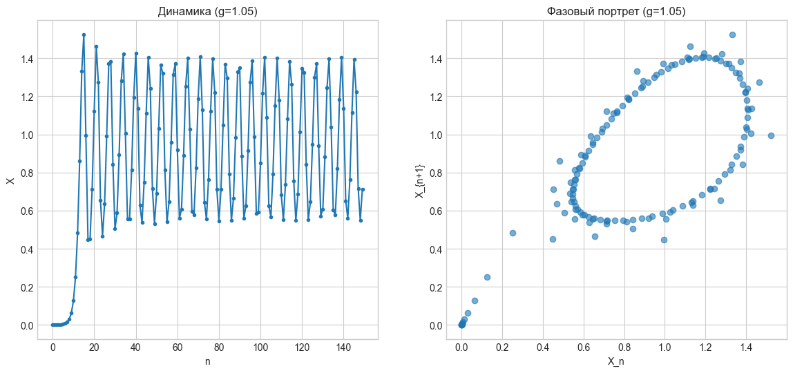
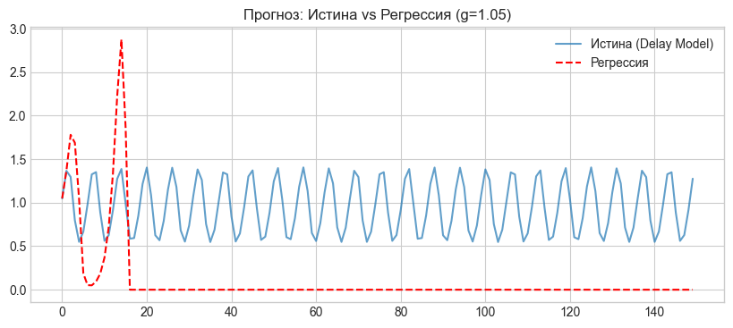

### Хаотические режимы и коллапс системы ($g = 1.25$ и $g = 1.6$)

В режимах развитой неустойчивости наблюдается деформация инвариантной кривой и переход к хаосу.

**Результаты моделирования:**
*   При $g=1.25$ фазовый портрет демонстрирует разрыв замкнутой петли. Линейный прогноз мгновенно расходится с реальностью из-за высокой чувствительности к фазовым сдвигам.
*   При $g=1.6$ происходит «перегрев» системы: слишком сильная реакция на запаздывающий сигнал приводит к резкому скачку и последующему падению до нуля (аналог банкротства). Регрессионный анализ в точке коллапса становится невозможным ($R^2$ падает до 0.27) из-за вырождения временного ряда в константу.

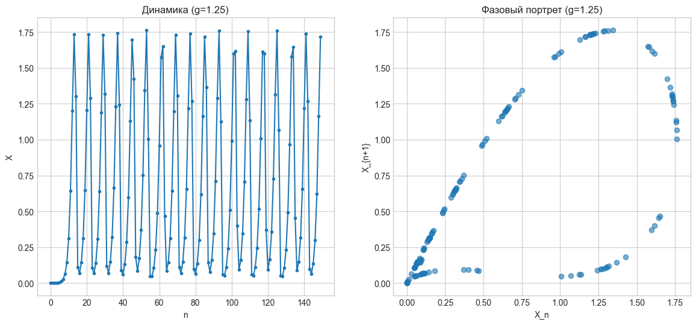
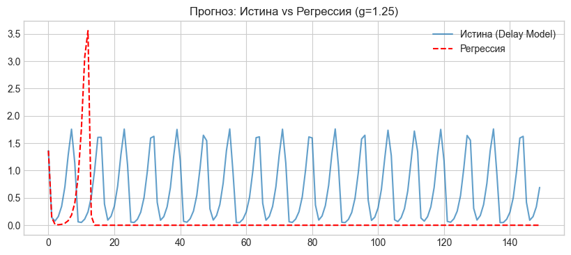
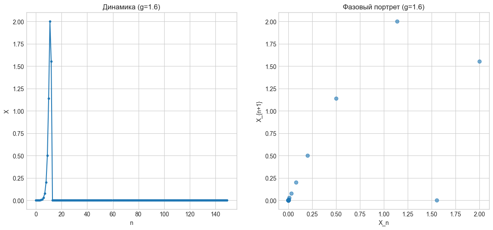
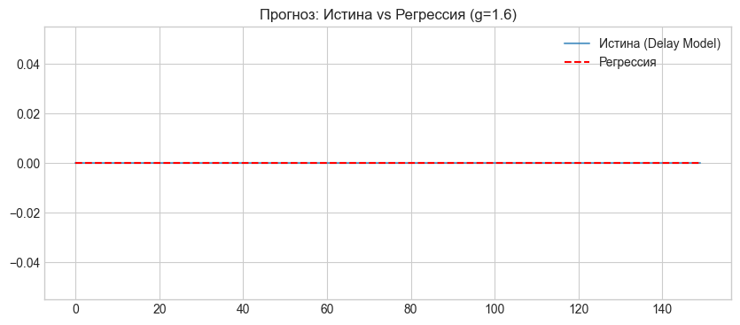

### Выводы по запаздывающей модели

Сравнительный анализ модели с запаздыванием позволил выявить фундаментальные отличия от базовой безынерционной модели:

1.  **Диагностика типа памяти.** Регрессионный анализ (метод Stepwise) является надежным инструментом структурной идентификации: смещение значимого лага с $X_n$ на $X_{n-1}$ позволяет уверенно диагностировать инерционную природу процесса.
2.  **Топологический критерий.** Вид фазового портрета служит индикатором типа нелинейности: трансформация портрета из линии в замкнутую петлю (окружность) свидетельствует о бифуркации Андронова-Хопфа и наличии запаздывания.
3.  **Кризис линейной экстраполяции.** В системах с запаздыванием при параметре интенсивности $g > 1$ наблюдается парадокс: формально идеальная модель ($R^2=1$) абсолютно непригодна для прогнозирования. Линейная аппроксимация неустойчивого цикла неизбежно приводит к резонансному раскачиванию и разрушению прогноза, так как не учитывает механизмы нелинейного насыщения.

### Детализация запаздывающей модели на коротких выборках (стадии + скользящие окна) 

#### Постановка задачи и место эксперимента в работе

В базовой части диплома запаздывающая модель уже была исследована как система с “глубокой памятью”, где темп роста определяется состоянием **предыдущего шага**:

$
X_{n+1} = X_n + g X_n (K - X_{n-1}), \quad K=1.
$

Ключевой вывод той части: **Stepwise сдвигает значимый регрессор с $X_n$ на $X_{n-1}$**, то есть корректно диагностирует наличие запаздывания, а также появляется особая топология фазового портрета (петля) и кризис линейного прогноза при (g>1).

**Цель текущего дополнения (по правке Полунина):** показать, как та же диагностика работает **в условиях коротких рядов**, когда исследователь наблюдает лишь локальные фрагменты траектории (окна), а не всю историю целиком — аналогично тому, как мы делали “детализацию” для базовой модели.

Мы фиксируем параметры “практического анализа” так же, как в базовой детализации:

* скользящее окно: **window = 25**,
* лаги: **lags = 10**,
* два метода оценивания (терминология SPSS): **ENTER** (все регрессоры) и **STEPWISE** (пошаговый отбор),
* анализируем регрессию темпа прироста:

$$
  \omega_{n+1}=\frac{X_{n+1}-X_n}{X_n}
$$
  на $X_n$ и лагах $X_{n-1}\ldots X_{n-10}$.

#### Дизайн эксперимента: “идеальный компромисс” — три режима (g)

Чтобы получить цельный нарратив (рост → колебания → сложная динамика), оставлены **три реперные точки**, которые покрывают разные классы аттракторов:

1. **$g=0.2$** — монотонный рост к насыщению (“жизненный цикл”) + окна
2. **$g=0.8$** — устойчивые затухающие колебания + окна
3. **$g=1.25$** — сложная динамика/хаос + окна

Это напрямую продолжает логику уже написанной главы:

* для $g=0.2$ уже было показано, что Stepwise выбирает **Lag_1** и коэффициент $\approx -g$;
* для $g=0.8$ отмечалась “аномалия отбора” (включение лишних лагов уровня машинного нуля);
* для $g>1$ обсуждался переход к неустойчивости и хаосу, и принципиальная проблема линейного прогноза.

**Новое в этом дополнении** — мы проверяем всё это **не на одном длинном ряде**, а **на множестве локальных окон** и (для $g=0.2$) ещё и **на стадиях жизненного цикла**, как аналог “корпоративных стадий”.

#### Визуальная диагностика режимов 

&nbsp;

* $g=0.2$: S-подобная траектория выхода на насыщение;
* $g=0.8$: затухающие колебания к равновесию;
* $g=1.25$: устойчивые колебания большой амплитуды/сложная динамика.

**Одна и та же модель с памятью при росте (g) меняет тип аттрактора**, и потому “короткие окна” будут вести себя по-разному.

#### $g=0.2$: жизненный цикл + короткие окна

##### Стадийная сегментация (аналог “роста фирмы”)

&nbsp;

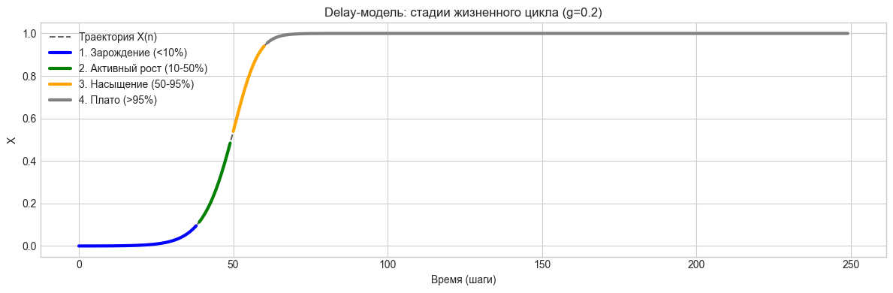

Смысл — тот же, что в базовой модели: проверить, сохраняется ли структура регрессии, когда мы смотрим на “локальные стадии”, а не на весь ряд.

##### Локальная регрессия по стадиям (ENTER/STEPWISE)

Ключевые результаты по стадиям:

* **Зарождение (<10%)**:

  * ENTER: $B(Lag_1)\approx -0.200$, $B(X_n)\approx 0$, $R^2\approx 1$
  * STEPWISE выбирает **только Lag_1**, $R^2=1$

Это идеально подтверждает теоретическую связь:

$$
\omega \approx g - gX_{n-1},
$$
то есть в “чистой памяти” значим именно прошлый шаг.

* **Плато (>95%)**:

  * ENTER всё ещё даёт $R^2 \approx 1$, но коэффициенты “размазываются” между $X_n$ и лагами: $B(X_n)$ и $B(Lag_1)$ уже не такие “чистые”.
  * STEPWISE начинает подбирать комбинации лагов (у вас в примере — несколько лагов и $X_n$ при $R^2=1)$.

**на плато дисперсия ряда мала**, возникает сильная мультиколлинеарность лагов (почти одно и то же число сдвинуто во времени), и Stepwise легко находит “альтернативные” комбинации регрессоров, которые дают тот же идеальный фит. Это ровно продолжает линию диплома про “алгоритмическое стремление к максимизации (R^2)” и риск ложных включений.

**Комментарий про то, что среди результатов стадий сейчас видны только “зарождение” и “плато”.**

Это не “ошибка модели”, а эффект **геометрии траектории + порогов + фильтров регрессии**:

* участки 10–50% и 50–95% по времени получились **слишком короткими** (или после учёта лагов (=10) осталось мало точек), и код их логично отбрасывает как статистически “тонкие”.
  Практически: это можно описать как “в delay-модели при $g=0.2$ фаза активного роста очень компактна во времени, поэтому полноценная эконометрическая идентификация на стадии ‘рост’ требует либо более длинного ряда, либо ослабления фильтра минимального числа наблюдений”.

##### Скользящее окно 

&nbsp;

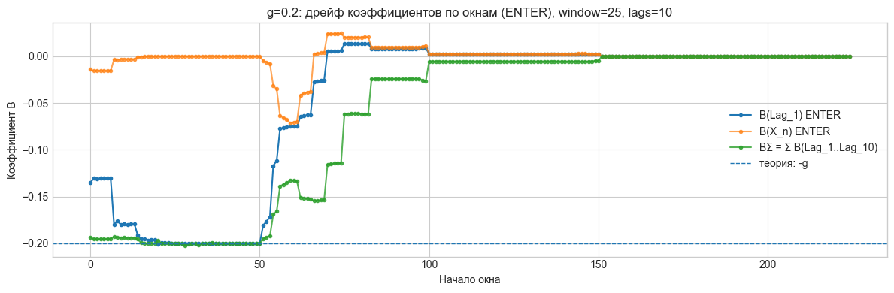

Этот результат показывает “реальную” проблему коротких данных в системе с памятью:

* На ранних окнах сумма лаговых коэффициентов $B_\Sigma$ держится близко к **$-g$** — то есть **суммарный эффект памяти** извлекается корректно, даже если отдельные лаги слегка плавают.
* По мере перехода к насыщению ENTER начинает перераспределять вклад между $Lag_1$ и другими лагами (потому что лаги становятся взаимозаменяемы).
* **Вывод**: в модели с запаздыванием на коротких выборках “правильнее смотреть не на один $B(Lag_1)$, а на агрегат влияния памяти (например $B_\Sigma$)”, потому что он устойчивее к мультиколлинеарности и смене дисперсии.

&nbsp;

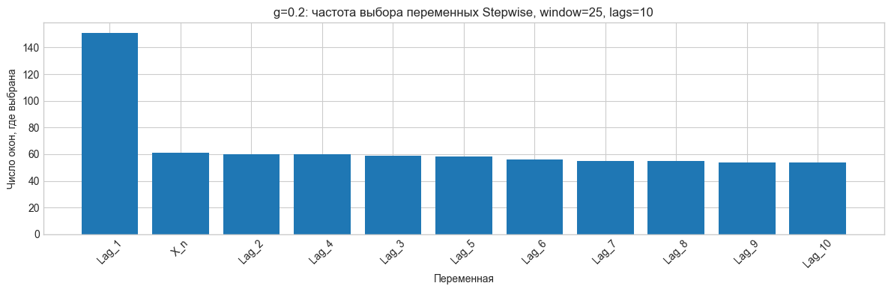

Видно:

* **$Lag_1$ выбирается чаще всего** → структурная идентификация памяти сохраняется.
* Но на части окон появляются и другие лаги → это отражает не смену закона, а взаимозаменяемость лагов на плато и “игру” Stepwise с почти эквивалентными предикторами.

**Итог по $g=0.2$:**

> На траектории роста метод на коротких окнах уверенно выявляет память (доминирование $Lag_1$), а на плато из-за мультиколлинеарности лагов начинается “размазывание” коэффициентов; устойчивее интерпретировать суммарный лаговый эффект $B_\Sigma$.

#### $g=0.8$: затухающие колебания и “усложнение структуры” на окнах

Это режим, который уже был описан как “затухающие колебания + эффект вычислительного шума/аномалия отбора переменных”.

Полученные окна подтверждают и усиливают это:

&nbsp;

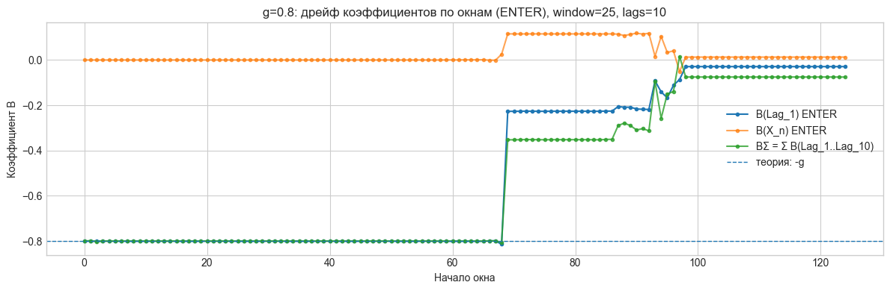

* На ранних окнах сумма лагов $B_\Sigma$ близка к $-g$, но при переходе через область колебаний появляются резкие перестройки оценок.
* Это нормально: разные окна “захватывают” разные фазы колебаний → локальная линейная аппроксимация получается разной.

&nbsp;

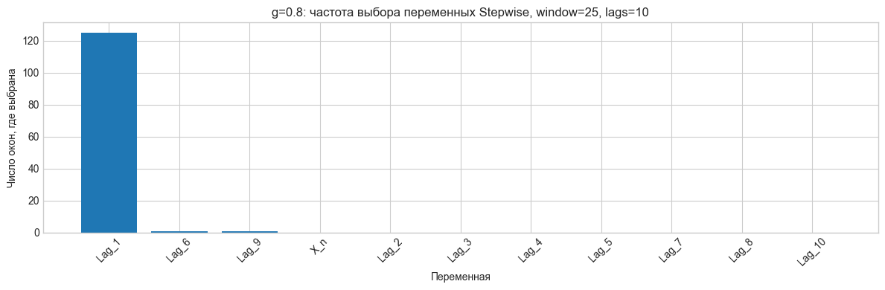

* Практически везде выбирается **$Lag_1$** (доминирующий фактор памяти), а “мусорные лаги” появляются редко/точечно.
  Это хорошо стыкуется с тем, что “лишние лаги” имели коэффициенты уровня машинного нуля: в коротких окнах Stepwise, как правило, удерживает правильную структуру, но на отдельных отрезках может “цеплять” артефакты.

**Сопряжение с уже полученными ранее результатами:**
ранее мы получили “аномалию” на одном обучающем отрезке; теперь видим, что **локально (по окнам) структура в целом стабильна $Lag_1$, но оценки параметров чувствительны к фазе колебаний** — то есть проблема не исчезает, а получает объяснение через “короткие данные”.

#### $g=1.25$: сложная динамика/хаос и ложные лаги на окнах

Ранее этот режим уже фигурировал как зона развитой неустойчивости/хаоса.

Окна добавляют “практическую” деталь:

&nbsp;

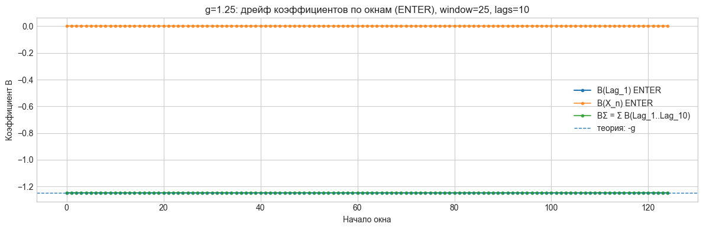

* Практически постоянный $B_\Sigma \approx -1.25$ при нулевом $B(X_n)$ — это выглядит “красиво” как идентификация суммарного эффекта памяти.
* Но это **не означает** хорошего прогноза: ранее уже сформулирована ключевая идея, что при $g>1$ парадоксально сохраняется идеальный фит на истории, но линейный прогноз принципиально плох. Окна лишь подчёркивают: “локально можно идеально подогнать, но глобально предсказать нельзя”.

&nbsp;

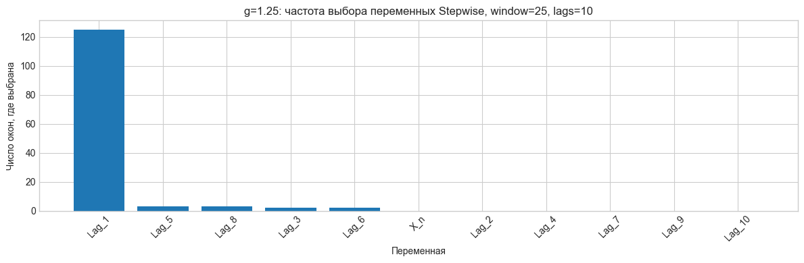

* $Lag_1$ доминирует, но появляются редкие дополнительные лаги.
  Это и есть “ложные лаги” как симптом того, что при сложной динамике короткие окна дают высокие шансы на случайные корреляции (особенно при лаговой мультиколлинеарности).

#### Как это дополнение связывается с детализацией базовой модели

* **В базовой модели** детализация показала: на стадиях и на окнах Stepwise выбирает $X_n$ и почти не тянет лаги → потому что памяти нет, а структура одномерная.
* **В запаздывающей модели** детализация показывает зеркальную картину: на росте и на большинстве окон Stepwise выбирает $Lag_1$ → то есть “короткие данные” всё равно позволяют диагностировать **наличие памяти**.

При этом отличие принципиальное:

* в базовой модели дрейф коэффициентов на окнах — в основном методический эффект смены диапазона $X$;
* в delay-модели добавляется **мультиколлинеарность лагов** (особенно на плато), из-за чего “правильный” эффект памяти может распределяться между несколькими лагами; поэтому появляется полезный диагностический приём — смотреть на **суммарный лаговый эффект $B_\Sigma$**.

## 2.4. Описание смешанной модели и параметров эксперимента

В данной главе рассматривается наиболее общий случай динамики, когда развитие системы определяется как текущим состоянием (мгновенная реакция), так и предысторией (инерция). Исследуется смешанное отображение, являющееся суперпозицией базовой модели и модели с запаздыванием.

Смешанная модель описывает процесс, в котором ограничивающий фактор представляет собой линейную комбинацию текущего и прошлого состояний системы. Математическое уравнение процесса имеет вид:

$$ X_{n+1} = X_n + q X_n (K - X_n - \gamma X_{n-1}) $$

Где $q$ — параметр нормированной интенсивности, а $\gamma$ — коэффициент памяти (вес предыстории). При $\gamma=0$ модель вырождается в базовую (Ферхюльста), при $\gamma \to \infty$ — в модель с чистым запаздыванием.

В ходе эксперимента исследовалось влияние величины коэффициента памяти на динамику и устойчивость системы. Были рассмотрены два режима:
1.  **Сильная память ($\gamma = 0.5$):** Влияние прошлого составляет половину от влияния настоящего.
2.  **Слабая память ($\gamma = 0.1$):** Доминирует текущая конъюнктура, влияние прошлого невелико.

Для каждого режима варьировался параметр $q$, чтобы охватить спектр состояний от устойчивости до хаоса.

*Анализ результатов для режима сильной памяти ($\gamma = 0.5$)*

###  Устойчивый рост ($q = 1.5$)

**Динамика:** Система демонстрирует быстрый выход на насыщение с характерным «перелетом» (overshoot) и стабилизацией в точке равновесия $X^* = \frac{1}{1+\gamma} \approx 0.67$.

**Регрессионный анализ:**
Метод Stepwise безошибочно идентифицировал структуру процесса.
*   **Отобранные переменные:** $X_n$ и $Lag\_1$ ($X_{n-1}$).
*   **Коэффициенты:** $\beta_{Xn} = -1.5$, $\beta_{Lag1} = -0.75$.
*   **Интерпретация:** Отношение коэффициентов $\frac{-0.75}{-1.5} = 0.5$ идеально соответствует заложенному параметру $\gamma$. Это доказывает высокую разрешающую способность регрессии в задачах структурной идентификации.

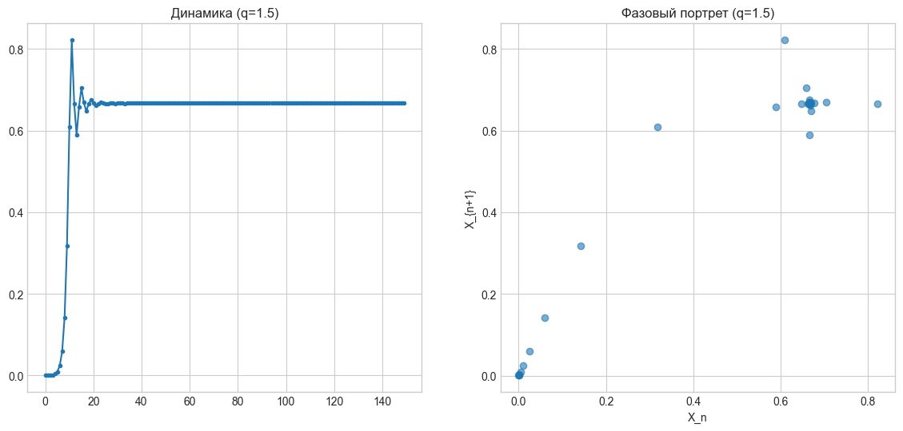
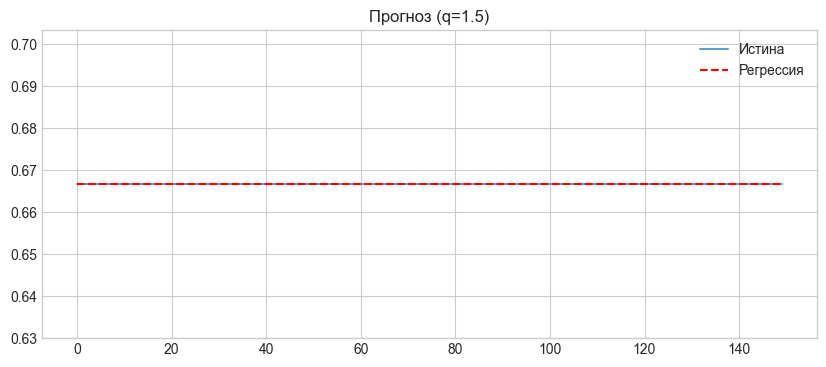

### Устойчивый цикл периода 2 ($q = 2.8$)

**Результаты идентификации:**
В условиях циклической динамики регрессионная модель сохранила высокую точность идентификации параметров ($\beta_{Xn} = -2.8$, $\beta_{Lag1} = -1.4$), что подтверждает робастность метода оценки коэффициентов.

**Парадокс прогнозирования:**
Несмотря на точное определение структуры связей, итеративный прогноз оказался несостоятельным. Линейная модель, обладая суммарным коэффициентом отрицательной обратной связи $-(q + q\gamma) = -4.2$, оказалась чрезмерно жесткой. В отсутствие нелинейных сдерживающих факторов любое отклонение в прогнозе приводило к мгновенному «перерегулированию» и математическому коллапсу траектории (падению в ноль).

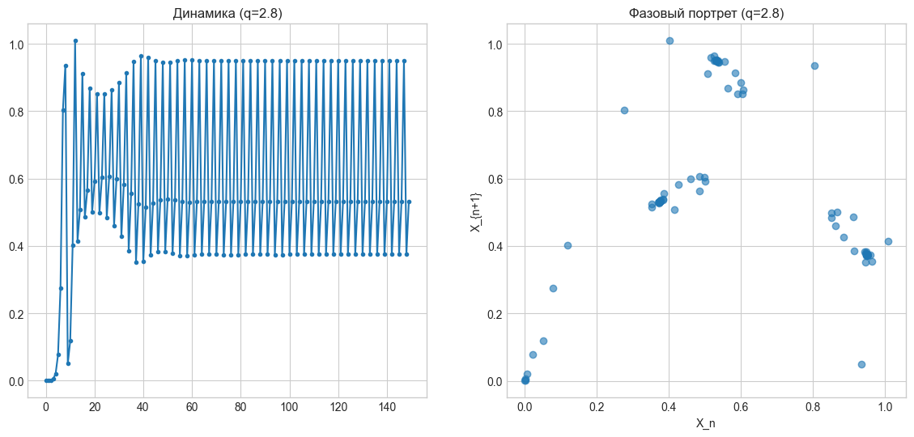
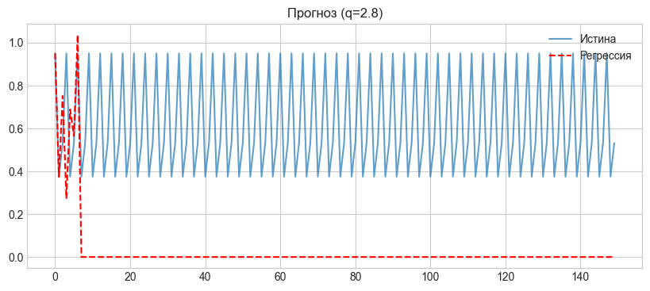

### Коллапс системы при переходе к хаосу ($q > 3.0$)

Эксперименты с $q=3.1, 3.5, 3.9$ показали, что при значительном коэффициенте памяти ($\gamma=0.5$) область устойчивого хаоса практически отсутствует. Высокая инерционность системы в сочетании с высокой интенсивностью реакции приводит к «жесткой бифуркации»: система теряет устойчивость скачкообразно, переходя от циклов сразу к разрушению (значения уходят в область отрицательных чисел). Регрессионный анализ на этапе краха неинформативен.

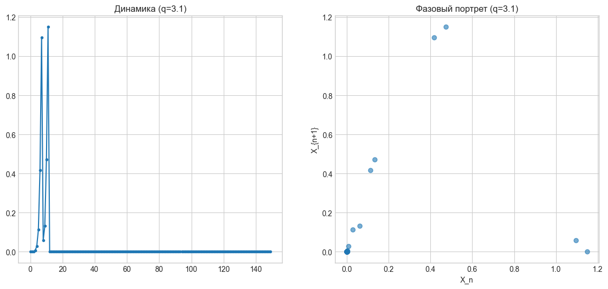
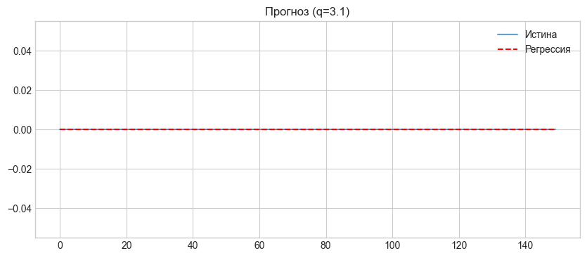

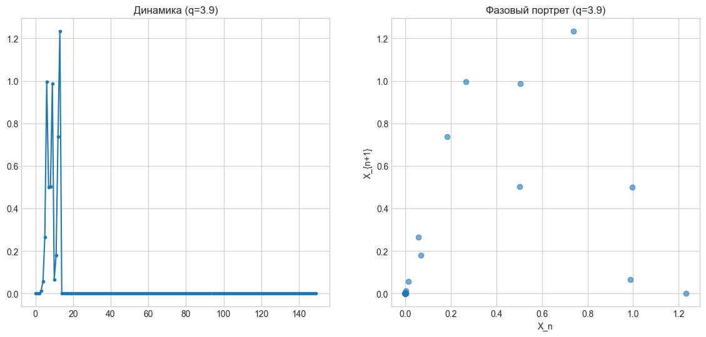

*Анализ результатов для режима слабой памяти ($\gamma = 0.1$)*

Для изучения развитого динамического хаоса был введен режим слабой памяти, позволяющий системе сохранять жизнеспособность при высоких значениях интенсивности.

### Слабый хаос и сложный цикл ($q = 2.7$)

**Фазовый анализ:**
Фазовый портрет трансформировался в «размытую параболу» — облако точек, сгруппированных вокруг кривой $X_{n+1}=f(X_n)$. Толщина облака пропорциональна влиянию памяти ($\gamma$).

**Регрессионный анализ:**
Алгоритм Stepwise вновь продемонстрировал точность идентификации:
*   Коэффициент при $X_n$: $-2.7$ (соответствует $-q$).
*   Коэффициент при $Lag\_1$: $-0.27$ (соответствует $-q\gamma$).
*   Отношение $1:10$ точно отражает параметр $\gamma=0.1$.

**Прогноз:** Наблюдается постепенное расхождение фаз истинной и прогнозируемой траекторий, обусловленное нелинейным взаимодействием факторов $X_n$ и $X_{n-1}$, которое линейная модель аппроксимирует аддитивной суммой.

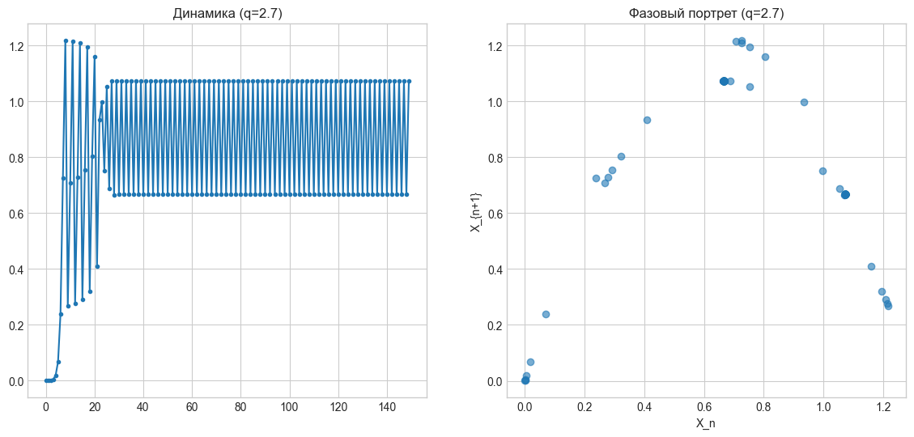
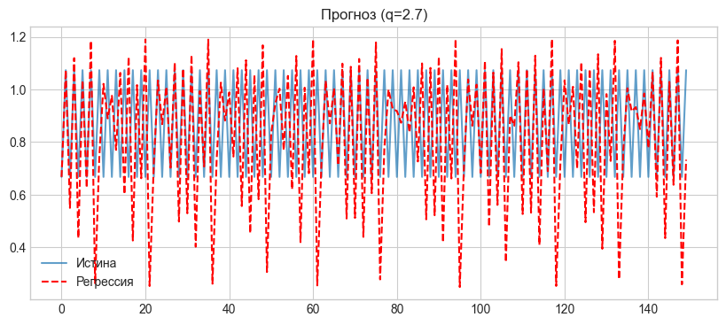

### Развитый динамический хаос ($q = 2.9$)

**Динамика:** Апериодические колебания со сложной структурой амплитудной модуляции.

**Прогностический провал:**
При сохранении идеального качества подгонки на исторических данных ($R^2=1.000$), прогнозная модель демонстрирует эффект **«раздувания волатильности»**. Амплитуда колебаний регрессионной модели превышает амплитуду истинного процесса, что приводит к быстрой декорреляции. Это связано с тем, что линейная модель не имеет «потолка насыщения», который ограничивает рост реальной нелинейной системы.

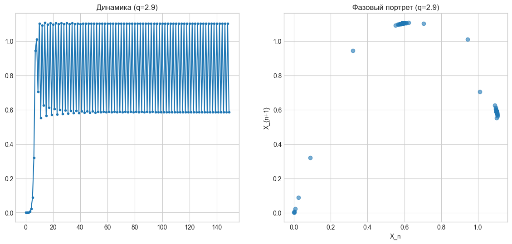
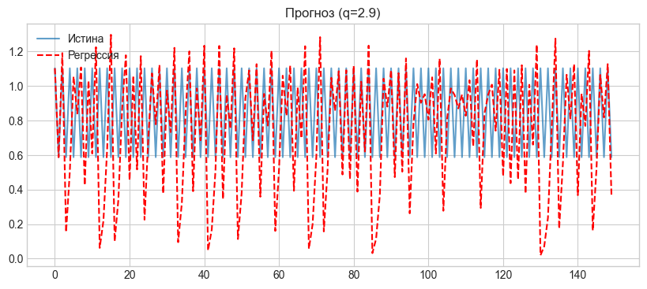

### Выводы по смешанной модели

Исследование смешанной модели позволило сделать ключевые выводы о применимости эконометрических методов к сложным системам:

1.  **Высокая диагностическая способность.** Линейная авторегрессия (в частности, метод пошагового отбора) является мощным инструментом **структурной идентификации**. Она позволяет не только выявить наличие памяти в системе, но и количественно оценить соотношение влияния текущих факторов и предыстории (параметр $\gamma$), даже в условиях сложной динамики.
2.  **Ограничения прогнозирования.** Успешная идентификация структуры прошлого не гарантирует точности прогноза будущего. В зоне неустойчивости ($q > 2.7$) линейные модели склонны к генерации траекторий с избыточной волатильностью или к резонансному разрушению из-за отсутствия механизмов нелинейного демпфирования.
3.  **Влияние памяти на устойчивость.** Установлено, что высокая инерционность системы ($\gamma=0.5$) сужает область существования устойчивых режимов и повышает риск катастрофического коллапса при росте интенсивности процессов.

### Дополнение: смешанная модель на коротких выборках (стадии + скользящие окна) 

#### Место эксперимента и что нового добавлено

Смешанная модель рассматривается как гибрид базовой и delay-логики:

$$
X_{n+1}=X_n+qX_n,(1-X_n-\gamma X_{n-1}),\quad K=1,
$$

где $q$ — интенсивность роста, $\gamma$ — вес памяти (влияние предыстории).

**Что было важно в “основной” части по смешанной модели:** гипотеза структурной идентификации “оба фактора сразу”: и $X_n$, и $X_{n-1}$, а в темпах прироста:

$$
\omega_{n+1}\approx q - qX_n - q\gamma X_{n-1}.
$$

**Что добавляет текущий шаг:** проверяем ту же идентификацию **на коротких фрагментах** — скользящие окна $window=25$, $lags=10$, и смотрим, как ведут себя:

* ENTER (все регрессоры),
* STEPWISE (отбор),
* и агрегат памяти $B_\Sigma=\sum_{i=1}^{10}B(Lag_i)$ как более устойчивый индикатор “суммарной памяти” при мультиколлинеарности лагов.

#### Дизайн: три режима при $\gamma=0.5$

Использованы 3 реперные точки, дающие цельный нарратив “рост → цикл → разрушение”:

1. **$q=1.5$** — рост/выход на стационар (жизненный цикл + окна)
2. **$q=2.8$** — устойчивые колебания (только окна)
3. **$q=3.5$** — разрушение/вырождение режима (только окна)

#### Визуальная диагностика режимов

&nbsp;

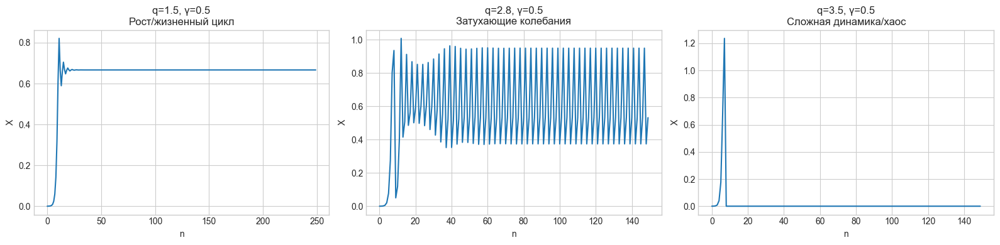

**Микровывод:** при $q=1.5$ динамика быстро выходит на плато (после короткого overshoot); при $q=2.8$ фиксируется устойчивый колебательный режим; при $q=3.5$ — резкий всплеск и последующее вырождение траектории (в нашей реализации — уход в 0), что соответствует постановке “режим краха/неустойчивости”.

#### $q=1.5$: жизненный цикл + окна 

##### Стадийная разметка

&nbsp;

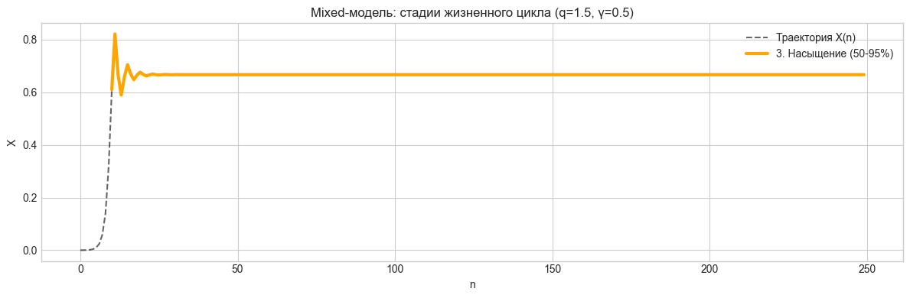

**Наблюдение:** практически вся траектория попала в “Насыщение (50–95%)”. Это не “ошибка”, а следствие того, что рост слишком быстрый: ранние пороги $<10%$ и $10–50%$ проходятся за малое число шагов, а для регрессии с лагами $=10$ это часто не даёт достаточно статистики для отдельных стадий.

##### Локальная регрессия по стадии

| stage | interval | n | R² | B(Xn) | B(L1) | β(Xn) | β(L1) |
|------|---------:|--:|---:|------:|------:|------:|------:|
| Насыщение (50–95%) | 10–250 | 229 | 1.00 | -1.50 | -0.75 | -0.684 | -0.677 |

**STEPWISE:**

- R² = 1.00  
- выбранные лаги: Lag_10, Lag_6, Lag_9, Lag_2, Lag_1, Lag_4, Lag_8

**Ключевой вывод:** ENTER **идеально восстанавливает теоретическую структуру** смешанной модели:

* $B(X_n)\approx -1.5$,
* $B(Lag_1)\approx -0.75$,
  и $R^2=1$.

То есть на локальном сегменте подтверждается “физика” модели: текущий уровень и память одновременно участвуют в ограничении роста.

**Что важно:** STEPWISE на этом же участке начинает выбирать “наборы лагов” (много лагов сразу при $R^2=1$). Это типичный эффект плато: лаги становятся взаимозаменяемыми (мультиколлинеарность), и Stepwise легко находит альтернативные комбинации предикторов без потери качества подгонки. Поэтому в этой зоне **структуру лучше читать по устойчивым коэффициентам ENTER и/или по агрегату $B_\Sigma$**, а не по “точному списку лагов”.

##### Скользящие окна: дрейф коэффициентов и агрегат памяти

&nbsp;

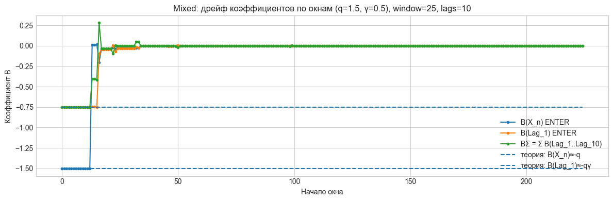

**Вывод:** на информативных фрагментах (до полного “плато”) коэффициенты попадают в теоретические уровни $-q$ и $-q\gamma$. На плато коэффициенты “сдуваются” к нулю — это не смена закона, а сигнал, что в окне почти нет вариации (и $\omega\approx 0$), то есть **короткие выборки перестают нести информацию для устойчивой идентификации**.

&nbsp;

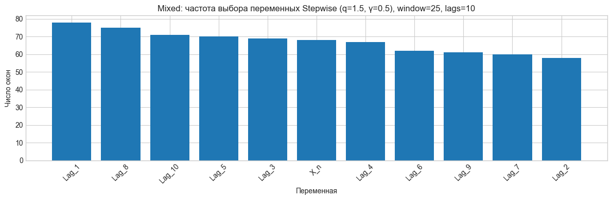

**Вывод:** частоты распределены “широко” по лагам — это иллюстрирует риск интерпретации Stepwise на стационаре: он склонен “размазывать” память по лагам из-за мультиколлинеарности.

#### $q=2.8$: окна на устойчивых колебаниях — самая сильная проверка структуры

##### ENTER по окнам: коэффициенты стабильны и совпадают с теорией

**По сводке окон (q=2.8):**

* число окон: **125** ENTER и **125** STEPWISE,
* $R^2$ в каждом окне **≈ 1.0** (mean = 1.0; std ~ $5\cdot10^{-10}$),
* коэффициенты:

  * $B(X_n)$ **строго** $-2.8000$,
  * $B(Lag_1)$ **строго** $-1.4000$,
  * $B_\Sigma$ **≈** $-1.4000$ (min -1.4001; max -1.3999).

**Интерпретация:** в режиме цикла (колебаний) короткие окна не разрушают идентификацию: модель “локально” в каждом окне воспроизводит разложение влияний на текущий уровень и память **точно как предсказывает теория** $-q$ и $-q\gamma$.

##### Stepwise по окнам: ядро структуры сохраняется, “ложные лаги” редки

**Stepwise частоты $q=2.8$:**

* $X_n$ выбирается в **121** окне из 125,
* $Lag_1$ выбирается в **121** окне,
* редкие включения: $Lag_3$ — 5 раз, $Lag_2$ — 4 раза.

**Топ-наборы selected:**

* $[Lag_1, X_n]$ — **120** окон (доминирующий правильный вариант),
* $[Lag_2, Lag_3]$ — **4** окна (пример “ложного ядра” на отдельных коротких фрагментах),
* $[Lag_1, Lag_3, X_n]$ — **1** окно.

**Вывод:** на колебаниях структура смешанной модели **устойчиво распознаётся**: Stepwise почти всегда возвращает именно ${X_n, X_{n-1}}$, а “ложные лаги” появляются редко и точечно — как эффект короткого окна и локальной корреляции фаз.

&nbsp;

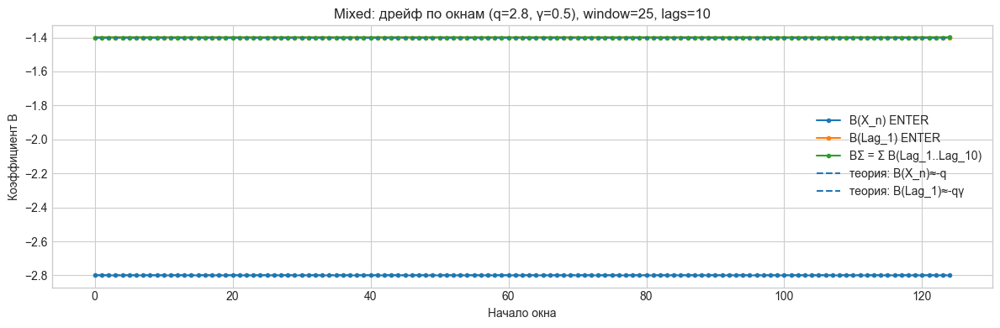

* график дрейфа (q=2.8) — “коэффициенты стабильны”,

&nbsp;

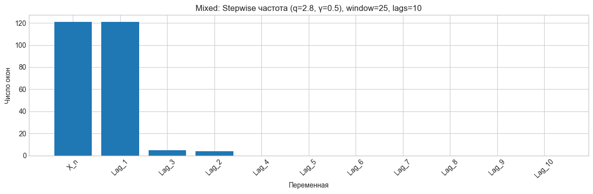

* график частот Stepwise $q=2.8$ — “доминируют $X_n$ и $Lag_1$”.

#### $q=3.5$: разрушение/вырождение и почему Stepwise = 0 окон

Тут вышла важная “краевая ситуация”.

##### ENTER по окнам: данные вырождаются → регрессия теряет смысл

По сводке $q=3.5$:

* ENTER windows: **125**, но:

  * $R^2$ везде **NaN** (count=0),
  * $B(X_n)=0$, $B(Lag_1)=0$, $B_\Sigma=0$ во всех окнах.

Это характерно для вырожденного сегмента: если траектория после всплеска уходит в “поглощающее состояние” (в нашей реализации — ноль + клиппинг), то внутри окна:

* $\omega$ становится почти константой/нулём,
* регрессоры почти константны,
* дисперсия исчезает → $R^2$ и p-values теряют определённость.

##### Stepwise = 0 окон: диагностический маркер “краха” на коротких данных

**STEPWISE windows: 0** означает: при заданных порогах значимости Stepwise **нигде не смог собрать устойчивую модель** (нечего отбирать). Это можно подать как сильный прикладной вывод:

> В зоне разрушения (при высокой интенсивности роста и наличии памяти) короткие наблюдаемые фрагменты становятся статистически вырожденными; в результате процедуры отбора (Stepwise) перестают возвращать модель вовсе. На практике это можно трактовать как диагностический признак “краха/режима деградации” при анализе коротких рядов.

&nbsp;

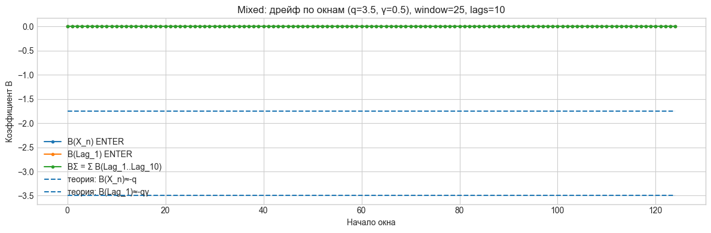

* дрейф $q=3.5$ — “всё нули/плоско”,

&nbsp;

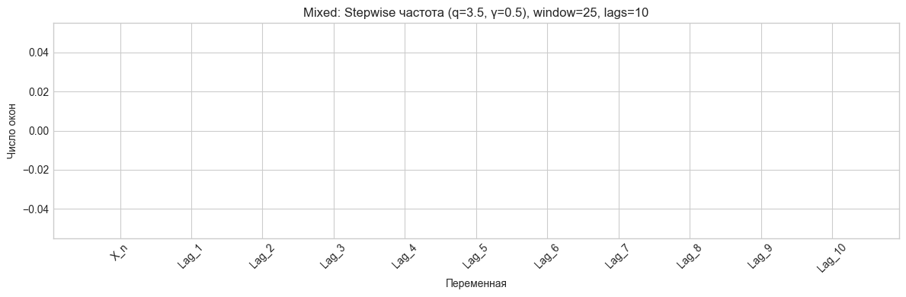

* пустой график частот Stepwise — прямо как иллюстрация “нет моделей”.

#### Как это сопрягается с базовой и delay-моделью 

Получается красивая лестница по сложности памяти:

* **Базовая модель (без памяти):** на окнах Stepwise почти всегда выбирает $X_n$; “ложные лаги” — исключение.
* **Delay-модель (чистая память):** на окнах доминирует $Lag_1$; при стационаре/сложной динамике память может “размазываться” по лагам → поэтому полезен агрегат $B_\Sigma$.
* **Mixed-модель (частичная память):** теперь одновременно:

  1. на информативных режимах (рост до плато и цикл) окна подтверждают **двухфакторную природу**: $B(X_n)\approx -q$, $B(Lag_1)\approx -q\gamma$;
  2. на плато Stepwise начинает “комбинаторно” гулять по лагам (как в delay-дополнении);
  3. на крахе $q=3.5$ окна вырождаются и Stepwise **перестаёт строиться** — это предельная форма тезиса о “неинформативности регрессии на разрушении”.

## 2.5 ЗАКЛЮЧЕНИЕ И ОБЩИЕ ВЫВОДЫ ПО РЕЗУЛЬТАТАМ МОДЕЛИРОВАНИЯ

Проведённый цикл вычислительных экспериментов, охватывающий исследование базовой, запаздывающей и смешанной моделей развития, позволил верифицировать гипотезу о границах применимости линейного регрессионного анализа к детерминированным нелинейным процессам.

В отличие от первоначального этапа исследования, где анализ проводился преимущественно на длинных траекториях, в настоящей работе дополнительно реализована детализация в формате **коротких выборок** (скользящее окно фиксированной длины, window = 25, lags = 10), что имитирует реальные условия ограниченности наблюдений в социально-экономической практике.

Обобщение полученных результатов позволяет сформулировать следующие ключевые выводы.

### Высокая способность к структурной идентификации

Установлено, что линейные методы авторегрессии (в частности, алгоритмы пошагового отбора переменных) являются эффективным инструментом **диагностики внутренней структуры** сложных систем.

* Алгоритмы корректно определяют наличие и вес «памяти» в системе даже в условиях колебательной и хаотической динамики.
* В смешанных моделях отношение коэффициентов регрессии при текущем $X_n$ и лаговом $X_{n-1}$ значениях с высокой точностью отражает истинный параметр инерции $\gamma$, заложенный в уравнение.
* В режиме циклической динамики (например, при $q=2.8$, $\gamma=0.5$) на множестве локальных окон оценки коэффициентов стабилизируются около теоретических значений $-q$ и $-q\gamma$, что подтверждает робастность параметрической идентификации.

**Практическая значимость:** регрессионный анализ может использоваться для классификации рынков и компаний по типу реакции — мгновенной (адаптивной) или инерционной (консервативной), а также для количественной оценки степени инерционности.

### Корректность выводов на коротких выборках

Дополнительный анализ с использованием скользящих окон показал, что структурные выводы, полученные на длинных траекториях, в целом сохраняются и на коротких фрагментах данных.

Однако выявлены важные методические ограничения:

* На стадиях насыщения и плато (когда дисперсия процесса снижается) оценки коэффициентов могут демонстрировать заметный дрейф от окна к окну.
* При этом сам закон динамики остаётся неизменным.

Следовательно, наблюдаемое изменение параметров регрессии в коротких выборках **не обязательно означает структурный сдвиг системы**; оно может быть следствием ограниченного объёма данных и изменения диапазона переменных.

Этот результат существенно уточняет границы интерпретации эконометрических моделей в прикладных задачах.

### Агрегированная оценка памяти как устойчивый диагностический показатель

В запаздывающей и смешанной моделях выявлен эффект перераспределения влияния памяти между несколькими лагами в условиях мультиколлинеарности (особенно на стационаре).

В связи с этим введён агрегированный показатель суммарного влияния памяти:

$$
B_\Sigma = \sum_{i=1}^{10} B(Lag_i).
$$

Показано, что:

* на информативных режимах (рост, цикл) величина $B_\Sigma$ устойчива и близка к теоретическому значению;
* отдельные лаговые коэффициенты могут «размазываться» между переменными без изменения суммарного эффекта.

Таким образом, интерпретация агрегированного влияния памяти оказывается более надёжной, чем анализ одиночного лага, особенно на коротких временных фрагментах.

### Парадокс прогностической ценности ($R^2$ vs Реальность)

Исследование подтвердило фундаментальный разрыв между объясняющей и предсказательной силой линейных моделей в зоне турбулентности.

* В режимах сложной динамики линейная регрессия может демонстрировать практически идеальное качество подгонки ($R^2 \approx 1$), поскольку локальная зависимость темпов прироста от состояния системы сохраняет линейную форму.
* Однако долгосрочный прогноз на основе такой модели оказывается несостоятельным.

Причина заключается в отсутствии в линейной модели механизма нелинейного насыщения. Малейшие ошибки в оценке коэффициентов приводят к резонансному раскачиванию траектории прогноза и её быстрому расхождению с истинной динамикой.

Детализация по окнам показала, что локальная идеальность подгонки может сохраняться даже при переходе к хаотическим режимам, что делает высокий $R^2$ недостаточным критерием адекватности модели.

### Проблема ложных корреляций и переобучения

В режимах периодической и сложной динамики алгоритм Stepwise склонен выявлять «фантомные» зависимости от дальних лагов (Lag 2, Lag 3, Lag 10 и др.).

Выявлено, что такие ложные включения особенно характерны:

* для стационарных участков (плато), где лаги становятся почти линейно зависимыми;
* для циклических режимов, где фазовые сдвиги создают корреляции между удалёнными лагами;
* для коротких окон в зоне хаотических колебаний.

В крайних случаях (например, при разрушении траектории в смешанной модели при высоких (q)) процедура Stepwise не формирует ни одной модели, что отражает вырождение вариативности ряда.

Таким образом, отсутствие модели в окнах может рассматриваться как диагностический признак деградации динамики.

### Топологическая диагностика как необходимый метод

Подтверждено, что анализ временных рядов в отрыве от фазового анализа остаётся неинформативным.

Построение фазовых портретов ($X_{n+1}$ от $X_n$) позволяет:

* определить размерность системы (наличие памяти);
* отличить цикл от хаоса;
* выявить потерю устойчивости и топологический переход.

Фазовый анализ выступает необходимым дополнением к эконометрической интерпретации.

### Итоговая рекомендация

Для анализа социально-экономических процессов в условиях нестабильности предлагается комбинированный подход:

1. Использовать **линейную регрессию** для ретроспективной структурной идентификации (наличие памяти, оценка инерционности).
2. Применять **скользящие окна** для проверки устойчивости параметров и выявления дрейфа коэффициентов.
3. Использовать **агрегированные показатели влияния памяти** при интерпретации коротких рядов.
4. Строить **фазовые портреты** для диагностики текущего режима (стабильность, цикл, хаос).
5. Относиться с критической осторожностью к долгосрочным точечным прогнозам в периоды турбулентности, даже при высоких показателях статистической значимости моделей.

### Общий итог главы

Показано, что линейный регрессионный анализ обладает высокой диагностической ценностью для выявления структуры детерминированных нелинейных систем, однако его прогностическая применимость принципиально ограничена в зонах колебательной и хаотической динамики.

Дополнительная детализация на коротких выборках уточнила границы интерпретации коэффициентов и выявила условия, при которых статистическая идентификация остаётся устойчивой, а также случаи, когда она теряет информативность.

Тем самым сформирована методологическая рамка, позволяющая корректно сочетать эконометрику и динамический анализ при исследовании процессов развития в условиях нестабильности.