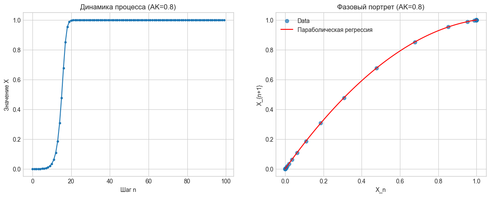
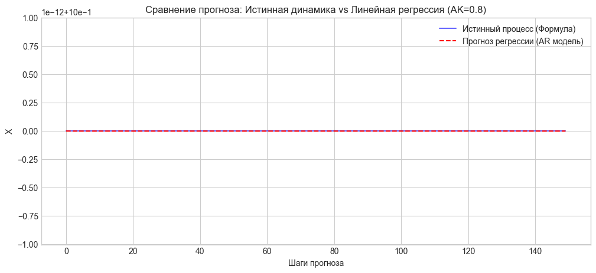
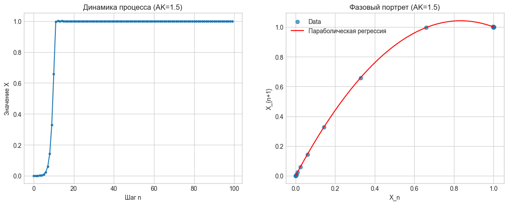
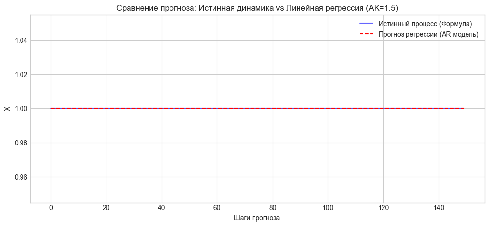
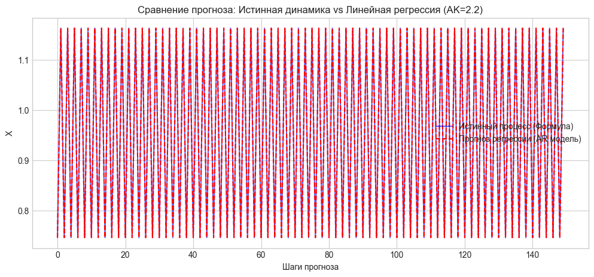
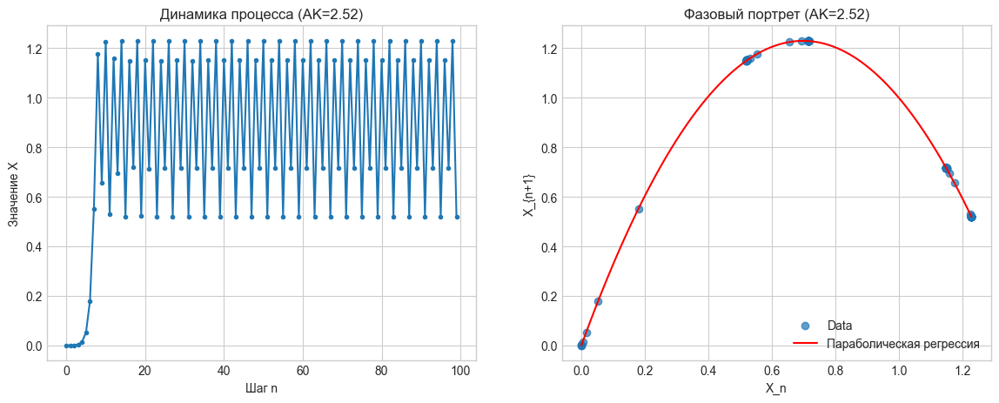
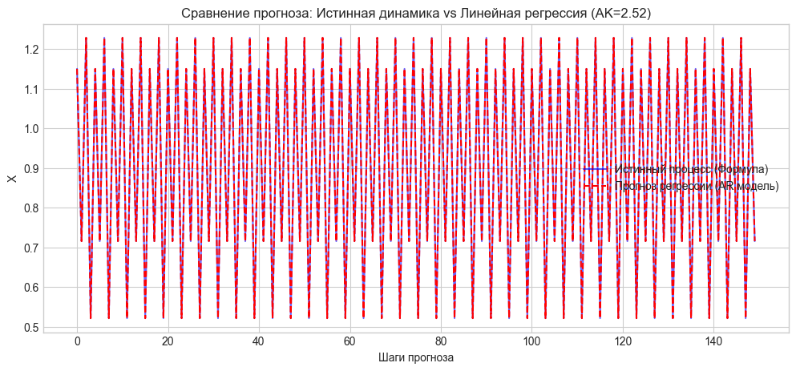

# ГЛАВА 2. ЧИСЛЕННОЕ МОДЕЛИРОВАНИЕ И ИССЛЕДОВАНИЕ ВОЗМОЖНОСТЕЙ РЕГРЕССИОННОГО АНАЛИЗА ДЛЯ ИДЕНТИФИКАЦИИ НЕЛИНЕЙНЫХ ПРОЦЕССОВ

## 2.1. Постановка задачи и методология вычислительного эксперимента

### Введение и цель эксперимента
Теоретический анализ, проведенный в первой части работы, показал, что социально-экономические системы развиваются в условиях ограниченных ресурсов и часто демонстрируют нелинейное поведение. Традиционным инструментом анализа таких процессов в эконометрике являются линейные регрессионные модели (в частности, авторегрессия). Однако возникает фундаментальный вопрос: насколько корректно линейные методы способны описывать, идентифицировать и прогнозировать сложные нелинейные режимы, такие как цикличность, бифуркации и динамический хаос?

Целью данной главы является проведение вычислительного эксперимента для верификации гипотезы о применимости линейных регрессионных моделей к анализу детерминированных нелинейных процессов.

В отличие от работы с реальными статистическими данными, где истинный закон генерации данных неизвестен и зашумлен, вычислительный эксперимент позволяет использовать **синтетические данные**. Это дает возможность сравнивать результаты эконометрического моделирования с «истиной» (генерирующим уравнением) и объективно оценивать качество идентификации параметров и точность прогноза.

### Объекты исследования: Типология нелинейных моделей
В рамках эксперимента исследуются три класса дискретных отображений, описывающих различные типы реакции системы на ограничения роста. Все модели рассматриваются в нормированном виде, где ограничение ресурса $K$ принято за единицу масштаба.

**1. Базовая модель (Мгновенная реакция)**
Основана на логистическом отображении Ферхюльста. Предполагается, что темп прироста зависит исключительно от текущего размера системы.
$$ X_{n+1} = X_n + A X_n (K - X_n) $$
Где $A$ — параметр интенсивности. Эта модель описывает безынерционные системы.

**2. Модель с запаздыванием (Глубокая память)**
Описывает ситуации, когда доступность ресурса определяется состоянием системы в предыдущий период (лаговая зависимость). Это характерно для инвестиционных циклов, сельскохозяйственных рынков и демографии.
$$ X_{n+1} = X_n + g X_n (K - X_{n-1}) $$
Где $g$ — параметр интенсивности. Ключевая особенность — зависимость от $X_{n-1}$.

**3. Смешанная (Комбинированная) модель**
Наиболее общий случай, учитывающий как текущее давление ограничений, так и инерцию прошлого.
$$ X_{n+1} = X_n + q X_n (K - X_n - \gamma X_{n-1}) $$
Где $q$ — интенсивность, а $\gamma$ — коэффициент памяти, определяющий вес предыстории.

### Алгоритм проведения эксперимента
Для каждого типа модели реализуется унифицированный протокол исследования, включающий четыре этапа. Реализация выполнена в среде **Jupyter Notebook** с использованием библиотек научного программирования на языке **Python** (`NumPy`, `Pandas`, `Statsmodels`, `Scikit-learn`).

**Этап 1. Генерация временных рядов**
Для каждого типа модели формируются наборы данных (сценарии) с различными значениями управляющих параметров ($A, g, q$). Значения параметров подбираются таким образом, чтобы охватить все динамические режимы согласно сценарию Фейгенбаума:
*   Монотонный рост (устойчивое равновесие);
*   Затухающие колебания;
*   Предельные циклы (бифуркации удвоения периода);
*   Переходные процессы на границе устойчивости;
*   Развитый динамический хаос.

**Этап 2. Фазовый анализ**
Для визуальной диагностики типа динамики строятся фазовые портреты (зависимость $X_{n+1}$ от $X_n$). Это позволяет оценить топологию аттрактора: является ли он точкой, линией (параболой) или сложной структурой (инвариантной окружностью, странным аттрактором).

**Этап 3. Эконометрическое моделирование (Авторегрессия)**
К сгенерированным временным рядам применяются методы линейного регрессионного анализа для построения модели вида:
$$ \omega_{n+1} = const + \sum_{i=0}^{k} \zeta_i \cdot Lag_i + \xi_n $$
Где $\omega$ — темп прироста, $\zeta_i$ — оценки нестандартизированных коэффициентов регрессии (B-коэффициенты).

Используются два метода отбора предикторов (аналогично пакетам SPSS/Statistica):
1.  **Принудительное включение (Method Enter):** Включение всех лагов для оценки мультиколлинеарности.
2.  **Пошаговый отбор (Stepwise Selection):** Автоматический отбор значимых переменных для проверки способности алгоритма выявить истинную структуру лагов (отличить $X_n$ от $X_{n-1}$).

Особое внимание уделяется анализу стандартизированных **Бета-коэффициентов** ($\beta_i$), которые позволяют ранжировать факторы по силе влияния, и коэффициенту детерминации $R^2$ как мере объясняющей способности модели.

**Этап 4. Сравнительное прогнозирование (Решение обратной задачи)**
На финальном этапе проводится проверка прогностической силы полученных регрессионных уравнений. Строится итеративный прогноз на 100–150 шагов вперед, который сравнивается с истинной траекторией системы. Это позволяет выявить «горизонт прогнозирования» в условиях хаоса и проверить устойчивость линейной аппроксимации.

## 2.2 Описание базовой модели и сценариев эксперимента

В данной главе представлены результаты численного моделирования и регрессионного анализа процессов, порождаемых базовым логистическим отображением. Исследование направлено на выявление возможностей и ограничений линейных эконометрических методов при идентификации параметров и прогнозировании динамики безынерционных нелинейных систем.

В качестве объекта исследования рассматривается дискретное логистическое уравнение (отображение Ферхюльста), описывающее развитие системы в условиях ограниченных ресурсов при отсутствии запаздывания реакции:

$$ X_{n+1} = X_n + A X_n (K - X_n) $$

Где $X_n$ — состояние системы в момент времени $n$, $K$ — предельная емкость среды (потенциал роста), $A$ — параметр интенсивности процесса. Для унификации расчетов принято значение $K=1$. Ключевым управляющим параметром, определяющим динамический режим системы, является произведение $AK$ (нормированная интенсивность).

В ходе эксперимента были исследованы пять сценариев, соответствующих различным этапам сценария удвоения периода (сценария Фейгенбаума):
1.  **$AK = 0.8$**: Монотонный рост к устойчивому состоянию равновесия (S-образная кривая).
2.  **$AK = 1.5$**: Затухающие колебания вблизи точки равновесия.
3.  **$AK = 2.2$**: Устойчивый предельный цикл периода 2 (бифуркация удвоения периода).
4.  **$AK = 2.52$**: Сложный цикл периода 4 (граница перехода к хаосу).
5.  **$AK = 2.8$**: Развитый динамический хаос (странный аттрактор).

Для каждого сценария проводился анализ временных рядов, построение фазовых портретов и оценка параметров авторегрессионных моделей вида $\omega_{n+1} = f(X_n, X_{n-1}, \dots)$, где $\omega$ — темп прироста.

### Режимы устойчивого равновесия ($AK = 0.8$ и $AK = 1.5$)

В сценариях с низкой интенсивностью система демонстрирует стремление к стационарному состоянию (аттрактору типа «фиксированная точка»).

**Фазовый анализ:** Фазовые портреты представляют собой набор точек, идеально ложащихся на параболическую кривую $X_{n+1} = f(X_n)$, что подтверждает детерминированный характер процесса и отсутствие скрытых переменных.

**Регрессионный анализ:**
Применение метода пошагового отбора (Stepwise) показало высокую эффективность линейной авторегрессии в данных режимах.
*   **Коэффициент детерминации ($R^2$):** Равен $1.000$, что свидетельствует о полной объясняющей способности модели.
*   **Структурная идентификация:** Алгоритм корректно выделил единственную значимую переменную — текущее состояние $X_n$. Влияние лаговых переменных ($X_{n-1}, X_{n-2}$ и др.) признано статистически незначимым.
*   **Параметрическая идентификация:** Значения стандартизированных Бета-коэффициентов при $X_n$ ($-0.8$ и $-1.5$ соответственно) с высокой точностью совпадают с теоретическими значениями параметра $-AK$, следующими из линеаризации исходного уравнения.

**Сравнительное прогнозирование:**
Итеративный прогноз на 150 шагов вперед полностью совпадает с истинной траекторией процесса.

**Вывод:** В условиях стабильной динамики линейные регрессионные модели являются адекватным инструментом описания и прогнозирования нелинейных процессов логистического типа.

### Режим циклической динамики ($AK = 2.2$)

При переходе через точку первой бифуркации система попадает в режим устойчивых автоколебаний с периодом 2.

**Динамика и фазовый портрет:** Временной ряд демонстрирует пилообразную структуру («высокое — низкое» значение). На фазовом портрете точки группируются в два кластера, лежащие на параболе.

**Аномалии регрессионного анализа:**
Несмотря на сохранение высокого качества подгонки ($R^2 = 1.0$), алгоритм пошагового отбора выявил в качестве значимых предикторов не только $X_n$, но и переменную **$Lag\_2$ ($X_{n-2}$)**.

*Интерпретация:* С физической точки зрения зависимость текущего состояния от состояния два шага назад в уравнении отсутствует. Появление переменной $Lag\_2$ в модели является следствием периодичности процесса ($X_n \approx X_{n-2}$). Статистический алгоритм интерпретировал цикличность как причинно-следственную связь, что является примером **ложной корреляции** (spurious correlation).

### Граница хаоса и проблема мультиколлинеарности ($AK = 2.52$)

В режиме сложного цикла (период 4) наблюдаются существенные затруднения в работе алгоритмов автоматического отбора переменных.

**Результаты моделирования:** Алгоритм Stepwise столкнулся с проблемой сходимости (зацикливанием) и выделил набор переменных: `['X_n', 'Lag_4', 'Lag_10']`.
*   Появление переменной **$Lag\_4$** обусловлено периодом цикла (значения повторяются каждые 4 такта).
*   Появление переменной **$Lag\_10$** объясняется арифметикой цикла: $10 \equiv 2 \pmod 4$. Таким образом, $Lag\_10$ несет ту же информацию, что и $Lag\_2$, выступая статистическим дублером.

**Вывод:** В точках бифуркации и сложных циклов стандартные эконометрические методы склонны к переобучению и включению в модель избыточных переменных, не имеющих физического смысла, из-за высокой мультиколлинеарности лаговых значений.

### Режим развитого динамического хаоса ($AK = 2.8$)

Данный сценарий является наиболее критичным для оценки границ применимости линейных моделей.

**Визуальный анализ:** Динамика процесса визуально неотличима от стохастического шума. Однако фазовый портрет сохраняет четкую структуру параболы, что доказывает детерминированную природу наблюдаемого хаоса.

**Парадокс качества модели ($R^2 = 1.000$):**
Линейная регрессия продемонстрировала идеальное качество аппроксимации на обучающей выборке. Это объясняется спецификой логистического отображения: зависимость темпа прироста $\omega$ от $X_n$ является строго линейной ($\omega = A - A X_n$). Таким образом, регрессия смогла точно восстановить закон эволюции системы.

**Сравнительное прогнозирование и «Эффект бабочки»:**
Несмотря на идеальное описание прошлого, прогностическая способность модели оказалась ограниченной. График сравнения прогнозов показывает, что траектория, построенная регрессионной моделью, совпадает с истинной лишь на горизонте около 70–80 шагов. В дальнейшем наблюдается **расхождение траекторий**: прогноз теряет фазовую синхронизацию с истинным процессом, хотя и сохраняет схожие статистические характеристики (амплитуду и дисперсию).

**Причина расхождения:** Явление чувствительности к начальным условиям, характерное для странных аттракторов. Микроскопические погрешности в оценке коэффициентов регрессии или округлении данных экспоненциально нарастают в ходе итеративного прогнозирования, что делает долгосрочный точечный прогноз принципиально невозможным за пределами горизонта Ляпунова.

### Выводы по базовой модели

Проведенное исследование базовой модели позволило сформулировать следующие выводы:

1.  **Диагностическая ценность фазовых портретов.** В условиях сложной динамики, визуально напоминающей хаос, построение фазовых портретов является необходимым этапом анализа, позволяющим выявить скрытый детерминированный закон (аттрактор) и отличить его от случайного шума.
2.  **Риск ложных корреляций.** В циклических режимах алгоритмы автоматического отбора переменных склонны находить несуществующие зависимости от дальних лагов, принимая периодичность процесса за наличие «глубокой памяти».
3.  **Ограниченность прогноза в хаосе.** Высокие статистические показатели качества модели ($R^2 \approx 1$) являются необходимым, но не достаточным условием для точности долгосрочного прогнозирования. В режиме динамического хаоса горизонт прогноза ограничен внутренней неустойчивостью системы к малым возмущениям, что требует перехода от точечных прогнозов к сценарным или вероятностным оценкам.

### Детализация динамики (стадии жизненного цикла + короткие окна) и сравнение с хаосом 

#### 1. Постановка задачи и методология

В соответствии с рекомендацией научного руководителя выполнена детализация исследования базовой логистической модели Ферхюльста в форме:

$$
X_{n+1}=X_n + A X_n (K - X_n), \qquad K=1.
$$

Цель дополнения — проверить применимость регрессионного анализа **в условиях коротких выборок**, поскольку в реальной социально-экономической практике исследователь чаще наблюдает **не всю траекторию**, а лишь **локальные фрагменты**, соответствующие отдельным этапам развития процесса.

Чтобы связать “классическое” исследование режимов (стабильность/цикл/хаос) с практикой коротких рядов, использованы два взаимодополняющих подхода:

1. **Стадийная сегментация (жизненный цикл)** — выделение на S-кривой четырёх стадий по уровню освоения потенциала $X/K$:

* Зарождение: $X < 0.1K$
* Активный рост: $0.1K \le X < 0.5K$
* Насыщение: $0.5K \le X < 0.95K$
* Плато: $X \ge 0.95K$

2. **Скользящее окно фиксированной длины** ($window=25$) — моделирование ситуации, когда доступен лишь короткий временной отрезок; в каждом окне оцениваются параметры авторегрессионной модели темпов прироста с лагами до 10 (как в ТЗ).

Рассматривалась зависимость темпа прироста:

$$
\omega_{n+1}=\frac{X_{n+1}-X_n}{X_n}
$$

от текущего уровня $X_n$ и лагов $X_{n-1},...,X_{n-10}$. Оценивание выполнено двумя способами (терминология SPSS):

* **ENTER**: принудительное включение всех регрессоров;
* **STEPWISE**: пошаговый отбор значимых переменных.

Дополнительно рассчитаны **стандартизированные Beta-коэффициенты**, позволяющие сравнивать влияние факторов на общей шкале и выявлять доминирующие переменные в условиях мультиколлинеарности.

#### Визуальная диагностика объектов исследования

S-кривая и стадии жизненного цикла ($A=0.1$)

**S-образная кривая и стадии жизненного цикла.**

График демонстрирует классический S-образный рост с выходом на насыщение. Цветовая разметка подчёркивает, что одна и та же траектория может быть интерпретирована как последовательность **локально однородных фаз**, каждая из которых потенциально доступна для наблюдения в реальных данных.

Сравнение с хаосом ($A=2.8$)

**Сравнение: S-кривая ($A=0.1$) vs хаотическая динамика ($A=2.8$).**

В отличие от S-кривой, хаотический режим не демонстрирует последовательных стадий роста/насыщения: колебания возникают почти сразу, а динамика визуально напоминает шум. Следовательно, **сегментация “жизненного цикла” применима именно к S-траекториям**, тогда как для хаоса “короткие данные” интерпретируются иначе — как тест устойчивости оценок и ложных корреляций.

#### Результаты локального анализа по стадиям (жизненный цикл)

##### Табличные результаты (ENTER и STEPWISE, lags=10)

Полученные оценки для четырёх стадий приведены в таблице (на основе вывода кода):

| Стадия        | Инт.   | n  | ENTER R² | STEP R² | B(X_n)    | Beta(X_n)  |
|--------------|-------:|---:|---------:|--------:|----------:|-----------:|
| Зарождение   | 0–50   | 39 | 1.000000 | 1.00    | −0.099676 | −0.994135  |
| Активный рост| 50–72  | 11 | 1.000000 | 1.00    | −0.099873 | −1.004154  |
| Насыщение    | 72–101 | 18 | 0.999971 | 1.00    | −0.100010 | −1.000580  |
| Плато        | 101–150| 38 | 1.000000 | 1.00    | −0.070943 | −0.640854  |

где  
Инт. — интервал наблюдений,  
n — число точек в окне.

**Ключевые наблюдения:**

1. **Структурная идентификация устойчива:** алгоритм Stepwise **во всех стадиях** выбирает только $X_n$. Ни один лаг $X_{n-1}...X_{n-10}$ не признан значимым, что согласуется с отсутствием памяти в базовой модели.

2. **Качество подгонки максимальное:** $R^2\approx 1$ во всех сегментах (и для ENTER, и для STEPWISE). Это соответствует тому факту, что связь $\omega$ и $X_n$ в логистическом отображении имеет точную линейную форму:
   $$
   \omega = A(K - X_n) = A - A X_n \quad (K=1).
   $$

3. **Интерпретация Beta-коэффициентов:** на стадиях зарождения/роста/насыщения $\text{Beta}(X_n)\approx -1$, то есть вклад $X_n$ доминирует и полностью определяет динамику $\omega$. Это удобно для ранжирования факторов в более сложных моделях (когда присутствуют лаги и мультиколлинеарность), и служит “эталоном” для сравнения.

4. **Особенность стадии “Плато”:** в отличие от первых трёх стадий, на стадии насыщения и плато вариативность $X_n$ падает (ряд становится почти константой), поэтому стандартизированный вклад $\text{Beta}(X_n)$ уменьшается по модулю (≈ -0.64). Это **не означает** изменения физического закона, а отражает снижение информативности регрессора в условиях малой дисперсии на плато.

#### Анализ “коротких данных” через скользящее окно

##### Дрейф оценок B(X_n) по окнам (ENTER)

&nbsp;

Несмотря на то, что закон генерации данных неизменен, оценка коэффициента $B(X_n)$ демонстрирует **ступенчатый дрейф** при перемещении окна вдоль траектории. Этот эффект интерпретируется следующим образом:

* при переходе окна через разные области S-кривой меняется диапазон наблюдаемых значений $X_n$ и его дисперсия;
* в условиях коротких рядов (25 точек) это приводит к “локальной” перестройке оценок коэффициентов;
* наблюдаемый дрейф — это **методический эффект ограниченности данных**, а не реальный структурный сдвиг процесса.

Таким образом, даже для простого детерминированного процесса возникает важный практический вывод:

> **при коротких выборках параметры регрессии могут “плыть” без изменения закона динамики**, что требует осторожной интерпретации коэффициентов на реальных данных.

#### Частота выбора переменных Stepwise (короткие окна)

   
&nbsp;

На S-кривой Stepwise **почти во всех окнах** выбирает только $X_n$, а лаговые переменные не появляются. Это подтверждает робастность структурной идентификации при отсутствии памяти.

#### Сопряжение с предыдущими результатами и общий вывод

Полученные результаты дополняют основную часть главы о режимах (стабильность/цикл/хаос) следующим образом:

1. **Для S-образной траектории** (рост и насыщение) сегментация жизненного цикла корректна и позволяет имитировать практику анализа компаний на разных стадиях.

2. **Регрессионный анализ устойчив на коротких сегментах:** даже при ограниченном числе наблюдений модель корректно выявляет структуру зависимости $\omega=f(X_n)$, не “вытягивая” ложные лаги.

3. **Однако коэффициенты на коротких данных демонстрируют дрейф:** это принципиально важная оговорка для практики — изменение оценок может быть следствием ограниченности выборки и смены диапазона переменной, а не структурного сдвига.

4. **Сравнение с хаосом показывает границы интерпретации стадий:** в хаотическом режиме отсутствует смысловая последовательность “зарождение-рост-плато”, поэтому “жизненный цикл” относится к S-траекториям, а для хаоса уместны другие формы локального анализа (скользящее окно как тест нестабильности и ложных корреляций).

### Итоговый вывод

> Проведённая детализация подтвердила, что линейные регрессионные модели темпов прироста способны корректно идентифицировать базовый логистический закон даже на коротких временных фрагментах, соответствующих различным стадиям S-образного роста.
> Вместе с тем показано, что при анализе коротких окон возможно наблюдать дрейф оценок коэффициентов вследствие смены диапазона и дисперсии данных, что требует осторожной интерпретации параметров в прикладных социально-экономических задачах.
> Сравнение с хаотическим режимом подчёркивает, что стадийная интерпретация применима к траекториям роста и насыщения, тогда как для хаоса короткие окна служат инструментом методической диагностики ограничений линейной аппроксимации.

## 2.3. Описание модели с запаздыванием и сценариев эксперимента

В данной главе рассматриваются особенности идентификации и прогнозирования процессов, обладающих «глубокой памятью», где текущая динамика определяется не текущим состоянием системы, а ее предысторией. Исследование проводится на базе логистического отображения с запаздывающим аргументом.

Модель с запаздыванием описывает эволюцию системы, в которой ограничение ресурсов (или реакция рынка) действует с задержкой в один такт времени. Математически это выражается дискретным уравнением:

$$ X_{n+1} = X_n + g X_n (K - X_{n-1}) $$

В нормированном виде ($K=1$) единственным управляющим параметром является $g$ (нормированная интенсивность). Принципиальное отличие от базовой модели заключается в том, что темп прироста зависит от $X_{n-1}$, а не от $X_n$. Это превращает систему из одномерной в двумерную (для описания состояния требуется вектор $[X_n, X_{n-1}]$).

Для анализа были выбраны пять сценариев, охватывающих основные динамические режимы согласно теории устойчивости дифференциально-разностных уравнений:
1.  **$g = 0.2$**: Монотонный (апериодический) рост к состоянию равновесия.
2.  **$g = 0.8$**: Колебательный переходный процесс (затухающие колебания).
3.  **$g = 1.05$**: Потеря устойчивости равновесия через бифуркацию Андронова-Хопфа (возникновение квазипериодических колебаний).
4.  **$g = 1.25$**: Режим хаотических биений (слабый хаос).
5.  **$g = 1.6$**: Критический режим («жесткий хаос»), приводящий к коллапсу системы из-за перерегулирования.

### Режим монотонного роста ($g = 0.2$)

**Фазовый анализ:** Фазовый портрет ($X_{n+1}$ vs $X_n$) представляет собой линию с небольшим изгибом, визуально схожую с параболой базовой модели, что свидетельствует о доминировании линейной составляющей динамики на этапе роста.

**Регрессионный анализ:**
Метод пошагового отбора продемонстрировал способность алгоритма различать типы динамики.
*   **Выбор переменных:** В отличие от базовой модели, где выбирался $X_n$, здесь алгоритм Stepwise корректно отобрал переменную **$Lag\_1$ ($X_{n-1}$)** как единственный значимый предиктор.
*   **Параметрическая идентификация:** Коэффициент регрессии составил $-0.2$, что точно соответствует теоретическому значению $-g$.
*   **Качество модели:** $R^2 = 1.000$. Прогноз полностью совпадает с истинной траекторией.

**Вывод:** Линейная регрессия успешно диагностирует наличие запаздывания в системе в условиях стабильного роста.

### Режим затухающих колебаний ($g = 0.8$) и эффект «вычислительного шума»

В данном сценарии процесс сходится к равновесию через серию затухающих колебаний.

**Аномалия отбора переменных:**
При сохранении идеального $R^2=1.000$, алгоритм Stepwise включил в модель наряду со значимым $Lag\_1$ также переменные **$Lag\_3$ и $Lag\_9$**. Коэффициенты при этих переменных оказались ничтожно малы ($\sim 10^{-16}$), что соответствует уровню машинного нуля (machine epsilon) для типа данных `float64`.

**Проблема устойчивости прогноза:**
График сравнительного прогнозирования выявил серьезный дефект: после 100 шагов стабильности траектория регрессионной модели начинает **самопроизвольно раскачиваться**, расходясь с истинным процессом.
*   *Причина:* Эффект переобучения на шуме. Включение в рекуррентную формулу прогноза «мусорных» коэффициентов привело к накоплению ошибок округления и появлению паразитных собственных частот в линейной модели.

**Вывод:** Стремление статистических алгоритмов к максимизации $R^2$ может приводить к включению в модель вычислительных артефактов, что снижает робастность модели на длительных горизонтах прогнозирования.

### Бифуркация и возникновение инвариантной кривой ($g = 1.05$)

При переходе параметра $g$ через критическое значение $1.0$ система теряет устойчивость.

**Топологический анализ:**
Фазовый портрет кардинально меняет структуру: вместо линии точки формируют **замкнутую петлю (инвариантную окружность)**.
*   *Значение:* Это визуальный признак увеличения размерности аттрактора. Система переходит в режим квазипериодического движения, характерного для систем с запаздыванием. Наличие петли на фазовом портрете однозначно указывает на инерционность процесса.

**Катастрофа линейного прогноза:**
Регрессионная модель показала $R^2 = 1.000$ на обучающей выборке, определив коэффициент при $Lag\_1$ равным $-1.05$. Однако прогнозная траектория продемонстрировала **резонансное разрушение**:
*   Поскольку коэффициент обратной связи $|-1.05| > 1$, линейная модель действует как усилитель отклонений.
*   В отсутствие нелинейного сдерживающего фактора (множителя $X_n$ в исходном уравнении), амплитуда колебаний в прогнозе начала экспоненциально расти, что привело к математическому коллапсу модели (выходу за пределы области определения) уже на 15-м шаге.

### Хаотические режимы и коллапс системы ($g = 1.25$ и $g = 1.6$)

В режимах развитой неустойчивости наблюдается деформация инвариантной кривой и переход к хаосу.

**Результаты моделирования:**
*   При $g=1.25$ фазовый портрет демонстрирует разрыв замкнутой петли. Линейный прогноз мгновенно расходится с реальностью из-за высокой чувствительности к фазовым сдвигам.
*   При $g=1.6$ происходит «перегрев» системы: слишком сильная реакция на запаздывающий сигнал приводит к резкому скачку и последующему падению до нуля (аналог банкротства). Регрессионный анализ в точке коллапса становится невозможным ($R^2$ падает до 0.27) из-за вырождения временного ряда в константу.

### Выводы по запаздывающей модели

Сравнительный анализ модели с запаздыванием позволил выявить фундаментальные отличия от базовой безынерционной модели:

1.  **Диагностика типа памяти.** Регрессионный анализ (метод Stepwise) является надежным инструментом структурной идентификации: смещение значимого лага с $X_n$ на $X_{n-1}$ позволяет уверенно диагностировать инерционную природу процесса.
2.  **Топологический критерий.** Вид фазового портрета служит индикатором типа нелинейности: трансформация портрета из линии в замкнутую петлю (окружность) свидетельствует о бифуркации Андронова-Хопфа и наличии запаздывания.
3.  **Кризис линейной экстраполяции.** В системах с запаздыванием при параметре интенсивности $g > 1$ наблюдается парадокс: формально идеальная модель ($R^2=1$) абсолютно непригодна для прогнозирования. Линейная аппроксимация неустойчивого цикла неизбежно приводит к резонансному раскачиванию и разрушению прогноза, так как не учитывает механизмы нелинейного насыщения.

### Детализация запаздывающей модели на коротких выборках (стадии + скользящие окна) 

#### Постановка задачи и место эксперимента в работе

В базовой части диплома запаздывающая модель уже была исследована как система с “глубокой памятью”, где темп роста определяется состоянием **предыдущего шага**:

$
X_{n+1} = X_n + g X_n (K - X_{n-1}), \quad K=1.
$

Ключевой вывод той части: **Stepwise сдвигает значимый регрессор с $X_n$ на $X_{n-1}$**, то есть корректно диагностирует наличие запаздывания, а также появляется особая топология фазового портрета (петля) и кризис линейного прогноза при (g>1).

**Цель текущего дополнения (по правке Полунина):** показать, как та же диагностика работает **в условиях коротких рядов**, когда исследователь наблюдает лишь локальные фрагменты траектории (окна), а не всю историю целиком — аналогично тому, как мы делали “детализацию” для базовой модели.

Мы фиксируем параметры “практического анализа” так же, как в базовой детализации:

* скользящее окно: **window = 25**,
* лаги: **lags = 10**,
* два метода оценивания (терминология SPSS): **ENTER** (все регрессоры) и **STEPWISE** (пошаговый отбор),
* анализируем регрессию темпа прироста:

$$
  \omega_{n+1}=\frac{X_{n+1}-X_n}{X_n}
$$
  на $X_n$ и лагах $X_{n-1}\ldots X_{n-10}$.

#### Дизайн эксперимента: “идеальный компромисс” — три режима (g)

Чтобы получить цельный нарратив (рост → колебания → сложная динамика), оставлены **три реперные точки**, которые покрывают разные классы аттракторов:

1. **$g=0.2$** — монотонный рост к насыщению (“жизненный цикл”) + окна
2. **$g=0.8$** — устойчивые затухающие колебания + окна
3. **$g=1.25$** — сложная динамика/хаос + окна

Это напрямую продолжает логику уже написанной главы:

* для $g=0.2$ уже было показано, что Stepwise выбирает **Lag_1** и коэффициент $\approx -g$;
* для $g=0.8$ отмечалась “аномалия отбора” (включение лишних лагов уровня машинного нуля);
* для $g>1$ обсуждался переход к неустойчивости и хаосу, и принципиальная проблема линейного прогноза.

**Новое в этом дополнении** — мы проверяем всё это **не на одном длинном ряде**, а **на множестве локальных окон** и (для $g=0.2$) ещё и **на стадиях жизненного цикла**, как аналог “корпоративных стадий”.

#### Визуальная диагностика режимов 

&nbsp;

* $g=0.2$: S-подобная траектория выхода на насыщение;
* $g=0.8$: затухающие колебания к равновесию;
* $g=1.25$: устойчивые колебания большой амплитуды/сложная динамика.

**Одна и та же модель с памятью при росте (g) меняет тип аттрактора**, и потому “короткие окна” будут вести себя по-разному.

#### $g=0.2$: жизненный цикл + короткие окна

##### Стадийная сегментация (аналог “роста фирмы”)

&nbsp;

Смысл — тот же, что в базовой модели: проверить, сохраняется ли структура регрессии, когда мы смотрим на “локальные стадии”, а не на весь ряд.

##### Локальная регрессия по стадиям (ENTER/STEPWISE)

Ключевые результаты по стадиям:

* **Зарождение (<10%)**:

  * ENTER: $B(Lag_1)\approx -0.200$, $B(X_n)\approx 0$, $R^2\approx 1$
  * STEPWISE выбирает **только Lag_1**, $R^2=1$

Это идеально подтверждает теоретическую связь:

$$
\omega \approx g - gX_{n-1},
$$
то есть в “чистой памяти” значим именно прошлый шаг.

* **Плато (>95%)**:

  * ENTER всё ещё даёт $R^2 \approx 1$, но коэффициенты “размазываются” между $X_n$ и лагами: $B(X_n)$ и $B(Lag_1)$ уже не такие “чистые”.
  * STEPWISE начинает подбирать комбинации лагов (у вас в примере — несколько лагов и $X_n$ при $R^2=1)$.

**на плато дисперсия ряда мала**, возникает сильная мультиколлинеарность лагов (почти одно и то же число сдвинуто во времени), и Stepwise легко находит “альтернативные” комбинации регрессоров, которые дают тот же идеальный фит. Это ровно продолжает линию диплома про “алгоритмическое стремление к максимизации (R^2)” и риск ложных включений.

**Комментарий про то, что среди результатов стадий сейчас видны только “зарождение” и “плато”.**

Это не “ошибка модели”, а эффект **геометрии траектории + порогов + фильтров регрессии**:

* участки 10–50% и 50–95% по времени получились **слишком короткими** (или после учёта лагов (=10) осталось мало точек), и код их логично отбрасывает как статистически “тонкие”.
  Практически: это можно описать как “в delay-модели при $g=0.2$ фаза активного роста очень компактна во времени, поэтому полноценная эконометрическая идентификация на стадии ‘рост’ требует либо более длинного ряда, либо ослабления фильтра минимального числа наблюдений”.

##### Скользящее окно 

&nbsp;

Этот результат показывает “реальную” проблему коротких данных в системе с памятью:

* На ранних окнах сумма лаговых коэффициентов $B_\Sigma$ держится близко к **$-g$** — то есть **суммарный эффект памяти** извлекается корректно, даже если отдельные лаги слегка плавают.
* По мере перехода к насыщению ENTER начинает перераспределять вклад между $Lag_1$ и другими лагами (потому что лаги становятся взаимозаменяемы).
* **Вывод**: в модели с запаздыванием на коротких выборках “правильнее смотреть не на один $B(Lag_1)$, а на агрегат влияния памяти (например $B_\Sigma$)”, потому что он устойчивее к мультиколлинеарности и смене дисперсии.

&nbsp;

Видно:

* **$Lag_1$ выбирается чаще всего** → структурная идентификация памяти сохраняется.
* Но на части окон появляются и другие лаги → это отражает не смену закона, а взаимозаменяемость лагов на плато и “игру” Stepwise с почти эквивалентными предикторами.

**Итог по $g=0.2$:**

> На траектории роста метод на коротких окнах уверенно выявляет память (доминирование $Lag_1$), а на плато из-за мультиколлинеарности лагов начинается “размазывание” коэффициентов; устойчивее интерпретировать суммарный лаговый эффект $B_\Sigma$.

#### $g=0.8$: затухающие колебания и “усложнение структуры” на окнах

Это режим, который уже был описан как “затухающие колебания + эффект вычислительного шума/аномалия отбора переменных”.

Полученные окна подтверждают и усиливают это:

&nbsp;

* На ранних окнах сумма лагов $B_\Sigma$ близка к $-g$, но при переходе через область колебаний появляются резкие перестройки оценок.
* Это нормально: разные окна “захватывают” разные фазы колебаний → локальная линейная аппроксимация получается разной.

&nbsp;

* Практически везде выбирается **$Lag_1$** (доминирующий фактор памяти), а “мусорные лаги” появляются редко/точечно.
  Это хорошо стыкуется с тем, что “лишние лаги” имели коэффициенты уровня машинного нуля: в коротких окнах Stepwise, как правило, удерживает правильную структуру, но на отдельных отрезках может “цеплять” артефакты.

**Сопряжение с уже полученными ранее результатами:**
ранее мы получили “аномалию” на одном обучающем отрезке; теперь видим, что **локально (по окнам) структура в целом стабильна $Lag_1$, но оценки параметров чувствительны к фазе колебаний** — то есть проблема не исчезает, а получает объяснение через “короткие данные”.

#### $g=1.25$: сложная динамика/хаос и ложные лаги на окнах

Ранее этот режим уже фигурировал как зона развитой неустойчивости/хаоса.

Окна добавляют “практическую” деталь:

&nbsp;

* Практически постоянный $B_\Sigma \approx -1.25$ при нулевом $B(X_n)$ — это выглядит “красиво” как идентификация суммарного эффекта памяти.
* Но это **не означает** хорошего прогноза: ранее уже сформулирована ключевая идея, что при $g>1$ парадоксально сохраняется идеальный фит на истории, но линейный прогноз принципиально плох. Окна лишь подчёркивают: “локально можно идеально подогнать, но глобально предсказать нельзя”.

&nbsp;

* $Lag_1$ доминирует, но появляются редкие дополнительные лаги.
  Это и есть “ложные лаги” как симптом того, что при сложной динамике короткие окна дают высокие шансы на случайные корреляции (особенно при лаговой мультиколлинеарности).

#### Как это дополнение связывается с детализацией базовой модели

* **В базовой модели** детализация показала: на стадиях и на окнах Stepwise выбирает $X_n$ и почти не тянет лаги → потому что памяти нет, а структура одномерная.
* **В запаздывающей модели** детализация показывает зеркальную картину: на росте и на большинстве окон Stepwise выбирает $Lag_1$ → то есть “короткие данные” всё равно позволяют диагностировать **наличие памяти**.

При этом отличие принципиальное:

* в базовой модели дрейф коэффициентов на окнах — в основном методический эффект смены диапазона $X$;
* в delay-модели добавляется **мультиколлинеарность лагов** (особенно на плато), из-за чего “правильный” эффект памяти может распределяться между несколькими лагами; поэтому появляется полезный диагностический приём — смотреть на **суммарный лаговый эффект $B_\Sigma$**.

## 2.4. Описание смешанной модели и параметров эксперимента

В данной главе рассматривается наиболее общий случай динамики, когда развитие системы определяется как текущим состоянием (мгновенная реакция), так и предысторией (инерция). Исследуется смешанное отображение, являющееся суперпозицией базовой модели и модели с запаздыванием.

Смешанная модель описывает процесс, в котором ограничивающий фактор представляет собой линейную комбинацию текущего и прошлого состояний системы. Математическое уравнение процесса имеет вид:

$$ X_{n+1} = X_n + q X_n (K - X_n - \gamma X_{n-1}) $$

Где $q$ — параметр нормированной интенсивности, а $\gamma$ — коэффициент памяти (вес предыстории). При $\gamma=0$ модель вырождается в базовую (Ферхюльста), при $\gamma \to \infty$ — в модель с чистым запаздыванием.

Стационарное состояние (фиксированная точка) смешанной модели при $X_{n}=X_{n-1}=X^*$ определяется из условия нулевого прироста:

$$
0 = q X^*(1 - X^* - \gamma X^*) \Rightarrow 1-(1+\gamma)X^*=0 \Rightarrow
X^*=\frac{1}{1+\gamma}.
$$

Отсюда следует ключевой факт для интерпретации:

* при $\gamma>0$ стационарный уровень $X^*$ **снижается** относительно $K=1$ (память усиливает ограничение);
* при $\gamma<0$ стационарный уровень $X^*$ **увеличивается** (предыстория “расширяет потенциал развития”);
* значение $\gamma=-1$ является пороговым: при $\gamma<-1$ особая точка становится отрицательной ($X^*<0$), что разрушает экономическую интерпретацию стационарного “потенциала” в нормировке $K=1$.

В ходе эксперимента исследовалось влияние величины коэффициента памяти на динамику и устойчивость системы. Были рассмотрены два режима:
1.  **Сильная память ($\gamma = 0.5$):** Влияние прошлого составляет половину от влияния настоящего.
2.  **Слабая память ($\gamma = 0.1$):** Доминирует текущая конъюнктура, влияние прошлого невелико.
3. **Стимулирующая память ($\gamma < 0$):** предыстория увеличивает особую точку $X^*$ и тем самым интерпретируется как фактор роста потенциальной емкости развития.

Для каждого режима варьировался параметр $q$, чтобы охватить спектр состояний от устойчивости до хаоса.

*Анализ результатов для режима сильной памяти ($\gamma = 0.5$)*

###  Устойчивый рост ($q = 1.5$)

**Динамика:** Система демонстрирует быстрый выход на насыщение с характерным «перелетом» (overshoot) и стабилизацией в точке равновесия $X^* = \frac{1}{1+\gamma} \approx 0.67$.

**Регрессионный анализ:**
Метод Stepwise безошибочно идентифицировал структуру процесса.
*   **Отобранные переменные:** $X_n$ и $Lag\_1$ ($X_{n-1}$).
*   **Коэффициенты:** $\zeta_{Xn} = -1.5$, $\zeta_{Lag1} = -0.75$.
*   **Интерпретация:** Отношение коэффициентов $\frac{-0.75}{-1.5} = 0.5$ идеально соответствует заложенному параметру $\gamma$. Это доказывает высокую разрешающую способность регрессии в задачах структурной идентификации.

### Устойчивый цикл периода 2 ($q = 2.8$)

**Результаты идентификации:**
В условиях циклической динамики регрессионная модель сохранила высокую точность идентификации параметров ($\zeta_{Xn} = -2.8$, $\zeta_{Lag1} = -1.4$), что подтверждает робастность метода оценки коэффициентов.

**Парадокс прогнозирования:**
Несмотря на точное определение структуры связей, итеративный прогноз оказался несостоятельным. Линейная модель, обладая суммарным коэффициентом отрицательной обратной связи $-(q + q\gamma) = -4.2$, оказалась чрезмерно жесткой. В отсутствие нелинейных сдерживающих факторов любое отклонение в прогнозе приводило к мгновенному «перерегулированию» и математическому коллапсу траектории (падению в ноль).

### Коллапс системы при переходе к хаосу ($q > 3.0$)

Эксперименты с $q=3.1, 3.5, 3.9$ показали, что при значительном коэффициенте памяти ($\gamma=0.5$) область устойчивого хаоса практически отсутствует. Высокая инерционность системы в сочетании с высокой интенсивностью реакции приводит к «жесткой бифуркации»: система теряет устойчивость скачкообразно, переходя от циклов сразу к разрушению (значения уходят в область отрицательных чисел). Регрессионный анализ на этапе краха неинформативен.

*Анализ результатов для режима слабой памяти ($\gamma = 0.1$)*

Для изучения развитого динамического хаоса был введен режим слабой памяти, позволяющий системе сохранять жизнеспособность при высоких значениях интенсивности.

### Слабый хаос и сложный цикл ($q = 2.7$)

**Фазовый анализ:**
Фазовый портрет трансформировался в «размытую параболу» — облако точек, сгруппированных вокруг кривой $X_{n+1}=f(X_n)$. Толщина облака пропорциональна влиянию памяти ($\gamma$).

**Регрессионный анализ:**
Алгоритм Stepwise вновь продемонстрировал точность идентификации:
*   Коэффициент при $X_n$: $-2.7$ (соответствует $-q$).
*   Коэффициент при $Lag\_1$: $-0.27$ (соответствует $-q\gamma$).
*   Отношение $1:10$ точно отражает параметр $\gamma=0.1$.

**Прогноз:** Наблюдается постепенное расхождение фаз истинной и прогнозируемой траекторий, обусловленное нелинейным взаимодействием факторов $X_n$ и $X_{n-1}$, которое линейная модель аппроксимирует аддитивной суммой.

### Развитый динамический хаос ($q = 2.9$)

**Динамика:** Апериодические колебания со сложной структурой амплитудной модуляции.

**Прогностический провал:**
При сохранении идеального качества подгонки на исторических данных ($R^2=1.000$), прогнозная модель демонстрирует эффект **«раздувания волатильности»**. Амплитуда колебаний регрессионной модели превышает амплитуду истинного процесса, что приводит к быстрой декорреляции. Это связано с тем, что линейная модель не имеет «потолка насыщения», который ограничивает рост реальной нелинейной системы.

*Анализ результатов для режима стимулирующей памяти ($\gamma < 0$)*

Данный режим введён для выполнения требования о рассмотрении случаев, когда предыстория повышает “потенциал развития”, то есть увеличивает стационарный уровень $X^*$. При $\gamma<0$ особая точка возрастает:
$$
X^*=\frac{1}{1+\gamma} > 1,
$$
а лаговый коэффициент в регрессии темпов прироста меняет знак на положительный:
$$
\omega_{n+1}\approx q-qX_n-q\gamma X_{n-1} \Rightarrow B(Lag_1)=-q\gamma>0.
$$

### Устойчивый режим при умеренно отрицательной памяти ($\gamma=-0.2$, $q=1.5$)

**Динамика:** процесс демонстрирует быстрый рост из окрестности нуля с выходом на устойчивые колебания вокруг стационарного уровня. Теоретическая особая точка
$$
X^*=\frac{1}{1+\gamma}=1.25
$$
превышает $K=1$, что интерпретируется как расширение потенциала развития за счёт стимулирующего эффекта предыстории.

**Фазовый портрет:** сохраняет параболическую структуру и демонстрирует смещение области достижимых значений вправо относительно режима $\gamma>0$.

**Регрессионная идентификация (ENTER/Stepwise):** в устойчивом режиме коэффициенты совпадают с теорией: $B(X_n)\approx -q$, $B(Lag_1)\approx -q\gamma>0$. Положительный знак лагового эффекта выступает диагностическим признаком стимулирующей памяти.

### Потеря устойчивости при росте интенсивности ($\gamma=-0.2$, $q=2.8$ и $q=3.1$)

При увеличении $q$ стимулирующая роль памяти усиливает положительную обратную связь, что приводит к эффекту «перерегулирования»: наблюдается резкий всплеск и последующий коллапс траектории (в экспериментах — вырождение к нулю). Формально $X^*$ остаётся положительной, но система фактически не стабилизируется в окрестности стационарного уровня.

### Усиление стимулирующей памяти и сужение области устойчивости ($\gamma=-0.5$ и $\gamma=-0.8$)

При усилении отрицательной памяти стационарный уровень резко возрастает:

* $\gamma=-0.5 \Rightarrow X^*=2$,
* $\gamma=-0.8 \Rightarrow X^*=5$,

однако область устойчивости по $q$ существенно сужается: даже при $q=1.5$ система становится склонной к перегреву и последующему вырождению. Это показывает принципиальный компромисс: рост “потенциала развития” при $\gamma<0$ сопровождается потерей структурной устойчивости.

### Порог интерпретируемости ($\gamma<-1$, пример $\gamma=-1.1$)

Значение $\gamma=-1$ является пороговым. При $\gamma<-1$ фиксированная точка становится отрицательной ($X^*<0$), и интерпретация стационарного потенциала в нормировке $K=1$ теряет смысл. Численные эксперименты демонстрируют сверхбыстрый разгон и последующий коллапс, а фазовый портрет утрачивает признаки устойчивого аттрактора.

### Сводная таблица идентификации (ENTER) для $\gamma<0$

Ниже приводится сводная таблица оценок (ENTER) для отрицательных значений $\gamma$. В устойчивом режиме (например, $\gamma=-0.2$, $q=1.5$) наблюдается совпадение оценок с теорией и ключевой эффект смены знака лагового коэффициента: $B(Lag_1)=-q\gamma>0$. В режимах коллапса и вырождения параметрическая идентификация деградирует: формальные метрики (включая $R^2$ на коротких участках) перестают отражать физический смысл коэффициентов.

| q   | γ     | X*     | R²     | Bx      | Blag1   | βx      | βlag1   | Bx(th)  | Blag1(th) |
|-----|-------|--------|--------|---------|---------|---------|---------|---------|-----------|
| 1.5 | −0.2  | 1.25   | 1.0000 | −1.5000 | 0.3000  | −0.8412 | 0.1724  | −1.5000 | 0.30      |
| 2.8 | −0.2  | 1.25   | 1.0000 | −0.5487 | 0.0000  | −1.0000 | 0.0000  | −2.8000 | 0.56      |
| 3.1 | −0.2  | 1.25   |        | 0.0000  | 0.0000  |         | 0.0000  | −3.1000 | 0.62      |
| 1.5 | −0.5  | 2.00   | 0.1577 | −0.1646 | 0.2413  | −0.4753 | 0.6980  | −1.5000 | 0.75      |
| 2.8 | −0.5  | 2.00   | 1.0000 | −0.3211 | 0.0000  | −1.0000 | 0.0000  | −2.8000 | 1.40      |
| 3.1 | −0.5  | 2.00   |        | 0.0000  | 0.0000  |         | 0.0000  | −3.1000 | 1.55      |
| 1.5 | −0.8  | 5.00   | 0.0341 | −0.0419 | 0.0581  | −0.1641 | 0.2275  | −1.5000 | 1.20      |
| 2.8 | −0.8  | 5.00   | 1.0000 | −0.2040 | 0.0000  | −1.0000 | 0.0000  | −2.8000 | 2.24      |
| 3.1 | −0.8  | 5.00   |        | 0.0000  | 0.0000  |         | 0.0000  | −3.1000 | 2.48      |
| 1.5 | −1.1  | −10.0  | 0.0251 | −0.0245 | 0.0349  | −0.1307 | 0.1867  | −1.5000 | 1.65      |
| 2.8 | −1.1  | −10.0  | 1.0000 | −0.1368 | 0.0000  | −1.0000 | 0.0000  | −2.8000 | 3.08      |
| 3.1 | −1.1  | −10.0  |        | 0.0000  | 0.0000  |         | 0.0000  | −3.1000 | 3.41      |

### Выводы по смешанной модели

Исследование смешанной модели позволило сделать ключевые выводы о применимости эконометрических методов к сложным системам:

1. **Высокая диагностическая способность.** Линейная авторегрессия (в частности, метод пошагового отбора) является мощным инструментом структурной идентификации. Она позволяет выявить наличие памяти в системе и количественно оценить соотношение влияния текущих факторов и предыстории (параметр $\gamma$) в режимах, где динамика остаётся информативной.

2. **Ограничения прогнозирования.** Успешная идентификация структуры прошлого не гарантирует точности прогноза будущего. В зоне неустойчивости линейные модели склонны к генерации траекторий с избыточной волатильностью или к резонансному разрушению из-за отсутствия механизмов нелинейного демпфирования.

3. **Двоякая роль памяти: устойчивость vs потенциал.**

   * При $\gamma>0$ память усиливает ограничение и снижает стационарный уровень $X^*=1/(1+\gamma)$, одновременно сужая область устойчивых режимов по $q$.
   * При $\gamma<0$ предыстория приобретает стимулирующий характер: $X^*$ возрастает (потенциал развития увеличивается), однако усиливается положительная обратная связь и область устойчивости по $q$ сужается ещё сильнее, что проявляется в эффектах «перерегулирования» и коллапса при росте интенсивности.
   * Порог $\gamma=-1$ является границей интерпретируемости стационарного потенциала: при $\gamma<-1$ $X^*$ становится отрицательной, и режимы следует трактовать как неустойчивые/нефизические в нормировке $K=1$.

### Дополнение: смешанная модель на коротких выборках (стадии + скользящие окна) 

#### Место эксперимента и что нового добавлено

Смешанная модель рассматривается как гибрид базовой и delay-логики:

$$
X_{n+1}=X_n+qX_n,(1-X_n-\gamma X_{n-1}),\quad K=1,
$$

где $q$ — интенсивность роста, $\gamma$ — вес памяти (влияние предыстории).

**Что было важно в “основной” части по смешанной модели:** гипотеза структурной идентификации “оба фактора сразу”: и $X_n$, и $X_{n-1}$, а в темпах прироста:

$$
\omega_{n+1}\approx q - qX_n - q\gamma X_{n-1}.
$$

**Что добавляет текущий шаг:** проверяем ту же идентификацию **на коротких фрагментах** — скользящие окна $window=25$, $lags=10$ (не только для $\gamma>0$, но и для $\gamma<0$), и смотрим, как ведут себя:

* ENTER (все регрессоры),
* STEPWISE (отбор),
* и агрегат памяти $B_\Sigma=\sum_{i=1}^{10}B(Lag_i)$ как более устойчивый индикатор “суммарной памяти” при мультиколлинеарности лагов.

Это позволяет:

* подтвердить смену знака лагового эффекта ($B(Lag_1)>0$) в устойчивых режимах;
* показать, что при усилении стимулирующей памяти (более отрицательной γ) окна быстро теряют информативность из-за срыва устойчивости.

#### Дизайн: три режима при $\gamma=0.5$

Использованы 3 реперные точки, дающие цельный нарратив “рост → цикл → разрушение”:

1. **$q=1.5$** — рост/выход на стационар (жизненный цикл + окна)
2. **$q=2.8$** — устойчивые колебания (только окна)
3. **$q=3.5$** — разрушение/вырождение режима (только окна)

#### Визуальная диагностика режимов

&nbsp;

**Микровывод:** при $q=1.5$ динамика быстро выходит на плато (после короткого overshoot); при $q=2.8$ фиксируется устойчивый колебательный режим; при $q=3.5$ — резкий всплеск и последующее вырождение траектории (в нашей реализации — уход в 0), что соответствует постановке “режим краха/неустойчивости”.

#### $q=1.5$: жизненный цикл + окна 

##### Стадийная разметка

&nbsp;

**Наблюдение:** практически вся траектория попала в “Насыщение (50–95%)”. Это не “ошибка”, а следствие того, что рост слишком быстрый: ранние пороги $<10%$ и $10–50%$ проходятся за малое число шагов, а для регрессии с лагами $=10$ это часто не даёт достаточно статистики для отдельных стадий.

##### Локальная регрессия по стадии

| stage | interval | n | R² | B(Xn) | B(L1) | β(Xn) | β(L1) |
|------|---------:|--:|---:|------:|------:|------:|------:|
| Насыщение (50–95%) | 10–250 | 229 | 1.00 | -1.50 | -0.75 | -0.684 | -0.677 |

**STEPWISE:**

- R² = 1.00  
- выбранные лаги: Lag_10, Lag_6, Lag_9, Lag_2, Lag_1, Lag_4, Lag_8

**Ключевой вывод:** ENTER **идеально восстанавливает теоретическую структуру** смешанной модели:

* $B(X_n)\approx -1.5$,
* $B(Lag_1)\approx -0.75$,
  и $R^2=1$.

То есть на локальном сегменте подтверждается “физика” модели: текущий уровень и память одновременно участвуют в ограничении роста.

**Что важно:** STEPWISE на этом же участке начинает выбирать “наборы лагов” (много лагов сразу при $R^2=1$). Это типичный эффект плато: лаги становятся взаимозаменяемыми (мультиколлинеарность), и Stepwise легко находит альтернативные комбинации предикторов без потери качества подгонки. Поэтому в этой зоне **структуру лучше читать по устойчивым коэффициентам ENTER и/или по агрегату $B_\Sigma$**, а не по “точному списку лагов”.

##### Скользящие окна: дрейф коэффициентов и агрегат памяти

&nbsp;

**Вывод:** на информативных фрагментах (до полного “плато”) коэффициенты попадают в теоретические уровни $-q$ и $-q\gamma$. На плато коэффициенты “сдуваются” к нулю — это не смена закона, а сигнал, что в окне почти нет вариации (и $\omega\approx 0$), то есть **короткие выборки перестают нести информацию для устойчивой идентификации**.

&nbsp;

**Вывод:** частоты распределены “широко” по лагам — это иллюстрирует риск интерпретации Stepwise на стационаре: он склонен “размазывать” память по лагам из-за мультиколлинеарности.

#### $q=2.8$: окна на устойчивых колебаниях — самая сильная проверка структуры

##### ENTER по окнам: коэффициенты стабильны и совпадают с теорией

**По сводке окон (q=2.8):**

* число окон: **125** ENTER и **125** STEPWISE,
* $R^2$ в каждом окне **≈ 1.0** (mean = 1.0; std ~ $5\cdot10^{-10}$),
* коэффициенты:

  * $B(X_n)$ **строго** $-2.8000$,
  * $B(Lag_1)$ **строго** $-1.4000$,
  * $B_\Sigma$ **≈** $-1.4000$ (min -1.4001; max -1.3999).

**Интерпретация:** в режиме цикла (колебаний) короткие окна не разрушают идентификацию: модель “локально” в каждом окне воспроизводит разложение влияний на текущий уровень и память **точно как предсказывает теория** $-q$ и $-q\gamma$.

##### Stepwise по окнам: ядро структуры сохраняется, “ложные лаги” редки

**Stepwise частоты $q=2.8$:**

* $X_n$ выбирается в **121** окне из 125,
* $Lag_1$ выбирается в **121** окне,
* редкие включения: $Lag_3$ — 5 раз, $Lag_2$ — 4 раза.

**Топ-наборы selected:**

* $[Lag_1, X_n]$ — **120** окон (доминирующий правильный вариант),
* $[Lag_2, Lag_3]$ — **4** окна (пример “ложного ядра” на отдельных коротких фрагментах),
* $[Lag_1, Lag_3, X_n]$ — **1** окно.

**Вывод:** на колебаниях структура смешанной модели **устойчиво распознаётся**: Stepwise почти всегда возвращает именно ${X_n, X_{n-1}}$, а “ложные лаги” появляются редко и точечно — как эффект короткого окна и локальной корреляции фаз.

&nbsp;

* график дрейфа (q=2.8) — “коэффициенты стабильны”,

&nbsp;

* график частот Stepwise $q=2.8$ — “доминируют $X_n$ и $Lag_1$”.

#### $q=3.5$: разрушение/вырождение и почему Stepwise = 0 окон

Тут вышла важная “краевая ситуация”.

##### ENTER по окнам: данные вырождаются → регрессия теряет смысл

По сводке $q=3.5$:

* ENTER windows: **125**, но:

  * $R^2$ везде **NaN** (count=0),
  * $B(X_n)=0$, $B(Lag_1)=0$, $B_\Sigma=0$ во всех окнах.

Это характерно для вырожденного сегмента: если траектория после всплеска уходит в “поглощающее состояние” (в нашей реализации — ноль + клиппинг), то внутри окна:

* $\omega$ становится почти константой/нулём,
* регрессоры почти константны,
* дисперсия исчезает → $R^2$ и p-values теряют определённость.

##### Stepwise = 0 окон: диагностический маркер “краха” на коротких данных

**STEPWISE windows: 0** означает: при заданных порогах значимости Stepwise **нигде не смог собрать устойчивую модель** (нечего отбирать). Это можно подать как сильный прикладной вывод:

> В зоне разрушения (при высокой интенсивности роста и наличии памяти) короткие наблюдаемые фрагменты становятся статистически вырожденными; в результате процедуры отбора (Stepwise) перестают возвращать модель вовсе. На практике это можно трактовать как диагностический признак “краха/режима деградации” при анализе коротких рядов.

&nbsp;

* дрейф $q=3.5$ — “всё нули/плоско”,

&nbsp;

* пустой график частот Stepwise — прямо как иллюстрация “нет моделей”.

#### Короткие окна для режима $\gamma<0$ 

(i) Устойчивый кейс: $\gamma=-0.2$, $q=1.5$

На скользящих окнах наблюдается:

* почти во всех окнах $R^2\approx 1$,
* на ранних/информативных фрагментах коэффициенты близки к теории: $B(X_n)\approx -1.5$, $B(Lag_1)\approx 0.3$,
* Stepwise почти всегда включает $X_n$, часто включает $Lag_1$, а дополнительные лаги появляются как следствие мультиколлинеарности (взаимозаменяемости лагов), а не как “истинная глубокая память”.

Stagewise (q=1.5, γ=-0.2) | X* = 1.250

| Stage                 | Int.   | n   | R²   | Bx    | Blag1 | βx     | βlag1 |
|----------------------|--------|----:|-----:|------:|------:|-------:|------:|
| Насыщение (50–95%)   | 10–219 | 198 | 1.00 | -1.50 | 0.30  | -0.8346| 0.1666 |
| Плато (>95%)         | 11–220 | 198 | 1.00 | -1.50 | 0.30  | -0.8346| 0.1665 |

Selected variables:
- Насыщение: [X_n, Lag_1, Lag_10, Lag_6]
- Плато:     [X_n, Lag_1]

### (ii) Неустойчивые кейсы: $\gamma=-0.5$ и $\gamma=-0.8$ при $q=1.5$

При усилении отрицательной памяти:

* число “валидных” окон резко сокращается,
* метрики и коэффициенты становятся нестабильными,
* Stepwise часто не возвращает устойчивую модель (данные внутри окна вырождены).

Это согласуется с основным результатом: стимулирующая память увеличивает потенциальный уровень $X^*$, но резко снижает область устойчивости и ухудшает структурную идентифицируемость на коротких выборках.

$\gamma = -0.5$ (window=25, lags=10)

| q   | R² mean | R² med | R² min | R² max | Bx mean | Blag1 mean | Bsum mean |
|-----|--------:|-------:|-------:|-------:|--------:|-----------:|----------:|
| 1.5 | 0.7375  | 0.9337 | 0.2792 | 1.0000 | -0.0375 | -0.0070    | -0.0321   |
| 2.8 | 1.0000  | 1.0000 | 1.0000 | 1.0000 | -0.0016 | 0.0000     | 0.0000    |

$\gamma = -0.8$ (window=25, lags=10)

| q   | R² mean | R² med | R² min | R² max | Bx mean | Blag1 mean | Bsum mean |
|-----|--------:|-------:|-------:|-------:|--------:|-----------:|----------:|
| 1.5 | 0.6683  | 0.7635 | 0.2532 | 1.0000 | -0.0113 | -0.0023    | -0.1487   |
| 2.8 | 1.0000  | 1.0000 | 1.0000 | 1.0000 | -0.0010 | 0.0000     | 0.0000    |

Stepwise — частоты (практически вырождено)
(одинаково для $\gamma=-0.5$ и $\gamma=-0.8$, для $q=1.5$ и $q=2.8$)

Stepwise frequency (window=25, lags=10)

| Var    | Count |
|--------|------:|
| X_n    | 1     |
| Lag_1  | 0     |
| Lag_2  | 0     |
| Lag_3  | 0     |
| Lag_4  | 0     |
| Lag_5  | 0     |
| Lag_6  | 0     |
| Lag_7  | 0     |
| Lag_8  | 0     |
| Lag_9  | 0     |
| Lag_10 | 0     |

#### Как это сопрягается с базовой и delay-моделью

Получается красивая лестница по сложности и знаку памяти:

* **Базовая модель (без памяти):** на окнах Stepwise почти всегда выбирает $X_n$; “ложные лаги” — исключение.

* **Delay-модель (чистая память):** на окнах доминирует $Lag_1$; при стационаре/сложной динамике память может “размазываться” по лагам из-за мультиколлинеарности → поэтому полезен агрегат $B_\Sigma=\sum_{i=1}^{10}B(Lag_i)$ как устойчивый индикатор суммарной памяти.

* **Mixed-модель (частичная память):** объединяет мгновенный и лаговый факторы, причём знак лагового вклада определяется параметром $\gamma$:

  1. **На информативных режимах** (рост до плато и устойчивые колебания) окна подтверждают двухфакторную природу:
     $$
     B(X_n)\approx -q,\quad B(Lag_1)\approx -q\gamma.
     $$
     При $\gamma>0$ лаговый коэффициент отрицателен (инерция усиливает ограничения), а при $\gamma<0$ становится положительным (предыстория повышает потенциал развития).

  2. **На плато** Stepwise начинает “комбинаторно” гулять по лагам (как в delay-дополнении): лаги взаимозаменяемы, поэтому список выбранных предикторов менее информативен, чем устойчивые коэффициенты ENTER и агрегат $B_\Sigma$.

  3. **В зоне краха/вырождения** (например, при высокой интенсивности и/или сильной памяти) окна теряют дисперсию и становятся статистически вырожденными: коэффициенты “сдуваются” к нулю, $R^2$ теряет определённость, а Stepwise может перестать строиться. Это предельная форма тезиса о неинформативности линейной идентификации на разрушении режима.

  4. **Порог интерпретируемости для стимулирующей памяти:** при $\gamma\le -1$ фиксированная точка $X^*=1/(1+\gamma)$ становится неположительной, что сопровождается резким сужением области устойчивости и ускоренной деградацией идентификации на коротких окнах.

### 2.4.1. Сопоставление прямой идентификации параметров отображения и структурной регрессии

#### Постановка задачи

Одним из ключевых замечаний научного руководителя было требование выйти за пределы логики "если регрессия работает неустойчиво, нужно просто искать более удачную статистическую процедуру". В качестве альтернативы была поставлена задача проверить, может ли непосредственная идентификация параметров отображения по минимальному числу точек выступать самостоятельным инструментом анализа нелинейного процесса.

В этом дополнении сопоставляются два подхода. Первый подход основан на прямой локальной идентификации параметров отображения по коротким фрагментам траектории. Второй подход использует структурную регрессию на более длинном окне по теоретически корректным регрессорам. Смысл эксперимента состоит не в соревновании "лучшей" и "худшей" статистики, а в сопоставлении двух способов извлечения структурной информации из одного и того же детерминированного закона.

Итоговая гипотеза формулируется следующим образом. Прямая идентификация параметров отображения не является универсальной заменой регрессионного анализа, однако может выступать локальным структурным инструментом: на чистых данных и в части сложных режимов она точнее отражает геометрию процесса и момент вырождения окна, тогда как при наличии шума регрессия должна обладать большей устойчивостью.

#### Математическая схема прямой идентификации

##### Базовая модель

Для базовой модели использовалось отображение

$X_{n+1} = X_n + a X_n (k - X_n)$,

откуда для темпа прироста следует

$\omega_n = \frac{X_{n+1} - X_n}{X_n} = ak - a X_n$.

Если заданы три последовательные точки $X_0, X_1, X_2$, то можно вычислить

$d_0 = \frac{X_1 - X_0}{X_0}$, $d_1 = \frac{X_2 - X_1}{X_1}$,

после чего получить локальные оценки

$a = \frac{d_0 - d_1}{X_1 - X_0}$, $\alpha = ak = d_0 + a X_0$, $k = \frac{\alpha}{a}$.

Тем самым базовая модель идентифицируется по минимальному блоку из трёх точек.

##### Модель с запаздыванием

Для модели с запаздыванием использовалось отображение

$X_{n+1} = X_n + g X_n (k - X_{n-1})$,

и, соответственно,

$\omega_n = gk - g X_{n-1}$.

По четырём последовательным точкам $X_0, X_1, X_2, X_3$ вычислялись

$d_1 = \frac{X_2 - X_1}{X_1}$, $d_2 = \frac{X_3 - X_2}{X_2}$,

а затем

$g = \frac{d_1 - d_2}{X_1 - X_0}$, $\alpha = gk = d_1 + g X_0$, $k = \frac{\alpha}{g}$.

Таким образом, для модели с чистым запаздыванием минимальный идентифицирующий блок содержит четыре точки.

##### Смешанная модель

Для смешанной модели использовалось отображение

$X_{n+1} = X_n + q X_n (k - X_n - \gamma X_{n-1})$,

из которого следует линейная по структурным регрессорам форма

$\omega_n = qk - q X_n - q \gamma X_{n-1}$.

На пяти последовательных точках решалась локальная система

$\omega_n = \alpha + b_1 X_n + b_2 X_{n-1}$,

после чего параметры восстанавливались по формулам

$q = -b_1$, $\gamma = \frac{b_2}{b_1}$, $k = \frac{\alpha}{q}$.

В отличие от двух предыдущих моделей, здесь идентификация существенно чувствительнее к режиму и локальной геометрии траектории.

#### Регрессионный контур сравнения

В качестве сопоставимого инструмента использовалась не пошаговая селекция и не произвольная многолаговая авторегрессия, а именно структурная регрессия по теоретически правильным объясняющим переменным на окне длины $25$:

- для базовой модели: `omega ~ const + X_n`;
- для модели с запаздыванием: `omega ~ const + Lag_1`;
- для смешанной модели: `omega ~ const + X_n + Lag_1`.

Такое построение принципиально важно, поскольку в данном блоке сравниваются два способа восстановить одну и ту же структурную формулу, а не две разные статистические эвристики.

#### Дизайн вычислительного эксперимента

Эксперимент проводился на синтетических траекториях длины $180$ без верхнего клипа. Использовались те же реперные режимы, которые были введены в предыдущих подразделах главы, что позволяет напрямую сопоставлять результаты настоящего эксперимента с уже полученными выводами по базовой, запаздывающей и смешанной моделям:

- базовая модель: $a = 0.8, 1.5, 2.2, 2.52, 2.8$;
- модель с запаздыванием: $g = 0.2, 0.8, 1.05, 1.25, 1.6$;
- смешанная модель: $(q,\gamma) = (1.5, 0.5), (2.8, 0.5), (3.5, 0.5), (2.8, 0.1), (1.5, -0.2), (1.5, -0.5), (1.5, -0.8)$.

Для каждой траектории анализ проводился в двух режимах наблюдения. В первом случае использовалась чистая детерминированная траектория. Во втором случае на неё накладывался мультипликативный шум вида

$X_t^{obs} = X_t \cdot e^{\varepsilon_t}$, где $\varepsilon_t \sim \mathcal{N}(0, \sigma^2)$.

В базовом сравнении использовалось значение $\sigma = 0.02$, а затем был проведён отдельный шумовой sweep по уровням $\sigma = 0$, $0.005$, $0.01$, $0.02$, $0.05$.

Все окна дополнительно разбивались по положению на траектории на три сегмента: `early`, `middle`, `late`. Это не экономические стадии в содержательном смысле, а единая операциональная разметка, позволяющая сопоставлять результаты между моделями.

#### Критерии сравнения и диагностические показатели

Для того чтобы блок не сводился только к сравнению средних ошибок параметров, в нём были разведены две разные задачи.

Первая задача состояла в оценке параметров. Для неё использовались доля валидных окон `valid_share` и средняя абсолютная ошибка по параметрам.

Вторая задача состояла в диагностике структуры окна. Для неё использовались дополнительные показатели:

- `degenerate_recall` — как часто метод помечает действительно вырожденные окна;
- `degenerate_precision` — насколько чистым является этот сигнал;
- `informative_retention` — доля невырожденных окон, которые метод сохраняет как рабочие;
- `family_accuracy` — способность по локальному структурному fit-у правильно различать семейства `base`, `delay` и `mixed` на чистых окнах.

Тем самым direct-метод рассматривался не только как оценщик параметров, но и как возможный локальный structural probe.

#### Сопоставление методов на чистых и шумных траекториях

На чистых траекториях прямой метод в ряде режимов действительно восстанавливает параметры с очень высокой точностью. Для базовой и delay-модели на информативных окнах обе процедуры часто дают практически точные оценки. Для mixed-модели картина сложнее: прямая идентификация иногда оказывается точнее регрессии на редких валидных окнах, но стабильность этого эффекта существенно ниже.

На шумных траекториях при $\sigma = 0.02$ картина становится однозначной. Регрессия практически везде выигрывает по устойчивости и по ошибке оценки параметров. Наиболее показательны ранние сегменты траектории, поскольку именно там ожидалось возможное преимущество прямой идентификации.

Ниже приведены усреднённые результаты для раннего сегмента при $\sigma = 0.02$.

| Модель | Метод | `valid_share` | Основная ошибка параметра | Дополнительная ошибка |
|---|---:|---:|---:|---:|
| `base` | direct | 0.905 | `a_mae = 11.587` | `k_mae = 0.093` |
| `base` | regression | 1.000 | `a_mae = 0.145` | `k_mae = 0.004` |
| `delay` | direct | 0.631 | `g_mae = 44.875` | `k_mae = 0.407` |
| `delay` | regression | 0.800 | `g_mae = 0.300` | `k_mae = 0.125` |
| `mixed` | direct | 0.547 | `q_mae = 251.175` | `gamma_mae = 1.008` |
| `mixed` | regression | 0.682 | `q_mae = 0.981` | `gamma_mae = 0.542` |

Из таблицы видно, что при даже умеренном шуме прямая идентификация перестаёт быть конкурентоспособной как основной количественный оценщик параметров.

#### Шумовой sweep и порог чувствительности прямой идентификации

Чтобы перейти от качественного вывода "при шуме хуже" к количественному пороговому выводу, был проведён специальный sweep по уровню шума. На рисунке ниже показано, как меняется средняя абсолютная ошибка по главному параметру каждой модели в раннем сегменте.

График показывает три важных факта.

Во-первых, при $\sigma = 0$ прямая идентификация ещё может выигрывать у регрессии. Это хорошо видно для базовой и delay-модели, а также для mixed-модели по параметру $q$.

Во-вторых, уже при $\sigma = 0.005$ ситуация меняется радикально. Для раннего сегмента отношение ошибок `direct / regression` составляет:

- для базовой модели по параметру $a$: около $36$;
- для delay-модели по параметру $g$: около $37.7$;
- для mixed-модели по параметру $q$: около $256$.

В-третьих, дальнейший рост шума лишь усиливает этот разрыв. Это позволяет сделать более сильный вывод, чем в первой версии блока:

> Практически значимый порог шумовой чувствительности прямой идентификации лежит уже в области порядка $0.5\%$ относительного шума.

На следующем рисунке показано, что вместе с ростом ошибки падает и операционная устойчивость прямого метода, измеряемая через `valid_share`.

Для регрессии доля валидных окон по всем трём моделям практически не испытывает резкого провала. Для direct-подхода снижение выражено особенно сильно в модели с запаздыванием и в смешанной модели.

#### Диагностическая полезность прямой идентификации

Если оценивать direct исключительно по MAE параметров, то при шуме он выглядит почти везде слабее. Однако такой критерий не исчерпывает его функции. В ряде режимов direct работает прежде всего как локальный индикатор структурной информативности окна.

На рисунке ниже приведена способность методов распознавать семейство процесса на чистых ранних окнах.

Здесь видно, что для базовой модели direct даже превосходит регрессию как быстрый локальный structural probe: `family_accuracy = 0.864` против `0.633`. Для delay-модели различия почти исчезают. Для mixed-модели обе схемы распознавания работают заметно хуже, что само по себе является содержательным результатом: сложная смешанная динамика плохо сводится к простой локальной семейственной классификации.

Не менее важным оказалось поведение на вырожденных окнах. На следующем рисунке показан `degenerate_recall` на чистых траекториях.

Для базовой модели в `middle` и `late` сегментах direct практически идеально фиксирует вырождение окна, что соответствует содержательной картине выхода траектории на стационарное плато. Для mixed-модели direct также часто оказывается чувствителен к локальному распаду структурной информативности, хотя делает это ценой потери части содержательных окон. Иными словами, высокая чувствительность к вырождению является одновременно достоинством и ограничением прямой идентификации.

#### Интерпретация результатов по семействам моделей

Для базовой модели direct подтвердил теоретическую идентифицируемость закона по трём точкам и показал высокую диагностическую чувствительность к near-stationary окнам. Однако уже очень слабый шум делает его существенно хуже регрессии как количественный оценщик параметров.

Для delay-модели на чистых ранних окнах прямая идентификация может быть даже точнее регрессии по параметру $g$, но это преимущество быстро исчезает при шуме. Следовательно, для модели с запаздыванием direct полезен прежде всего на почти чистых локальных фрагментах, но не как рабочий оценщик для шумных наблюдений.

Для mixed-модели был получен наиболее тонкий результат. На части чистых ранних окон direct лучше отражает локальную структуру, чем регрессия. Но устойчивость этого эффекта мала, а при шуме он практически полностью исчезает. Поэтому в смешанном случае direct нельзя рассматривать как альтернативу регрессии; его роль ограничивается локальной структурной диагностикой редких информативных фрагментов.

#### Основной научный результат

Проведённый эксперимент позволяет сформулировать результат блока в завершённой форме.

Во-первых, теоретическая идентифицируемость подтверждена: для базовой и delay-модели параметры действительно восстанавливаются из минимального числа точек, а для mixed-модели такая идентификация также возможна, но существенно чувствительнее к режиму.

Во-вторых, на чистых данных прямая идентификация работает как точный локальный структурный инструмент. Это означает, что замечание научного руководителя о необходимости "подлезть с другой стороны" было реализовано не на уровне слов, а в виде конкретной вычислительной процедуры.

В-третьих, при наличии даже слабого шума прямой метод резко деградирует, причём заметно сильнее, чем структурная регрессия на окне длины $25$. Это позволяет сделать практический вывод:

> прямую идентификацию не следует рассматривать как замену регрессии при оценке параметров по шумным данным.

Наконец, direct сохраняет ценность как локальный диагностический инструмент. Он полезен для обнаружения вырожденных окон, контроля локальной структурной информативности и анализа редких "чистых" фрагментов сложной динамики.

#### Выводы и место блока в общей логике главы

Таким образом, это дополнение завершает переход от наивной идеи "нужно найти лучший регрессионный фильтр" к более сильной методологической схеме. Прямая идентификация и структурная регрессия решают разные задачи. Первая позволяет быстро проверить локальную геометрию процесса и увидеть, не выродилось ли окно. Вторая обеспечивает значительно более устойчивую количественную оценку параметров в присутствии шума.

Именно в этом виде результат блока становится достаточно зрелым для перехода к следующему этапу исследования: выбор инструмента должен быть режимно-зависимым, а сама регрессия должна рассматриваться как часть более общей адаптивной схемы анализа нелинейного процесса.

### 2.4.2. Влияние длины окна на частоту ложных лагов

#### Постановка задачи

После реализации блока A стало ясно, что следующая содержательная проблема находится уже не в прямой идентификации, а внутри самого регрессионного контура. В предыдущих подразделах было показано, что алгоритм Stepwise склонен включать дальние лаги в циклических режимах, на плато и на коротких окнах сложной динамики. Однако при фиксированном значении `window = 25` оставалось неясным, что именно порождает такие ложные включения: сама процедура пошагового отбора или конкретное соотношение между длиной окна, характерным периодом колебаний и размерностью лагового пространства.

Поэтому в данном подразделе была поставлена отдельная задача: проверить, как частота ложных лагов зависит от отношения

$\rho = \frac{W}{T}$,

где $W$ — длина окна, а $T$ — характерный период колебаний процесса.

Изначальная гипотеза формулировалась в сильной форме: если окно охватывает несколько периодов, структура должна стабилизироваться, а ложные лаги должны встречаться реже, чем при $W \lesssim T$. Проведённый эксперимент показал, что эта гипотеза подтверждается только частично. В окончательном виде результат блока B можно сформулировать следующим образом:

> Частота ложных лагов определяется не одним только отношением $W/T$, а его взаимодействием с типом динамики, размерностью лагового пространства и положением окна на траектории. В ряде режимов увеличение $W/T$ действительно очищает структуру, но в режимах, где длинное окно начинает захватывать плато или сильную лаговую взаимозаменяемость, ложные лаги, напротив, усиливаются.

Именно в этой уточнённой формулировке результат становится методологически сильным: он показывает не просто, что "длину окна надо подбирать", а объясняет, почему один и тот же рост окна может уменьшать ложные лаги в одном семействе моделей и усиливать их в другом.

#### Математическая схема эксперимента

##### Регрессионная постановка

Во всех окнах оценивалась стандартная регрессионная схема для темпа прироста

$\omega_n = \frac{X_{n+1} - X_n}{X_n}$,

где в качестве объясняющих переменных использовались $X_n$ и лаги $Lag_1, \ldots, Lag_L$. Для каждого окна строились две модели:

- Stepwise-регрессия, по которой анализировались выбранные предикторы;
- ENTER-регрессия на том же лаговом пространстве, по которой вычислялся агрегированный лаговый эффект

$B_\Sigma = \sum_{j=1}^{L} B(Lag_j)$.

Такое разделение было принципиальным. Stepwise использовалась как источник информации о том, какие переменные алгоритм считает значимыми, а ENTER — как более стабильный ориентир для суммарного лагового вклада.

##### Истинная структура предикторов

Для оценки качества отбора заранее фиксировались теоретически правильные предикторы:

- для базовой модели: только $X_n$;
- для модели с запаздыванием: только $Lag_1$;
- для смешанной модели: пара $X_n$ и $Lag_1$.

На этой основе для каждого окна вычислялись показатели:

- `hit_rate` — доля истинных предикторов, найденных Stepwise;
- `false_lag_rate` — доля выбранных переменных, не входящих в истинную структуру;
- `false_lag_count` — среднее число лишних лагов;
- `no_model_share` — доля окон, в которых Stepwise не вернул рабочую модель;
- `std(B_\Sigma)` — разброс суммарного лагового эффекта по окнам.

##### Оценка характерного периода

Для каждой траектории период $T$ оценивался автоматически по автокорреляционной функции:

$T = \arg\max_{\ell \ge 2} ACF(\ell)$

среди положительных локальных максимумов. Такая процедура оказалась достаточной для выделения доминирующего масштаба колебаний в рассматриваемых циклических и предтурбулентных режимах.

#### Дизайн вычислительного эксперимента

В эксперимент были включены те режимы, в которых проблема ложных лагов особенно содержательна:

- базовая модель: $a = 2.2$ и $a = 2.52$;
- модель с запаздыванием: $g = 0.8$, $g = 1.05$, $g = 1.25$;
- смешанная модель: $(q, \gamma) = (2.8, 0.5)$ и $(2.8, -0.2)$.

Для каждой траектории длины $180$ перебирались:

- длины окна $W = 10, 15, 20, 25, 30, 40, 50$;
- размерности лагового пространства $L = 3, 5, 10$.

Окно считалось информативным, если после построения таблицы регрессии в нём оставалось не менее восьми наблюдений. Для каждого допустимого окна вычислялись показатели отбора, а затем агрегировались по модели, кейсу, значениям $W$, $L$ и отношению $\rho = W/T$.

#### Оценённые периоды

Автоматическая оценка периода дала следующие значения.

| Модель | Кейс | Оценка периода $T$ |
| --- | --- | --- |
| base | $a = 2.2$ | $4$ |
| base | $a = 2.52$ | $4$ |
| delay | $g = 0.8$ | $20$ |
| delay | $g = 1.05$ | $6$ |
| delay | $g = 1.25$ | $8$ |
| mixed | $(q, \gamma) = (2.8, 0.5)$ | $3$ |
| mixed | $(q, \gamma) = (2.8, -0.2)$ | $2$ |

Для базовой модели это сразу задаёт важное ограничение интерпретации: даже минимальные рабочие окна здесь уже существенно превышают один период, поэтому по ней данный подраздел отвечает не на вопрос "что происходит при $W < T$", а на вопрос "исчезают ли ложные лаги автоматически, когда окно уже велико относительно периода". Эксперимент показывает, что нет: одного большого $W/T$ для этого недостаточно.

#### Основные результаты

##### 1. Отношение $W/T$ действительно важно, но только вместе с типом режима

На следующем рисунке показана средняя доля ложных лагов как функция отношения $W/T$.

График показывает три разных механизма.

Во-первых, для смешанной модели с положительной памятью рост $W/T$ действительно очищает структуру. Для кейса $(q, \gamma) = (2.8, 0.5)$ при `lags = 3` доля ложных лагов падает с $0.0848$ при $W = 15$ ($\rho = 5$) до $0.0089$ при $W = 30$ ($\rho = 10$) и до $0.0051$ при $W = 50$ ($\rho \approx 16.7$). Здесь исходная гипотеза подтверждается.

Во-вторых, для delay-модели картина обратная. При `lags = 3` агрегированный результат по полосам $\rho$ имеет вид:

| `lags` | Полоса $\rho$ | `false_lag_rate` | `hit_rate` |
| --- | --- | ---: | ---: |
| 3 | $\rho < 1$ | $0.000$ | $1.000$ |
| 3 | $1 \le \rho < 2$ | $0.038$ | $1.000$ |
| 3 | $\rho \ge 2$ | $0.092$ | $1.000$ |

Аналогичная картина сохраняется и для `lags = 5`, и для `lags = 10`. Следовательно, для delay-динамики длинное окно не очищает Stepwise автоматически, а чаще успевает захватить участок с малой дисперсией и усиливающейся взаимозаменяемостью лагов.

В-третьих, для базовой модели даже при $W \gg T$ ложные лаги не исчезают автоматически. Для случая $a = 2.2$ при `lags = 3` доля ложных лагов составляет $0.577$ при $W = 15$ и увеличивается до $0.663$ при $W = 50$. Это означает, что длинное окно не разрушает гармоническую эквивалентность лагов в колебательном режиме.

##### 2. Размерность лагового пространства — самостоятельный фактор риска

Независимо от модели увеличение числа доступных лагов почти везде ухудшает отбор:

- для base средняя `false_lag_rate` растёт с $0.322$ при `lags = 3` до $0.461$ при `lags = 10`;
- для delay — с $0.079$ до $0.172$;
- для mixed — с $0.018$ до $0.045$.

Это означает, что сама по себе длина окна не может рассматриваться отдельно от числа разрешённых лагов. Даже если отношение $W/T$ благоприятно, расширение лагового пространства создаёт дополнительные каналы для ложных включений.

##### 3. Тепловая карта показывает, что механизм ложных лагов различается по семействам

На следующем рисунке приведены тепловые карты `false_lag_rate` для трёх реперных случаев.

По рисунку видно:

- для `base_a_2_52` ложные лаги при малом лаговом пространстве редки, но резко усиливаются при `lags = 10` и больших окнах;
- для `delay_g_1_25` ложные лаги нарастают почти монотонно вместе с окном;
- для `mixed_q_2_8_gamma_0_5` на коротких окнах ложные лаги заметны, но уже при $W \ge 30$ структура почти очищается.

Тем самым один и тот же технический приём — увеличение окна — приводит к трём разным эффектам: почти не помогает, ухудшает или улучшает ситуацию в зависимости от режима.

##### 4. Агрегированный лаговый эффект $B_\Sigma$ стабилизируется не там же, где очищается Stepwise

Следующий рисунок показывает разброс агрегированного лагового эффекта по окнам.

Именно здесь появляется один из самых полезных результатов блока B. Для delay-модели и части mixed-режимов величина $B_\Sigma$ стабилизируется раньше, чем Stepwise перестаёт включать лишние лаги. Например:

- для `delay`, `lags = 3`, средний `false_lag_rate` возрастает от $0.000$ при $W = 15$ до $0.169$ при $W = 50$;
- при этом `std(B_\Sigma)` падает с $0.038$ до практически нуля.

Аналогичный эффект наблюдается и в базовой модели: доля ложных лагов не уменьшается, но разброс $B_\Sigma$ всё равно снижается при росте окна. Следовательно, агрегированный лаговый эффект и пошаговый список переменных несут разную информацию. Первый скорее отражает суммарную устойчивость лагового вклада, а второй — комбинаторную неопределённость между взаимозаменяемыми лагами.

##### 5. Случай отрицательной памяти показал, что низкая доля ложных лагов может быть обманчивой

Самый показательный контрпример даёт mixed-модель с отрицательной памятью $(q, \gamma) = (2.8, -0.2)$. На первый взгляд её `false_lag_rate` почти нулевая. Но это происходит не потому, что Stepwise особенно хорошо восстанавливает структуру, а потому, что он почти всегда не строит модель вообще:

- средняя `no_model_share` по кейсу составляет $0.993$;
- `hit_rate` остаётся на уровне порядка $0.005$.

Это видно и на отдельном графике доли окон без модели.

Практический смысл этого результата очень важен: при анализе ложных лагов нельзя смотреть только на `false_lag_rate`. Низкое значение этой метрики может означать не "чистый отбор", а вырождение процедуры.

#### Реперные численные результаты

Для компактности основные режимные эффекты можно свести в следующую таблицу.

| Кейс | `lags` | $W$ | $\rho = W/T$ | `false_lag_rate` | `hit_rate` | `no_model_share` |
| --- | ---: | ---: | ---: | ---: | ---: | ---: |
| `base_a_2_2` | 3 | 15 | $3.75$ | $0.577$ | $1.000$ | $0.000$ |
| `base_a_2_2` | 3 | 50 | $12.50$ | $0.663$ | $0.885$ | $0.000$ |
| `delay_g_0_8` | 3 | 15 | $0.75$ | $0.000$ | $1.000$ | $0.000$ |
| `delay_g_0_8` | 3 | 30 | $1.50$ | $0.106$ | $1.000$ | $0.000$ |
| `mixed_q_2_8_gamma_0_5` | 3 | 15 | $5.00$ | $0.085$ | $0.915$ | $0.000$ |
| `mixed_q_2_8_gamma_0_5` | 3 | 30 | $10.00$ | $0.009$ | $1.000$ | $0.000$ |
| `mixed_q_2_8_gamma_neg_0_2` | 3 | 15 | $7.50$ | $0.000$ | $0.003$ | $0.994$ |

Таблица подчёркивает, что один и тот же рост $\rho$ не ведёт к универсально одинаковому результату. В positive-mixed случае структура очищается, в delay возникает дополнительное "размазывание" лагов, а в negative-mixed сам алгоритм практически выключается.

#### Интерпретация результатов по семействам моделей

Для базовой модели данный блок показал, что даже очень большие окна не гарантируют исчезновения ложных лагов. В колебательных режимах типа $a = 2.2$ периодичность создаёт гармоническую эквивалентность между текущим состоянием и дальними лагами, поэтому Stepwise продолжает подбирать заменяющие регрессоры, несмотря на большой $W/T$.

Для delay-модели получен наиболее нетривиальный результат. Здесь короткие окна не хуже, а зачастую лучше длинных в смысле чистоты отбора. Причина в том, что при росте окна в него начинают попадать участки с малой дисперсией и высокой лаговой взаимозаменяемостью. Однако суммарный лаговый эффект $B_\Sigma$ при этом стабилизируется. Следовательно, именно для модели с запаздыванием выбор длины окна должен сопровождаться переходом от буквального чтения списка Stepwise к агрегированной интерпретации памяти.

Для mixed-модели получены два разных режима. При положительной памяти длинное окно действительно помогает и делает Stepwise ближе к истинной структуре. При отрицательной памяти пошаговый отбор оказывается почти неработоспособным: здесь главным сигналом становится не список выбранных лагов, а высокая доля окон без модели.

#### Основной научный результат

Проведённый эксперимент позволяет сформулировать результат блока B в завершённой форме.

Во-первых, длина окна действительно является содержательным параметром метода, а не технической константой. Это подтверждает исходную интуицию плана.

Во-вторых, отношение $W/T$ важно, но само по себе недостаточно для объяснения ложных лагов. Решающее значение имеет режим процесса: попадает ли длинное окно в устойчиво циклический участок, в переход к плато, в область сильной взаимозаменяемости лагов или в режим, где Stepwise вообще теряет работоспособность.

В-третьих, агрегированный лаговый эффект $B_\Sigma$ ведёт себя устойчивее, чем пошаговый список переменных. Следовательно, в режимах с сильной мультиколлинеарностью и структурной взаимозаменяемостью лагов Stepwise и $B_\Sigma$ должны интерпретироваться совместно, а не взаимозаменяемо.

Наконец, данный блок даёт прямой ответ на замечание научного руководителя о необходимости "подкопаться с другой стороны". Вместо очередной настройки порога значимости или косметического тюнинга алгоритма удалось выделить сам механизм возникновения ложных лагов: он связан с сочетанием масштаба окна, лагового пространства и фазовой структуры процесса.

#### Выводы и место блока в общей логике главы

Этот результат усиливает общую методологию работы сразу в двух направлениях. С одной стороны, он показывает, что выбор длины окна должен быть режимно-зависимым. С другой стороны, он демонстрирует, что проблема ложных лагов не решается одной процедурой отбора: для одних режимов нужно укрупнять окно, для других — наоборот, ограничивать его и переходить к агрегированной диагностике памяти.

Тем самым блок B естественно продолжает логику блока A. В блоке A было показано, что нужно различать инструменты локальной структурной идентификации и устойчивой параметрической оценки. В блоке B показано, что даже внутри регрессионного контура выбор рабочей конфигурации зависит от режима процесса. Это напрямую подводит к следующему шагу: построению алгоритма предварительной диагностики режима до запуска регрессии.

### 2.4.3. Диагностика режима как предварительный этап выбора метода анализа

#### Постановка задачи

Блоки A и B показали две разные, но взаимосвязанные вещи. Во-первых, один и тот же нелинейный процесс можно анализировать разными инструментами, и эти инструменты решают не одну и ту же задачу. Во-вторых, даже внутри регрессионного контура качество интерпретации зависит от режима процесса, длины окна и лаговой структуры. Отсюда следует естественный следующий шаг: перед тем как запускать регрессию, нужно сначала понять, в каком режиме находится окно.

Именно это и составляет содержание данного блока. Его цель состояла не в построении ещё одного более сложного классификатора, а в проверке более сильной методологической идеи:

> можно ли по набору простых диагностических признаков заранее определить, какой тип анализа для данного окна является уместным: регрессия, прямая идентификация, агрегированный лаговый показатель $B_\Sigma$, фазовый анализ или трактовка окна как деградационного.

Исходная гипотеза в первой формулировке звучала так: предварительная классификация режима должна и правильно отделять информативные окна от неинформативных, и одновременно уменьшать долю ложных лагов при последующей регрессии. Эксперимент показал, что эта гипотеза также требует уточнения. В завершённой форме результат блока G выглядит следующим образом:

> предварительная диагностика режима действительно полезна как routing-механизм выбора инструмента и как способ отбраковки заведомо плохих окон, однако она не гарантирует универсального уменьшения ложных лагов. В ряде режимов, прежде всего в устойчивых циклах, сами информативные окна остаются структурно сложными для Stepwise, поэтому главный выигрыш проявляется не столько в снижении `false_lag_rate`, сколько в росте интерпретируемости, уменьшении `no_model_share` и более корректном выборе типа анализа.

Именно в таком виде блок G становится прямым методологическим ответом на замечание научного руководителя: сначала нужно определить режим, а уже потом выбирать инструмент.

#### Набор классов и логика выбора инструмента

Для каждого окна рассматривались шесть классов:

1. `growth_no_memory` — рост без памяти;
2. `growth_with_memory` — рост с памятью;
3. `stable_cycle` — устойчивый цикл;
4. `chaotic_informative` — информативный хаотический режим;
5. `plateau_degenerate` — плато или локальное вырождение;
6. `collapse` — крах или деградация траектории.

Этим классам сопоставлялись рекомендуемые инструменты:

| Класс окна | Рекомендуемый инструмент |
| --- | --- |
| `growth_no_memory` | прямая идентификация |
| `growth_with_memory` | структурная регрессия |
| `stable_cycle` | структурная регрессия |
| `chaotic_informative` | фазовый анализ |
| `plateau_degenerate` | агрегированный лаговый эффект $B_\Sigma$ |
| `collapse` | деградационная интерпретация, отказ от обычной регрессии |

Тем самым блок G с самого начала ставился не как задача "угадай класс ради класса", а как задача маршрутизации окна к адекватному инструменту.

#### Диагностические признаки

Для каждого окна без использования явной регрессионной идентификации вычислялся набор простых признаков:

- средний уровень и стандартное отклонение ряда $X_n$;
- относительный размах окна;
- стандартное отклонение темпа прироста $\omega_n$;
- доля смен знака в первых разностях как индикатор локальной цикличности;
- отношение числа различных значений к длине окна;
- автокорреляция первого и второго лага;
- доминирующий период по автокорреляционной функции;
- корреляции $\omega_n$ с $X_n$ и с $Lag_1$;
- отношение среднего уровня в конце окна к его максимуму как индикатор краха.

Формально центральными величинами были:

$\omega_n = \frac{X_{n+1} - X_n}{X_n}$,

$\rho_{lag1} = corr(X_n, X_{n-1})$,

$T = \arg\max_{\ell \ge 2} ACF(\ell)$,

$c = \frac{\overline{X}_{end}}{\max X}$.

Последняя величина $c$ использовалась как один из индикаторов коллапса: если окно заканчивается почти в нуле при достаточно высоких предыдущих уровнях, то его следует интерпретировать не как обычную турбулентность, а как деградационный режим.

#### Дизайн вычислительного эксперимента

Для эксперимента использовались двенадцать реперных траекторий длины $180$:

- базовая модель: $a = 0.8$, $1.5$, $2.2$, $2.8$;
- модель с запаздыванием: $g = 0.2$, $0.8$, $1.25$, $1.6$;
- смешанная модель: $(q,\gamma) = (1.5,0.5)$, $(2.8,0.5)$, $(3.5,0.5)$, $(1.5,-0.2)$.

Окно фиксировалось на уровне `window = 25`, а для сопоставимости с основной логикой диплома последующая Stepwise-регрессия считалась на пространстве `lags = 10`. Тем самым эксперимент блока G специально был встроен в уже существующую исследовательскую схему, а не строился как отдельный искусственный классификационный benchmark.

Для каждого окна заранее задавался "истинный" класс, используя:

- известное семейство модели;
- локальный факт вырождения окна;
- наличие или отсутствие краха по траектории.

После этого простое rule-based правило без знания модели предсказывало режим только по диагностическим признакам. Далее сравнивались:

- точность точной режимной классификации;
- точность выбора рекомендуемого инструмента;
- полнота обнаружения плохих окон;
- доля сохранённых информативных окон;
- изменение интерпретируемости Stepwise после отбрасывания заранее распознанных плохих окон.

#### Основные интегральные результаты

В целом по всем окнам были получены следующие показатели.

| Показатель | Значение |
| --- | ---: |
| `regime_accuracy` | $0.726$ |
| `tool_accuracy` | $0.901$ |
| `bad_window_recall` | $1.000$ |
| `informative_retention` | $0.795$ |

Эта таблица сразу задаёт ключевой вывод блока G. Точная шестиклассовая классификация работает умеренно хорошо, но routing к нужному типу инструмента работает заметно лучше. Иначе говоря, диагностика режима полезнее как метод выбора дальнейшего способа анализа, чем как самоцельный fine-grained классификатор.

#### Матрица ошибок и структура путаницы классов

На следующем рисунке приведена матрица предсказанных и истинных классов.

Из матрицы видно, что:

- `chaotic_informative` определяется практически безошибочно;
- `plateau_degenerate` также выделяется очень надёжно;
- основная путаница возникает между `growth_with_memory` и `stable_cycle`;
- небольшая, но содержательная часть окон `growth_no_memory` ошибочно уходит в память или в фазовый анализ.

Это как раз объясняет разрыв между `regime_accuracy = 0.726` и `tool_accuracy = 0.901`. Для многих окон fine-grained режим определяется не идеально, но выбор инструмента всё равно остаётся корректным, поскольку и `growth_with_memory`, и `stable_cycle` маршрутизируются к структурной регрессии.

Особенно показателен случай:

- `delay_g_1.25`, где `regime_accuracy = 0.000`, но `tool_accuracy = 1.000`;
- `mixed_q_1.5_gamma_neg_0.2`, где `regime_accuracy = 0.000`, но `tool_accuracy = 0.890`.

Это означает, что rule-based диагностика не всегда идеально различает тонкие подклассы динамики, но уже умеет достаточно надёжно отвечать на более важный прикладной вопрос: что с этим окном делать дальше.

#### Влияние предклассификации на последующую регрессию

Для оценки downstream-эффекта сравнивались три режима:

- `all_windows` — регрессия на всех окнах;
- `oracle_filtered` — регрессия только на окнах, которые истинно являются регрессионно допустимыми;
- `predicted_filtered` — регрессия только на окнах, которые rule-based диагностика признала допустимыми для регрессии.

На следующем рисунке показано изменение `false_lag_rate`.

Результат здесь оказался неоднородным.

Для delay-модели предклассификация действительно улучшает картину:

- `false_lag_rate` падает с $0.107$ до $0.032$;
- `hit_rate` растёт с $0.745$ до $1.000$;
- `no_model_share` падает с $0.250$ до $0.000$.

Для base- и mixed-моделей ситуация сложнее. После фильтрации остаются в основном информативные, но структурно трудные окна — циклические и смешанные. Поэтому:

- `hit_rate` резко растёт;
- `no_model_share` падает до нуля;
- но `false_lag_rate` универсально не уменьшается, а в отдельных случаях даже возрастает.

Это принципиально важный результат. Он означает, что предварительная диагностика режима не устраняет сама по себе проблему ложных лагов в циклах; она лишь переводит анализ в более честную область, где регрессия работает на действительно информативных окнах, а не на смеси полезных и вырожденных.

#### Устранение вырождения как основной практический выигрыш

Следующий рисунок показывает долю окон без рабочей модели.

Именно здесь блок G даёт наиболее сильный практический эффект.

Для delay- и mixed-моделей фильтрация по предклассификации практически убирает регрессионную работу на окнах, где модель заведомо неустойчива или содержательно бессмысленна:

- в delay-модели `no_model_share` падает с $0.250$ до $0.000$;
- в mixed-модели — с $0.340$ до $0.000$;
- одновременно `hit_rate` возрастает до $1.000$ и $0.933$ соответственно.

Для base-модели `no_model_share` также падает с $0.377$ до $0.000$, однако это не приводит к очищению Stepwise от ложных лагов. Причина уже не в плохих окнах, а в самой природе колебательного режима: гармоническая взаимозаменяемость лагов остаётся даже на содержательно информативных участках.

#### Согласованность с выбором инструмента

На следующем рисунке показано соответствие между истинным рекомендуемым инструментом и инструментом, который выбирает предклассификация.

Основная масса окон попадает на диагональ:

- `phase_analysis -> phase_analysis` для хаотических окон;
- `b_sum -> b_sum` для плато и вырожденных режимов;
- `regression -> regression` для окон с памятью и устойчивыми циклами.

Именно это и является главным успехом блока G. Даже если точный режим окна определяется не безошибочно, метод уже умеет достаточно надёжно направлять окно в правильный аналитический контур.

#### Интерпретация результатов по моделям

Для базовой модели блок G показал, что предварительная диагностика очень хорошо отличает хаотические и вырожденные окна, но не решает проблему ложных лагов в устойчивых циклах. Следовательно, для base-динамики этот блок полезен прежде всего как фильтр плато и как ранний отказ от бессодержательной регрессии, а не как средство "вылечить" Stepwise в колебательном режиме.

Для delay-модели получен наиболее сильный практический результат. Именно здесь предклассификация действительно улучшает и структуру, и последующую регрессию: исчезают окна без модели, растёт `hit_rate`, заметно падает `false_lag_rate`. Это делает delay-модель лучшей демонстрацией того, что предварительная диагностика режима может быть не только описательной, но и операционно полезной.

Для mixed-модели блок G выполняет другую роль. Он очень хорошо отделяет хаос, плато и коллапс от регрессионно допустимых окон, но не гарантирует очистки Stepwise от ложных включений. Зато он почти полностью устраняет бессмысленный запуск регрессии на вырожденных участках и тем самым повышает содержательность дальнейшей интерпретации.

#### Основной научный результат

Проведённый эксперимент позволяет сформулировать результат блока G в завершённой форме.

Во-первых, предварительная диагностика режима по простым признакам действительно возможна и даёт практически полезный результат. Это подтверждается высокой точностью выбора инструмента (`tool_accuracy = 0.901`) и полной полнотой обнаружения плохих окон (`bad_window_recall = 1.000`).

Во-вторых, предварительная диагностика полезнее как механизм маршрутизации окна к подходящему инструменту, чем как точный многоклассовый классификатор. Разрыв между `regime_accuracy` и `tool_accuracy` показывает, что для методологии работы важнее не идеально назвать режим, а не ошибиться с типом дальнейшего анализа.

В-третьих, предклассификация существенно уменьшает число случаев, когда регрессия запускается на бессодержательных окнах. Именно здесь проявляется её главный downstream-эффект: уменьшается `no_model_share`, увеличивается `hit_rate`, а сама последующая интерпретация становится более устойчивой.

Наконец, гипотеза о том, что предварительная диагностика автоматически уменьшит долю ложных лагов во всех моделях, не подтвердилась в полной мере. В циклических режимах ложные лаги остаются внутренним свойством самой регрессионной постановки, а не только следствием плохих окон. Следовательно, блок G не заменяет блок B, а дополняет его.

#### Выводы и место блока в общей логике главы

Именно блок G позволяет превратить совокупность предыдущих результатов в почти готовый методологический алгоритм.

1. Сначала окно диагностируется по простым признакам режима.
2. Затем выбирается не "лучшая регрессия вообще", а тип анализа, адекватный режиму.
3. Только после этого выполняется структурная интерпретация коэффициентов.

Тем самым результат блока G приближает главу к той схеме, которую требовал научный руководитель: анализ нелинейного процесса должен быть режимно-адаптивным. Регрессия здесь выступает уже не универсальным молотком, а одним из инструментов в более общей архитектуре исследования.

### 2.4.4. Beta-коэффициенты против обычных B-коэффициентов в диагностике ложных лагов

#### Постановка задачи

После блоков A, B и G стало ясно, что одна из центральных проблем главы связана не только с выбором окна или режима анализа, но и с тем, как именно интерпретировать уже построенную регрессию. В предыдущих разделах было показано, что в циклических и стационаризирующихся режимах Stepwise может включать ложные дальние лаги, а сами предикторы оказываются сильно взаимозаменяемыми. В такой ситуации абсолютные значения нестандартизированных коэффициентов $B$ не всегда являются надёжным индикатором физической значимости переменной: они зависят от масштаба регрессора и могут переоценивать "удобный" по размерности лаг.

Именно поэтому блок C был поставлен как отдельный эксперимент на сравнение трёх интерпретационных сигналов:

- локального ранжирования по $|B_i|$;
- локального ранжирования по $|\beta_i|$;
- агрегированного ранжирования по частоте выбора переменной Stepwise.

Изначальная гипотеза формулировалась в сильной форме: стандартизированные $\beta$-коэффициенты должны лучше, чем обычные $B$, выделять истинное структурное ядро зависимости в условиях мультиколлинеарности и ложных лагов. Эксперимент показал, что эта гипотеза подтверждается не универсально, но содержательно. В окончательном виде результат блока C формулируется так:

> Стандартизированные $\beta$-коэффициенты действительно оказываются более надёжным локальным инструментом ранжирования структурного ядра зависимости, чем абсолютные значения $B$, однако это преимущество режимно-зависимо. В простых и умеренно коллинеарных окнах $\beta$ и $B$ часто совпадают. В проблемных окнах $\beta$ чаще правильно восстанавливает ядро структуры, но в отдельных mixed-режимах с отрицательной памятью уступает по top-1, оставаясь при этом лучше по восстановлению полного набора истинных предикторов.

В таком виде блок C становится прямым ответом на замечание научного руководителя: $\beta$-коэффициенты нужны не как декоративное дополнение к таблице регрессии, а как отдельный структурный диагностический инструмент.

#### Регрессионная схема и используемые показатели

##### Базовая модель интерпретации

Во всех окнах оценивалась регрессия темпа прироста

$\omega_n = \frac{X_{n+1} - X_n}{X_n} = \alpha + B_0 X_n + \sum_{j=1}^{L} B_j Lag_j + \varepsilon_n.$

После оценки ENTER-модели по полному лаговому пространству вычислялись стандартизированные коэффициенты

$\beta_j = B_j \frac{\sigma(X_j)}{\sigma(\omega)}.$

Именно эти две шкалы сравнивались как альтернативные способы локального ранжирования предикторов внутри одного и того же окна.

##### Определение проблемного окна

Чтобы не смешивать заведомо простые и содержательно трудные случаи, отдельно вводилось понятие проблемного окна. Окно считалось проблемным, если выполнялось хотя бы одно из условий:

- Stepwise выбирал хотя бы один ложный лаг;
- средняя абсолютная попарная корреляция между регрессорами превышала порог $0.9$.

Формально использовалась величина

$\bar{\rho}_X = \frac{1}{m(m-1)} \sum_{i \ne j} |corr(X_i, X_j)|,$

где $m$ — число регрессоров в окне.

Такое определение позволило отделить действительно трудные для интерпретации окна от тех, где и $B$, и $\beta$ почти неизбежно дают одинаковый результат.

##### Метрики качества ранжирования

Для каждого окна и для каждой шкалы оценивались три метрики.

1. `correct_top` — доля окон, где предиктор с максимальным абсолютным коэффициентом принадлежит истинному множеству структурных переменных.
2. `topk_recall` — доля истинных структурных переменных, попавших в top-$k$ ранжирования, где $k$ равно числу истинных предикторов модели.
3. `pairwise_score` — доля пар "истинный предиктор против ложного лага", в которых истинный предиктор имеет больший абсолютный вес:

$S = \frac{1}{|T||F|} \sum_{t \in T} \sum_{f \in F} \mathbf{1}\{|s_t| > |s_f|\},$

где $T$ — множество истинных предикторов, $F$ — множество ложных лагов, а $s$ означает либо $B$, либо $\beta$.

Именно `pairwise_score` оказался особенно полезным для mixed-моделей, где top-1 может быть слишком грубым критерием.

#### Дизайн вычислительного эксперимента

В эксперимент были включены режимы, где проблема ложных лагов уже проявилась в блоках B и G:

- базовая модель: $a = 2.2$ и $a = 2.52$;
- модель с запаздыванием: $g = 0.8$ и $g = 1.25$;
- смешанная модель: $(q,\gamma) = (2.8,0.5)$ и $(1.5,-0.2)$.

Для всех кейсов использовалась единая схема:

- длина траектории: $180$;
- длина окна: `window = 25`;
- лаговое пространство: `lags = 10`.

В каждом окне строилась таблица вида:

| окно | переменная | $B$ | $\beta$ | `p-value` | выбран Stepwise |
| --- | --- | ---: | ---: | ---: | --- |

Далее по окнам агрегировались:

- точность выбора главного структурного предиктора;
- точность восстановления полного ядра структуры;
- разделяющая способность между истинными и ложными лагами;
- частота выбора переменной Stepwise как отдельный глобальный baseline.

#### Основные интегральные результаты

##### 1. В среднем по всем окнам $\beta$ действительно лучше, чем $B$

Интегральные результаты по моделям приведены в таблице.

| Область агрегации | `correct_top` по `abs(B)` | `correct_top` по `abs(beta)` | `topk_recall` по `abs(B)` | `topk_recall` по `abs(beta)` | `pairwise_score` по `abs(B)` | `pairwise_score` по `abs(beta)` |
| --- | ---: | ---: | ---: | ---: | ---: | ---: |
| overall, все окна | $0.649$ | $0.694$ | $0.595$ | $0.688$ | $0.776$ | $0.810$ |
| overall, проблемные окна | $0.479$ | $0.508$ | $0.377$ | $0.496$ | $0.625$ | $0.684$ |
| base, проблемные окна | $0.226$ | $0.347$ | $0.226$ | $0.347$ | $0.556$ | $0.664$ |
| mixed, проблемные окна | $0.940$ | $0.787$ | $0.623$ | $0.750$ | $0.729$ | $0.704$ |

Эта таблица сразу даёт главный вывод блока C. Если смотреть на задачу в среднем, $\beta$-коэффициенты действительно лучше выделяют структурное ядро зависимости. Причём преимущество усиливается именно на проблемных окнах, где регрессоры коллинеарны или Stepwise уже начал включать ложные лаги.

На следующем рисунке показано, как это преимущество выглядит по отдельным кейсам в терминах `correct_top` и `topk_recall`.

##### 2. Наиболее сильный эффект получен в базовой колебательной модели

Самый показательный кейс блока C — `base_a_2_2`. Для него проблемными оказываются $95.5\%$ окон, то есть речь идёт не об отдельных выбросах, а о режиме, где коллинеарность и ложные лаги составляют почти всю рабочую картину.

Для этого кейса получены следующие значения:

| Кейс | Доля проблемных окон | `correct_top` по `abs(B)` | `correct_top` по `abs(beta)` | `topk_recall` по `abs(B)` | `topk_recall` по `abs(beta)` | `pairwise_score` по `abs(B)` | `pairwise_score` по `abs(beta)` |
| --- | ---: | ---: | ---: | ---: | ---: | ---: | ---: |
| `base_a_2_2` | $0.955$ | $0.000$ | $0.196$ | $0.000$ | $0.196$ | $0.165$ | $0.376$ |
| `delay_g_0_8` | $0.026$ | $0.500$ | $0.500$ | $0.500$ | $0.500$ | $0.750$ | $0.550$ |
| `mixed_q_1_5_gamma_neg_0_2` | $0.929$ | $0.938$ | $0.778$ | $0.608$ | $0.740$ | $0.718$ | $0.691$ |

Именно `base_a_2_2` даёт самый чистый аргумент в пользу $\beta$: в таких окнах ранжирование по $|B|$ практически перестаёт видеть истинную структуру, тогда как ранжирование по $|\beta|$ хотя бы частично возвращает её.

Типичный пример:

| Кейс | Окно | Лидер по `abs(B)` | Лидер по `abs(beta)` | `pairwise_score` по `abs(B)` | `pairwise_score` по `abs(beta)` |
| --- | --- | --- | --- | ---: | ---: |
| `base_a_2_2` | $[24,49]$ | `Lag_1` | `X_n` | $0.600$ | $1.000$ |
| `base_a_2_52` | $[73,98]$ | `Lag_2` | `X_n` | $0.900$ | $1.000$ |
| `delay_g_0_8` | $[98,123]$ | `Lag_7` | `Lag_1` | $0.500$ | $1.000$ |
| `mixed_q_1_5_gamma_neg_0_2` | $[82,107]$ | `Lag_9` | `X_n` | $0.500$ | $0.944$ |

Эти примеры показывают, что выигрыш от $\beta$ не сводится к "чуть более красивым коэффициентам". В конкретных окнах $\beta$ буквально возвращает правильный структурный лидер.

##### 3. В mixed-модели с отрицательной памятью top-1 и top-k расходятся

Именно `mixed_q_1_5_gamma_neg_0_2` дал самый полезный контрпример. В проблемных окнах здесь top-1 по $|B|$ чаще оказывается корректным, чем top-1 по $|\beta|$:

- `correct_top` по $|B|$: $0.938$;
- `correct_top` по $|\beta|$: $0.778$.

Однако если смотреть не на один доминирующий коэффициент, а на восстановление всей структуры из двух истинных предикторов, то картина меняется:

- `topk_recall` по $|B|$: $0.608$;
- `topk_recall` по $|\beta|$: $0.740$.

Содержательно это означает следующее. В mixed-режиме с отрицательной памятью абсолютные $B$ часто хорошо удерживают один доминирующий предиктор, но хуже отделяют второй истинный компонент от ложных лагов. $\beta$-коэффициенты, напротив, иногда уступают в top-1, зато лучше сохраняют полное двухкомпонентное ядро структуры.

Таким образом, блок C даёт важное уточнение: преимущество $\beta$ нельзя формулировать как "всегда лучше по top-1". Правильнее говорить, что $\beta$ чаще лучше восстанавливают структуру как систему взаимосвязанных факторов.

##### 4. Разделение истинных и ложных лагов по величине заметно лучше именно в шкале $\beta$

На следующем рисунке показаны распределения абсолютных весов истинных и ложных предикторов на проблемных окнах.

Медианные значения подтверждают визуальный вывод:

| Модель | Истинный / ложный предиктор | медиана `abs(B)` | медиана `abs(beta)` |
| --- | --- | ---: | ---: |
| base | ложный | $0.189$ | $0.086$ |
| base | истинный | $0.613$ | $0.263$ |
| mixed | ложный | $0.144$ | $0.091$ |
| mixed | истинный | $0.227$ | $0.160$ |

Для базовой модели разрыв между истинными и ложными лагами заметно чище именно в стандартизированной шкале. В mixed-модели эффект слабее, но также сохраняется: ложные лаги "сжимаются" сильнее, чем истинные.

Дополнительный взгляд на это даёт сравнение `pairwise_score`.

В базовых режимах именно эта метрика наиболее явно показывает превосходство $\beta$ над $B$. В delay- и positive-mixed режимах различие уже мало, потому что структура и без того хорошо идентифицируема.

##### 5. Частота выбора Stepwise полезна как глобальный baseline, но плохо заменяет локальное ранжирование

Третьим кандидатом на интерпретацию была частота выбора переменной Stepwise по окнам. Эксперимент показал, что это полезный, но качественно другой инструмент.

На следующем рисунке сравнивается восстановление структурного ядра по трём агрегированным критериям:

Здесь выявились два характерных эффекта.

Во-первых, в `base_a_2_2` частота выбора ведёт себя лучше, чем средние $|B|$ и $|\beta|$: `X_n` выбирается Stepwise практически во всех проблемных окнах, хотя локальное ранжирование по величине коэффициента часто отдаёт лидерство ложным лагам. Это значит, что частота выбора хорошо отражает устойчивое присутствие переменной, но не её локальное доминирование.

Во-вторых, в `mixed_q_2_8_gamma_0_5` частота выбора может оказаться откровенно вводящей в заблуждение: в проблемных окнах `Lag_2` выбирается Stepwise с частотой $0.833$, тогда как истинные `X_n` и `Lag_1` выбираются лишь в $0.167$ окон. При этом ENTER-оценки показывают почти идеальное структурное доминирование именно истинных предикторов:

- `problem_mean_abs_B(X_n) \approx 2.80`,
- `problem_mean_abs_B(Lag_1) \approx 1.40`,
- для ложных лагов величины порядка $10^{-6}$ и ниже.

Следовательно, частота выбора — это скорее индикатор комбинаторного поведения Stepwise, а не замена интерпретации коэффициентов.

#### Интерпретация результатов по семействам моделей

Для базовой модели блок C оказался особенно сильным. Здесь циклическая взаимозаменяемость лагов делает обычные $B$ крайне чувствительными к локальному масштабу признаков, а $\beta$ заметно лучше возвращают текущей переменной $X_n$ её содержательный приоритет.

Для delay-модели результат более умеренный. В сложном режиме $g = 1.25$ и $B$, и $\beta$ практически идеальны. В более мягком режиме $g = 0.8$ есть отдельные окна, где $B$ уводит лидерство к дальнему лагу, тогда как $\beta$ возвращает его к `Lag_1`. Но в среднем по проблемным окнам выигрыш здесь не столь велик, потому что самих проблемных окон мало.

Для mixed-модели получена наиболее содержательная неоднозначность. В positive-mixed режиме обе шкалы почти эквивалентны и хорошо восстанавливают структуру. В negative-mixed режиме $\beta$ уже нельзя трактовать как безусловно лучший критерий top-1, зато именно они лучше удерживают двухфакторное ядро зависимости и сильнее отделяют второй истинный фактор от ложных лагов.

#### Основной научный результат

Проведённый эксперимент позволяет сформулировать результат блока C в завершённой форме.

Во-первых, стандартизированные $\beta$-коэффициенты действительно обладают самостоятельной интерпретационной ценностью и не сводятся к косметическому дополнению таблицы регрессии. В среднем по всем окнам и особенно по проблемным окнам они лучше, чем обычные $B$, восстанавливают структурное ядро модели.

Во-вторых, главное преимущество $\beta$ проявляется не обязательно в выборе одного "самого главного" предиктора, а в более корректном разделении истинных и ложных лагов и в лучшем восстановлении полного набора структурных факторов.

В-третьих, это преимущество режимно-зависимо. В простых и хорошо идентифицируемых окнах различие между $B$ и $\beta$ мало. В циклических и стационаризирующихся режимах различие становится содержательно важным. В отдельных mixed-режимах $\beta$ могут даже уступать по top-1, но выигрывать по top-k и по интерпретации структуры в целом.

Наконец, частота выбора Stepwise не заменяет ни $B$, ни $\beta$. Она отражает другой аспект процесса: устойчивость включения переменной в пошаговую модель. Поэтому частоту выбора следует трактовать как дополнительный глобальный показатель, а локальную структуру окна — интерпретировать прежде всего через ENTER-коэффициенты, причём в проблемных окнах предпочтительно через стандартизированную шкалу $\beta$.

#### Выводы и место блока в общей логике главы

Блок C закрывает важный методический пробел главы. После блоков A, B и G уже было ясно, что нужно:

- выбирать инструмент анализа по режиму окна;
- осторожно трактовать Stepwise в циклах и на плато;
- использовать дополнительные диагностические признаки.

Блок C добавляет к этому ещё одно правило:

> если окно интерпретируется регрессионно, то в условиях мультиколлинеарности и ложных лагов основное структурное ранжирование предикторов следует вести не по абсолютным $B$, а по стандартизированным $\beta$-коэффициентам, дополняя их частотой выбора только как вторичным глобальным сигналом.

Именно в этом состоит основной методологический вклад блока C. Он показывает, что даже внутри уже выбранного регрессионного контура интерпретация коэффициентов должна быть режимно-адаптивной и учитывать масштабную несопоставимость регрессоров.

## 2.5. ЗАКЛЮЧЕНИЕ И ОБЩИЕ ВЫВОДЫ ПО РЕЗУЛЬТАТАМ МОДЕЛИРОВАНИЯ

Проведённый цикл вычислительных экспериментов, охватывающий исследование базовой, запаздывающей и смешанной моделей развития, позволил верифицировать гипотезу о границах применимости линейного регрессионного анализа к детерминированным нелинейным процессам.

В отличие от первоначального этапа исследования, где анализ проводился преимущественно на длинных траекториях, в настоящей работе дополнительно реализована детализация в формате **коротких выборок** (скользящее окно фиксированной длины, `window = 25`, `lags = 10`), что имитирует реальные условия ограниченности наблюдений в социально-экономической практике.

Обобщение полученных результатов позволяет сформулировать следующие ключевые выводы.

### Высокая способность к структурной идентификации

Установлено, что линейные методы авторегрессии (в частности, алгоритм пошагового отбора переменных) являются эффективным инструментом **диагностики внутренней структуры** сложных детерминированных систем.

* Алгоритмы корректно определяют наличие и вес «памяти» в системе даже в условиях колебательной и хаотической динамики.
* В смешанных моделях отношение коэффициентов регрессии при текущем $X_n$ и лаговом $X_{n-1}$ значениях с высокой точностью отражает истинный параметр инерции $\gamma$, заложенный в уравнение.
* Показано, что при отрицательных значениях параметра памяти ($\gamma<0$) знак лагового коэффициента в регрессионной модели меняется на положительный ($B(Lag_1)=-q\gamma>0$), что корректно отражает стимулирующее влияние предыстории и увеличение стационарного потенциала развития $X^*=1/(1+\gamma)$.
* В режиме циклической динамики (например, при $q=2.8$, $\gamma=0.5$ или $\gamma=-0.2$) на множестве локальных окон оценки коэффициентов стабилизируются около теоретических значений $-q$ и $-q\gamma$, что подтверждает робастность параметрической идентификации.

**Практическая значимость:** регрессионный анализ может использоваться для классификации рынков и компаний по типу реакции — мгновенной (адаптивной), инерционной (консервативной) или стимулирующей (проциклической), а также для количественной оценки степени влияния предыстории.

### Двоякая роль памяти: устойчивость и потенциал развития

Дополнительный анализ смешанной модели выявил асимметричную роль параметра памяти $\gamma$.

* При $\gamma>0$ память усиливает ограничение роста и снижает стационарный уровень $X^*=1/(1+\gamma)$.
* При $\gamma<0$ предыстория приобретает стимулирующий характер, что приводит к увеличению стационарного уровня и расширению потенциальной ёмкости развития.
* Однако в обоих случаях увеличение абсолютной величины $\gamma$ сопровождается сужением области устойчивости по параметру интенсивности $q$.
* Значение $\gamma=-1$ является пороговым: при $\gamma<-1$ фиксированная точка становится неположительной, и интерпретация стационарного «потенциала развития» в нормировке $K=1$ теряет экономический смысл.

Таким образом, память может выступать как фактор стабилизации или как фактор усиления роста, но её усиление неизбежно повышает чувствительность системы к возмущениям и ускоряет переход к режимам неустойчивости.

### Корректность выводов на коротких выборках

Анализ с использованием скользящих окон показал, что структурные выводы, полученные на длинных траекториях, в целом сохраняются и на коротких фрагментах данных — при условии, что система находится в информативном режиме (рост или устойчивый цикл).

При этом выявлены важные методические ограничения:

* На стадиях насыщения и плато (когда дисперсия процесса снижается) оценки коэффициентов демонстрируют заметный дрейф от окна к окну.
* При переходе к режимам разрушения или вырождения данные внутри окна теряют вариативность, что приводит к деградации метрик ($R^2$ становится неинформативным, коэффициенты «сдуваются» к нулю, Stepwise может не сформировать модель).
* Наблюдаемое изменение параметров регрессии в коротких выборках **не обязательно означает структурный сдвиг системы**; оно может быть следствием ограниченного объёма данных и изменения диапазона переменных.

Тем самым уточнены границы применимости эконометрической интерпретации на коротких временных рядах.

### Агрегированная оценка памяти как устойчивый диагностический показатель

В запаздывающей и смешанной моделях выявлен эффект перераспределения влияния памяти между несколькими лагами в условиях мультиколлинеарности, особенно на стационарных участках.

Введён агрегированный показатель суммарного влияния памяти:

$$
B_\Sigma = \sum_{i=1}^{10} B(Lag_i).
$$

Показано, что:

* на информативных режимах (рост, цикл) величина $B_\Sigma$ устойчива и близка к теоретическому значению $-q\gamma$;
* отдельные лаговые коэффициенты могут «размазываться» между переменными без изменения суммарного эффекта;
* агрегированный показатель оказывается более надёжным инструментом диагностики памяти на коротких выборках, чем анализ одиночного лага.

### Парадокс прогностической ценности ($R^2$ vs реальная динамика)

Исследование подтвердило фундаментальный разрыв между объясняющей и предсказательной силой линейных моделей в зоне сложной динамики.

* В режимах циклов и хаоса линейная регрессия может демонстрировать практически идеальное качество подгонки ($R^2 \approx 1$), поскольку локальная зависимость темпов прироста от состояния системы сохраняет линейную форму.
* Однако долгосрочный прогноз оказывается несостоятельным из-за отсутствия в линейной модели механизма нелинейного насыщения.
* Малейшие ошибки в оценке коэффициентов приводят к резонансному раскачиванию прогнозной траектории и её быстрому расхождению с истинной динамикой.

Таким образом, высокий $R^2$ не может рассматриваться как достаточный критерий адекватности модели в условиях турбулентности.

### Проблема ложных корреляций и переобучения

В режимах периодической и сложной динамики алгоритм Stepwise склонен выявлять «фантомные» зависимости от дальних лагов (Lag 2, Lag 3, Lag 10 и др.).

Выявлено, что такие ложные включения особенно характерны:

* для стационарных участков (плато), где лаги становятся почти линейно зависимыми;
* для циклических режимов, где фазовые сдвиги создают корреляции между удалёнными лагами;
* для коротких окон в зоне турбулентной динамики.

В крайних случаях (например, при разрушении траектории в смешанной модели при высоких $q$ или при сильной стимулирующей памяти) процедура Stepwise может не сформировать ни одной модели, что отражает вырождение вариативности ряда и может служить диагностическим признаком деградации режима.

### Топологическая диагностика как необходимый метод

Подтверждено, что анализ временных рядов в отрыве от фазового анализа остаётся ограниченным.

Построение фазовых портретов ($X_{n+1}$ от $X_n$) позволяет:

* определить размерность системы и наличие памяти;
* отличить цикл от хаоса;
* выявить потерю устойчивости и топологические переходы;
* диагностировать зону краха до того, как статистические метрики теряют информативность.

Фазовый анализ выступает необходимым дополнением к эконометрической интерпретации.

### Итоговая рекомендация

Для анализа социально-экономических процессов в условиях нестабильности предлагается комбинированный подход:

1. Использовать **линейную регрессию** для ретроспективной структурной идентификации (наличие памяти, оценка знака и величины $\gamma$).
2. Применять **скользящие окна** для проверки устойчивости параметров и выявления дрейфа коэффициентов.
3. Использовать **агрегированные показатели влияния памяти** при интерпретации коротких рядов.
4. Строить **фазовые портреты** для диагностики текущего режима (стабильность, цикл, хаос, деградация).
5. Относиться с критической осторожностью к долгосрочным точечным прогнозам в периоды турбулентности, даже при высоких показателях статистической значимости.

### Общий итог главы

Показано, что линейный регрессионный анализ обладает высокой диагностической ценностью для выявления структуры детерминированных нелинейных систем, включая оценку величины и знака эффекта памяти.

Выявлена асимметрия роли памяти: положительная память ($\gamma>0$) снижает стационарный потенциал, тогда как отрицательная память ($\gamma<0$) увеличивает его, однако в обоих случаях усиление памяти сужает область динамической устойчивости.

Детализация на коротких выборках уточнила границы интерпретации коэффициентов, выявила условия устойчивой идентификации и показала, что статистическая информативность регрессии принципиально зависит от режима динамики.

Тем самым сформирована методологическая рамка, позволяющая корректно сочетать эконометрику и нелинейную динамику при исследовании процессов развития в условиях нестабильности.
