# ГЛАВА 2. ЧИСЛЕННОЕ МОДЕЛИРОВАНИЕ И ИССЛЕДОВАНИЕ ВОЗМОЖНОСТЕЙ РЕГРЕССИОННОГО АНАЛИЗА ДЛЯ ИДЕНТИФИКАЦИИ НЕЛИНЕЙНЫХ ПРОЦЕССОВ

## 2.1. Постановка задачи и методология вычислительного эксперимента

### Цель и гипотеза вычислительного эксперимента
Цель данной главы состоит в том, чтобы проверить гипотезу в рамках вычислительного эксперимента: в каких режимах линейный регрессионный анализ способен правильно читать структуру детерминированного нелинейного процесса, а в каких режимах высокий fit начинает маскировать ложные лаги, вырождение окна или потерю прогностической устойчивости.

Вычислительный эксперимент проводится на синтетических траекториях, где закон генерации данных задан заранее. Это позволяет оценивать результаты эконометрического анализа в контролируемых условиях, сопоставляя найденную регрессионную структуру с истинным механизмом динамики.

### Три семейства исследуемых моделей
В работе рассматриваются три типа дискретных отображений, задающих разные варианты реакции системы на ограничение роста. Во всех моделях $K=1$.

**1. Базовая модель (мгновенная реакция)**

$$
X_{n+1} = X_n + A X_n (K - X_n)
$$

Темп прироста определяется только текущим состоянием $X_n$. Истинная структура памяти отсутствует.

**2. Модель с запаздыванием**

$$
X_{n+1} = X_n + g X_n (K - X_{n-1})
$$

Темп прироста зависит от предыдущего состояния $X_{n-1}$. Истинная структура содержит лаг 1.

**3. Смешанная модель**

$$
X_{n+1} = X_n + q X_n (K - X_n - \gamma X_{n-1})
$$

Динамика определяется одновременно текущим уровнем и лагом 1. Это наиболее общий случай, где возможна конкуренция факторов и усиление мультиколлинеарности.

### Что именно сравнивается
Для каждой модели генерируются траектории в нескольких режимах: от устойчивого роста до колебаний, границы хаоса и развитого динамического хаоса. Далее на этих траекториях строятся регрессионные модели для темпа прироста

$$
\omega_{n+1} = \frac{X_{n+1} - X_n}{X_n},
$$

где в качестве предикторов выступают текущий уровень и лаги ряда. Сравниваются:

1. качество подгонки регрессионной модели;
2. способность метода выделить истинные структурные переменные;
3. склонность метода включать ложные лаги;
4. устойчивость краткосрочного и итеративного прогноза;
5. поведение оценок на длинных траекториях и на коротких окнах.

### Метрики качества и критерии интерпретации
В качестве основных показателей используются:

1. $R^2$ и adjusted $R^2$ как меры локального качества подгонки;
2. знаки и величины коэффициентов $B$;
3. стандартизированные коэффициенты $\beta$ для ранжирования факторов;
4. частота ложных лагов и доля правильного восстановления структуры;
5. устойчивость прогноза при итеративном продолжении траектории;
6. признаки вырождения окна: малая дисперсия, коллинеарность, исчезновение сигнала.

Успех метода в данной главе понимается не как получение максимального fit само по себе, а как совпадение статистического вывода с истинной структурой модели. Неуспехом считается ситуация, когда регрессия демонстрирует высокое качество подгонки, но:

1. выбирает ложные лаги;
2. теряет истинную переменную;
3. становится неустойчивой на коротких окнах;
4. даёт формально хорошее, но содержательно пустое прогнозное продолжение.

### Дизайн вычислительного эксперимента
Единый протокол главы включает четыре шага.

1. Генерация траекторий для выбранных параметров и режимов.
2. Фазовая диагностика динамики.
3. Построение регрессионных моделей `ENTER` и `STEPWISE`, а в дополнительных экспериментах также альтернативных диагностических контуров.
4. Сравнение полученной регрессионной структуры с истинным законом динамики и анализ прогностической устойчивости.

Краткий паспорт эксперимента приведён в таблице.

| Модель | Истинная структура | Основные режимы | Ожидание от регрессии | Основной риск ошибки |
| --- | --- | --- | --- | --- |
| Базовая | только $X_n$ | устойчивый рост, колебания, хаос | выделение текущего уровня без ложной памяти | принятие цикличности за глубокую память |
| Запаздывающая | доминирует $X_{n-1}$ | рост, затухающие колебания, бифуркация, хаос | выделение лага 1 как ключевого фактора | потеря истинного лага из-за шума и коллинеарности |
| Смешанная | совместно $X_n$ и $X_{n-1}$ | устойчивость, цикл, хаос, режимы при $\gamma<0$ | восстановление конкурирующих факторов и их знаков | ложная подмена структуры дальними лагами |

Таким образом, глава 2 строится как последовательная проверка того, где линейная регрессия действительно восстанавливает структуру нелинейного процесса, а где она должна использоваться только как локальный диагностический инструмент.

## 2.2 Описание базовой модели и сценариев эксперимента

В данном подразделе рассматривается базовое логистическое отображение

$$
X_{n+1} = X_n + A X_n (K - X_n), \qquad K=1,
$$

в котором истинная структура темпа прироста определяется только текущим состоянием $X_n$. Для проверки регрессионного аппарата выбраны пять сценариев: $AK=0.8$, $AK=1.5$, $AK=2.2$, $AK=2.52$ и $AK=2.8$. Они охватывают устойчивое равновесие, цикл и развитый хаос.

### Устойчивый режим

Сценарии $AK=0.8$ и $AK=1.5$ дают близкий по смыслу результат, поэтому их удобно рассматривать вместе. В обоих случаях траектория сходится к стационарному состоянию, а фазовый портрет согласуется с детерминированной природой процесса и сохраняет параболическую форму $X_{n+1}=f(X_n)$.

Для этих режимов регрессия работает корректно: метод `STEPWISE` выделяет только текущий уровень $X_n$, коэффициент детерминации равен $R^2 \approx 1$, а оценка влияния $X_n$ совпадает с теоретическим значением в пределах вычислительной точности. Итеративный прогноз также остаётся устойчивым и на рассматриваемом горизонте практически не расходится с истинной траекторией.

Следовательно, в устойчивом режиме линейная регрессия действительно способна восстановить линейную структуру темпа прироста и не создаёт ложной памяти.

### Циклический режим

При $AK=2.2$ система переходит к устойчивому циклу периода 2, а при $AK=2.52$ — к более сложному циклу на границе хаоса. Для регрессионного анализа это принципиально иной класс ситуаций: качество подгонки остаётся очень высоким, но структура модели начинает искажаться.

В режиме $AK=2.2$ алгоритм `STEPWISE` выбирает не только $X_n$, но и $Lag_2$. Содержательно это ложный результат: уравнение не содержит зависимости от второго лага, а его появление вызвано тем, что в цикле периода 2 значения $X_n$ и $X_{n-2}$ почти совпадают. В режиме $AK=2.52$ эффект усиливается: в модель попадают $Lag_4$ и статистические дубли более дальних лагов. Тем самым высокая мультиколлинеарность циклических значений начинает маскироваться под глубокую память.

Именно циклический режим даёт первый устойчивый контрпример наивной интерпретации высокого $R^2$: хорошая подгонка ещё не означает правильное восстановление структуры.

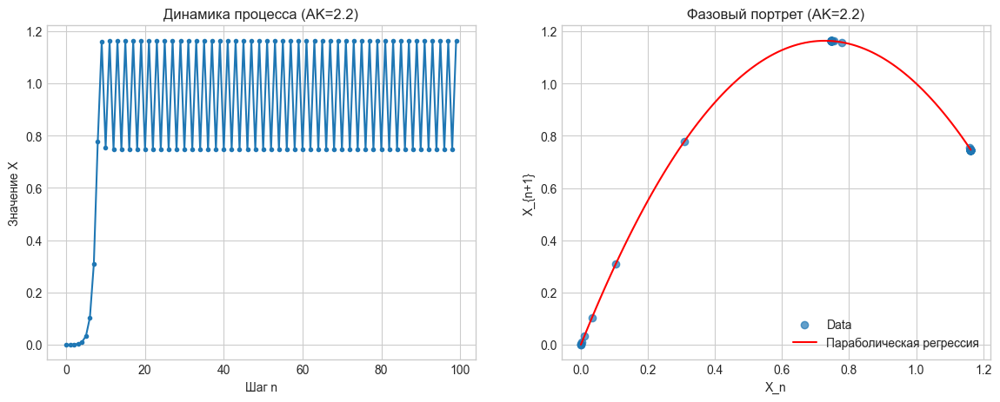

### Хаотический режим

Сценарий $AK=2.8$ задаёт развитый динамический хаос. Временной ряд визуально напоминает шум, однако фазовый портрет по-прежнему согласуется с детерминированной природой процесса и сохраняет геометрию логистического отображения.

Здесь возникает ключевой парадокс базовой модели. С одной стороны, регрессия по-прежнему даёт $R^2 \approx 1$, поскольку темп прироста сохраняет линейную зависимость от $X_n$. Иными словами, метод способен восстановить линейную структуру темпа прироста даже в хаотическом режиме. С другой стороны, итеративный прогноз быстро теряет фазовую синхронизацию с истинной траекторией. На коротком горизонте совпадение сохраняется, но затем чувствительность к начальным условиям делает долгосрочный точечный прогноз неустойчивым.

Тем самым хаос выявляет второе фундаментальное ограничение регрессионного подхода: корректное описание локального закона ещё не гарантирует пригодность далёкого итеративного прогноза.

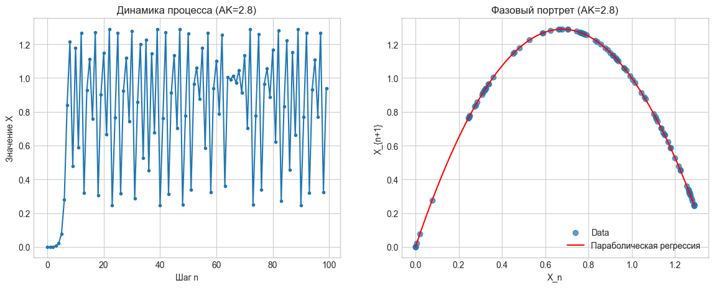
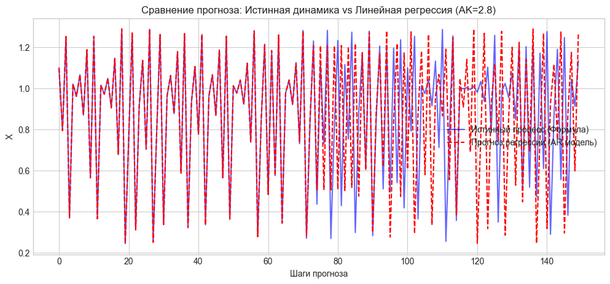

### Итог по базовой модели

Основные результаты удобно свести в таблицу.

| Режим | Истинный фактор | Что выбрал Stepwise | Ложные лаги | Работает ли прогноз |
| --- | --- | --- | --- | --- |
| Устойчивое равновесие ($AK=0.8; 1.5$) | $X_n$ | $X_n$ | нет | да, на всём рассматриваемом горизонте |
| Цикл ($AK=2.2$) | $X_n$ | $X_n$, $Lag_2$ | да | локально, но структура читается неверно |
| Сложный цикл ($AK=2.52$) | $X_n$ | $X_n$, $Lag_4$, дальние дубли | да | ограниченно |
| Хаос ($AK=2.8$) | $X_n$ | $X_n$ | нет в базовой структуре, но прогноз неустойчив | только на коротком горизонте |

По базовой модели можно сделать три вывода. Во-первых, в устойчивом режиме регрессия правильно восстанавливает структуру без ложной памяти. Во-вторых, цикл и граница хаоса показывают, что `STEPWISE` склонен принимать периодичность за наличие глубоких лагов. В-третьих, хаос демонстрирует разрыв между локальной идентификацией и долгосрочным прогнозом: высокий $R^2$ совместим с потерей прогностической устойчивости.

### Детализация динамики (стадии жизненного цикла + короткие окна) и сравнение с хаосом 

#### 1. Постановка задачи и методология

В соответствии с рекомендацией научного руководителя выполнена детализация исследования базовой логистической модели Ферхюльста в форме:

$$
X_{n+1}=X_n + A X_n (K - X_n), \qquad K=1.
$$

Цель дополнения — проверить применимость регрессионного анализа **в условиях коротких выборок**, поскольку в реальной социально-экономической практике исследователь чаще наблюдает **не всю траекторию**, а лишь **локальные фрагменты**, соответствующие отдельным этапам развития процесса.

Чтобы связать “классическое” исследование режимов (стабильность/цикл/хаос) с практикой коротких рядов, использованы два взаимодополняющих подхода:

1. **Стадийная сегментация (жизненный цикл)** — выделение на S-кривой четырёх стадий по уровню освоения потенциала $X/K$:

* Зарождение: $X < 0.1K$
* Активный рост: $0.1K \le X < 0.5K$
* Насыщение: $0.5K \le X < 0.95K$
* Плато: $X \ge 0.95K$

2. **Скользящее окно фиксированной длины** ($window=25$) — моделирование ситуации, когда доступен лишь короткий временной отрезок; в каждом окне оцениваются параметры авторегрессионной модели темпов прироста с лагами до 10 (как в ТЗ).

Рассматривалась зависимость темпа прироста:

$$
\omega_{n+1}=\frac{X_{n+1}-X_n}{X_n}
$$

от текущего уровня $X_n$ и лагов $X_{n-1},...,X_{n-10}$. Оценивание выполнено двумя способами (терминология SPSS):

* **ENTER**: принудительное включение всех регрессоров;
* **STEPWISE**: пошаговый отбор значимых переменных.

Дополнительно рассчитаны **стандартизированные Beta-коэффициенты**, позволяющие сравнивать влияние факторов на общей шкале и выявлять доминирующие переменные в условиях мультиколлинеарности.

#### Визуальная диагностика объектов исследования

S-кривая и стадии жизненного цикла ($A=0.1$)

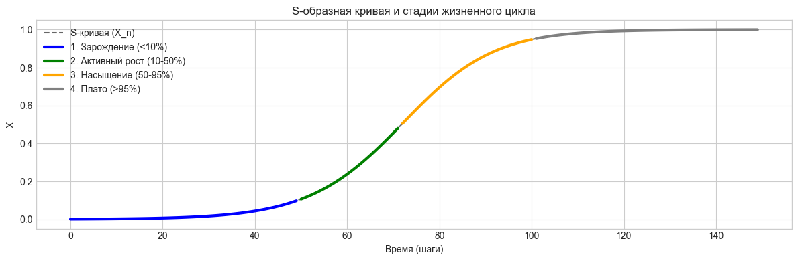

**S-образная кривая и стадии жизненного цикла.**

График демонстрирует классический S-образный рост с выходом на насыщение. Цветовая разметка подчёркивает, что одна и та же траектория может быть интерпретирована как последовательность **локально однородных фаз**, каждая из которых потенциально доступна для наблюдения в реальных данных.

Сравнение с хаосом ($A=2.8$)

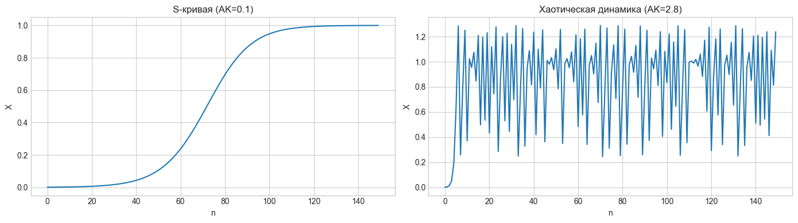

**Сравнение: S-кривая ($A=0.1$) vs хаотическая динамика ($A=2.8$).**

В отличие от S-кривой, хаотический режим не демонстрирует последовательных стадий роста/насыщения: колебания возникают почти сразу, а динамика визуально напоминает шум. Следовательно, **сегментация “жизненного цикла” применима именно к S-траекториям**, тогда как для хаоса “короткие данные” интерпретируются иначе — как тест устойчивости оценок и ложных корреляций.

#### Результаты локального анализа по стадиям (жизненный цикл)

##### Табличные результаты (ENTER и STEPWISE, lags=10)

Полученные оценки для четырёх стадий приведены в таблице (на основе вывода кода):

| Стадия        | Инт.   | n  | ENTER R² | STEP R² | B(X_n)    | Beta(X_n)  |
|--------------|-------:|---:|---------:|--------:|----------:|-----------:|
| Зарождение   | 0–50   | 39 | 1.000000 | 1.00    | −0.099676 | −0.994135  |
| Активный рост| 50–72  | 11 | 1.000000 | 1.00    | −0.099873 | −1.004154  |
| Насыщение    | 72–101 | 18 | 0.999971 | 1.00    | −0.100010 | −1.000580  |
| Плато        | 101–150| 38 | 1.000000 | 1.00    | −0.070943 | −0.640854  |

где  
Инт. — интервал наблюдений,  
n — число точек в окне.

**Ключевые наблюдения:**

1. **Структурная идентификация устойчива:** алгоритм Stepwise **во всех стадиях** выбирает только $X_n$. Ни один лаг $X_{n-1}...X_{n-10}$ не признан значимым, что согласуется с отсутствием памяти в базовой модели.

2. **Качество подгонки максимальное:** $R^2\approx 1$ во всех сегментах (и для ENTER, и для STEPWISE). Это соответствует тому факту, что связь $\omega$ и $X_n$ в логистическом отображении имеет точную линейную форму:
   $$
   \omega = A(K - X_n) = A - A X_n \quad (K=1).
   $$

3. **Интерпретация Beta-коэффициентов:** на стадиях зарождения/роста/насыщения $\text{Beta}(X_n)\approx -1$, то есть вклад $X_n$ доминирует и полностью определяет динамику $\omega$. Это удобно для ранжирования факторов в более сложных моделях (когда присутствуют лаги и мультиколлинеарность), и служит “эталоном” для сравнения.

4. **Особенность стадии “Плато”:** в отличие от первых трёх стадий, на стадии насыщения и плато вариативность $X_n$ падает (ряд становится почти константой), поэтому стандартизированный вклад $\text{Beta}(X_n)$ уменьшается по модулю (≈ -0.64). Это **не означает** изменения физического закона, а отражает снижение информативности регрессора в условиях малой дисперсии на плато.

#### Анализ “коротких данных” через скользящее окно

##### Дрейф оценок B(X_n) по окнам (ENTER)

&nbsp;

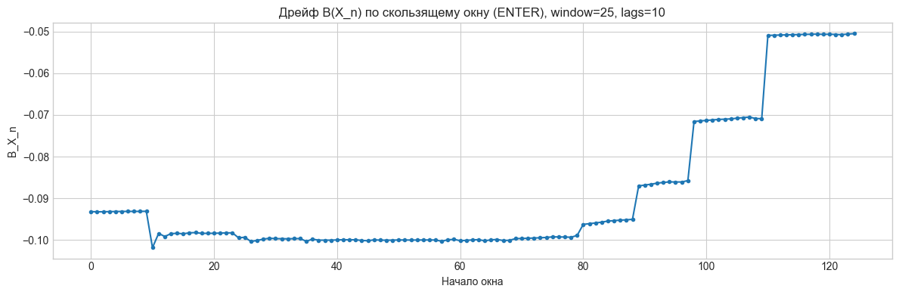

Несмотря на то, что закон генерации данных неизменен, оценка коэффициента $B(X_n)$ демонстрирует **ступенчатый дрейф** при перемещении окна вдоль траектории. Этот эффект интерпретируется следующим образом:

* при переходе окна через разные области S-кривой меняется диапазон наблюдаемых значений $X_n$ и его дисперсия;
* в условиях коротких рядов (25 точек) это приводит к “локальной” перестройке оценок коэффициентов;
* наблюдаемый дрейф — это **методический эффект ограниченности данных**, а не реальный структурный сдвиг процесса.

Таким образом, даже для простого детерминированного процесса возникает важный практический вывод:

> **при коротких выборках параметры регрессии могут “плыть” без изменения закона динамики**, что требует осторожной интерпретации коэффициентов на реальных данных.

#### Частота выбора переменных Stepwise (короткие окна)

   
&nbsp;

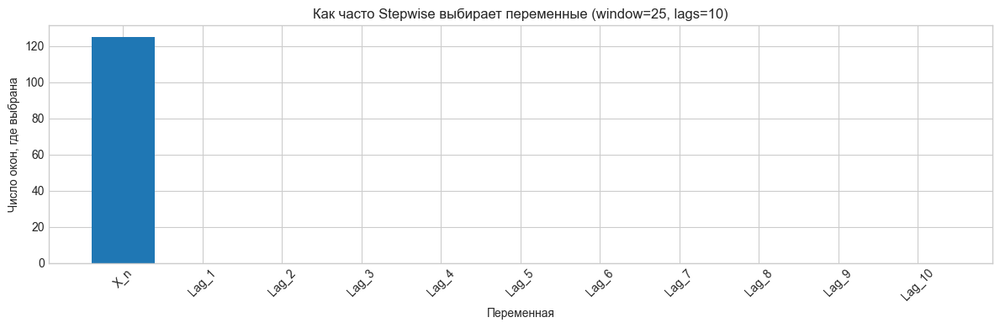

На S-кривой Stepwise **почти во всех окнах** выбирает только $X_n$, а лаговые переменные не появляются. Это подтверждает робастность структурной идентификации при отсутствии памяти.

#### Сопряжение с предыдущими результатами и общий вывод

Полученные результаты дополняют основную часть главы о режимах (стабильность/цикл/хаос) следующим образом:

1. **Для S-образной траектории** (рост и насыщение) сегментация жизненного цикла корректна и позволяет имитировать практику анализа компаний на разных стадиях.

2. **Регрессионный анализ устойчив на коротких сегментах:** даже при ограниченном числе наблюдений модель корректно выявляет структуру зависимости $\omega=f(X_n)$, не “вытягивая” ложные лаги.

3. **Однако коэффициенты на коротких данных демонстрируют дрейф:** это принципиально важная оговорка для практики — изменение оценок может быть следствием ограниченности выборки и смены диапазона переменной, а не структурного сдвига.

4. **Сравнение с хаосом показывает границы интерпретации стадий:** в хаотическом режиме отсутствует смысловая последовательность “зарождение-рост-плато”, поэтому “жизненный цикл” относится к S-траекториям, а для хаоса уместны другие формы локального анализа (скользящее окно как тест нестабильности и ложных корреляций).

### Итоговый вывод

> Проведённая детализация подтвердила, что линейные регрессионные модели темпов прироста способны корректно идентифицировать базовый логистический закон даже на коротких временных фрагментах, соответствующих различным стадиям S-образного роста.
> Вместе с тем показано, что при анализе коротких окон возможно наблюдать дрейф оценок коэффициентов вследствие смены диапазона и дисперсии данных, что требует осторожной интерпретации параметров в прикладных социально-экономических задачах.
> Сравнение с хаотическим режимом подчёркивает, что стадийная интерпретация применима к траекториям роста и насыщения, тогда как для хаоса короткие окна служат инструментом методической диагностики ограничений линейной аппроксимации.

## 2.3. Описание модели с запаздыванием и сценариев эксперимента

В данной главе рассматриваются особенности идентификации и прогнозирования процессов, обладающих «глубокой памятью», где текущая динамика определяется не текущим состоянием системы, а ее предысторией. Исследование проводится на базе логистического отображения с запаздывающим аргументом.

Модель с запаздыванием описывает эволюцию системы, в которой ограничение ресурсов (или реакция рынка) действует с задержкой в один такт времени. Математически это выражается дискретным уравнением:

$$ X_{n+1} = X_n + g X_n (K - X_{n-1}) $$

В нормированном виде ($K=1$) единственным управляющим параметром является $g$ (нормированная интенсивность). Принципиальное отличие от базовой модели заключается в том, что темп прироста зависит от $X_{n-1}$, а не от $X_n$. Это превращает систему из одномерной в двумерную (для описания состояния требуется вектор $[X_n, X_{n-1}]$).

Для анализа были выбраны пять сценариев, охватывающих основные динамические режимы согласно теории устойчивости дифференциально-разностных уравнений:
1.  **$g = 0.2$**: Монотонный (апериодический) рост к состоянию равновесия.
2.  **$g = 0.8$**: Колебательный переходный процесс (затухающие колебания).
3.  **$g = 1.05$**: Потеря устойчивости равновесия через бифуркацию Андронова-Хопфа (возникновение квазипериодических колебаний).
4.  **$g = 1.25$**: Режим хаотических биений (слабый хаос).
5.  **$g = 1.6$**: Критический режим («жесткий хаос»), приводящий к коллапсу системы из-за перерегулирования.

### Режим монотонного роста ($g = 0.2$)

**Фазовый анализ:** Фазовый портрет ($X_{n+1}$ vs $X_n$) представляет собой линию с небольшим изгибом, визуально схожую с параболой базовой модели, что свидетельствует о доминировании линейной составляющей динамики на этапе роста.

**Регрессионный анализ:**
Метод пошагового отбора продемонстрировал способность алгоритма различать типы динамики.
*   **Выбор переменных:** В отличие от базовой модели, где выбирался $X_n$, здесь алгоритм Stepwise корректно отобрал переменную **$Lag\_1$ ($X_{n-1}$)** как единственный значимый предиктор.
*   **Параметрическая идентификация:** Коэффициент регрессии составил $-0.2$, что точно соответствует теоретическому значению $-g$.
*   **Качество модели:** $R^2 = 1.000$. Прогноз полностью совпадает с истинной траекторией.

**Вывод:** Линейная регрессия успешно диагностирует наличие запаздывания в системе в условиях стабильного роста.

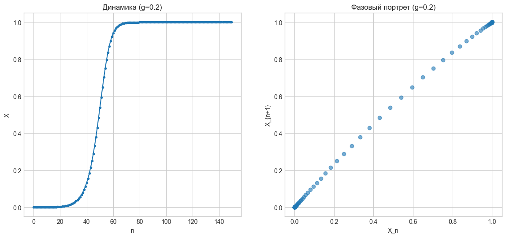
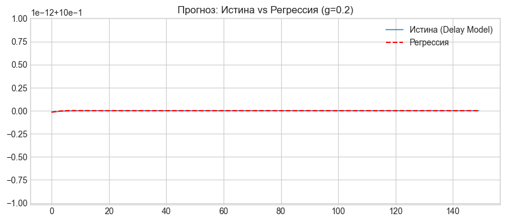

### Режим затухающих колебаний ($g = 0.8$) и эффект «вычислительного шума»

В данном сценарии процесс сходится к равновесию через серию затухающих колебаний.

**Аномалия отбора переменных:**
При сохранении идеального $R^2=1.000$, алгоритм Stepwise включил в модель наряду со значимым $Lag\_1$ также переменные **$Lag\_3$ и $Lag\_9$**. Коэффициенты при этих переменных оказались ничтожно малы ($\sim 10^{-16}$), что соответствует уровню машинного нуля (machine epsilon) для типа данных `float64`.

**Проблема устойчивости прогноза:**
График сравнительного прогнозирования выявил серьезный дефект: после 100 шагов стабильности траектория регрессионной модели начинает **самопроизвольно раскачиваться**, расходясь с истинным процессом.
*   *Причина:* Эффект переобучения на шуме. Включение в рекуррентную формулу прогноза «мусорных» коэффициентов привело к накоплению ошибок округления и появлению паразитных собственных частот в линейной модели.

**Вывод:** Стремление статистических алгоритмов к максимизации $R^2$ может приводить к включению в модель вычислительных артефактов, что снижает робастность модели на длительных горизонтах прогнозирования.

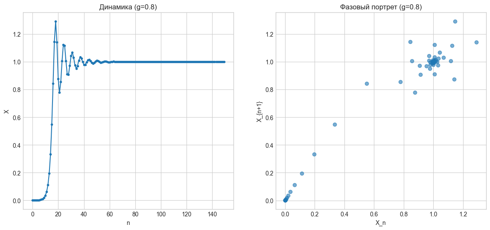
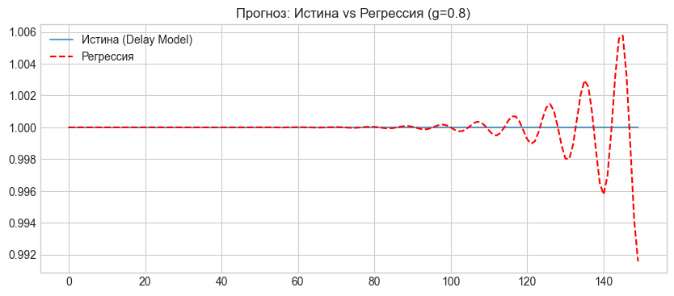

### Бифуркация и возникновение инвариантной кривой ($g = 1.05$)

При переходе параметра $g$ через критическое значение $1.0$ система теряет устойчивость.

**Топологический анализ:**
Фазовый портрет кардинально меняет структуру: вместо линии точки формируют **замкнутую петлю (инвариантную окружность)**.
*   *Значение:* Это визуальный признак увеличения размерности аттрактора. Система переходит в режим квазипериодического движения, характерного для систем с запаздыванием. Наличие петли на фазовом портрете однозначно указывает на инерционность процесса.

**Катастрофа линейного прогноза:**
Регрессионная модель показала $R^2 = 1.000$ на обучающей выборке, определив коэффициент при $Lag\_1$ равным $-1.05$. Однако прогнозная траектория продемонстрировала **резонансное разрушение**:
*   Поскольку коэффициент обратной связи $|-1.05| > 1$, линейная модель действует как усилитель отклонений.
*   В отсутствие нелинейного сдерживающего фактора (множителя $X_n$ в исходном уравнении), амплитуда колебаний в прогнозе начала экспоненциально расти, что привело к математическому коллапсу модели (выходу за пределы области определения) уже на 15-м шаге.

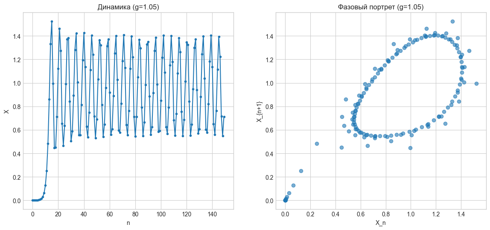
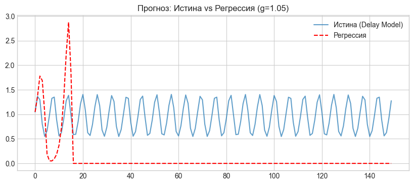

### Хаотические режимы и коллапс системы ($g = 1.25$ и $g = 1.6$)

В режимах развитой неустойчивости наблюдается деформация инвариантной кривой и переход к хаосу.

**Результаты моделирования:**
*   При $g=1.25$ фазовый портрет демонстрирует разрыв замкнутой петли. Линейный прогноз мгновенно расходится с реальностью из-за высокой чувствительности к фазовым сдвигам.
*   При $g=1.6$ происходит «перегрев» системы: слишком сильная реакция на запаздывающий сигнал приводит к резкому скачку и последующему падению до нуля (аналог банкротства). Регрессионный анализ в точке коллапса становится невозможным ($R^2$ падает до 0.27) из-за вырождения временного ряда в константу.

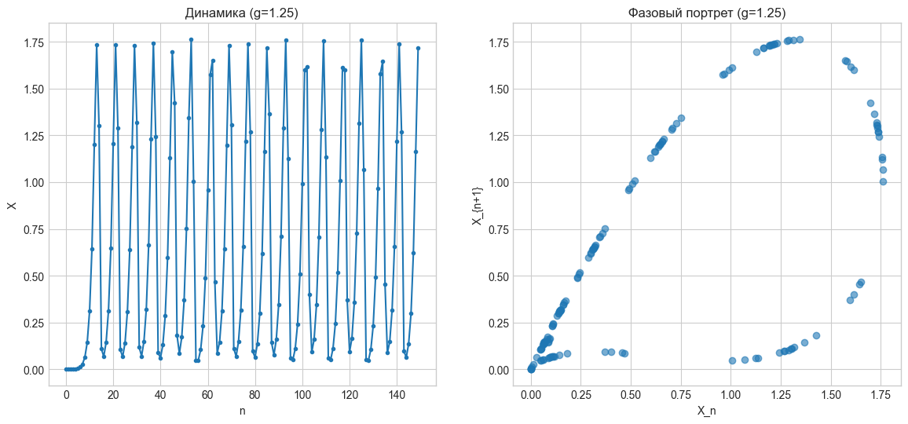
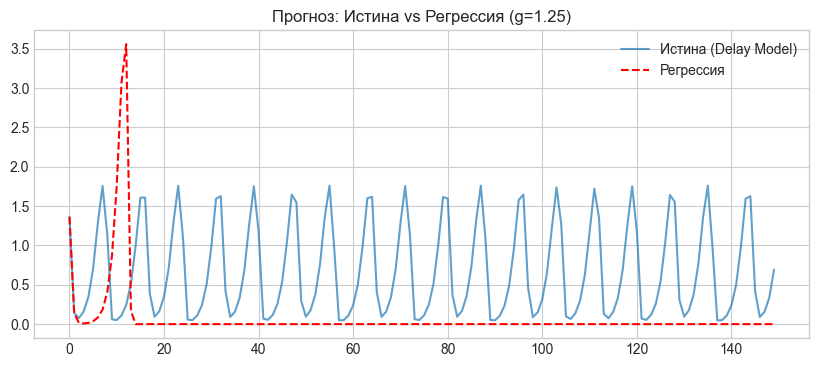
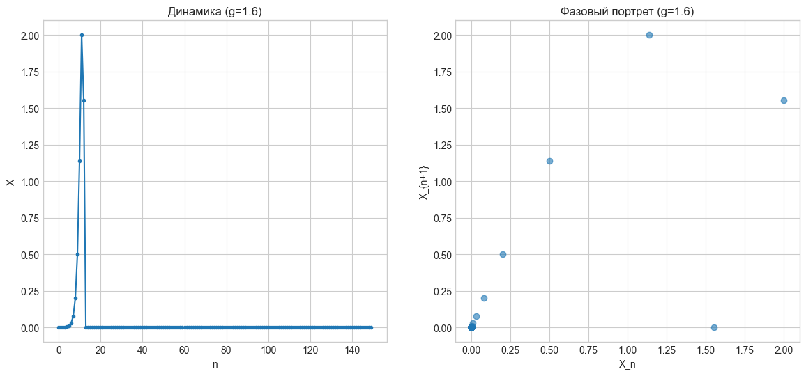
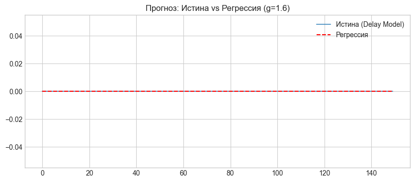

### Выводы по запаздывающей модели

Сравнительный анализ модели с запаздыванием позволил выявить фундаментальные отличия от базовой безынерционной модели:

1.  **Диагностика типа памяти.** Регрессионный анализ (метод Stepwise) является надежным инструментом структурной идентификации: смещение значимого лага с $X_n$ на $X_{n-1}$ позволяет уверенно диагностировать инерционную природу процесса.
2.  **Топологический критерий.** Вид фазового портрета служит индикатором типа нелинейности: трансформация портрета из линии в замкнутую петлю (окружность) свидетельствует о бифуркации Андронова-Хопфа и наличии запаздывания.
3.  **Кризис линейной экстраполяции.** В системах с запаздыванием при параметре интенсивности $g > 1$ наблюдается парадокс: формально идеальная модель ($R^2=1$) абсолютно непригодна для прогнозирования. Линейная аппроксимация неустойчивого цикла неизбежно приводит к резонансному раскачиванию и разрушению прогноза, так как не учитывает механизмы нелинейного насыщения.

### Детализация запаздывающей модели на коротких выборках (стадии + скользящие окна) 

#### Постановка задачи и место эксперимента в работе

В базовой части диплома запаздывающая модель уже была исследована как система с “глубокой памятью”, где темп роста определяется состоянием **предыдущего шага**:

$
X_{n+1} = X_n + g X_n (K - X_{n-1}), \quad K=1.
$

Ключевой вывод той части: **Stepwise сдвигает значимый регрессор с $X_n$ на $X_{n-1}$**, то есть корректно диагностирует наличие запаздывания, а также появляется особая топология фазового портрета (петля) и кризис линейного прогноза при (g>1).

**Цель текущего дополнения (по правке Полунина):** показать, как та же диагностика работает **в условиях коротких рядов**, когда исследователь наблюдает лишь локальные фрагменты траектории (окна), а не всю историю целиком — аналогично тому, как мы делали “детализацию” для базовой модели.

Мы фиксируем параметры “практического анализа” так же, как в базовой детализации:

* скользящее окно: **window = 25**,
* лаги: **lags = 10**,
* два метода оценивания (терминология SPSS): **ENTER** (все регрессоры) и **STEPWISE** (пошаговый отбор),
* анализируем регрессию темпа прироста:

$$
  \omega_{n+1}=\frac{X_{n+1}-X_n}{X_n}
$$
  на $X_n$ и лагах $X_{n-1}\ldots X_{n-10}$.

#### Дизайн эксперимента: “идеальный компромисс” — три режима (g)

Чтобы получить цельный нарратив (рост → колебания → сложная динамика), оставлены **три реперные точки**, которые покрывают разные классы аттракторов:

1. **$g=0.2$** — монотонный рост к насыщению (“жизненный цикл”) + окна
2. **$g=0.8$** — устойчивые затухающие колебания + окна
3. **$g=1.25$** — сложная динамика/хаос + окна

Это напрямую продолжает логику уже написанной главы:

* для $g=0.2$ уже было показано, что Stepwise выбирает **Lag_1** и коэффициент $\approx -g$;
* для $g=0.8$ отмечалась “аномалия отбора” (включение лишних лагов уровня машинного нуля);
* для $g>1$ обсуждался переход к неустойчивости и хаосу, и принципиальная проблема линейного прогноза.

**Новое в этом дополнении** — мы проверяем всё это **не на одном длинном ряде**, а **на множестве локальных окон** и (для $g=0.2$) ещё и **на стадиях жизненного цикла**, как аналог “корпоративных стадий”.

#### Визуальная диагностика режимов 

&nbsp;

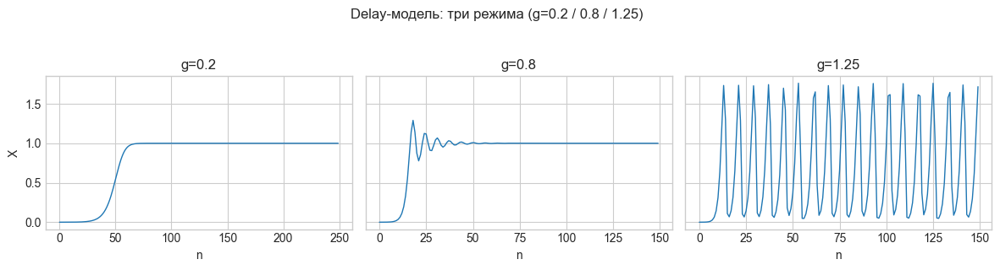

* $g=0.2$: S-подобная траектория выхода на насыщение;
* $g=0.8$: затухающие колебания к равновесию;
* $g=1.25$: устойчивые колебания большой амплитуды/сложная динамика.

**Одна и та же модель с памятью при росте (g) меняет тип аттрактора**, и потому “короткие окна” будут вести себя по-разному.

#### $g=0.2$: жизненный цикл + короткие окна

##### Стадийная сегментация (аналог “роста фирмы”)

&nbsp;

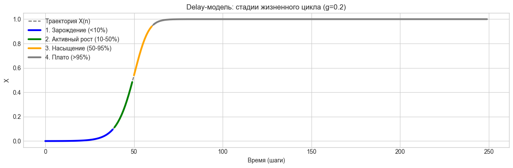

Смысл — тот же, что в базовой модели: проверить, сохраняется ли структура регрессии, когда мы смотрим на “локальные стадии”, а не на весь ряд.

##### Локальная регрессия по стадиям (ENTER/STEPWISE)

Ключевые результаты по стадиям:

* **Зарождение (<10%)**:

  * ENTER: $B(Lag_1)\approx -0.200$, $B(X_n)\approx 0$, $R^2\approx 1$
  * STEPWISE выбирает **только Lag_1**, $R^2=1$

Это идеально подтверждает теоретическую связь:

$$
\omega \approx g - gX_{n-1},
$$
то есть в “чистой памяти” значим именно прошлый шаг.

* **Плато (>95%)**:

  * ENTER всё ещё даёт $R^2 \approx 1$, но коэффициенты “размазываются” между $X_n$ и лагами: $B(X_n)$ и $B(Lag_1)$ уже не такие “чистые”.
  * STEPWISE начинает подбирать комбинации лагов (у вас в примере — несколько лагов и $X_n$ при $R^2=1)$.

**на плато дисперсия ряда мала**, возникает сильная мультиколлинеарность лагов (почти одно и то же число сдвинуто во времени), и Stepwise легко находит “альтернативные” комбинации регрессоров, которые дают тот же идеальный фит. Это ровно продолжает линию диплома про “алгоритмическое стремление к максимизации (R^2)” и риск ложных включений.

**Комментарий про то, что среди результатов стадий сейчас видны только “зарождение” и “плато”.**

Это не “ошибка модели”, а эффект **геометрии траектории + порогов + фильтров регрессии**:

* участки 10–50% и 50–95% по времени получились **слишком короткими** (или после учёта лагов (=10) осталось мало точек), и код их логично отбрасывает как статистически “тонкие”.
  Практически: это можно описать как “в delay-модели при $g=0.2$ фаза активного роста очень компактна во времени, поэтому полноценная эконометрическая идентификация на стадии ‘рост’ требует либо более длинного ряда, либо ослабления фильтра минимального числа наблюдений”.

##### Скользящее окно 

&nbsp;

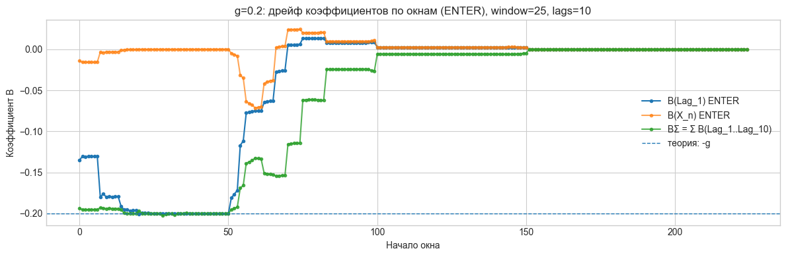

Этот результат показывает “реальную” проблему коротких данных в системе с памятью:

* На ранних окнах сумма лаговых коэффициентов $B_\Sigma$ держится близко к **$-g$** — то есть **суммарный эффект памяти** извлекается корректно, даже если отдельные лаги слегка плавают.
* По мере перехода к насыщению ENTER начинает перераспределять вклад между $Lag_1$ и другими лагами (потому что лаги становятся взаимозаменяемы).
* **Вывод**: в модели с запаздыванием на коротких выборках “правильнее смотреть не на один $B(Lag_1)$, а на агрегат влияния памяти (например $B_\Sigma$)”, потому что он устойчивее к мультиколлинеарности и смене дисперсии.

&nbsp;

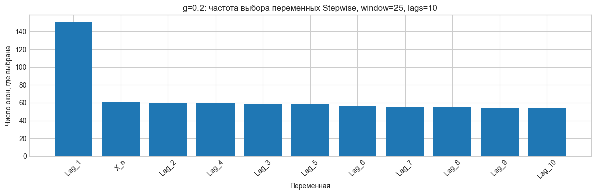

Видно:

* **$Lag_1$ выбирается чаще всего** → структурная идентификация памяти сохраняется.
* Но на части окон появляются и другие лаги → это отражает не смену закона, а взаимозаменяемость лагов на плато и “игру” Stepwise с почти эквивалентными предикторами.

**Итог по $g=0.2$:**

> На траектории роста метод на коротких окнах уверенно выявляет память (доминирование $Lag_1$), а на плато из-за мультиколлинеарности лагов начинается “размазывание” коэффициентов; устойчивее интерпретировать суммарный лаговый эффект $B_\Sigma$.

#### $g=0.8$: затухающие колебания и “усложнение структуры” на окнах

Это режим, который уже был описан как “затухающие колебания + эффект вычислительного шума/аномалия отбора переменных”.

Полученные окна подтверждают и усиливают это:

&nbsp;

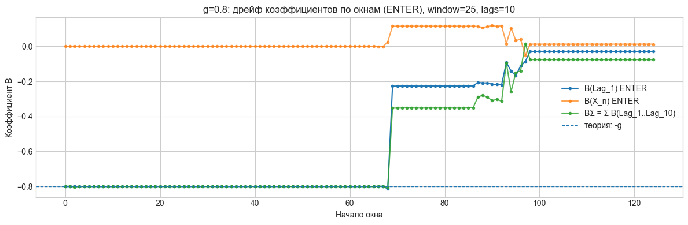

* На ранних окнах сумма лагов $B_\Sigma$ близка к $-g$, но при переходе через область колебаний появляются резкие перестройки оценок.
* Это нормально: разные окна “захватывают” разные фазы колебаний → локальная линейная аппроксимация получается разной.

&nbsp;

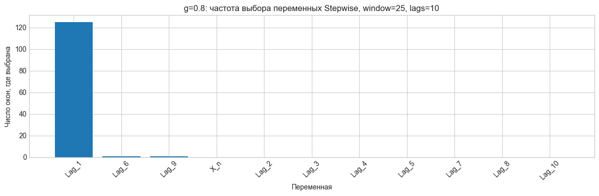

* Практически везде выбирается **$Lag_1$** (доминирующий фактор памяти), а “мусорные лаги” появляются редко/точечно.
  Это хорошо стыкуется с тем, что “лишние лаги” имели коэффициенты уровня машинного нуля: в коротких окнах Stepwise, как правило, удерживает правильную структуру, но на отдельных отрезках может “цеплять” артефакты.

**Сопряжение с уже полученными ранее результатами:**
ранее мы получили “аномалию” на одном обучающем отрезке; теперь видим, что **локально (по окнам) структура в целом стабильна $Lag_1$, но оценки параметров чувствительны к фазе колебаний** — то есть проблема не исчезает, а получает объяснение через “короткие данные”.

#### $g=1.25$: сложная динамика/хаос и ложные лаги на окнах

Ранее этот режим уже фигурировал как зона развитой неустойчивости/хаоса.

Окна добавляют “практическую” деталь:

&nbsp;

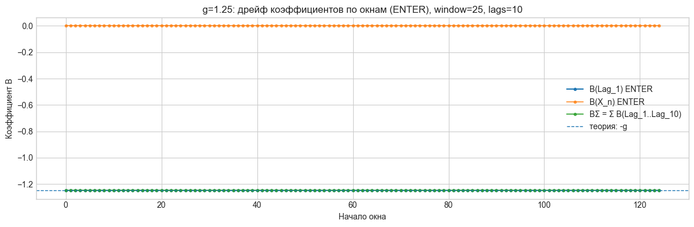

* Практически постоянный $B_\Sigma \approx -1.25$ при нулевом $B(X_n)$ — это выглядит “красиво” как идентификация суммарного эффекта памяти.
* Но это **не означает** хорошего прогноза: ранее уже сформулирована ключевая идея, что при $g>1$ парадоксально сохраняется идеальный фит на истории, но линейный прогноз принципиально плох. Окна лишь подчёркивают: “локально можно идеально подогнать, но глобально предсказать нельзя”.

&nbsp;

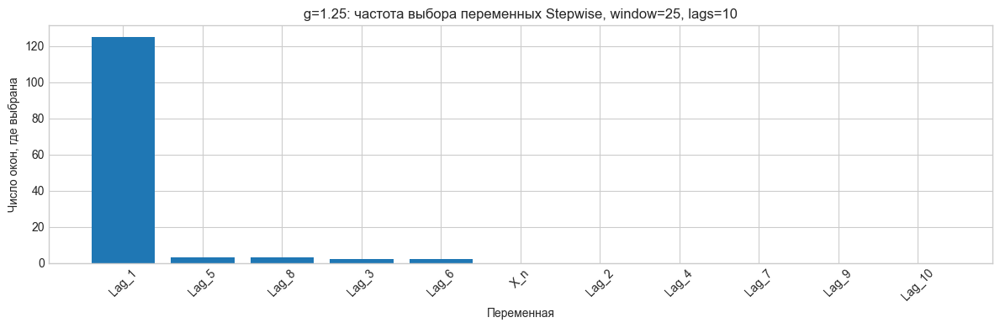

* $Lag_1$ доминирует, но появляются редкие дополнительные лаги.
  Это и есть “ложные лаги” как симптом того, что при сложной динамике короткие окна дают высокие шансы на случайные корреляции (особенно при лаговой мультиколлинеарности).

#### Как это дополнение связывается с детализацией базовой модели

* **В базовой модели** детализация показала: на стадиях и на окнах Stepwise выбирает $X_n$ и почти не тянет лаги → потому что памяти нет, а структура одномерная.
* **В запаздывающей модели** детализация показывает зеркальную картину: на росте и на большинстве окон Stepwise выбирает $Lag_1$ → то есть “короткие данные” всё равно позволяют диагностировать **наличие памяти**.

При этом отличие принципиальное:

* в базовой модели дрейф коэффициентов на окнах — в основном методический эффект смены диапазона $X$;
* в delay-модели добавляется **мультиколлинеарность лагов** (особенно на плато), из-за чего “правильный” эффект памяти может распределяться между несколькими лагами; поэтому появляется полезный диагностический приём — смотреть на **суммарный лаговый эффект $B_\Sigma$**.

## 2.4. Описание смешанной модели и параметров эксперимента

В данной главе рассматривается наиболее общий случай динамики, когда развитие системы определяется как текущим состоянием (мгновенная реакция), так и предысторией (инерция). Исследуется смешанное отображение, являющееся суперпозицией базовой модели и модели с запаздыванием.

Смешанная модель описывает процесс, в котором ограничивающий фактор представляет собой линейную комбинацию текущего и прошлого состояний системы. Математическое уравнение процесса имеет вид:

$$ X_{n+1} = X_n + q X_n (K - X_n - \gamma X_{n-1}) $$

Где $q$ — параметр нормированной интенсивности, а $\gamma$ — коэффициент памяти (вес предыстории). При $\gamma=0$ модель вырождается в базовую (Ферхюльста), при $\gamma \to \infty$ — в модель с чистым запаздыванием.

Стационарное состояние (фиксированная точка) смешанной модели при $X_{n}=X_{n-1}=X^*$ определяется из условия нулевого прироста:

$$
0 = q X^*(1 - X^* - \gamma X^*) \Rightarrow 1-(1+\gamma)X^*=0 \Rightarrow
X^*=\frac{1}{1+\gamma}.
$$

Отсюда следует ключевой факт для интерпретации:

* при $\gamma>0$ стационарный уровень $X^*$ **снижается** относительно $K=1$ (память усиливает ограничение);
* при $\gamma<0$ стационарный уровень $X^*$ **увеличивается** (предыстория “расширяет потенциал развития”);
* значение $\gamma=-1$ является пороговым: при $\gamma<-1$ особая точка становится отрицательной ($X^*<0$), что разрушает экономическую интерпретацию стационарного “потенциала” в нормировке $K=1$.

В ходе эксперимента исследовалось влияние величины коэффициента памяти на динамику и устойчивость системы. Были рассмотрены два режима:
1.  **Сильная память ($\gamma = 0.5$):** Влияние прошлого составляет половину от влияния настоящего.
2.  **Слабая память ($\gamma = 0.1$):** Доминирует текущая конъюнктура, влияние прошлого невелико.
3. **Стимулирующая память ($\gamma < 0$):** предыстория увеличивает особую точку $X^*$ и тем самым интерпретируется как фактор роста потенциальной емкости развития.

Для каждого режима варьировался параметр $q$, чтобы охватить спектр состояний от устойчивости до хаоса.

*Анализ результатов для режима сильной памяти ($\gamma = 0.5$)*

###  Устойчивый рост ($q = 1.5$)

**Динамика:** Система демонстрирует быстрый выход на насыщение с характерным «перелетом» (overshoot) и стабилизацией в точке равновесия $X^* = \frac{1}{1+\gamma} \approx 0.67$.

**Регрессионный анализ:**
Метод Stepwise безошибочно идентифицировал структуру процесса.
*   **Отобранные переменные:** $X_n$ и $Lag\_1$ ($X_{n-1}$).
*   **Коэффициенты:** $\zeta_{Xn} = -1.5$, $\zeta_{Lag1} = -0.75$.
*   **Интерпретация:** Отношение коэффициентов $\frac{-0.75}{-1.5} = 0.5$ идеально соответствует заложенному параметру $\gamma$. Это доказывает высокую разрешающую способность регрессии в задачах структурной идентификации.

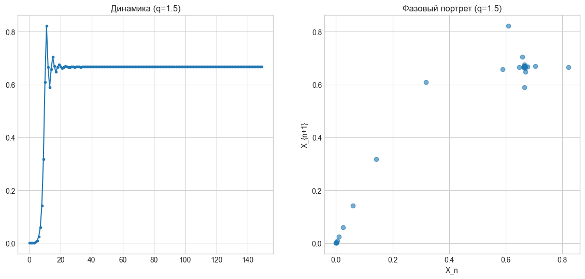
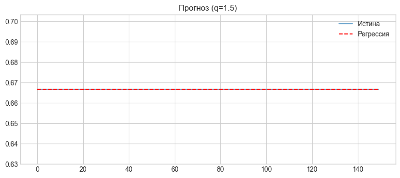

### Устойчивый цикл периода 2 ($q = 2.8$)

**Результаты идентификации:**
В условиях циклической динамики регрессионная модель сохранила высокую точность идентификации параметров ($\zeta_{Xn} = -2.8$, $\zeta_{Lag1} = -1.4$), что подтверждает робастность метода оценки коэффициентов.

**Парадокс прогнозирования:**
Несмотря на точное определение структуры связей, итеративный прогноз оказался несостоятельным. Линейная модель, обладая суммарным коэффициентом отрицательной обратной связи $-(q + q\gamma) = -4.2$, оказалась чрезмерно жесткой. В отсутствие нелинейных сдерживающих факторов любое отклонение в прогнозе приводило к мгновенному «перерегулированию» и математическому коллапсу траектории (падению в ноль).

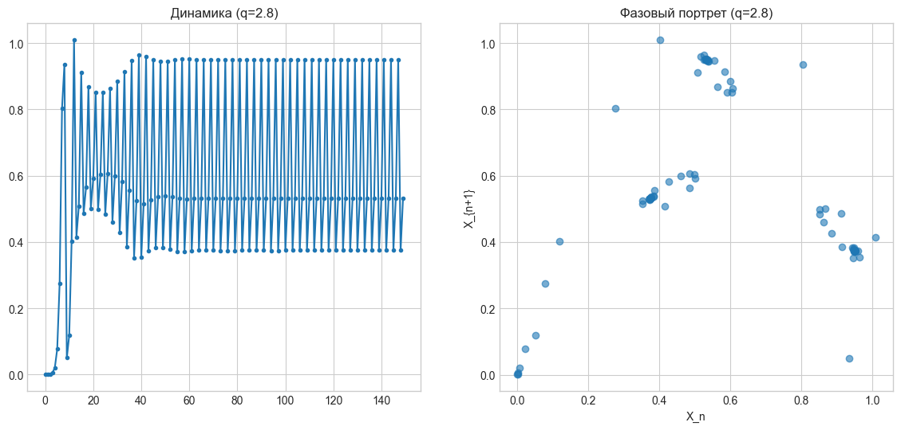
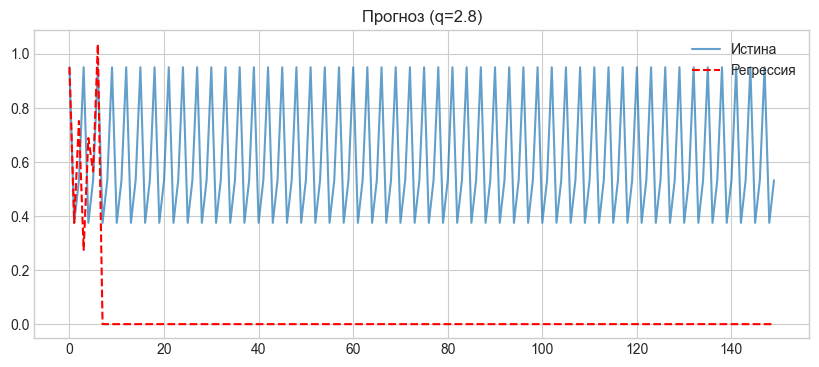

### Коллапс системы при переходе к хаосу ($q > 3.0$)

Эксперименты с $q=3.1, 3.5, 3.9$ показали, что при значительном коэффициенте памяти ($\gamma=0.5$) область устойчивого хаоса практически отсутствует. Высокая инерционность системы в сочетании с высокой интенсивностью реакции приводит к «жесткой бифуркации»: система теряет устойчивость скачкообразно, переходя от циклов сразу к разрушению (значения уходят в область отрицательных чисел). Регрессионный анализ на этапе краха неинформативен.

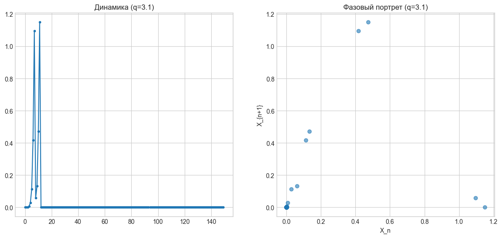
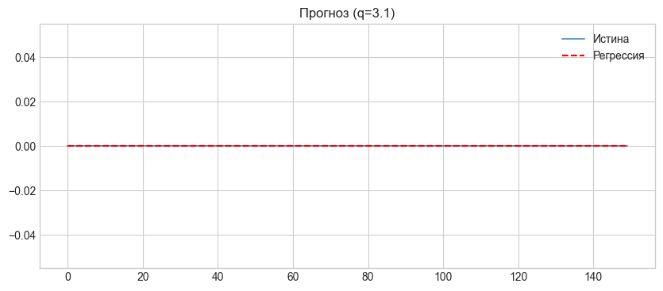
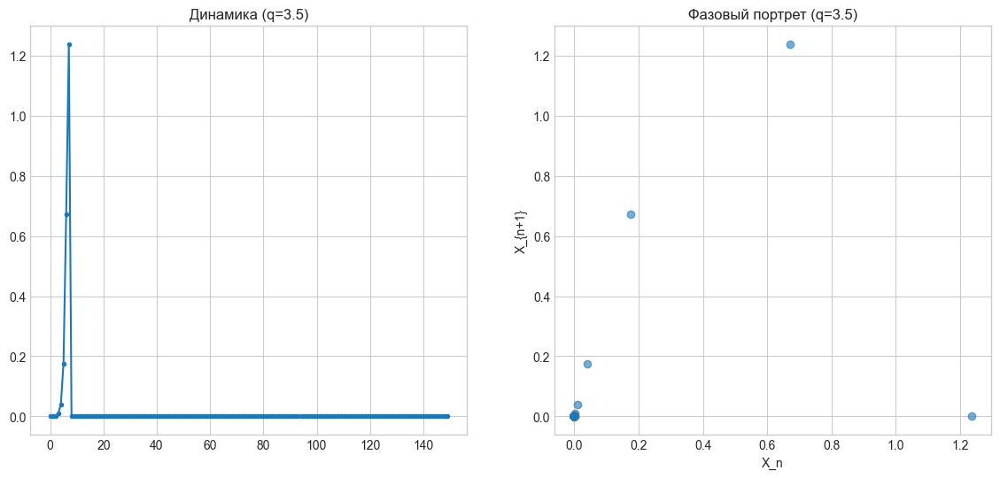
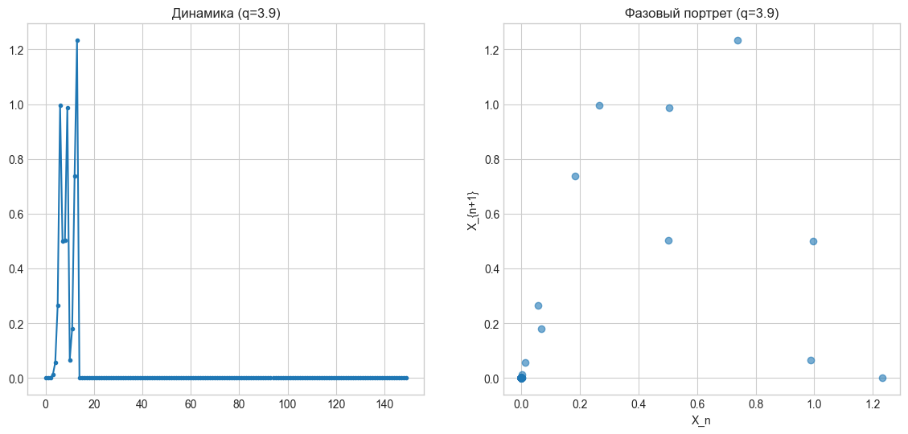

*Анализ результатов для режима слабой памяти ($\gamma = 0.1$)*

Для изучения развитого динамического хаоса был введен режим слабой памяти, позволяющий системе сохранять жизнеспособность при высоких значениях интенсивности.

### Слабый хаос и сложный цикл ($q = 2.7$)

**Фазовый анализ:**
Фазовый портрет трансформировался в «размытую параболу» — облако точек, сгруппированных вокруг кривой $X_{n+1}=f(X_n)$. Толщина облака пропорциональна влиянию памяти ($\gamma$).

**Регрессионный анализ:**
Алгоритм Stepwise вновь продемонстрировал точность идентификации:
*   Коэффициент при $X_n$: $-2.7$ (соответствует $-q$).
*   Коэффициент при $Lag\_1$: $-0.27$ (соответствует $-q\gamma$).
*   Отношение $1:10$ точно отражает параметр $\gamma=0.1$.

**Прогноз:** Наблюдается постепенное расхождение фаз истинной и прогнозируемой траекторий, обусловленное нелинейным взаимодействием факторов $X_n$ и $X_{n-1}$, которое линейная модель аппроксимирует аддитивной суммой.

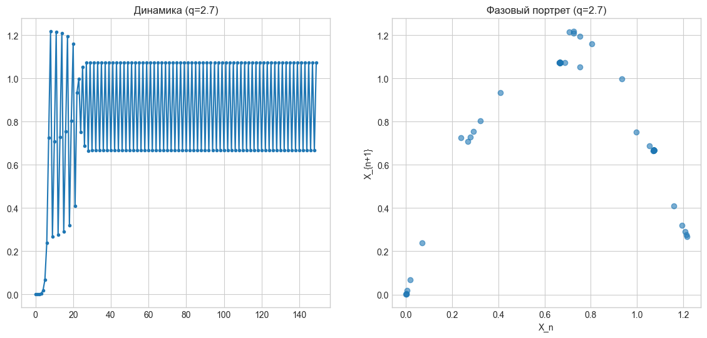
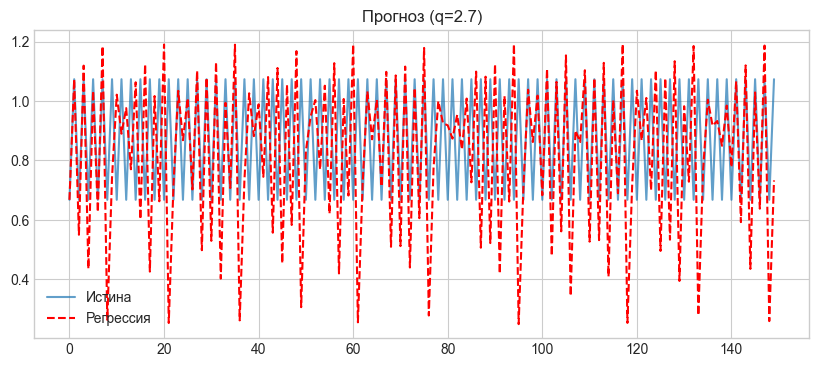

### Развитый динамический хаос ($q = 2.9$)

**Динамика:** Апериодические колебания со сложной структурой амплитудной модуляции.

**Прогностический провал:**
При сохранении идеального качества подгонки на исторических данных ($R^2=1.000$), прогнозная модель демонстрирует эффект **«раздувания волатильности»**. Амплитуда колебаний регрессионной модели превышает амплитуду истинного процесса, что приводит к быстрой декорреляции. Это связано с тем, что линейная модель не имеет «потолка насыщения», который ограничивает рост реальной нелинейной системы.

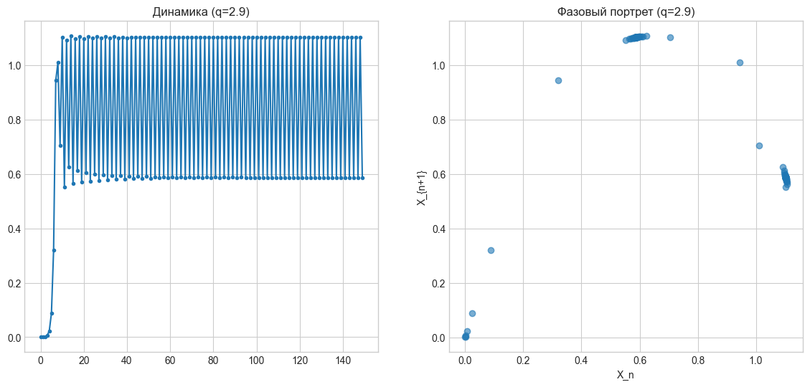
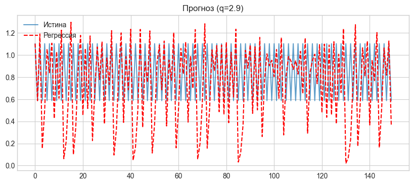

*Анализ результатов для режима стимулирующей памяти ($\gamma < 0$)*

Данный режим введён для выполнения требования о рассмотрении случаев, когда предыстория повышает “потенциал развития”, то есть увеличивает стационарный уровень $X^*$. При $\gamma<0$ особая точка возрастает:
$$
X^*=\frac{1}{1+\gamma} > 1,
$$
а лаговый коэффициент в регрессии темпов прироста меняет знак на положительный:
$$
\omega_{n+1}\approx q-qX_n-q\gamma X_{n-1} \Rightarrow B(Lag_1)=-q\gamma>0.
$$

### Устойчивый режим при умеренно отрицательной памяти ($\gamma=-0.2$, $q=1.5$)

**Динамика:** процесс демонстрирует быстрый рост из окрестности нуля с выходом на устойчивые колебания вокруг стационарного уровня. Теоретическая особая точка
$$
X^*=\frac{1}{1+\gamma}=1.25
$$
превышает $K=1$, что интерпретируется как расширение потенциала развития за счёт стимулирующего эффекта предыстории.

**Фазовый портрет:** сохраняет параболическую структуру и демонстрирует смещение области достижимых значений вправо относительно режима $\gamma>0$.

**Регрессионная идентификация (ENTER/Stepwise):** в устойчивом режиме коэффициенты совпадают с теорией: $B(X_n)\approx -q$, $B(Lag_1)\approx -q\gamma>0$. Положительный знак лагового эффекта выступает диагностическим признаком стимулирующей памяти.

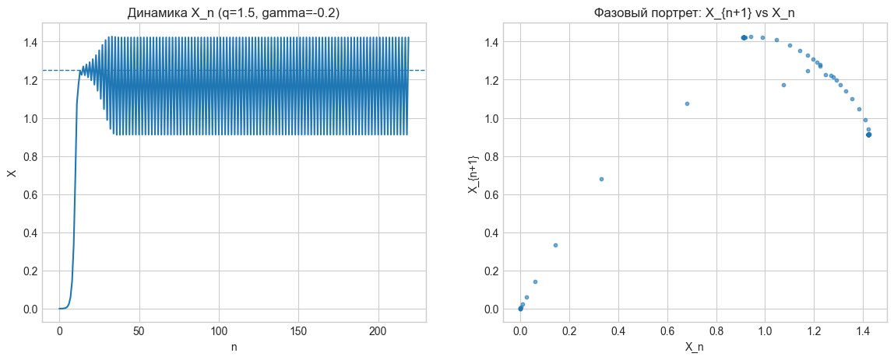

### Потеря устойчивости при росте интенсивности ($\gamma=-0.2$, $q=2.8$ и $q=3.1$)

При увеличении $q$ стимулирующая роль памяти усиливает положительную обратную связь, что приводит к эффекту «перерегулирования»: наблюдается резкий всплеск и последующий коллапс траектории (в экспериментах — вырождение к нулю). Формально $X^*$ остаётся положительной, но система фактически не стабилизируется в окрестности стационарного уровня.

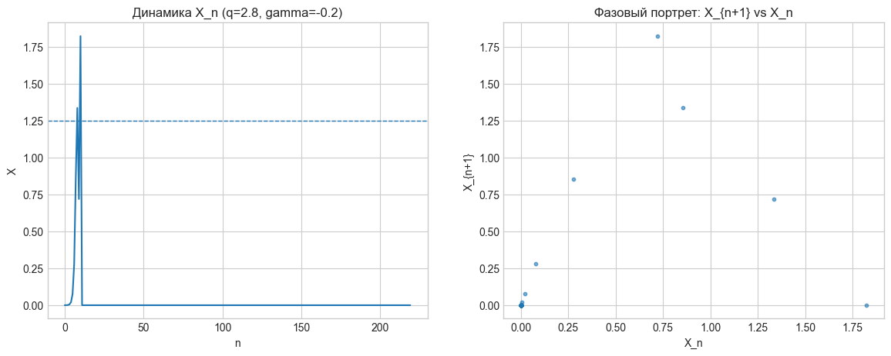
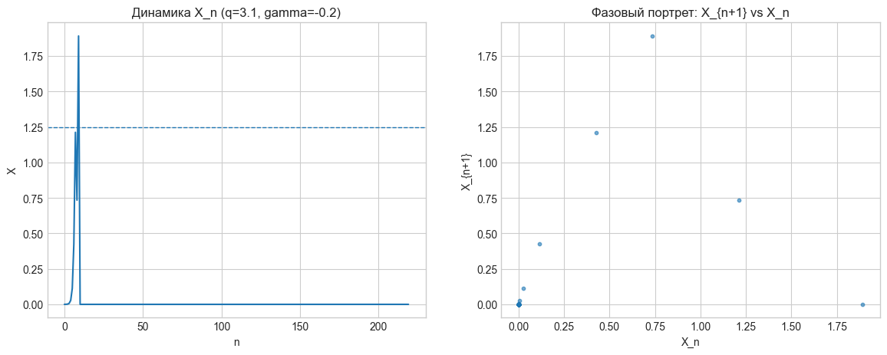

### Усиление стимулирующей памяти и сужение области устойчивости ($\gamma=-0.5$ и $\gamma=-0.8$)

При усилении отрицательной памяти стационарный уровень резко возрастает:

* $\gamma=-0.5 \Rightarrow X^*=2$,
* $\gamma=-0.8 \Rightarrow X^*=5$,

однако область устойчивости по $q$ существенно сужается: даже при $q=1.5$ система становится склонной к перегреву и последующему вырождению. Это показывает принципиальный компромисс: рост “потенциала развития” при $\gamma<0$ сопровождается потерей структурной устойчивости.

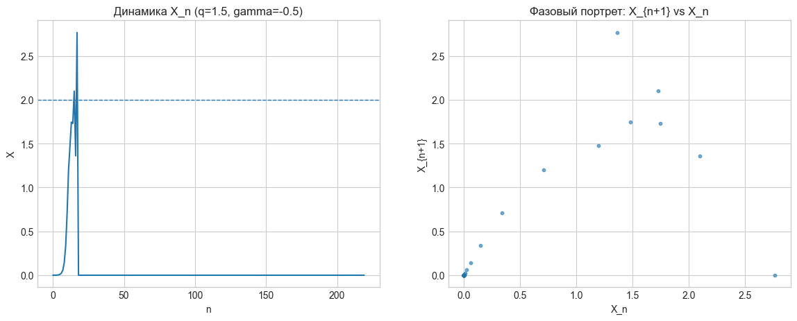
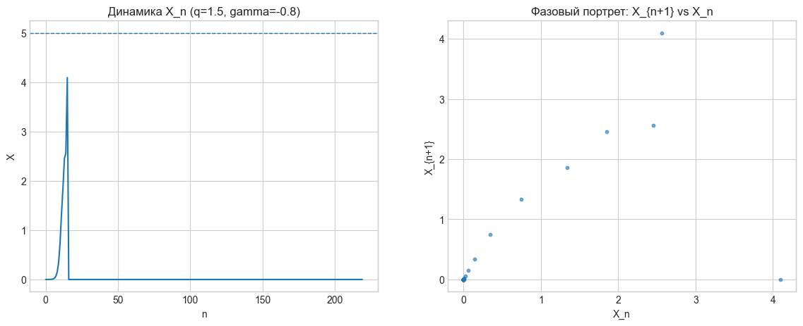

### Порог интерпретируемости ($\gamma<-1$, пример $\gamma=-1.1$)

Значение $\gamma=-1$ является пороговым. При $\gamma<-1$ фиксированная точка становится отрицательной ($X^*<0$), и интерпретация стационарного потенциала в нормировке $K=1$ теряет смысл. Численные эксперименты демонстрируют сверхбыстрый разгон и последующий коллапс, а фазовый портрет утрачивает признаки устойчивого аттрактора.

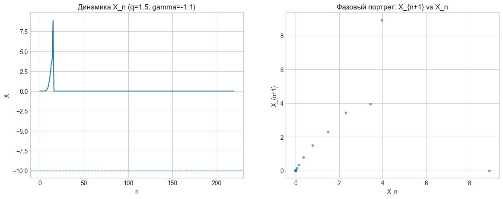

### Сводная таблица идентификации (ENTER) для $\gamma<0$

Ниже приводится сводная таблица оценок (ENTER) для отрицательных значений $\gamma$. В устойчивом режиме (например, $\gamma=-0.2$, $q=1.5$) наблюдается совпадение оценок с теорией и ключевой эффект смены знака лагового коэффициента: $B(Lag_1)=-q\gamma>0$. В режимах коллапса и вырождения параметрическая идентификация деградирует: формальные метрики (включая $R^2$ на коротких участках) перестают отражать физический смысл коэффициентов.

| q   | γ     | X*     | R²     | Bx      | Blag1   | βx      | βlag1   | Bx(th)  | Blag1(th) |
|-----|-------|--------|--------|---------|---------|---------|---------|---------|-----------|
| 1.5 | −0.2  | 1.25   | 1.0000 | −1.5000 | 0.3000  | −0.8412 | 0.1724  | −1.5000 | 0.30      |
| 2.8 | −0.2  | 1.25   | 1.0000 | −0.5487 | 0.0000  | −1.0000 | 0.0000  | −2.8000 | 0.56      |
| 3.1 | −0.2  | 1.25   |        | 0.0000  | 0.0000  |         | 0.0000  | −3.1000 | 0.62      |
| 1.5 | −0.5  | 2.00   | 0.1577 | −0.1646 | 0.2413  | −0.4753 | 0.6980  | −1.5000 | 0.75      |
| 2.8 | −0.5  | 2.00   | 1.0000 | −0.3211 | 0.0000  | −1.0000 | 0.0000  | −2.8000 | 1.40      |
| 3.1 | −0.5  | 2.00   |        | 0.0000  | 0.0000  |         | 0.0000  | −3.1000 | 1.55      |
| 1.5 | −0.8  | 5.00   | 0.0341 | −0.0419 | 0.0581  | −0.1641 | 0.2275  | −1.5000 | 1.20      |
| 2.8 | −0.8  | 5.00   | 1.0000 | −0.2040 | 0.0000  | −1.0000 | 0.0000  | −2.8000 | 2.24      |
| 3.1 | −0.8  | 5.00   |        | 0.0000  | 0.0000  |         | 0.0000  | −3.1000 | 2.48      |
| 1.5 | −1.1  | −10.0  | 0.0251 | −0.0245 | 0.0349  | −0.1307 | 0.1867  | −1.5000 | 1.65      |
| 2.8 | −1.1  | −10.0  | 1.0000 | −0.1368 | 0.0000  | −1.0000 | 0.0000  | −2.8000 | 3.08      |
| 3.1 | −1.1  | −10.0  |        | 0.0000  | 0.0000  |         | 0.0000  | −3.1000 | 3.41      |

### Выводы по смешанной модели

Исследование смешанной модели позволило сделать ключевые выводы о применимости эконометрических методов к сложным системам:

1. **Высокая диагностическая способность.** Линейная авторегрессия (в частности, метод пошагового отбора) является мощным инструментом структурной идентификации. Она позволяет выявить наличие памяти в системе и количественно оценить соотношение влияния текущих факторов и предыстории (параметр $\gamma$) в режимах, где динамика остаётся информативной.

2. **Ограничения прогнозирования.** Успешная идентификация структуры прошлого не гарантирует точности прогноза будущего. В зоне неустойчивости линейные модели склонны к генерации траекторий с избыточной волатильностью или к резонансному разрушению из-за отсутствия механизмов нелинейного демпфирования.

3. **Двоякая роль памяти: устойчивость vs потенциал.**

   * При $\gamma>0$ память усиливает ограничение и снижает стационарный уровень $X^*=1/(1+\gamma)$, одновременно сужая область устойчивых режимов по $q$.
   * При $\gamma<0$ предыстория приобретает стимулирующий характер: $X^*$ возрастает (потенциал развития увеличивается), однако усиливается положительная обратная связь и область устойчивости по $q$ сужается ещё сильнее, что проявляется в эффектах «перерегулирования» и коллапса при росте интенсивности.
   * Порог $\gamma=-1$ является границей интерпретируемости стационарного потенциала: при $\gamma<-1$ $X^*$ становится отрицательной, и режимы следует трактовать как неустойчивые/нефизические в нормировке $K=1$.

### Дополнение: смешанная модель на коротких выборках (стадии + скользящие окна) 

#### Место эксперимента и что нового добавлено

Смешанная модель рассматривается как гибрид базовой и delay-логики:

$$
X_{n+1}=X_n+qX_n,(1-X_n-\gamma X_{n-1}),\quad K=1,
$$

где $q$ — интенсивность роста, $\gamma$ — вес памяти (влияние предыстории).

**Что было важно в “основной” части по смешанной модели:** гипотеза структурной идентификации “оба фактора сразу”: и $X_n$, и $X_{n-1}$, а в темпах прироста:

$$
\omega_{n+1}\approx q - qX_n - q\gamma X_{n-1}.
$$

**Что добавляет текущий шаг:** проверяем ту же идентификацию **на коротких фрагментах** — скользящие окна $window=25$, $lags=10$ (не только для $\gamma>0$, но и для $\gamma<0$), и смотрим, как ведут себя:

* ENTER (все регрессоры),
* STEPWISE (отбор),
* и агрегат памяти $B_\Sigma=\sum_{i=1}^{10}B(Lag_i)$ как более устойчивый индикатор “суммарной памяти” при мультиколлинеарности лагов.

Это позволяет:

* подтвердить смену знака лагового эффекта ($B(Lag_1)>0$) в устойчивых режимах;
* показать, что при усилении стимулирующей памяти (более отрицательной γ) окна быстро теряют информативность из-за срыва устойчивости.

#### Дизайн: три режима при $\gamma=0.5$

Использованы 3 реперные точки, дающие цельный нарратив “рост → цикл → разрушение”:

1. **$q=1.5$** — рост/выход на стационар (жизненный цикл + окна)
2. **$q=2.8$** — устойчивые колебания (только окна)
3. **$q=3.5$** — разрушение/вырождение режима (только окна)

#### Визуальная диагностика режимов

&nbsp;

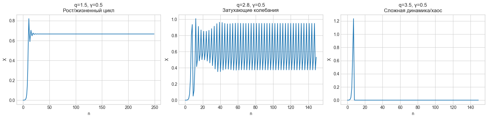

**Микровывод:** при $q=1.5$ динамика быстро выходит на плато (после короткого overshoot); при $q=2.8$ фиксируется устойчивый колебательный режим; при $q=3.5$ — резкий всплеск и последующее вырождение траектории (в нашей реализации — уход в 0), что соответствует постановке “режим краха/неустойчивости”.

#### $q=1.5$: жизненный цикл + окна 

##### Стадийная разметка

&nbsp;

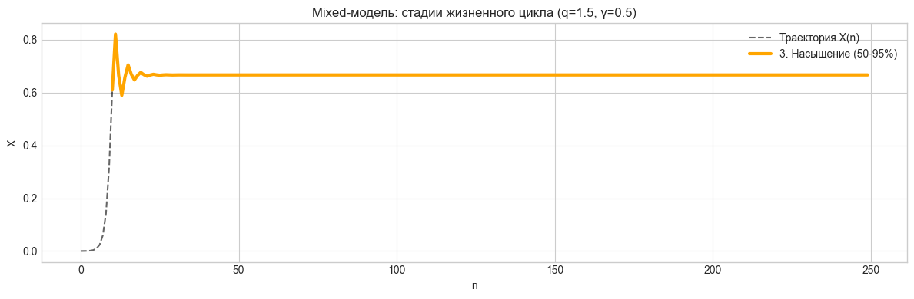

**Наблюдение:** практически вся траектория попала в “Насыщение (50–95%)”. Это не “ошибка”, а следствие того, что рост слишком быстрый: ранние пороги $<10%$ и $10–50%$ проходятся за малое число шагов, а для регрессии с лагами $=10$ это часто не даёт достаточно статистики для отдельных стадий.

##### Локальная регрессия по стадии

| stage | interval | n | R² | B(Xn) | B(L1) | β(Xn) | β(L1) |
|------|---------:|--:|---:|------:|------:|------:|------:|
| Насыщение (50–95%) | 10–250 | 229 | 1.00 | -1.50 | -0.75 | -0.684 | -0.677 |

**STEPWISE:**

- R² = 1.00  
- выбранные лаги: Lag_10, Lag_6, Lag_9, Lag_2, Lag_1, Lag_4, Lag_8

**Ключевой вывод:** ENTER **идеально восстанавливает теоретическую структуру** смешанной модели:

* $B(X_n)\approx -1.5$,
* $B(Lag_1)\approx -0.75$,
  и $R^2=1$.

То есть на локальном сегменте подтверждается “физика” модели: текущий уровень и память одновременно участвуют в ограничении роста.

**Что важно:** STEPWISE на этом же участке начинает выбирать “наборы лагов” (много лагов сразу при $R^2=1$). Это типичный эффект плато: лаги становятся взаимозаменяемыми (мультиколлинеарность), и Stepwise легко находит альтернативные комбинации предикторов без потери качества подгонки. Поэтому в этой зоне **структуру лучше читать по устойчивым коэффициентам ENTER и/или по агрегату $B_\Sigma$**, а не по “точному списку лагов”.

##### Скользящие окна: дрейф коэффициентов и агрегат памяти

&nbsp;

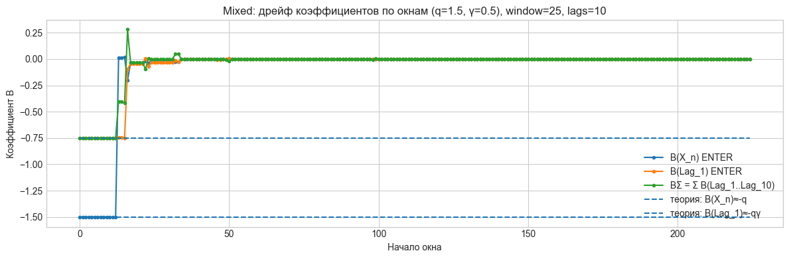

**Вывод:** на информативных фрагментах (до полного “плато”) коэффициенты попадают в теоретические уровни $-q$ и $-q\gamma$. На плато коэффициенты “сдуваются” к нулю — это не смена закона, а сигнал, что в окне почти нет вариации (и $\omega\approx 0$), то есть **короткие выборки перестают нести информацию для устойчивой идентификации**.

&nbsp;

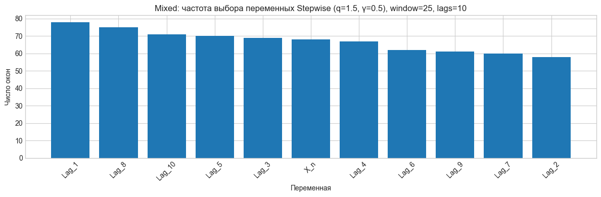

**Вывод:** частоты распределены “широко” по лагам — это иллюстрирует риск интерпретации Stepwise на стационаре: он склонен “размазывать” память по лагам из-за мультиколлинеарности.

#### $q=2.8$: окна на устойчивых колебаниях — самая сильная проверка структуры

##### ENTER по окнам: коэффициенты стабильны и совпадают с теорией

**По сводке окон (q=2.8):**

* число окон: **125** ENTER и **125** STEPWISE,
* $R^2$ в каждом окне **≈ 1.0** (mean = 1.0; std ~ $5\cdot10^{-10}$),
* коэффициенты:

  * $B(X_n)$ **строго** $-2.8000$,
  * $B(Lag_1)$ **строго** $-1.4000$,
  * $B_\Sigma$ **≈** $-1.4000$ (min -1.4001; max -1.3999).

**Интерпретация:** в режиме цикла (колебаний) короткие окна не разрушают идентификацию: модель “локально” в каждом окне воспроизводит разложение влияний на текущий уровень и память **точно как предсказывает теория** $-q$ и $-q\gamma$.

##### Stepwise по окнам: ядро структуры сохраняется, “ложные лаги” редки

**Stepwise частоты $q=2.8$:**

* $X_n$ выбирается в **121** окне из 125,
* $Lag_1$ выбирается в **121** окне,
* редкие включения: $Lag_3$ — 5 раз, $Lag_2$ — 4 раза.

**Топ-наборы selected:**

* $[Lag_1, X_n]$ — **120** окон (доминирующий правильный вариант),
* $[Lag_2, Lag_3]$ — **4** окна (пример “ложного ядра” на отдельных коротких фрагментах),
* $[Lag_1, Lag_3, X_n]$ — **1** окно.

**Вывод:** на колебаниях структура смешанной модели **устойчиво распознаётся**: Stepwise почти всегда возвращает именно ${X_n, X_{n-1}}$, а “ложные лаги” появляются редко и точечно — как эффект короткого окна и локальной корреляции фаз.

&nbsp;

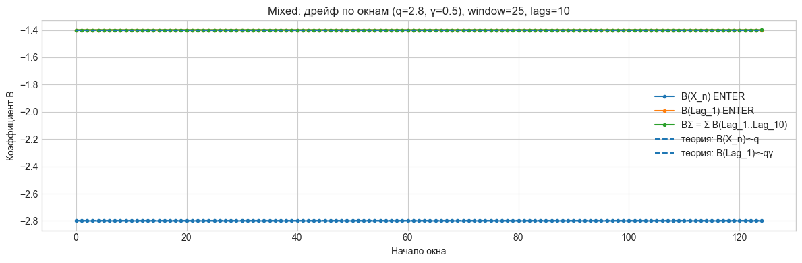

* график дрейфа (q=2.8) — “коэффициенты стабильны”,

&nbsp;

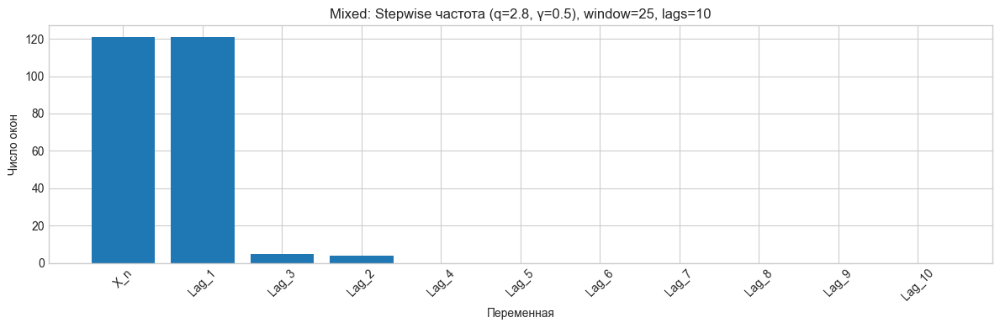

* график частот Stepwise $q=2.8$ — “доминируют $X_n$ и $Lag_1$”.

#### $q=3.5$: разрушение/вырождение и почему Stepwise = 0 окон

Тут вышла важная “краевая ситуация”.

##### ENTER по окнам: данные вырождаются → регрессия теряет смысл

По сводке $q=3.5$:

* ENTER windows: **125**, но:

  * $R^2$ везде **NaN** (count=0),
  * $B(X_n)=0$, $B(Lag_1)=0$, $B_\Sigma=0$ во всех окнах.

Это характерно для вырожденного сегмента: если траектория после всплеска уходит в “поглощающее состояние” (в нашей реализации — ноль + клиппинг), то внутри окна:

* $\omega$ становится почти константой/нулём,
* регрессоры почти константны,
* дисперсия исчезает → $R^2$ и p-values теряют определённость.

##### Stepwise = 0 окон: диагностический маркер “краха” на коротких данных

**STEPWISE windows: 0** означает: при заданных порогах значимости Stepwise **нигде не смог собрать устойчивую модель** (нечего отбирать). Это можно подать как сильный прикладной вывод:

> В зоне разрушения (при высокой интенсивности роста и наличии памяти) короткие наблюдаемые фрагменты становятся статистически вырожденными; в результате процедуры отбора (Stepwise) перестают возвращать модель вовсе. На практике это можно трактовать как диагностический признак “краха/режима деградации” при анализе коротких рядов.

&nbsp;

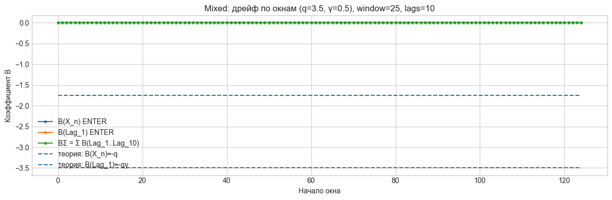

* дрейф $q=3.5$ — “всё нули/плоско”,

&nbsp;

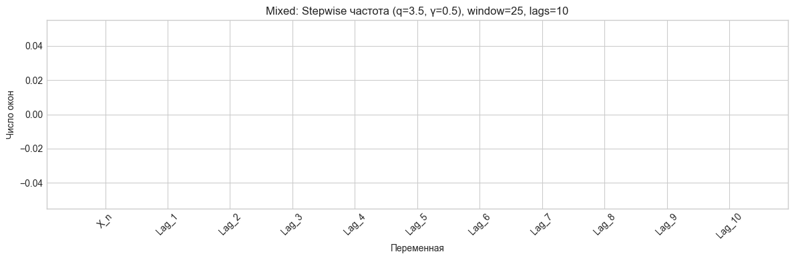

* пустой график частот Stepwise — прямо как иллюстрация “нет моделей”.

#### Короткие окна для режима $\gamma<0$ 

(i) Устойчивый кейс: $\gamma=-0.2$, $q=1.5$

На скользящих окнах наблюдается:

* почти во всех окнах $R^2\approx 1$,
* на ранних/информативных фрагментах коэффициенты близки к теории: $B(X_n)\approx -1.5$, $B(Lag_1)\approx 0.3$,
* Stepwise почти всегда включает $X_n$, часто включает $Lag_1$, а дополнительные лаги появляются как следствие мультиколлинеарности (взаимозаменяемости лагов), а не как “истинная глубокая память”.

Stagewise (q=1.5, γ=-0.2) | X* = 1.250

| Stage                 | Int.   | n   | R²   | Bx    | Blag1 | βx     | βlag1 |
|----------------------|--------|----:|-----:|------:|------:|-------:|------:|
| Насыщение (50–95%)   | 10–219 | 198 | 1.00 | -1.50 | 0.30  | -0.8346| 0.1666 |
| Плато (>95%)         | 11–220 | 198 | 1.00 | -1.50 | 0.30  | -0.8346| 0.1665 |

Selected variables:
- Насыщение: [X_n, Lag_1, Lag_10, Lag_6]
- Плато:     [X_n, Lag_1]

### (ii) Неустойчивые кейсы: $\gamma=-0.5$ и $\gamma=-0.8$ при $q=1.5$

При усилении отрицательной памяти:

* число “валидных” окон резко сокращается,
* метрики и коэффициенты становятся нестабильными,
* Stepwise часто не возвращает устойчивую модель (данные внутри окна вырождены).

Это согласуется с основным результатом: стимулирующая память увеличивает потенциальный уровень $X^*$, но резко снижает область устойчивости и ухудшает структурную идентифицируемость на коротких выборках.

$\gamma = -0.5$ (window=25, lags=10)

| q   | R² mean | R² med | R² min | R² max | Bx mean | Blag1 mean | Bsum mean |
|-----|--------:|-------:|-------:|-------:|--------:|-----------:|----------:|
| 1.5 | 0.7375  | 0.9337 | 0.2792 | 1.0000 | -0.0375 | -0.0070    | -0.0321   |
| 2.8 | 1.0000  | 1.0000 | 1.0000 | 1.0000 | -0.0016 | 0.0000     | 0.0000    |

$\gamma = -0.8$ (window=25, lags=10)

| q   | R² mean | R² med | R² min | R² max | Bx mean | Blag1 mean | Bsum mean |
|-----|--------:|-------:|-------:|-------:|--------:|-----------:|----------:|
| 1.5 | 0.6683  | 0.7635 | 0.2532 | 1.0000 | -0.0113 | -0.0023    | -0.1487   |
| 2.8 | 1.0000  | 1.0000 | 1.0000 | 1.0000 | -0.0010 | 0.0000     | 0.0000    |

Stepwise — частоты (практически вырождено)
(одинаково для $\gamma=-0.5$ и $\gamma=-0.8$, для $q=1.5$ и $q=2.8$)

Stepwise frequency (window=25, lags=10)

| Var    | Count |
|--------|------:|
| X_n    | 1     |
| Lag_1  | 0     |
| Lag_2  | 0     |
| Lag_3  | 0     |
| Lag_4  | 0     |
| Lag_5  | 0     |
| Lag_6  | 0     |
| Lag_7  | 0     |
| Lag_8  | 0     |
| Lag_9  | 0     |
| Lag_10 | 0     |

#### Как это сопрягается с базовой и delay-моделью

Получается красивая лестница по сложности и знаку памяти:

* **Базовая модель (без памяти):** на окнах Stepwise почти всегда выбирает $X_n$; “ложные лаги” — исключение.

* **Delay-модель (чистая память):** на окнах доминирует $Lag_1$; при стационаре/сложной динамике память может “размазываться” по лагам из-за мультиколлинеарности → поэтому полезен агрегат $B_\Sigma=\sum_{i=1}^{10}B(Lag_i)$ как устойчивый индикатор суммарной памяти.

* **Mixed-модель (частичная память):** объединяет мгновенный и лаговый факторы, причём знак лагового вклада определяется параметром $\gamma$:

  1. **На информативных режимах** (рост до плато и устойчивые колебания) окна подтверждают двухфакторную природу:
     $$
     B(X_n)\approx -q,\quad B(Lag_1)\approx -q\gamma.
     $$
     При $\gamma>0$ лаговый коэффициент отрицателен (инерция усиливает ограничения), а при $\gamma<0$ становится положительным (предыстория повышает потенциал развития).

  2. **На плато** Stepwise начинает “комбинаторно” гулять по лагам (как в delay-дополнении): лаги взаимозаменяемы, поэтому список выбранных предикторов менее информативен, чем устойчивые коэффициенты ENTER и агрегат $B_\Sigma$.

  3. **В зоне краха/вырождения** (например, при высокой интенсивности и/или сильной памяти) окна теряют дисперсию и становятся статистически вырожденными: коэффициенты “сдуваются” к нулю, $R^2$ теряет определённость, а Stepwise может перестать строиться. Это предельная форма тезиса о неинформативности линейной идентификации на разрушении режима.

  4. **Порог интерпретируемости для стимулирующей памяти:** при $\gamma\le -1$ фиксированная точка $X^*=1/(1+\gamma)$ становится неположительной, что сопровождается резким сужением области устойчивости и ускоренной деградацией идентификации на коротких окнах.

### Введение к серии дополнительных экспериментов 2.4.1-2.4.8

Материал подразделов 2.4.1-2.4.8 возник не как набор изолированных проверок, а как последовательный ответ на одно методологическое затруднение, выявленное в предыдущем анализе смешанной модели. К моменту завершения основного исследования по длинным траекториям и коротким окнам уже было понятно, что сама по себе высокая подгонка регрессии ещё не гарантирует корректную структурную интерпретацию, а появление ложных лагов, дрейф коэффициентов и вырождение окна могут иметь разную природу.

Поэтому потребовалась серия уточняющих вычислительных экспериментов. Их общая цель состояла в том, чтобы отделить собственно содержательную память процесса от статистических артефактов короткого окна, а также выстроить режимно-зависимую схему анализа, в которой выбор метода зависит от геометрии данных и типа динамического режима.

Логика этой серии такова. В подразделе 2.4.1 проверяется, можно ли подойти к задаче не через регрессию, а через прямую локальную идентификацию параметров отображения. В подразделе 2.4.2 уточняется, какую роль играет длина окна и соотношение между размером окна, периодом и лаговым пространством. Подраздел 2.4.3 вводит предварительную диагностику режима как этап выбора инструмента анализа. Подразделы 2.4.4 и 2.4.6 уточняют, как именно интерпретировать коэффициенты и какие регрессионные процедуры лучше работают в разных режимах. Подраздел 2.4.5 вводит критерий интерпретируемости окна через локальную дисперсию и кондиционность. Подраздел 2.4.7 показывает пределы ортогонализации и PCA как средства борьбы с мультиколлинеарностью. Наконец, подраздел 2.4.8 проверяет, может ли простая настройка порога значимости в Stepwise заменить всю эту маршрутизацию, и показывает, что не может.

Тем самым подразделы 2.4.1-2.4.8 образуют единую исследовательскую дугу: от постановки проблемы и проверки альтернативных способов идентификации до построения практического маршрута интерпретации коротких окон в нелинейной динамике.

### 2.4.1. Сопоставление прямой идентификации параметров отображения и структурной регрессии

#### Постановка задачи

Одним из ключевых замечаний научного руководителя было требование выйти за пределы логики "если регрессия работает неустойчиво, нужно просто искать более удачную статистическую процедуру". В качестве альтернативы была поставлена задача проверить, может ли непосредственная идентификация параметров отображения по минимальному числу точек выступать самостоятельным инструментом анализа нелинейного процесса.

В этом дополнении сопоставляются два подхода. Первый подход основан на прямой локальной идентификации параметров отображения по коротким фрагментам траектории. Второй подход использует структурную регрессию на более длинном окне по теоретически корректным регрессорам. Смысл эксперимента состоит не в соревновании "лучшей" и "худшей" статистики, а в сопоставлении двух способов извлечения структурной информации из одного и того же детерминированного закона.

Итоговая гипотеза формулируется следующим образом. Прямая идентификация параметров отображения не является универсальной заменой регрессионного анализа, однако может выступать локальным структурным инструментом: на чистых данных и в части сложных режимов она точнее отражает геометрию процесса и момент вырождения окна, тогда как при наличии шума регрессия должна обладать большей устойчивостью.

#### Математическая схема прямой идентификации

##### Базовая модель

Для базовой модели использовалось отображение

$X_{n+1} = X_n + a X_n (k - X_n)$,

откуда для темпа прироста следует

$\omega_n = \frac{X_{n+1} - X_n}{X_n} = ak - a X_n$.

Если заданы три последовательные точки $X_0, X_1, X_2$, то можно вычислить

$d_0 = \frac{X_1 - X_0}{X_0}$, $d_1 = \frac{X_2 - X_1}{X_1}$,

после чего получить локальные оценки

$a = \frac{d_0 - d_1}{X_1 - X_0}$, $\alpha = ak = d_0 + a X_0$, $k = \frac{\alpha}{a}$.

Тем самым базовая модель идентифицируется по минимальному блоку из трёх точек.

##### Модель с запаздыванием

Для модели с запаздыванием использовалось отображение

$X_{n+1} = X_n + g X_n (k - X_{n-1})$,

и, соответственно,

$\omega_n = gk - g X_{n-1}$.

По четырём последовательным точкам $X_0, X_1, X_2, X_3$ вычислялись

$d_1 = \frac{X_2 - X_1}{X_1}$, $d_2 = \frac{X_3 - X_2}{X_2}$,

а затем

$g = \frac{d_1 - d_2}{X_1 - X_0}$, $\alpha = gk = d_1 + g X_0$, $k = \frac{\alpha}{g}$.

Таким образом, для модели с чистым запаздыванием минимальный идентифицирующий блок содержит четыре точки.

##### Смешанная модель

Для смешанной модели использовалось отображение

$X_{n+1} = X_n + q X_n (k - X_n - \gamma X_{n-1})$,

из которого следует линейная по структурным регрессорам форма

$\omega_n = qk - q X_n - q \gamma X_{n-1}$.

На пяти последовательных точках решалась локальная система

$\omega_n = \alpha + b_1 X_n + b_2 X_{n-1}$,

после чего параметры восстанавливались по формулам

$q = -b_1$, $\gamma = \frac{b_2}{b_1}$, $k = \frac{\alpha}{q}$.

В отличие от двух предыдущих моделей, здесь идентификация существенно чувствительнее к режиму и локальной геометрии траектории.

#### Регрессионный контур сравнения

В качестве сопоставимого инструмента использовалась не пошаговая селекция и не произвольная многолаговая авторегрессия, а именно структурная регрессия по теоретически правильным объясняющим переменным на окне длины $25$:

- для базовой модели: `omega ~ const + X_n`;
- для модели с запаздыванием: `omega ~ const + Lag_1`;
- для смешанной модели: `omega ~ const + X_n + Lag_1`.

Такое построение принципиально важно, поскольку в настоящем подразделе сравниваются два способа восстановить одну и ту же структурную формулу, а не две разные статистические эвристики.

#### Дизайн вычислительного эксперимента

Эксперимент проводился на синтетических траекториях длины $180$ без верхнего клипа. Использовались те же реперные режимы, которые были введены в предыдущих подразделах главы, что позволяет напрямую сопоставлять результаты настоящего эксперимента с уже полученными выводами по базовой, запаздывающей и смешанной моделям:

- базовая модель: $a = 0.8, 1.5, 2.2, 2.52, 2.8$;
- модель с запаздыванием: $g = 0.2, 0.8, 1.05, 1.25, 1.6$;
- смешанная модель: $(q,\gamma) = (1.5, 0.5), (2.8, 0.5), (3.5, 0.5), (2.8, 0.1), (1.5, -0.2), (1.5, -0.5), (1.5, -0.8)$.

Для каждой траектории анализ проводился в двух режимах наблюдения. В первом случае использовалась чистая детерминированная траектория. Во втором случае на неё накладывался мультипликативный шум вида

$X_t^{obs} = X_t \cdot e^{\varepsilon_t}$, где $\varepsilon_t \sim \mathcal{N}(0, \sigma^2)$.

В базовом сравнении использовалось значение $\sigma = 0.02$, а затем был проведён отдельный шумовой sweep по уровням $\sigma = 0$, $0.005$, $0.01$, $0.02$, $0.05$.

Все окна дополнительно разбивались по положению на траектории на три сегмента: `early`, `middle`, `late`. Это не экономические стадии в содержательном смысле, а единая операциональная разметка, позволяющая сопоставлять результаты между моделями.

#### Критерии сравнения и диагностические показатели

Для того чтобы настоящий подраздел не сводился только к сравнению средних ошибок параметров, в нём были разведены две разные задачи.

Первая задача состояла в оценке параметров. Для неё использовались доля валидных окон `valid_share` и средняя абсолютная ошибка по параметрам.

Вторая задача состояла в диагностике структуры окна. Для неё использовались дополнительные показатели:

- `degenerate_recall` — как часто метод помечает действительно вырожденные окна;
- `degenerate_precision` — насколько чистым является этот сигнал;
- `informative_retention` — доля невырожденных окон, которые метод сохраняет как рабочие;
- `family_accuracy` — способность по локальному структурному fit-у правильно различать семейства `base`, `delay` и `mixed` на чистых окнах.

Тем самым direct-метод рассматривался не только как оценщик параметров, но и как возможный локальный structural probe.

#### Сопоставление методов на чистых и шумных траекториях

На чистых траекториях прямой метод в ряде режимов действительно восстанавливает параметры с очень высокой точностью. Для базовой и delay-модели на информативных окнах обе процедуры часто дают практически точные оценки. Для mixed-модели картина сложнее: прямая идентификация иногда оказывается точнее регрессии на редких валидных окнах, но стабильность этого эффекта существенно ниже.

На шумных траекториях при $\sigma = 0.02$ картина становится однозначной. Регрессия практически везде выигрывает по устойчивости и по ошибке оценки параметров. Наиболее показательны ранние сегменты траектории, поскольку именно там ожидалось возможное преимущество прямой идентификации.

Ниже приведены усреднённые результаты для раннего сегмента при $\sigma = 0.02$.

| Модель | Метод | `valid_share` | Основная ошибка параметра | Дополнительная ошибка |
|---|---:|---:|---:|---:|
| `base` | direct | 0.905 | `a_mae = 11.587` | `k_mae = 0.093` |
| `base` | regression | 1.000 | `a_mae = 0.145` | `k_mae = 0.004` |
| `delay` | direct | 0.631 | `g_mae = 44.875` | `k_mae = 0.407` |
| `delay` | regression | 0.800 | `g_mae = 0.300` | `k_mae = 0.125` |
| `mixed` | direct | 0.547 | `q_mae = 251.175` | `gamma_mae = 1.008` |
| `mixed` | regression | 0.682 | `q_mae = 0.981` | `gamma_mae = 0.542` |

Из таблицы видно, что при даже умеренном шуме прямая идентификация перестаёт быть конкурентоспособной как основной количественный оценщик параметров.

#### Шумовой sweep и порог чувствительности прямой идентификации

Чтобы перейти от качественного вывода "при шуме хуже" к количественному пороговому выводу, был проведён специальный sweep по уровню шума. На рисунке ниже показано, как меняется средняя абсолютная ошибка по главному параметру каждой модели в раннем сегменте.

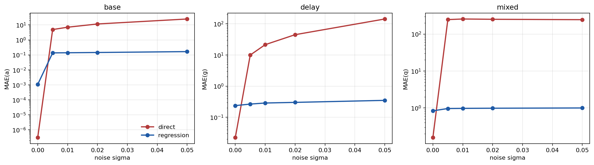

График показывает три важных факта.

Во-первых, при $\sigma = 0$ прямая идентификация ещё может выигрывать у регрессии. Это хорошо видно для базовой и delay-модели, а также для mixed-модели по параметру $q$.

Во-вторых, уже при $\sigma = 0.005$ ситуация меняется радикально. Для раннего сегмента отношение ошибок `direct / regression` составляет:

- для базовой модели по параметру $a$: около $36$;
- для delay-модели по параметру $g$: около $37.7$;
- для mixed-модели по параметру $q$: около $256$.

В-третьих, дальнейший рост шума лишь усиливает этот разрыв. Это позволяет сделать более сильный вывод, чем в первой версии подраздела:

> Практически значимый порог шумовой чувствительности прямой идентификации лежит уже в области порядка $0.5\%$ относительного шума.

На следующем рисунке показано, что вместе с ростом ошибки падает и операционная устойчивость прямого метода, измеряемая через `valid_share`.

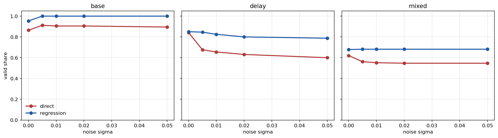

Для регрессии доля валидных окон по всем трём моделям практически не испытывает резкого провала. Для direct-подхода снижение выражено особенно сильно в модели с запаздыванием и в смешанной модели.

#### Диагностическая полезность прямой идентификации

Если оценивать direct исключительно по MAE параметров, то при шуме он выглядит почти везде слабее. Однако такой критерий не исчерпывает его функции. В ряде режимов direct работает прежде всего как локальный индикатор структурной информативности окна.

На рисунке ниже приведена способность методов распознавать семейство процесса на чистых ранних окнах.

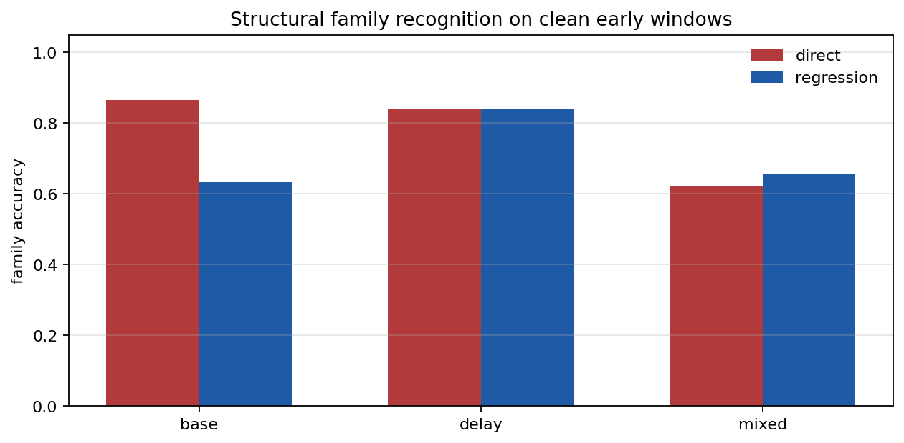

Здесь видно, что для базовой модели direct даже превосходит регрессию как быстрый локальный structural probe: `family_accuracy = 0.864` против `0.633`. Для delay-модели различия почти исчезают. Для mixed-модели обе схемы распознавания работают заметно хуже, что само по себе является содержательным результатом: сложная смешанная динамика плохо сводится к простой локальной семейственной классификации.

Не менее важным оказалось поведение на вырожденных окнах. На следующем рисунке показан `degenerate_recall` на чистых траекториях.

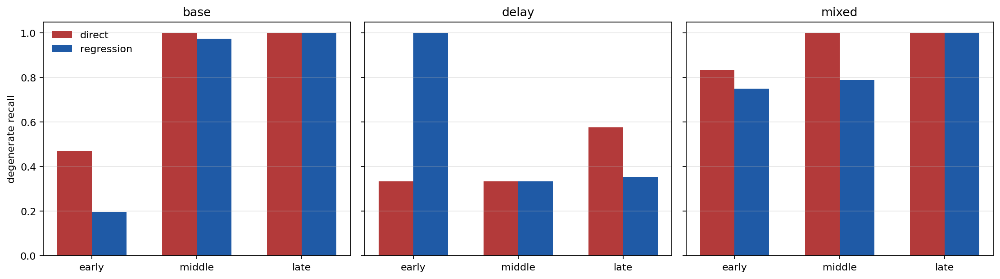

Для базовой модели в `middle` и `late` сегментах direct практически идеально фиксирует вырождение окна, что соответствует содержательной картине выхода траектории на стационарное плато. Для mixed-модели direct также часто оказывается чувствителен к локальному распаду структурной информативности, хотя делает это ценой потери части содержательных окон. Иными словами, высокая чувствительность к вырождению является одновременно достоинством и ограничением прямой идентификации.

#### Интерпретация результатов по семействам моделей

Для базовой модели direct подтвердил теоретическую идентифицируемость закона по трём точкам и показал высокую диагностическую чувствительность к near-stationary окнам. Однако уже очень слабый шум делает его существенно хуже регрессии как количественный оценщик параметров.

Для delay-модели на чистых ранних окнах прямая идентификация может быть даже точнее регрессии по параметру $g$, но это преимущество быстро исчезает при шуме. Следовательно, для модели с запаздыванием direct полезен прежде всего на почти чистых локальных фрагментах, но не как рабочий оценщик для шумных наблюдений.

Для mixed-модели был получен наиболее тонкий результат. На части чистых ранних окон direct лучше отражает локальную структуру, чем регрессия. Но устойчивость этого эффекта мала, а при шуме он практически полностью исчезает. Поэтому в смешанном случае direct нельзя рассматривать как альтернативу регрессии; его роль ограничивается локальной структурной диагностикой редких информативных фрагментов.

#### Основной методологический результат

Теоретическая идентифицируемость подтверждена: для базовой и delay-модели параметры действительно восстанавливаются из минимального числа точек, а для mixed-модели такая идентификация также возможна, но существенно чувствительнее к режиму. На чистых данных прямая идентификация работает как точный локальный структурный инструмент, то есть замечание научного руководителя о необходимости "подлезть с другой стороны" было реализовано в виде конкретной вычислительной процедуры. Однако даже слабый шум делает direct-метод заметно менее устойчивым, чем структурная регрессия на окне длины $25$. Отсюда следует практический вывод:

> прямую идентификацию не следует рассматривать как замену регрессии при оценке параметров по шумным данным.

Наконец, direct сохраняет ценность как локальный диагностический инструмент. Он полезен для обнаружения вырожденных окон, контроля локальной структурной информативности и анализа редких "чистых" фрагментов сложной динамики.

#### Выводы и место подраздела в общей логике главы

1. Проверялось, может ли прямая локальная идентификация выступать самостоятельной альтернативой структурной регрессии.
2. Получено, что на чистых данных direct хорошо восстанавливает локальную структуру, но при шуме резко уступает регрессии по устойчивости.
3. Практически это означает, что direct следует использовать как local probe и диагностический инструмент, а не как основной оценщик параметров.
4. В общей логике главы подраздел 2.4.1 задаёт первое разведение инструментов и подводит к режимно-зависимому выбору метода.

### 2.4.2. Влияние длины окна на частоту ложных лагов

#### Постановка задачи

После результатов подраздела 2.4.1 стало ясно, что следующая содержательная проблема находится уже не в прямой идентификации, а внутри самого регрессионного контура. В предыдущих подразделах было показано, что алгоритм Stepwise склонен включать дальние лаги в циклических режимах, на плато и на коротких окнах сложной динамики. Однако при фиксированном значении `window = 25` оставалось неясным, что именно порождает такие ложные включения: сама процедура пошагового отбора или конкретное соотношение между длиной окна, характерным периодом колебаний и размерностью лагового пространства.

Поэтому в данном подразделе была поставлена отдельная задача: проверить, как частота ложных лагов зависит от отношения

$\rho = \frac{W}{T}$,

где $W$ — длина окна, а $T$ — характерный период колебаний процесса.

Изначальная гипотеза формулировалась в сильной форме: если окно охватывает несколько периодов, структура должна стабилизироваться, а ложные лаги должны встречаться реже, чем при $W \lesssim T$. Проведённый эксперимент показал, что эта гипотеза подтверждается только частично. В окончательном виде результат подраздела 2.4.2 можно сформулировать следующим образом:

> Частота ложных лагов определяется не одним только отношением $W/T$, а его взаимодействием с типом динамики, размерностью лагового пространства и положением окна на траектории. В ряде режимов увеличение $W/T$ действительно очищает структуру, но в режимах, где длинное окно начинает захватывать плато или сильную лаговую взаимозаменяемость, ложные лаги, напротив, усиливаются.

Именно в этой уточнённой формулировке результат становится методологически сильным: он показывает не просто, что "длину окна надо подбирать", а объясняет, почему один и тот же рост окна может уменьшать ложные лаги в одном семействе моделей и усиливать их в другом.

#### Математическая схема эксперимента

##### Регрессионная постановка

Во всех окнах оценивалась стандартная регрессионная схема для темпа прироста

$\omega_n = \frac{X_{n+1} - X_n}{X_n}$,

где в качестве объясняющих переменных использовались $X_n$ и лаги $Lag_1, \ldots, Lag_L$. Для каждого окна строились две модели:

- Stepwise-регрессия, по которой анализировались выбранные предикторы;
- ENTER-регрессия на том же лаговом пространстве, по которой вычислялся агрегированный лаговый эффект

$B_\Sigma = \sum_{j=1}^{L} B(Lag_j)$.

Такое разделение было принципиальным. Stepwise использовалась как источник информации о том, какие переменные алгоритм считает значимыми, а ENTER — как более стабильный ориентир для суммарного лагового вклада.

##### Истинная структура предикторов

Для оценки качества отбора заранее фиксировались теоретически правильные предикторы:

- для базовой модели: только $X_n$;
- для модели с запаздыванием: только $Lag_1$;
- для смешанной модели: пара $X_n$ и $Lag_1$.

На этой основе для каждого окна вычислялись показатели:

- `hit_rate` — доля истинных предикторов, найденных Stepwise;
- `false_lag_rate` — доля выбранных переменных, не входящих в истинную структуру;
- `false_lag_count` — среднее число лишних лагов;
- `no_model_share` — доля окон, в которых Stepwise не вернул рабочую модель;
- `std(B_\Sigma)` — разброс суммарного лагового эффекта по окнам.

##### Оценка характерного периода

Для каждой траектории период $T$ оценивался автоматически по автокорреляционной функции:

$T = \arg\max_{\ell \ge 2} ACF(\ell)$

среди положительных локальных максимумов. Такая процедура оказалась достаточной для выделения доминирующего масштаба колебаний в рассматриваемых циклических и предтурбулентных режимах.

#### Дизайн вычислительного эксперимента

В эксперимент были включены те режимы, в которых проблема ложных лагов особенно содержательна:

- базовая модель: $a = 2.2$ и $a = 2.52$;
- модель с запаздыванием: $g = 0.8$, $g = 1.05$, $g = 1.25$;
- смешанная модель: $(q, \gamma) = (2.8, 0.5)$ и $(2.8, -0.2)$.

Для каждой траектории длины $180$ перебирались:

- длины окна $W = 10, 15, 20, 25, 30, 40, 50$;
- размерности лагового пространства $L = 3, 5, 10$.

Окно считалось информативным, если после построения таблицы регрессии в нём оставалось не менее восьми наблюдений. Для каждого допустимого окна вычислялись показатели отбора, а затем агрегировались по модели, кейсу, значениям $W$, $L$ и отношению $\rho = W/T$.

#### Оценённые периоды

Автоматическая оценка периода дала следующие значения.

| Модель | Кейс | Оценка периода $T$ |
| --- | --- | --- |
| base | $a = 2.2$ | $4$ |
| base | $a = 2.52$ | $4$ |
| delay | $g = 0.8$ | $20$ |
| delay | $g = 1.05$ | $6$ |
| delay | $g = 1.25$ | $8$ |
| mixed | $(q, \gamma) = (2.8, 0.5)$ | $3$ |
| mixed | $(q, \gamma) = (2.8, -0.2)$ | $2$ |

Для базовой модели это сразу задаёт важное ограничение интерпретации: даже минимальные рабочие окна здесь уже существенно превышают один период, поэтому по ней данный подраздел отвечает не на вопрос "что происходит при $W < T$", а на вопрос "исчезают ли ложные лаги автоматически, когда окно уже велико относительно периода". Эксперимент показывает, что нет: одного большого $W/T$ для этого недостаточно.

#### Основные результаты

##### 1. Отношение $W/T$ действительно важно, но только вместе с типом режима

На следующем рисунке показана средняя доля ложных лагов как функция отношения $W/T$.

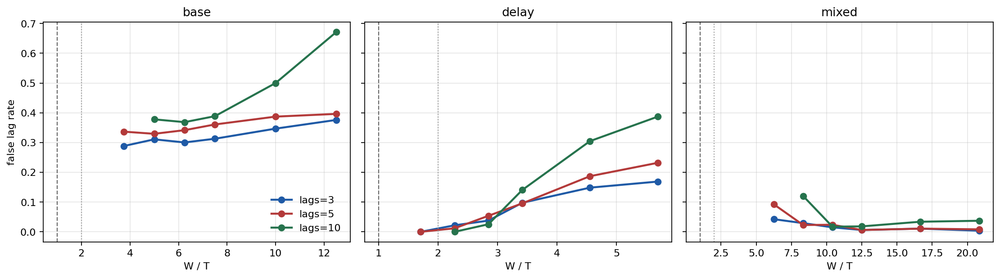

График показывает три разных механизма.

Во-первых, для смешанной модели с положительной памятью рост $W/T$ действительно очищает структуру. Для кейса $(q, \gamma) = (2.8, 0.5)$ при `lags = 3` доля ложных лагов падает с $0.0848$ при $W = 15$ ($\rho = 5$) до $0.0089$ при $W = 30$ ($\rho = 10$) и до $0.0051$ при $W = 50$ ($\rho \approx 16.7$). Здесь исходная гипотеза подтверждается.

Во-вторых, для delay-модели картина обратная. При `lags = 3` агрегированный результат по полосам $\rho$ имеет вид:

| `lags` | Полоса $\rho$ | `false_lag_rate` | `hit_rate` |
| --- | --- | ---: | ---: |
| 3 | $\rho < 1$ | $0.000$ | $1.000$ |
| 3 | $1 \le \rho < 2$ | $0.038$ | $1.000$ |
| 3 | $\rho \ge 2$ | $0.092$ | $1.000$ |

Аналогичная картина сохраняется и для `lags = 5`, и для `lags = 10`. Следовательно, для delay-динамики длинное окно не очищает Stepwise автоматически, а чаще успевает захватить участок с малой дисперсией и усиливающейся взаимозаменяемостью лагов.

В-третьих, для базовой модели даже при $W \gg T$ ложные лаги не исчезают автоматически. Для случая $a = 2.2$ при `lags = 3` доля ложных лагов составляет $0.577$ при $W = 15$ и увеличивается до $0.663$ при $W = 50$. Это означает, что длинное окно не разрушает гармоническую эквивалентность лагов в колебательном режиме.

##### 2. Размерность лагового пространства — самостоятельный фактор риска

Независимо от модели увеличение числа доступных лагов почти везде ухудшает отбор:

- для base средняя `false_lag_rate` растёт с $0.322$ при `lags = 3` до $0.461$ при `lags = 10`;
- для delay — с $0.079$ до $0.172$;
- для mixed — с $0.018$ до $0.045$.

Это означает, что сама по себе длина окна не может рассматриваться отдельно от числа разрешённых лагов. Даже если отношение $W/T$ благоприятно, расширение лагового пространства создаёт дополнительные каналы для ложных включений.

##### 3. Тепловая карта показывает, что механизм ложных лагов различается по семействам

На следующем рисунке приведены тепловые карты `false_lag_rate` для трёх реперных случаев.

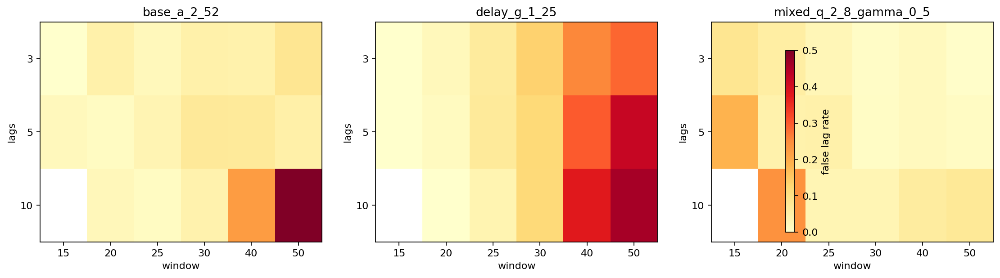

По рисунку видно:

- для `base_a_2_52` ложные лаги при малом лаговом пространстве редки, но резко усиливаются при `lags = 10` и больших окнах;
- для `delay_g_1_25` ложные лаги нарастают почти монотонно вместе с окном;
- для `mixed_q_2_8_gamma_0_5` на коротких окнах ложные лаги заметны, но уже при $W \ge 30$ структура почти очищается.

Тем самым один и тот же технический приём — увеличение окна — приводит к трём разным эффектам: почти не помогает, ухудшает или улучшает ситуацию в зависимости от режима.

##### 4. Агрегированный лаговый эффект $B_\Sigma$ стабилизируется не там же, где очищается Stepwise

Следующий рисунок показывает разброс агрегированного лагового эффекта по окнам.

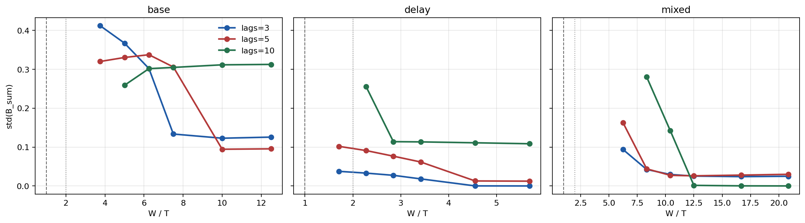

Именно здесь появляется один из самых полезных результатов подраздела 2.4.2. Для delay-модели и части mixed-режимов величина $B_\Sigma$ стабилизируется раньше, чем Stepwise перестаёт включать лишние лаги. Например:

- для `delay`, `lags = 3`, средний `false_lag_rate` возрастает от $0.000$ при $W = 15$ до $0.169$ при $W = 50$;
- при этом `std(B_\Sigma)` падает с $0.038$ до практически нуля.

Аналогичный эффект наблюдается и в базовой модели: доля ложных лагов не уменьшается, но разброс $B_\Sigma$ всё равно снижается при росте окна. Следовательно, агрегированный лаговый эффект и пошаговый список переменных несут разную информацию. Первый скорее отражает суммарную устойчивость лагового вклада, а второй — комбинаторную неопределённость между взаимозаменяемыми лагами.

##### 5. Случай отрицательной памяти показал, что низкая доля ложных лагов может быть обманчивой

Самый показательный контрпример даёт mixed-модель с отрицательной памятью $(q, \gamma) = (2.8, -0.2)$. На первый взгляд её `false_lag_rate` почти нулевая. Но это происходит не потому, что Stepwise особенно хорошо восстанавливает структуру, а потому, что он почти всегда не строит модель вообще:

- средняя `no_model_share` по кейсу составляет $0.993$;
- `hit_rate` остаётся на уровне порядка $0.005$.

Это видно и на отдельном графике доли окон без модели.

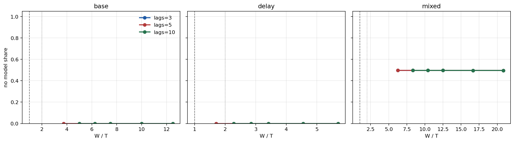

Практический смысл этого результата очень важен: при анализе ложных лагов нельзя смотреть только на `false_lag_rate`. Низкое значение этой метрики может означать не "чистый отбор", а вырождение процедуры.

#### Реперные численные результаты

Для компактности основные режимные эффекты можно свести в следующую таблицу.

Здесь используются краткие обозначения кейсов: `b2.2` = `base_a_2_2`, `d0.8` = `delay_g_0_8`, `m2.8+` = `mixed_q_2_8_gamma_0_5`, `m2.8-` = `mixed_q_2_8_gamma_neg_0_2`.

| Кейс | lags | W | rho | false lags | hit | no model |
| --- | ---: | ---: | ---: | ---: | ---: | ---: |
| `b2.2` | 3 | 15 | $3.75$ | $0.577$ | $1.000$ | $0.000$ |
| `b2.2` | 3 | 50 | $12.50$ | $0.663$ | $0.885$ | $0.000$ |
| `d0.8` | 3 | 15 | $0.75$ | $0.000$ | $1.000$ | $0.000$ |
| `d0.8` | 3 | 30 | $1.50$ | $0.106$ | $1.000$ | $0.000$ |
| `m2.8+` | 3 | 15 | $5.00$ | $0.085$ | $0.915$ | $0.000$ |
| `m2.8+` | 3 | 30 | $10.00$ | $0.009$ | $1.000$ | $0.000$ |
| `m2.8-` | 3 | 15 | $7.50$ | $0.000$ | $0.003$ | $0.994$ |

Таблица подчёркивает, что один и тот же рост $\rho$ не ведёт к универсально одинаковому результату. В positive-mixed случае структура очищается, в delay возникает дополнительное "размазывание" лагов, а в negative-mixed сам алгоритм практически выключается.

#### Интерпретация результатов по семействам моделей

Для базовой модели настоящий подраздел показал, что даже очень большие окна не гарантируют исчезновения ложных лагов. В колебательных режимах типа $a = 2.2$ периодичность создаёт гармоническую эквивалентность между текущим состоянием и дальними лагами, поэтому Stepwise продолжает подбирать заменяющие регрессоры, несмотря на большой $W/T$.

Для delay-модели получен наиболее нетривиальный результат. Здесь короткие окна не хуже, а зачастую лучше длинных в смысле чистоты отбора. Причина в том, что при росте окна в него начинают попадать участки с малой дисперсией и высокой лаговой взаимозаменяемостью. Однако суммарный лаговый эффект $B_\Sigma$ при этом стабилизируется. Следовательно, именно для модели с запаздыванием выбор длины окна должен сопровождаться переходом от буквального чтения списка Stepwise к агрегированной интерпретации памяти.

Для mixed-модели получены два разных режима. При положительной памяти длинное окно действительно помогает и делает Stepwise ближе к истинной структуре. При отрицательной памяти пошаговый отбор оказывается почти неработоспособным: здесь главным сигналом становится не список выбранных лагов, а высокая доля окон без модели.

#### Основной методологический результат

Длина окна действительно является содержательным параметром метода, а не технической константой. Отношение $W/T$ важно, но само по себе недостаточно: решающее значение имеет режим процесса и то, попадает ли окно в устойчивый цикл, переход к плато или область сильной взаимозаменяемости лагов. При этом агрегированный лаговый эффект $B_\Sigma$ ведёт себя устойчивее, чем пошаговый список переменных; следовательно, в режимах с сильной мультиколлинеарностью Stepwise и $B_\Sigma$ должны интерпретироваться совместно, а не взаимозаменяемо. Тем самым здесь был выделен сам механизм возникновения ложных лагов, а не просто предложена ещё одна настройка алгоритма.

#### Выводы и место подраздела в общей логике главы

1. Проверялось, как длина окна и отношение $W/T$ влияют на ложные лаги и устойчивость чтения памяти.
2. Получено, что длина окна является содержательным параметром метода, но её эффект определяется режимом процесса, а не одной только величиной $W/T$.
3. Практически это означает, что Stepwise и $B_\Sigma$ нужно читать совместно, а выбор окна делать режимно-зависимо.
4. В общей логике главы подраздел 2.4.2 переводит задачу от выбора статистической процедуры к анализу геометрии окна и подводит к диагностике режима.

### 2.4.3. Диагностика режима как предварительный этап выбора метода анализа

#### Постановка задачи

Подразделы 2.4.1 и 2.4.2 показали две разные, но взаимосвязанные вещи. Во-первых, один и тот же нелинейный процесс можно анализировать разными инструментами, и эти инструменты решают не одну и ту же задачу. Во-вторых, даже внутри регрессионного контура качество интерпретации зависит от режима процесса, длины окна и лаговой структуры. Отсюда следует естественный следующий шаг: перед тем как запускать регрессию, нужно сначала понять, в каком режиме находится окно.

Именно это и составляет содержание данного подраздела. Его цель состояла не в построении ещё одного более сложного классификатора, а в проверке более сильной методологической идеи:

> можно ли по набору простых диагностических признаков заранее определить, какой тип анализа для данного окна является уместным: регрессия, прямая идентификация, агрегированный лаговый показатель $B_\Sigma$, фазовый анализ или трактовка окна как деградационного.

Исходная гипотеза в первой формулировке звучала так: предварительная классификация режима должна и правильно отделять информативные окна от неинформативных, и одновременно уменьшать долю ложных лагов при последующей регрессии. Эксперимент показал, что эта гипотеза также требует уточнения. В завершённой форме результат подраздела 2.4.3 выглядит следующим образом:

> предварительная диагностика режима действительно полезна как routing-механизм выбора инструмента и как способ отбраковки заведомо плохих окон, однако она не гарантирует универсального уменьшения ложных лагов. В ряде режимов, прежде всего в устойчивых циклах, сами информативные окна остаются структурно сложными для Stepwise, поэтому главный выигрыш проявляется не столько в снижении `false_lag_rate`, сколько в росте интерпретируемости, уменьшении `no_model_share` и более корректном выборе типа анализа.

Именно в таком виде подраздел 2.4.3 становится прямым методологическим ответом на замечание научного руководителя: сначала нужно определить режим, а уже потом выбирать инструмент.

#### Набор классов и логика выбора инструмента

Для каждого окна рассматривались шесть классов:

1. `growth_no_memory` — рост без памяти;
2. `growth_with_memory` — рост с памятью;
3. `stable_cycle` — устойчивый цикл;
4. `chaotic_informative` — информативный хаотический режим;
5. `plateau_degenerate` — плато или локальное вырождение;
6. `collapse` — крах или деградация траектории.

Этим классам сопоставлялись рекомендуемые инструменты:

| Класс окна | Рекомендуемый инструмент |
| --- | --- |
| `growth_no_memory` | прямая идентификация |
| `growth_with_memory` | структурная регрессия |
| `stable_cycle` | структурная регрессия |
| `chaotic_informative` | фазовый анализ |
| `plateau_degenerate` | агрегированный лаговый эффект $B_\Sigma$ |
| `collapse` | деградационная интерпретация, отказ от обычной регрессии |

Тем самым подраздел 2.4.3 с самого начала ставился не как задача "угадай класс ради класса", а как задача маршрутизации окна к адекватному инструменту.

#### Диагностические признаки

Для каждого окна без использования явной регрессионной идентификации вычислялся набор простых признаков:

- средний уровень и стандартное отклонение ряда $X_n$;
- относительный размах окна;
- стандартное отклонение темпа прироста $\omega_n$;
- доля смен знака в первых разностях как индикатор локальной цикличности;
- отношение числа различных значений к длине окна;
- автокорреляция первого и второго лага;
- доминирующий период по автокорреляционной функции;
- корреляции $\omega_n$ с $X_n$ и с $Lag_1$;
- отношение среднего уровня в конце окна к его максимуму как индикатор краха.

Формально центральными величинами были:

$\omega_n = \frac{X_{n+1} - X_n}{X_n}$,

$\rho_{lag1} = corr(X_n, X_{n-1})$,

$T = \arg\max_{\ell \ge 2} ACF(\ell)$,

$c = \frac{\overline{X}_{end}}{\max X}$.

Последняя величина $c$ использовалась как один из индикаторов коллапса: если окно заканчивается почти в нуле при достаточно высоких предыдущих уровнях, то его следует интерпретировать не как обычную турбулентность, а как деградационный режим.

#### Дизайн вычислительного эксперимента

Для эксперимента использовались двенадцать реперных траекторий длины $180$:

- базовая модель: $a = 0.8$, $1.5$, $2.2$, $2.8$;
- модель с запаздыванием: $g = 0.2$, $0.8$, $1.25$, $1.6$;
- смешанная модель: $(q,\gamma) = (1.5,0.5)$, $(2.8,0.5)$, $(3.5,0.5)$, $(1.5,-0.2)$.

Окно фиксировалось на уровне `window = 25`, а для сопоставимости с основной логикой диплома последующая Stepwise-регрессия считалась на пространстве `lags = 10`. Тем самым эксперимент подраздела 2.4.3 специально был встроен в уже существующую исследовательскую схему, а не строился как отдельный искусственный классификационный benchmark.

Для каждого окна заранее задавался "истинный" класс, используя:

- известное семейство модели;
- локальный факт вырождения окна;
- наличие или отсутствие краха по траектории.

После этого простое rule-based правило без знания модели предсказывало режим только по диагностическим признакам. Далее сравнивались:

- точность точной режимной классификации;
- точность выбора рекомендуемого инструмента;
- полнота обнаружения плохих окон;
- доля сохранённых информативных окон;
- изменение интерпретируемости Stepwise после отбрасывания заранее распознанных плохих окон.

#### Основные интегральные результаты

В целом по всем окнам были получены следующие показатели.

| Показатель | Значение |
| --- | ---: |
| `regime_accuracy` | $0.726$ |
| `tool_accuracy` | $0.901$ |
| `bad_window_recall` | $1.000$ |
| `informative_retention` | $0.795$ |

Эта таблица сразу задаёт ключевой вывод подраздела 2.4.3. Точная шестиклассовая классификация работает умеренно хорошо, но routing к нужному типу инструмента работает заметно лучше. Иначе говоря, диагностика режима полезнее как метод выбора дальнейшего способа анализа, чем как самоцельный fine-grained классификатор.

#### Матрица ошибок и структура путаницы классов

На следующем рисунке приведена матрица предсказанных и истинных классов.

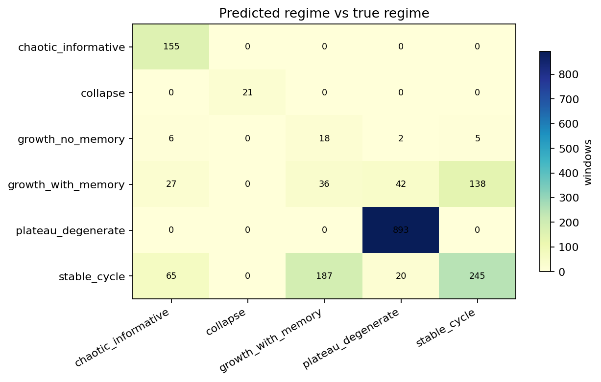

Из матрицы видно, что:

- `chaotic_informative` определяется практически безошибочно;
- `plateau_degenerate` также выделяется очень надёжно;
- основная путаница возникает между `growth_with_memory` и `stable_cycle`;
- небольшая, но содержательная часть окон `growth_no_memory` ошибочно уходит в память или в фазовый анализ.

Это как раз объясняет разрыв между `regime_accuracy = 0.726` и `tool_accuracy = 0.901`. Для многих окон fine-grained режим определяется не идеально, но выбор инструмента всё равно остаётся корректным, поскольку и `growth_with_memory`, и `stable_cycle` маршрутизируются к структурной регрессии.

Особенно показателен случай:

- `delay_g_1.25`, где `regime_accuracy = 0.000`, но `tool_accuracy = 1.000`;
- `mixed_q_1.5_gamma_neg_0.2`, где `regime_accuracy = 0.000`, но `tool_accuracy = 0.890`.

Это означает, что rule-based диагностика не всегда идеально различает тонкие подклассы динамики, но уже умеет достаточно надёжно отвечать на более важный прикладной вопрос: что с этим окном делать дальше.

#### Влияние предклассификации на последующую регрессию

Для оценки downstream-эффекта сравнивались три режима:

- `all_windows` — регрессия на всех окнах;
- `oracle_filtered` — регрессия только на окнах, которые истинно являются регрессионно допустимыми;
- `predicted_filtered` — регрессия только на окнах, которые rule-based диагностика признала допустимыми для регрессии.

На следующем рисунке показано изменение `false_lag_rate`.

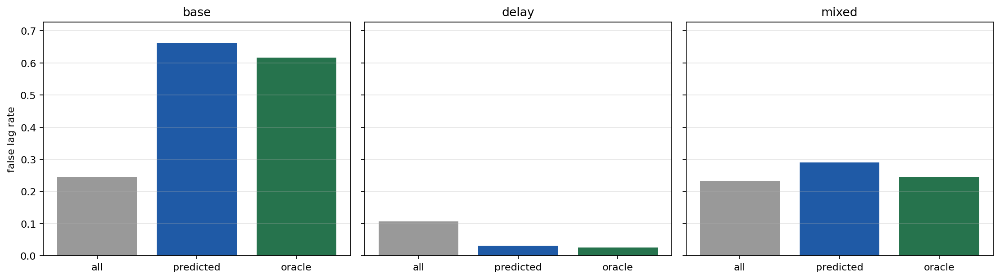

Результат здесь оказался неоднородным.

Для delay-модели предклассификация действительно улучшает картину:

- `false_lag_rate` падает с $0.107$ до $0.032$;
- `hit_rate` растёт с $0.745$ до $1.000$;
- `no_model_share` падает с $0.250$ до $0.000$.

Для base- и mixed-моделей ситуация сложнее. После фильтрации остаются в основном информативные, но структурно трудные окна — циклические и смешанные. Поэтому:

- `hit_rate` резко растёт;
- `no_model_share` падает до нуля;
- но `false_lag_rate` универсально не уменьшается, а в отдельных случаях даже возрастает.

Это принципиально важный результат. Он означает, что предварительная диагностика режима не устраняет сама по себе проблему ложных лагов в циклах; она лишь переводит анализ в более честную область, где регрессия работает на действительно информативных окнах, а не на смеси полезных и вырожденных.

#### Устранение вырождения как основной практический выигрыш

Следующий рисунок показывает долю окон без рабочей модели.

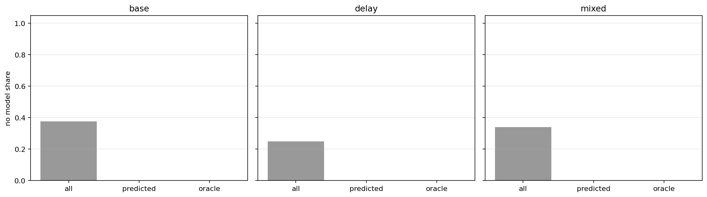

Именно здесь подраздел 2.4.3 даёт наиболее сильный практический эффект.

Для delay- и mixed-моделей фильтрация по предклассификации практически убирает регрессионную работу на окнах, где модель заведомо неустойчива или содержательно бессмысленна:

- в delay-модели `no_model_share` падает с $0.250$ до $0.000$;
- в mixed-модели — с $0.340$ до $0.000$;
- одновременно `hit_rate` возрастает до $1.000$ и $0.933$ соответственно.

Для base-модели `no_model_share` также падает с $0.377$ до $0.000$, однако это не приводит к очищению Stepwise от ложных лагов. Причина уже не в плохих окнах, а в самой природе колебательного режима: гармоническая взаимозаменяемость лагов остаётся даже на содержательно информативных участках.

#### Согласованность с выбором инструмента

На следующем рисунке показано соответствие между истинным рекомендуемым инструментом и инструментом, который выбирает предклассификация.

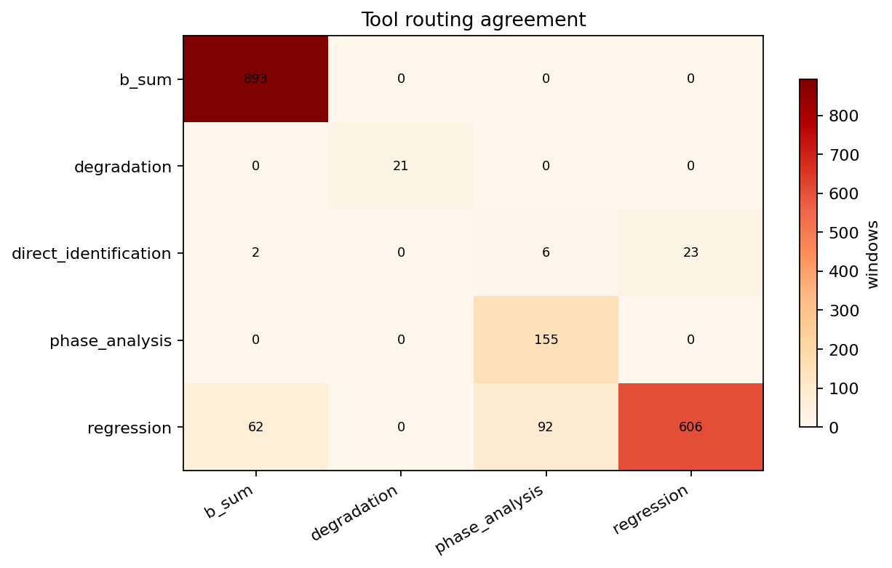

Основная масса окон попадает на диагональ:

- `phase_analysis -> phase_analysis` для хаотических окон;
- `b_sum -> b_sum` для плато и вырожденных режимов;
- `regression -> regression` для окон с памятью и устойчивыми циклами.

Именно это и является главным успехом подраздела 2.4.3. Даже если точный режим окна определяется не безошибочно, метод уже умеет достаточно надёжно направлять окно в правильный аналитический контур.

#### Интерпретация результатов по моделям

Для базовой модели подраздел 2.4.3 показал, что предварительная диагностика очень хорошо отличает хаотические и вырожденные окна, но не решает проблему ложных лагов в устойчивых циклах. Следовательно, для base-динамики этот подраздел полезен прежде всего как фильтр плато и как ранний отказ от бессодержательной регрессии, а не как средство "вылечить" Stepwise в колебательном режиме.

Для delay-модели получен наиболее сильный практический результат. Именно здесь предклассификация действительно улучшает и структуру, и последующую регрессию: исчезают окна без модели, растёт `hit_rate`, заметно падает `false_lag_rate`. Это делает delay-модель лучшей демонстрацией того, что предварительная диагностика режима может быть не только описательной, но и операционно полезной.

Для mixed-модели подраздел 2.4.3 выполняет другую роль. Он очень хорошо отделяет хаос, плато и коллапс от регрессионно допустимых окон, но не гарантирует очистки Stepwise от ложных включений. Зато он почти полностью устраняет бессмысленный запуск регрессии на вырожденных участках и тем самым повышает содержательность дальнейшей интерпретации.

#### Основной методологический результат

Предварительная диагностика режима по простым признакам действительно возможна и практически полезна. Это подтверждается высокой точностью выбора инструмента (`tool_accuracy = 0.901`) и полной полнотой обнаружения плохих окон (`bad_window_recall = 1.000`). Её главный эффект состоит не в безошибочной многоклассовой классификации, а в маршрутизации окна к подходящему типу анализа и в сокращении числа бессодержательных запусков регрессии. При этом гипотеза об автоматическом снижении ложных лагов во всех моделях не подтвердилась: в циклических режимах они остаются внутренним свойством самой регрессионной постановки. Следовательно, подраздел 2.4.3 не заменяет подраздел 2.4.2, а дополняет его.

#### Выводы и место подраздела в общей логике главы

1. Проверялось, можно ли по простым диагностическим признакам заранее выбирать подходящий тип анализа окна.
2. Получено, что routing по режиму работает заметно лучше, чем точная многоклассовая классификация, и хорошо отбраковывает плохие окна.
3. Практически это означает, что регрессию нужно запускать не по умолчанию, а только после предварительной диагностики режима.
4. В общей логике главы подраздел 2.4.3 превращает предыдущие результаты в почти готовый режимно-адаптивный алгоритм.

### 2.4.4. Beta-коэффициенты против обычных B-коэффициентов в диагностике ложных лагов

#### Постановка задачи

После результатов подразделов 2.4.1-2.4.3 стало ясно, что одна из центральных проблем главы связана не только с выбором окна или режима анализа, но и с тем, как именно интерпретировать уже построенную регрессию. В предыдущих разделах было показано, что в циклических и стационаризирующихся режимах Stepwise может включать ложные дальние лаги, а сами предикторы оказываются сильно взаимозаменяемыми. В такой ситуации абсолютные значения нестандартизированных коэффициентов $B$ не всегда являются надёжным индикатором физической значимости переменной: они зависят от масштаба регрессора и могут переоценивать "удобный" по размерности лаг.

Именно поэтому подраздел 2.4.4 был поставлен как отдельный эксперимент на сравнение трёх интерпретационных сигналов:

- локального ранжирования по $|B_i|$;
- локального ранжирования по $|\beta_i|$;
- агрегированного ранжирования по частоте выбора переменной Stepwise.

Изначальная гипотеза формулировалась в сильной форме: стандартизированные $\beta$-коэффициенты должны лучше, чем обычные $B$, выделять истинное структурное ядро зависимости в условиях мультиколлинеарности и ложных лагов. Эксперимент показал, что эта гипотеза подтверждается не универсально, но содержательно. В окончательном виде результат подраздела 2.4.4 формулируется так:

> Стандартизированные $\beta$-коэффициенты действительно оказываются более надёжным локальным инструментом ранжирования структурного ядра зависимости, чем абсолютные значения $B$, однако это преимущество режимно-зависимо. В простых и умеренно коллинеарных окнах $\beta$ и $B$ часто совпадают. В проблемных окнах $\beta$ чаще правильно восстанавливает ядро структуры, но в отдельных mixed-режимах с отрицательной памятью уступает по top-1, оставаясь при этом лучше по восстановлению полного набора истинных предикторов.

В таком виде подраздел 2.4.4 становится прямым ответом на замечание научного руководителя: $\beta$-коэффициенты нужны не как декоративное дополнение к таблице регрессии, а как отдельный структурный диагностический инструмент.

#### Регрессионная схема и используемые показатели

##### Базовая модель интерпретации

Во всех окнах оценивалась регрессия темпа прироста

$\omega_n = \frac{X_{n+1} - X_n}{X_n} = \alpha + B_0 X_n + \sum_{j=1}^{L} B_j Lag_j + \varepsilon_n.$

После оценки ENTER-модели по полному лаговому пространству вычислялись стандартизированные коэффициенты

$\beta_j = B_j \frac{\sigma(X_j)}{\sigma(\omega)}.$

Именно эти две шкалы сравнивались как альтернативные способы локального ранжирования предикторов внутри одного и того же окна.

##### Определение проблемного окна

Чтобы не смешивать заведомо простые и содержательно трудные случаи, отдельно вводилось понятие проблемного окна. Окно считалось проблемным, если выполнялось хотя бы одно из условий:

- Stepwise выбирал хотя бы один ложный лаг;
- средняя абсолютная попарная корреляция между регрессорами превышала порог $0.9$.

Формально использовалась величина

$\bar{\rho}_X = \frac{1}{m(m-1)} \sum_{i \ne j} |corr(X_i, X_j)|,$

где $m$ — число регрессоров в окне.

Такое определение позволило отделить действительно трудные для интерпретации окна от тех, где и $B$, и $\beta$ почти неизбежно дают одинаковый результат.

##### Метрики качества ранжирования

Для каждого окна и для каждой шкалы оценивались три метрики.

1. `correct_top` — доля окон, где предиктор с максимальным абсолютным коэффициентом принадлежит истинному множеству структурных переменных.
2. `topk_recall` — доля истинных структурных переменных, попавших в top-$k$ ранжирования, где $k$ равно числу истинных предикторов модели.
3. `pairwise_score` — доля пар "истинный предиктор против ложного лага", в которых истинный предиктор имеет больший абсолютный вес:

$S = \frac{1}{|T||F|} \sum_{t \in T} \sum_{f \in F} \mathbf{1}\{|s_t| > |s_f|\},$

где $T$ — множество истинных предикторов, $F$ — множество ложных лагов, а $s$ означает либо $B$, либо $\beta$.

Именно `pairwise_score` оказался особенно полезным для mixed-моделей, где top-1 может быть слишком грубым критерием.

#### Дизайн вычислительного эксперимента

В эксперимент были включены режимы, где проблема ложных лагов уже проявилась в подразделах 2.4.2 и 2.4.3:

- базовая модель: $a = 2.2$ и $a = 2.52$;
- модель с запаздыванием: $g = 0.8$ и $g = 1.25$;
- смешанная модель: $(q,\gamma) = (2.8,0.5)$ и $(1.5,-0.2)$.

Для всех кейсов использовалась единая схема:

- длина траектории: $180$;
- длина окна: `window = 25`;
- лаговое пространство: `lags = 10`.

В каждом окне строилась таблица вида:

| окно | переменная | $B$ | $\beta$ | `p-value` | выбран Stepwise |
| --- | --- | ---: | ---: | ---: | --- |

Далее по окнам агрегировались:

- точность выбора главного структурного предиктора;
- точность восстановления полного ядра структуры;
- разделяющая способность между истинными и ложными лагами;
- частота выбора переменной Stepwise как отдельный глобальный baseline.

#### Основные интегральные результаты

##### 1. В среднем по всем окнам $\beta$ действительно лучше, чем $B$

Интегральные результаты по моделям приведены в таблице. Здесь `top B` и `top beta` обозначают точность выбора главного предиктора, `rec B` и `rec beta` — полноту восстановления структурного ядра, `pair B` и `pair beta` — попарную разделяющую способность истинных и ложных лагов.

| Агрегация | top B | top beta | rec B | rec beta | pair B | pair beta |
| --- | ---: | ---: | ---: | ---: | ---: | ---: |
| overall, все окна | $0.649$ | $0.694$ | $0.595$ | $0.688$ | $0.776$ | $0.810$ |
| overall, проблемные окна | $0.479$ | $0.508$ | $0.377$ | $0.496$ | $0.625$ | $0.684$ |
| base, проблемные окна | $0.226$ | $0.347$ | $0.226$ | $0.347$ | $0.556$ | $0.664$ |
| mixed, проблемные окна | $0.940$ | $0.787$ | $0.623$ | $0.750$ | $0.729$ | $0.704$ |

Эта таблица сразу даёт главный вывод подраздела 2.4.4. Если смотреть на задачу в среднем, $\beta$-коэффициенты действительно лучше выделяют структурное ядро зависимости. Причём преимущество усиливается именно на проблемных окнах, где регрессоры коллинеарны или Stepwise уже начал включать ложные лаги.

На следующем рисунке показано, как это преимущество выглядит по отдельным кейсам в терминах `correct_top` и `topk_recall`.

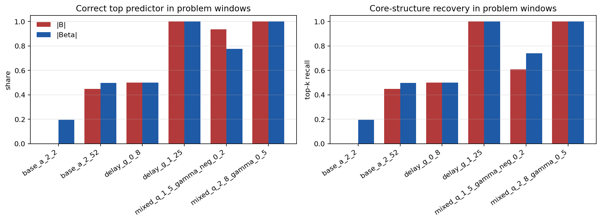

##### 2. Наиболее сильный эффект получен в базовой колебательной модели

Самый показательный кейс подраздела 2.4.4 — `base_a_2_2`. Для него проблемными оказываются $95.5\%$ окон, то есть речь идёт не об отдельных выбросах, а о режиме, где коллинеарность и ложные лаги составляют почти всю рабочую картину.

Для этого кейса получены следующие значения. Заголовки столбцов сохраняют ту же логику: `top` — точность выбора главного фактора, `rec` — полнота ядра, `pair` — разделение истинных и ложных лагов.

Для компактности в первом столбце используются краткие обозначения: `b2.2` = `base_a_2_2`, `d0.8` = `delay_g_0_8`, `m1.5-` = `mixed_q_1_5_gamma_neg_0_2`.

| Кейс | Проблемн. окна | top B | top beta | rec B | rec beta | pair B | pair beta |
| --- | ---: | ---: | ---: | ---: | ---: | ---: | ---: |
| `b2.2` | $0.955$ | $0.000$ | $0.196$ | $0.000$ | $0.196$ | $0.165$ | $0.376$ |
| `d0.8` | $0.026$ | $0.500$ | $0.500$ | $0.500$ | $0.500$ | $0.750$ | $0.550$ |
| `m1.5-` | $0.929$ | $0.938$ | $0.778$ | $0.608$ | $0.740$ | $0.718$ | $0.691$ |

Именно `base_a_2_2` даёт самый чистый аргумент в пользу $\beta$: в таких окнах ранжирование по $|B|$ практически перестаёт видеть истинную структуру, тогда как ранжирование по $|\beta|$ хотя бы частично возвращает её.

Типичный пример:

| Кейс | Окно | лидер B | лидер beta | pair B | pair beta |
| --- | --- | --- | --- | ---: | ---: |
| `b2.2` | $[24,49]$ | `Lag_1` | `X_n` | $0.600$ | $1.000$ |
| `b2.52` | $[73,98]$ | `Lag_2` | `X_n` | $0.900$ | $1.000$ |
| `d0.8` | $[98,123]$ | `Lag_7` | `Lag_1` | $0.500$ | $1.000$ |
| `m1.5-` | $[82,107]$ | `Lag_9` | `X_n` | $0.500$ | $0.944$ |

Эти примеры показывают, что выигрыш от $\beta$ не сводится к "чуть более красивым коэффициентам". В конкретных окнах $\beta$ буквально возвращает правильный структурный лидер.

##### 3. В mixed-модели с отрицательной памятью top-1 и top-k расходятся

Именно `mixed_q_1_5_gamma_neg_0_2` дал самый полезный контрпример. В проблемных окнах здесь top-1 по $|B|$ чаще оказывается корректным, чем top-1 по $|\beta|$:

- `correct_top` по $|B|$: $0.938$;
- `correct_top` по $|\beta|$: $0.778$.

Однако если смотреть не на один доминирующий коэффициент, а на восстановление всей структуры из двух истинных предикторов, то картина меняется:

- `topk_recall` по $|B|$: $0.608$;
- `topk_recall` по $|\beta|$: $0.740$.

Содержательно это означает следующее. В mixed-режиме с отрицательной памятью абсолютные $B$ часто хорошо удерживают один доминирующий предиктор, но хуже отделяют второй истинный компонент от ложных лагов. $\beta$-коэффициенты, напротив, иногда уступают в top-1, зато лучше сохраняют полное двухкомпонентное ядро структуры.

Таким образом, подраздел 2.4.4 даёт важное уточнение: преимущество $\beta$ нельзя формулировать как "всегда лучше по top-1". Правильнее говорить, что $\beta$ чаще лучше восстанавливают структуру как систему взаимосвязанных факторов.

##### 4. Разделение истинных и ложных лагов по величине заметно лучше именно в шкале $\beta$

На следующем рисунке показаны распределения абсолютных весов истинных и ложных предикторов на проблемных окнах.

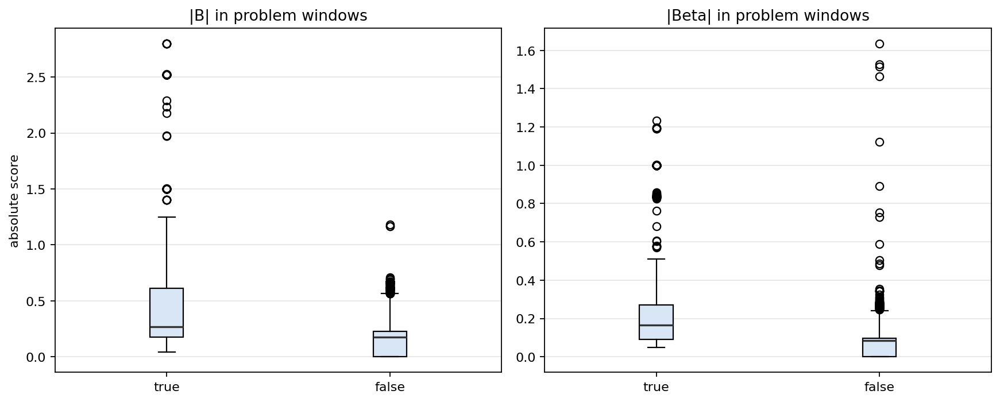

Медианные значения подтверждают визуальный вывод:

| Модель | Истинный / ложный предиктор | медиана `abs(B)` | медиана `abs(beta)` |
| --- | --- | ---: | ---: |
| base | ложный | $0.189$ | $0.086$ |
| base | истинный | $0.613$ | $0.263$ |
| mixed | ложный | $0.144$ | $0.091$ |
| mixed | истинный | $0.227$ | $0.160$ |

Для базовой модели разрыв между истинными и ложными лагами заметно чище именно в стандартизированной шкале. В mixed-модели эффект слабее, но также сохраняется: ложные лаги "сжимаются" сильнее, чем истинные.

Дополнительный взгляд на это даёт сравнение `pairwise_score`.

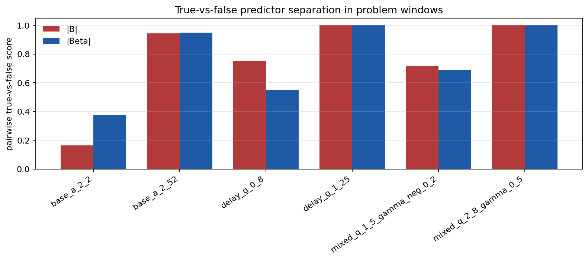

В базовых режимах именно эта метрика наиболее явно показывает превосходство $\beta$ над $B$. В delay- и positive-mixed режимах различие уже мало, потому что структура и без того хорошо идентифицируема.

##### 5. Частота выбора Stepwise полезна как глобальный baseline, но плохо заменяет локальное ранжирование

Третьим кандидатом на интерпретацию была частота выбора переменной Stepwise по окнам. Эксперимент показал, что это полезный, но качественно другой инструмент.

На следующем рисунке сравнивается восстановление структурного ядра по трём агрегированным критериям:

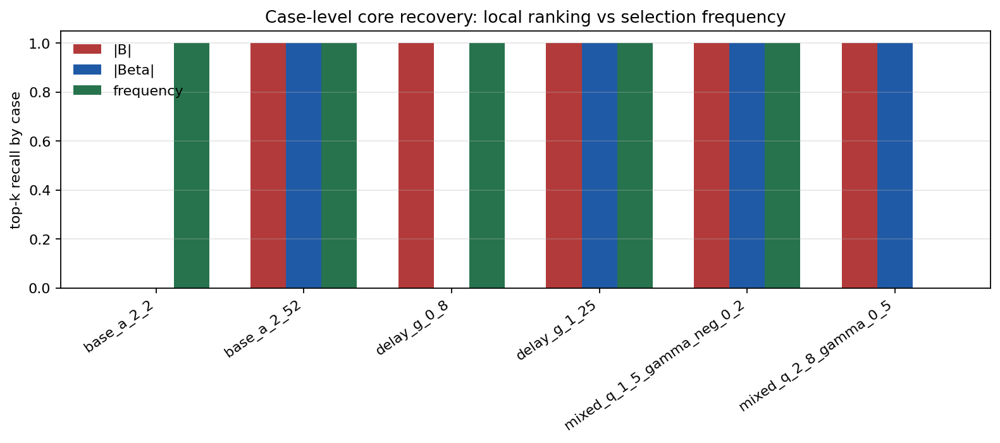

Здесь выявились два характерных эффекта.

Во-первых, в `base_a_2_2` частота выбора ведёт себя лучше, чем средние $|B|$ и $|\beta|$: `X_n` выбирается Stepwise практически во всех проблемных окнах, хотя локальное ранжирование по величине коэффициента часто отдаёт лидерство ложным лагам. Это значит, что частота выбора хорошо отражает устойчивое присутствие переменной, но не её локальное доминирование.

Во-вторых, в `mixed_q_2_8_gamma_0_5` частота выбора может оказаться откровенно вводящей в заблуждение: в проблемных окнах `Lag_2` выбирается Stepwise с частотой $0.833$, тогда как истинные `X_n` и `Lag_1` выбираются лишь в $0.167$ окон. При этом ENTER-оценки показывают почти идеальное структурное доминирование именно истинных предикторов:

- `problem_mean_abs_B(X_n) \approx 2.80`,
- `problem_mean_abs_B(Lag_1) \approx 1.40`,
- для ложных лагов величины порядка $10^{-6}$ и ниже.

Следовательно, частота выбора — это скорее индикатор комбинаторного поведения Stepwise, а не замена интерпретации коэффициентов.

#### Интерпретация результатов по семействам моделей

Для базовой модели подраздел 2.4.4 оказался особенно сильным. Здесь циклическая взаимозаменяемость лагов делает обычные $B$ крайне чувствительными к локальному масштабу признаков, а $\beta$ заметно лучше возвращают текущей переменной $X_n$ её содержательный приоритет.

Для delay-модели результат более умеренный. В сложном режиме $g = 1.25$ и $B$, и $\beta$ практически идеальны. В более мягком режиме $g = 0.8$ есть отдельные окна, где $B$ уводит лидерство к дальнему лагу, тогда как $\beta$ возвращает его к `Lag_1`. Но в среднем по проблемным окнам выигрыш здесь не столь велик, потому что самих проблемных окон мало.

Для mixed-модели получена наиболее содержательная неоднозначность. В positive-mixed режиме обе шкалы почти эквивалентны и хорошо восстанавливают структуру. В negative-mixed режиме $\beta$ уже нельзя трактовать как безусловно лучший критерий top-1, зато именно они лучше удерживают двухфакторное ядро зависимости и сильнее отделяют второй истинный фактор от ложных лагов.

#### Основной методологический результат

Стандартизированные $\beta$-коэффициенты обладают самостоятельной интерпретационной ценностью и в среднем лучше обычных $B$ восстанавливают структурное ядро модели, особенно в проблемных окнах. Их преимущество проявляется не столько в выборе одного "самого главного" предиктора, сколько в более корректном разделении истинных и ложных лагов и в лучшем восстановлении полного набора факторов. Это преимущество режимно-зависимо: в простых окнах различие между $B$ и $\beta$ мало, а в циклических и mixed-режимах становится содержательно важным. Частота выбора Stepwise при этом отражает иной аспект — устойчивость включения переменной — и потому должна использоваться только как дополнительный глобальный сигнал.

#### Выводы и место подраздела в общей логике главы

1. Проверялось, какие коэффициенты лучше отражают структурное ядро зависимости в проблемных окнах: $B$, $\beta$ или частота выбора.
2. Получено, что $\beta$ в среднем надёжнее восстанавливают ядро структуры, хотя их преимущество остаётся режимно-зависимым.
3. Практически это означает, что в интерпретируемых, но коллинеарных окнах основное ранжирование предикторов следует вести по $\beta$, а не по абсолютным $B$.
4. В общей логике главы подраздел 2.4.4 задаёт правило чтения коэффициентов внутри уже допущенного регрессионного контура.

### 2.4.5. Нормировка, дисперсия и масштаб как границы интерпретируемости короткого окна

#### Постановка задачи

После результатов подразделов 2.4.2-2.4.4 стало ясно, что короткое окно может деградировать как минимум по двум разным причинам. Во-первых, окно может почти потерять динамический сигнал: ряд выходит на плато, дисперсия темпа роста резко падает, а регрессия либо не строится, либо становится формально бессодержательной. Во-вторых, даже при сохраняющейся вариативности окно может оставаться плохо интерпретируемым из-за сильной коллинеарности лагов: Stepwise начинает подхватывать ложные дальние лаги, а локальная структура размывается.

Именно поэтому подраздел 2.4.5 был поставлен как отдельный диагностический эксперимент. Его цель состояла не в построении новой модели, а в проверке следующей гипотезы:

> часть нестабильности коэффициентов в коротких окнах связана не со структурным сдвигом как таковым, а с падением дисперсии и с плохой обусловленностью матрицы регрессоров; стандартизация и явный учёт дисперсии позволяют отличить окна, где регрессия теряет смысл из-за исчезновения сигнала, от окон, где проблема вызвана коллинеарностью лагов.

В ходе эксперимента эта гипотеза подтвердилась, но в уточнённой форме. Главный результат подраздела 2.4.5 состоит в том, что деградация короткого окна действительно имеет двойственную природу:

- в одних окнах доминирует low-dispersion failure, то есть исчезновение самого информативного сигнала;
- в других доминирует collinearity failure, то есть ложная лаговая структура при ещё ненулевой вариативности.

Следовательно, дисперсия и кондиционность не просто "мешают регрессии", а позволяют различить два качественно разных механизма её разрушения.

При этом подраздел 2.4.5 естественным образом продолжает логику подраздела 2.4.3. Если подраздел 2.4.3 отвечает на вопрос, какой инструмент анализа должен быть выбран для данного окна, то подраздел 2.4.5 отвечает на следующий вопрос: можно ли вообще интерпретировать короткую регрессию в этом окне. Тем самым возникает единое routing rule:

1. сначала выполняется режимная предклассификация окна;
2. если выбран регрессионный контур, то дополнительно проверяются $Var(\omega)$ и $\kappa(\widetilde{X})$;
3. только после этого интерпретируются lag-структура, $\beta$-коэффициенты и агрегированный показатель $B_\Sigma$.

Именно в таком виде подраздел 2.4.5 перестаёт быть "дополнительной статистикой" и становится обязательным фильтром перед чтением короткой регрессии.

#### Используемые показатели

##### Дисперсия сигнала

Для каждого окна длины `25` вычислялись

- $Var(X_n)$;
- $Var(\omega_n)$, где $\omega_n = \frac{X_{n+1} - X_n}{X_n}$.

Именно $Var(\omega_n)$ оказался главным показателем того, есть ли в окне вообще содержательный локальный сигнал для регрессионной интерпретации.

##### Кондиционность и нормировка

Для матрицы регрессоров $X$ оценивались два condition number:

- сырое значение $\kappa(X)$;
- стандартизованное значение $\kappa(\widetilde{X})$, где каждый столбец центрировался и делился на своё стандартное отклонение.

Это различие принципиально. Если после нормировки кондиционность резко падает, значит заметная часть проблемы была связана именно с масштабной несопоставимостью признаков. Если же и после нормировки окно остаётся плохо обусловленным, то причина уже содержательная: лаги почти неразличимы по самой геометрии процесса.

##### VIF и структурные индикаторы деградации

Для каждого предиктора вычислялся показатель

$VIF_j = \frac{1}{1 - R_j^2},$

где $R_j^2$ — коэффициент детерминации регрессии $j$-го предиктора на остальные.

Дополнительно по окну фиксировались:

- число ложных лагов и `false_lag_rate`;
- факт отсутствия Stepwise-модели (`no_model`);
- стандартизированные $\beta$-коэффициенты;
- `pairwise_beta` как доля сравнений "истинный предиктор против ложного лага", в которых истинный фактор сохраняет больший вес.

##### Классы деградации окна

Чтобы не смешивать разные типы провала, для каждого окна вводилась трёхклассовая разметка:

- `stable`: окно остаётся регрессионно интерпретируемым;
- `low_dispersion`: окно вырождено по сигналу;
- `collinearity`: окно сохраняет сигнал, но теряет интерпретируемость из-за ложных лагов и взаимозаменяемости признаков.

Формально использовалось следующее правило:

- `low_dispersion`, если окно почти вырождено по диапазону или Stepwise не возвращает модель;
- `collinearity`, если Stepwise выбирает ложные лаги или если `pairwise_beta < 0.5`;
- иначе окно считалось `stable`.

Такое разделение оказалось полезнее, чем единый бинарный ярлык "хорошее/плохое окно".

#### Дизайн вычислительного эксперимента

В подраздел 2.4.5 были включены девять реперных кейсов, охватывающих как почти стационарные, так и циклические режимы:

- базовая модель: $a = 0.8$, $a = 2.2$, $a = 2.52$;
- модель с запаздыванием: $g = 0.2$, $g = 0.8$, $g = 1.25$;
- смешанная модель: $(q,\gamma) = (1.5,0.5)$, $(2.8,0.5)$, $(1.5,-0.2)$.

Для всех кейсов использовалась единая схема:

- длина траектории: `180`;
- длина окна: `25`;
- лаговое пространство: `10`.

В каждом окне строилась ENTER-регрессия и Stepwise-регрессия по общему лаговому пространству. Затем окно описывалось вектором признаков

$\{Var(X_n), Var(\omega_n), \kappa(X), \kappa(\widetilde{X}), VIF, \beta, false\_lag\_rate, no\_model\}$

и относилось к одному из трёх классов: `stable`, `low_dispersion`, `collinearity`.

Всего было проанализировано `1395` окон.

#### Основные интегральные результаты

##### 1. Деградация окна действительно распадается на два разных механизма

Итоговая агрегация по всем окнам приведена в таблице.

| Область агрегации | доля degraded | доля low-dispersion | доля collinearity | доля stable |
| --- | ---: | ---: | ---: | ---: |
| overall | $0.511$ | $0.330$ | $0.181$ | $0.489$ |
| base | $0.583$ | $0.290$ | $0.292$ | $0.417$ |
| delay | $0.447$ | $0.413$ | $0.034$ | $0.553$ |
| mixed | $0.503$ | $0.286$ | $0.217$ | $0.497$ |

Эта таблица даёт главный структурный вывод подраздела 2.4.5. В среднем по всем окнам деградация распределяется неравномерно: примерно две трети проблемных окон относятся к классу `low_dispersion`, а оставшаяся треть — к классу `collinearity`.

При этом семейства моделей ведут себя по-разному:

- в `delay`-модели главная проблема — исчезновение сигнала на насыщении;
- в `base`-модели почти поровну представлены оба механизма;
- в `mixed`-модели коллинеарный сценарий существенно заметнее, чем в `delay`.

То есть сама по себе фраза "короткое окно нестабильно" слишком груба: нестабильность имеет разную природу, и это уже само по себе методологический результат.

##### 2. Самый сильный диагностический признак low-dispersion failure — исчезновение $Var(\omega)$

Медианные значения по устойчивым и деградировавшим окнам показали резкий разрыв:

| Показатель | degraded windows | stable windows |
| --- | ---: | ---: |
| median $Var(\omega)$ | $3.33 \cdot 10^{-14}$ | $3.54 \cdot 10^{-1}$ |
| median $\kappa(\widetilde{X})$ | $4.95 \cdot 10^{11}$ | $1.81 \cdot 10^{8}$ |

Корреляция между $\log_{10} Var(\omega)$ и признаком деградации окна составила $-0.649$, а для $\log_{10} Var(X_n)$ — $-0.666$. Это один из самых сильных эффектов всего подраздела.

Особенно показателен квартильный анализ:

- для нижнего квартиля по $Var(\omega)$ (`Q1`) доля деградации равна ровно `1.0`;
- для верхнего квартиля (`Q4`) она падает до `0.049`.

Иначе говоря, если локальная дисперсия темпа роста проваливается в нижний квартиль, окно почти гарантированно перестаёт быть содержательным для регрессионной интерпретации.

Это хорошо видно и на плоскости "дисперсия против кондиционности":

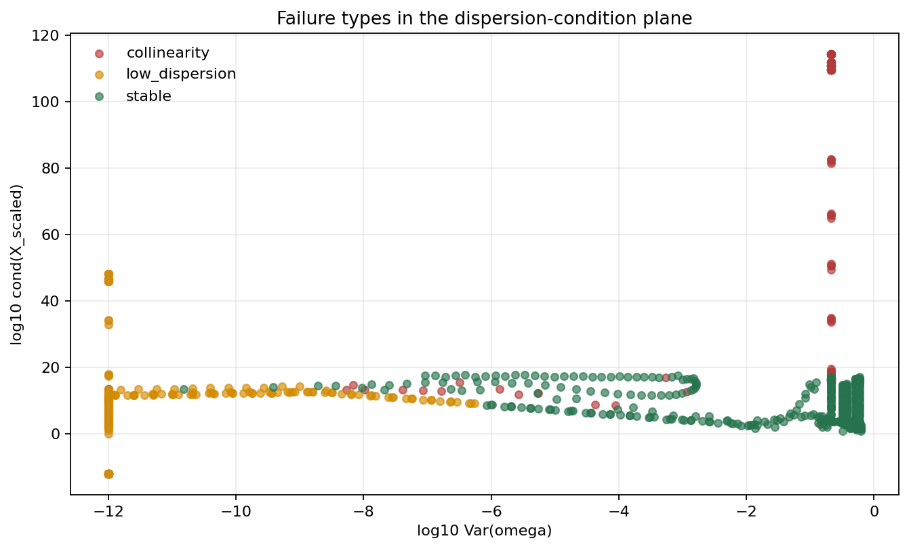

На графике видно, что класс `low_dispersion` концентрируется в зоне крайне малых значений $Var(\omega)$, тогда как `collinearity` уходит в область больших condition number при уже не нулевой вариативности.

##### 3. Высокая кондиционность важна, но только после отделения низкодисперсионных окон

Если смотреть на все окна сразу, сама по себе $\kappa(\widetilde{X})$ объясняет деградацию хуже, чем дисперсия: корреляция $\log_{10}\kappa(\widetilde{X})$ с ярлыком деградации составила лишь $0.357$. Это уже важное уточнение по сравнению с первоначальной гипотезой: плохая обусловленность не является универсальным объяснением всех проблем окна.

Однако после исключения низкодисперсионных окон эффект кондиционности становится содержательно сильным. Для окон с ненулевым сигналом средний `false_lag_rate` по bands кондиционности выглядит так:

| band по $\kappa(\widetilde{X})$ | mean false_lag_rate при $Var(\omega)$ выше нижнего квартиля |
| --- | ---: |
| Q1, наихудшая кондиционность | $0.598$ |
| Q2 | $0.084$ |
| Q3 | $0.030$ |
| Q4, лучшая кондиционность | $0.035$ |

Это означает, что после отделения плато и почти константных фрагментов именно плохая кондиционность начинает отвечать за ложную лаговую структуру.

Тепловая карта сочетания обоих факторов показывает это особенно наглядно.

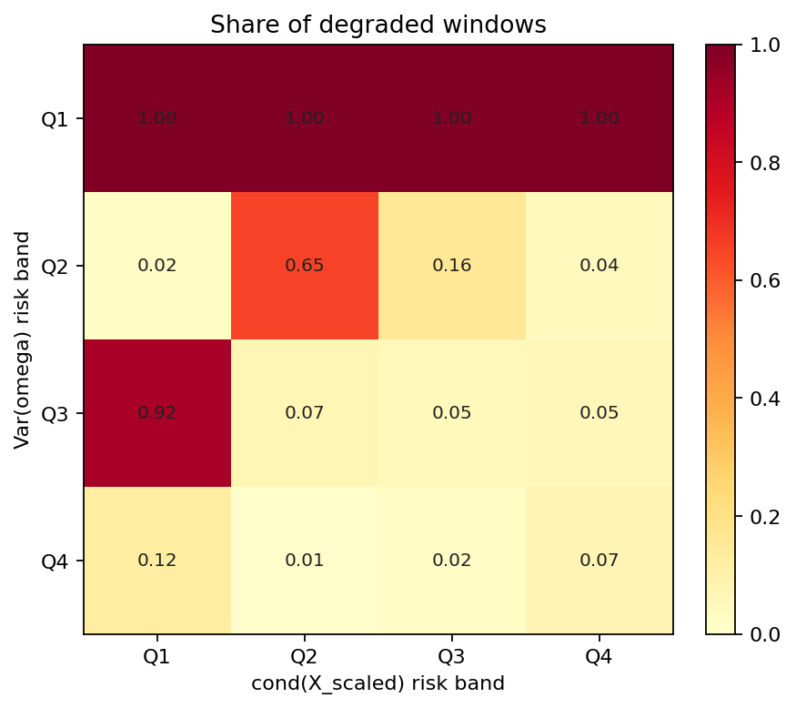

Ключевые зоны здесь такие:

- нижний квартиль по $Var(\omega)$ даёт `degraded_share = 1.0` при любой кондиционности;
- при умеренной и высокой вариативности наихудшая кондиционность даёт уже коллинеарный провал, например `degraded_share = 0.915` в клетке `Q3 var / Q1 cond`.

Следовательно, дисперсия отвечает на вопрос "есть ли в окне сигнал", а condition number — на вопрос "можно ли из этого сигнала извлечь устойчивую лаговую структуру".

##### 4. Стандартизация действительно убирает часть масштабной проблемы, но не спасает коллинеарные окна

Одной из идей подраздела 2.4.5 было проверить, насколько сильна именно масштабная компонента плохой обусловленности. Для этого сравнивались сырые и стандартизованные condition number.

Медианные значения по моделям:

| Модель | median $\kappa(X)$ | median $\kappa(\widetilde{X})$ |
| --- | ---: | ---: |
| base | $1.93 \cdot 10^{81}$ | $1.25 \cdot 10^{15}$ |
| delay | $1.41 \cdot 10^{14}$ | $5.31 \cdot 10^{7}$ |
| mixed | $6.81 \cdot 10^{16}$ | $2.92 \cdot 10^{11}$ |

В среднем нормировка уменьшала condition number заметно; медианный коэффициент сокращения по всем окнам составил примерно `2.44`. Но важнее не это, а то, что в циклических проблемных кейсах стандартизация проблему не снимала. Например:

- `base_a_2_2`: median $\kappa(\widetilde{X}) = 2.80 \cdot 10^{109}$, `false_lag_rate = 0.721`;
- `mixed_q_1_5_gamma_neg_0_2`: median $\kappa(\widetilde{X}) = 6.16 \cdot 10^{16}$, `false_lag_rate = 0.431`.

То есть часть взрыва condition number действительно связана с масштабом признаков, но в structurally hard окнах после нормировки остаётся содержательная, а не "единичная" коллинеарность.

Сравнение сырых и стандартизованных condition number по типам окна приведено на рисунке.

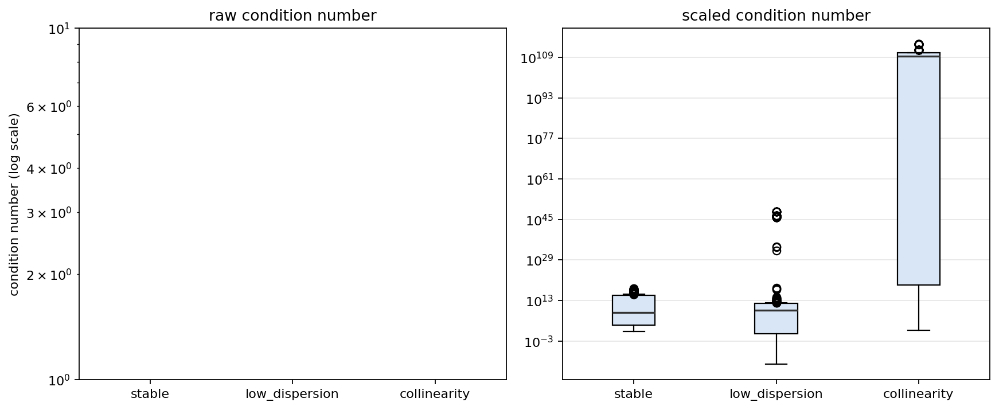

Этот график подтверждает две вещи:

- raw condition number сильно загрязнён масштабным эффектом;
- scaled condition number лучше отделяет truly problematic окна от технически разномасштабных.

##### 5. VIF оказался слабее, чем ожидалось

Изначально предполагалось, что `VIF` будет одним из главных локальных предикторов деградации. Эксперимент этого не подтвердил.

Во-первых, корреляция `max_vif` с признаком деградировавшего окна составила всего `0.081`. Во-вторых, медианный `max_vif` для устойчивых окон оказался даже выше, чем для degraded:

- median `max_vif` degraded: $5.84 \cdot 10^{4}$;
- median `max_vif` stable: $4.30 \cdot 10^{5}$.

Это важный отрицательный результат. В детерминированных нелинейных траекториях сильная взаимосвязь лагов настолько естественна, что `VIF` почти везде оказывается очень большим и плохо различает "нормальную" циклическую взаимосвязанность от реально опасной локальной вырожденности.

Следовательно, в рамках данной задачи `VIF` нельзя использовать как самостоятельный критерий фильтрации окон. Намного полезнее комбинация:

- локальная дисперсия $Var(\omega)$;
- стандартизованная кондиционность $\kappa(\widetilde{X})$;
- наличие или отсутствие ложных лагов.

##### 6. По кейсам чётко отделяются low-dispersion и collinearity сценарии

Распределение проблем по отдельным кейсам приведено в таблице.

Здесь используются краткие обозначения кейсов: `b0.8` = `base_a_0_8`, `b2.2` = `base_a_2_2`, `d0.8` = `delay_g_0_8`, `d1.25` = `delay_g_1_25`, `m1.5+` = `mixed_q_1_5_gamma_0_5`, `m1.5-` = `mixed_q_1_5_gamma_neg_0_2`, `m2.8+` = `mixed_q_2_8_gamma_0_5`.

| Кейс | degraded | low disp | collin | mean Var(w) | med cond | false lags | no model |
| --- | ---: | ---: | ---: | ---: | ---: | ---: | ---: |
| `b0.8` | $0.910$ | $0.871$ | $0.039$ | $2.25 \cdot 10^{-3}$ | $0.0$ | $0.071$ | $0.806$ |
| `b2.2` | $0.806$ | $0.000$ | $0.806$ | $2.10 \cdot 10^{-1}$ | $2.80 \cdot 10^{109}$ | $0.721$ | $0.000$ |
| `d0.8` | $0.665$ | $0.665$ | $0.000$ | $4.00 \cdot 10^{-3}$ | $2.96 \cdot 10^{10}$ | $0.018$ | $0.000$ |
| `d1.25` | $0.077$ | $0.000$ | $0.077$ | $5.49 \cdot 10^{-1}$ | $6.80 \cdot 10^{1}$ | $0.039$ | $0.000$ |
| `m1.5+` | $0.923$ | $0.858$ | $0.065$ | $1.56 \cdot 10^{-4}$ | $1.98 \cdot 10^{11}$ | $0.468$ | $0.361$ |
| `m1.5-` | $0.548$ | $0.000$ | $0.548$ | $1.94 \cdot 10^{-1}$ | $6.16 \cdot 10^{16}$ | $0.431$ | $0.000$ |
| `m2.8+` | $0.039$ | $0.000$ | $0.039$ | $3.30 \cdot 10^{-1}$ | $6.40 \cdot 10^{7}$ | $0.034$ | $0.000$ |

Эта таблица особенно важна методически. Она показывает, что подраздел 2.4.5 не просто добавляет ещё один диагностический показатель, а вводит режимное различение:

- `base_a_0_8`, `delay_g_0_8`, `mixed_q_1_5_gamma_0_5` — это прежде всего низкодисперсионные окна;
- `base_a_2_2` и `mixed_q_1_5_gamma_neg_0_2` — это коллинеарные окна с живым, но плохо интерпретируемым сигналом;
- `base_a_2_52`, `delay_g_1_25`, `mixed_q_2_8_gamma_0_5` — это в основном устойчиво интерпретируемые режимы.

Именно этот сдвиг от "одного показателя" к "типологии окна" и составляет основной вклад подраздела 2.4.5.

На рисунке ниже это видно уже на уровне кейсов.

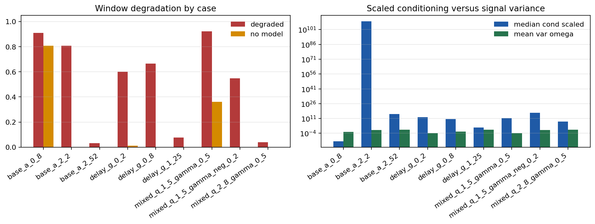

#### Практический диагностический критерий

В завершение был выполнен перебор простых пороговых правил вида

$Var(\omega) \le t_{\omega} \quad \lor \quad \kappa(\widetilde{X}) \ge t_{\kappa}.$

Лучшее формально правило давало `balanced_accuracy = 0.934`, но использовало слишком экстремальный порог по кондиционности, фактически подстроенный под один очень тяжёлый кейс. Более интерпретируемое правило оказалось таким:

- $Var(\omega) \lesssim 2.4 \cdot 10^{-8}$;
- или $\kappa(\widetilde{X}) \gtrsim 7.0 \cdot 10^{16}$.

Для него получены:

- `balanced_accuracy = 0.929`;
- `recall = 0.913`;
- `specificity = 0.946`;
- `precision = 0.946`.

Содержательно это правило означает:

1. если $Var(\omega)$ падает практически до нуля, окно нужно считать диагностически вырожденным даже без дальнейшего анализа лагов;
2. если сигнал остаётся ненулевым, но стандартизованная кондиционность взлетает выше порядка $10^{16}$, резко возрастает риск ложной лаговой структуры.

Это уже можно трактовать как рабочее правило предварительного скрининга окна перед интерпретацией регрессии.

#### Основной методологический результат

Результат подраздела 2.4.5 можно сформулировать в завершённом виде.

Во-первых, нестабильность короткой регрессии действительно нельзя сводить к единственной причине. Эксперимент показал существование по меньшей мере двух разных механизмов разрушения окна: low-dispersion failure и collinearity failure.

Во-вторых, наиболее сильным диагностическим индикатором вырожденного окна оказалась локальная дисперсия темпа роста $Var(\omega)$. При её резком падении регрессия теряет содержательность почти независимо от остальных характеристик.

В-третьих, плохая обусловленность становится содержательно важной только после отделения таких низкодисперсионных окон. В окнах с живым сигналом именно высокая $\kappa(\widetilde{X})$ объясняет всплеск ложных лагов и падение структурной интерпретируемости.

В-четвёртых, стандартизация действительно снимает часть проблемы масштаба, но не спасает structurally hard окна. Следовательно, сама по себе нормировка не является лечением ложных лагов; она лишь позволяет отделить технический scale effect от содержательной коллинеарности.

В-пятых, `VIF` в данной задаче оказался слабым самостоятельным критерием. Для детерминированных нелинейных траекторий он слишком часто велик "по умолчанию" и потому плохо ранжирует реально опасные окна.

#### Выводы и место подраздела в общей логике главы

1. Проверялось, какие именно механизмы делают короткое окно неинтерпретируемым: исчезновение сигнала или коллинеарная геометрическая вырожденность.
2. Получено, что деградация окна действительно имеет двойственную природу и лучше всего диагностируется через $Var(\omega)$ и $\kappa(\widetilde{X})$.
3. Практически это означает, что перед чтением lag-структуры необходимо сначала проверять локальную дисперсию сигнала и стандартизованную кондиционность.
4. В общей логике главы подраздел 2.4.5 вводит обязательный фильтр интерпретируемости после диагностики режима и до чтения коэффициентов.

### 2.4.6. ENTER, STEPWISE и регуляризованные методы как контрольный эксперимент

#### Постановка задачи

После результатов подразделов 2.4.1-2.4.5 стало ясно, что следующая проблема лежит уже не в выборе длины окна и не в предварительной диагностике режима, а внутри самого регрессионного контура. В предыдущих экспериментах было показано, что:

- ENTER-регрессия лучше сохраняет общий физический смысл структуры, но распределяет массу между многими взаимозаменяемыми лагами;
- STEPWISE-регрессия чаще даёт компактную модель, но в циклических и мультиколлинеарных режимах подхватывает ложные лаги;
- высокая предиктивная точность сама по себе не гарантирует корректную структурную интерпретацию.

На этом фоне естественным выглядит контрольный вопрос: способны ли регуляризованные процедуры отбора улучшить структурную интерпретируемость коротких окон. В подразделе 2.4.6 сравниваются пять методов:

- ENTER;
- STEPWISE;
- RidgeCV;
- LassoCV;
- ElasticNetCV.

Изначальная гипотеза формулировалась так:

> регуляризация способна уменьшать число ложных лагов в циклических и мультиколлинеарных режимах, но может ухудшать интерпретацию истинной структуры, если агрессивно зануляет физически значимые слабые лаговые эффекты.

Проведённый эксперимент подтвердил эту гипотезу частично. Итоговый результат подраздела 2.4.6 формулируется точнее:

> регуляризация не устраняет фундаментальную режимную неустойчивость, но меняет характер ошибки. Lasso действительно резко уменьшает число ложных лагов и среднюю ошибку коэффициентов, однако в части mixed-окон теряет один из истинных предикторов. Ridge и Elastic Net в данной задаче не дают устойчивого структурного преимущества над уже использованными методами: Ridge остаётся слишком плотным, а Elastic Net при выбранных оптимальных $l_1$-долях часто ведёт себя ближе к Ridge, чем к Lasso.

Именно в такой формулировке подраздел 2.4.6 важен для общей логики главы: он показывает, что даже более современные статистические процедуры не заменяют режимную диагностику, а лишь по-разному перераспределяют компромисс между ложными и пропущенными лагами.

#### Математическая схема сравнения

##### Базовая регрессионная постановка

Во всех окнах анализировался темп прироста

$\omega_n = \frac{X_{n+1} - X_n}{X_n}$,

а в качестве регрессоров использовались $X_n$ и лаги $Lag_1, \ldots, Lag_{10}$.

Теоретически правильная структура предикторов фиксировалась заранее:

- для базовой модели: только $X_n$;
- для модели с запаздыванием: только $Lag_1$;
- для смешанной модели: пара $X_n$ и $Lag_1$.

Соответствующие теоретические коэффициенты для уравнения темпа прироста равны:

- base: $\omega_n = a - a X_n$, поэтому истинный коэффициент при $X_n$ равен $-a$;
- delay: $\omega_n = g - g X_{n-1}$, поэтому истинный коэффициент при $Lag_1$ равен $-g$;
- mixed: $\omega_n = q - q X_n - q \gamma X_{n-1}$, поэтому истинные коэффициенты равны $-q$ и $-q\gamma$.

##### Стандартизация и восстановление коэффициентов

Регуляризованные методы сравнивались только на стандартизованных данных. Для обучающей части окна выполнялась нормировка

$\tilde X_j = \frac{X_j - \bar X_j}{s_{X_j}}, \qquad \tilde y = \frac{y - \bar y}{s_y}$.

После этого Ridge, Lasso и Elastic Net оценивались на паре $(\tilde X, \tilde y)$. Затем коэффициенты пересчитывались обратно в исходный масштаб:

$b_j = \frac{s_y}{s_{X_j}} \tilde b_j$.

Это позволило одновременно:

- честно сравнивать процедуры отбора, чувствительные к масштабу;
- сопоставлять восстановленные коэффициенты с теоретическими значениями в исходной шкале.

##### Как определялась активная структура

Для STEPWISE активным множеством считался список переменных, возвращённый самой процедурой.

Для ENTER, Ridge, Lasso и Elastic Net активными считались предикторы, для которых модуль стандартизованного коэффициента превышал порог

$|\tilde b_j| \ge \tau, \qquad \tau = 0.05$.

Такое правило было необходимо прежде всего для Ridge, который в чистом виде почти никогда не зануляет коэффициенты и иначе тривиально давал бы плотную поддержку во всех окнах.

##### Оценочные показатели

Для каждого окна вычислялись:

- `hit_rate` — доля истинных предикторов, сохранённых методом;
- `false_lag_rate` — доля ложных предикторов в активной поддержке;
- `false_lag_count` — число лишних лагов;
- `sign_correct_share` — доля истинных предикторов с правильно восстановленным знаком;
- `coef_mae_true` — средняя абсолютная ошибка по истинным коэффициентам;
- `coef_mae` — средняя абсолютная ошибка по всему лаговому пространству, включая ложные коэффициенты;
- `false_coef_l1` — суммарная абсолютная масса ложных коэффициентов;
- `validation_r2` и `validation_mae` на последней пятой части окна.

Последняя пара метрик использовалась только как контроль. Основной интерес подраздела 2.4.6 оставался структурным, а не прогностическим.

#### Дизайн вычислительного эксперимента

В эксперимент были включены именно те режимы, где проблема ложных лагов наиболее содержательна:

- базовая модель: $a = 2.2$ и $a = 2.52$;
- модель с запаздыванием: $g = 1.25$;
- смешанная модель: $(q, \gamma) = (1.5, 0.5)$ и $(2.8, 0.5)$.

Во всех случаях строились траектории длины $180$. Затем по ним скользило окно длины $W = 25$ с шагом $5$. Для каждого окна:

- формировалось лаговое пространство размерности $10$;
- отбрасывались вырожденные окна с почти нулевой вариацией;
- обучающая часть составляла $80\%$ наблюдений окна, контрольная часть — последние $20\%$.

Настройки регуляризованных методов были выбраны прагматично:

- `RidgeCV` с внутренним выбором $\alpha$ по сетке;
- `LassoCV` с трёхкратной кросс-валидацией;
- `ElasticNetCV` с сеткой по $\alpha$ и $l_1$-доле.

Всего в итоговую выборку вошло $216$ информативных окон.

#### Основные результаты

##### 1. Регуляризация действительно уменьшает ложные лаги, но не одинаково для всех методов

Общая сводка по методам приведена в таблице.

| Метод | hit | false lags | coef MAE | sign ok | val R2 |
| --- | ---: | ---: | ---: | ---: | ---: |
| ENTER | $1.000$ | $0.763$ | $0.959$ | $0.991$ | $0.419$ |
| STEPWISE | $0.958$ | $0.217$ | $0.471$ | $0.958$ | $1.000$ |
| RidgeCV | $0.924$ | $0.848$ | $1.396$ | $1.000$ | $0.948$ |
| LassoCV | $0.898$ | $0.116$ | $0.320$ | $0.898$ | $0.887$ |
| ElasticNetCV | $0.898$ | $0.597$ | $1.301$ | $0.898$ | $0.998$ |

Из таблицы видно несколько важных вещей.

Во-первых, Lasso дал самый чистый результат по ложным лагам: `false_lag_rate = 0.116`, тогда как у STEPWISE он равен $0.217$, у ENTER — $0.763$, а у Ridge — $0.848$.

Во-вторых, этот выигрыш Lasso получен не бесплатно. Его `hit_rate = 0.898` ниже, чем у STEPWISE ($0.958$) и ENTER ($1.000$). Следовательно, гипотеза о возможной потере истинной структуры подтверждается.

В-третьих, Elastic Net в данной задаче не занял промежуточное положение между Ridge и Lasso в ожидаемом виде. Среднее оптимальное значение `l1_ratio` составило только $0.415$, поэтому на практике он чаще вёл себя ближе к плотному шринкажу, чем к жёсткому отбору, и сохранил высокий `false_lag_rate = 0.597`.

Этот общий баланс хорошо виден на следующем рисунке.

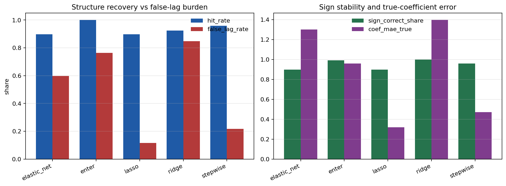

##### 2. Ridge не решает задачу структурной очистки

Самый однозначный результат подраздела 2.4.6 связан с Ridge. Хотя метод почти всегда сохраняет правильный знак истинных коэффициентов (`sign_correct_share = 1.000`), он практически не очищает лаговое пространство:

- среднее число ложных лагов равно $7.80$;
- `false_lag_rate = 0.848`;
- `coef_mae_true = 1.396` — худшее значение среди всех методов.

Следовательно, в задачах интерпретации памяти Ridge полезен как стабилизатор плотной модели, но не как процедура выделения истинной лаговой структуры.

Это принципиальный результат: если цель состоит именно в идентификации физических предикторов, то Ridge не может считаться заменой STEPWISE и тем более прямой режимной диагностики.

##### 3. Lasso оказался сильнейшим средним методом, но не универсальным

Наиболее убедительный выигрыш Lasso даёт в кейсах, где истинная структура проста, а ложные лаги носят в основном комбинаторный характер.

Для `base_a_2_2`:

- `false_lag_rate = 0.000` у Lasso;
- `false_lag_rate = 0.720` у STEPWISE;
- `false_lag_rate = 0.885` у ENTER;
- `false_lag_rate = 0.902` у Ridge.

Для `delay_g_1_25`:

- Lasso и STEPWISE обе дают идеально чистую структуру (`false_lag_rate = 0.000`, `hit_rate = 1.000`);
- ENTER и Ridge сохраняют от $4.98$ до $5.85$ ложных лагов в среднем;
- Elastic Net тоже лучше плотных методов, но хуже Lasso (`false_lag_rate = 0.136`).

Для `mixed_q_1_5_gamma_0_5` Lasso тоже даёт сильный результат:

- `hit_rate = 1.000`;
- `false_lag_rate = 0.125`;
- `coef_mae_true = 0.028`.

То есть в умеренном mixed-режиме регуляризация действительно может улучшать структурную читаемость окна.

##### 4. В трудном mixed-цикле Lasso уже начинает терять истинную память

Именно здесь гипотеза D получила самое содержательное подтверждение. Для кейса `mixed_q_2_8_gamma_0_5` результаты таковы:

- у STEPWISE: `hit_rate = 0.865`, `false_lag_rate = 0.135`, `coef_mae_true = 0.283`;
- у Lasso: `hit_rate = 0.577`, `false_lag_rate = 0.464`, `coef_mae_true = 1.250`;
- у ENTER: `hit_rate = 1.000`, но `false_lag_rate = 0.661`;
- у Elastic Net: `hit_rate = 0.577`, `false_lag_rate = 0.717`.

Следовательно, в смешанном циклическом режиме агрессивная регуляризация уже не очищает структуру без потерь, а начинает выбрасывать один из двух физических предикторов. Именно этот случай и делает вывод подраздела 2.4.6 нетривиальным: Lasso не является просто "лучшим Stepwise", а меняет тип ошибки.

Эта развилка особенно хорошо видна на следующем рисунке.

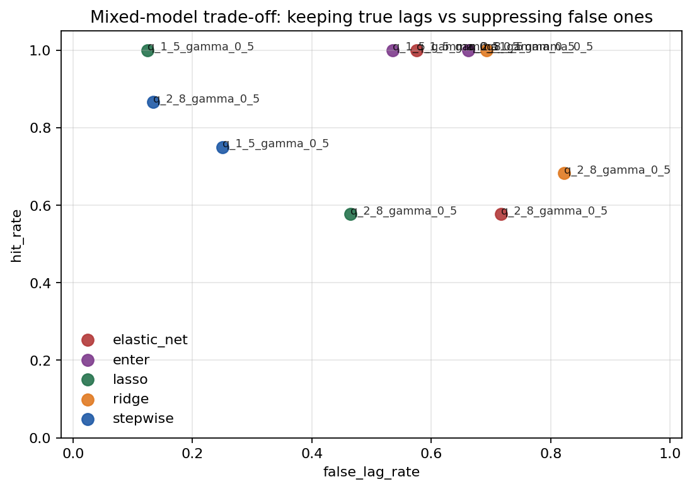

##### 5. STEPWISE остаётся наиболее сбалансированным методом в сложных двухфакторных окнах

Хотя по средним значениям Lasso оказался чище, STEPWISE сохранил важное преимущество в hardest mixed-window regime: он чаще удерживает обе физически значимые переменные одновременно.

Это видно и по средним метрикам, и по кейсовой сводке.

| Кейс | Метод | `hit_rate` | `false_lag_rate` | `coef_mae_true` |
| --- | --- | ---: | ---: | ---: |
| `base_a_2_2` | Lasso | $1.000$ | $0.000$ | $0.031$ |
| `base_a_2_2` | STEPWISE | $1.000$ | $0.720$ | $1.605$ |
| `delay_g_1_25` | Lasso | $1.000$ | $0.000$ | $0.009$ |
| `delay_g_1_25` | STEPWISE | $1.000$ | $0.000$ | $\approx 0$ |
| `mixed_q_1_5_gamma_0_5` | Lasso | $1.000$ | $0.125$ | $0.028$ |
| `mixed_q_1_5_gamma_0_5` | STEPWISE | $0.750$ | $0.250$ | $0.281$ |
| `mixed_q_2_8_gamma_0_5` | Lasso | $0.577$ | $0.464$ | $1.250$ |
| `mixed_q_2_8_gamma_0_5` | STEPWISE | $0.865$ | $0.135$ | $0.283$ |

Именно по этой причине итог подраздела 2.4.6 нельзя свести к утверждению "Lasso лучше". Верно более аккуратное утверждение:

- при простой истинной структуре Lasso действительно очень эффективен;
- при смешанной памяти и конкурирующих истинных факторах STEPWISE часто оказывается надёжнее;
- плотные методы ENTER и Ridge структурно проигрывают в большинстве проблемных режимов.

Следующий рисунок показывает разницу по кейсам более наглядно.

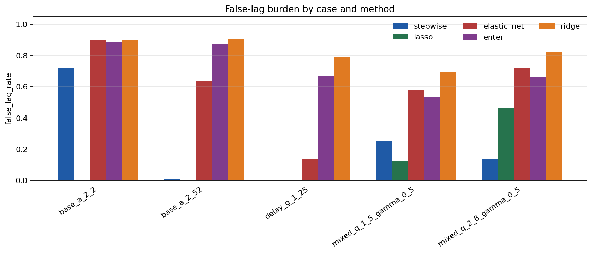

##### 6. Режимная зависимость никуда не исчезает после добавления регуляризации

Отдельно был проверен вопрос, меняется ли картина по мере движения окна вдоль траектории.

| Стадия | Метод | `false_lag_rate` | `hit_rate` | `coef_mae` |
| --- | --- | ---: | ---: | ---: |
| early | STEPWISE | $0.132$ | $0.950$ | $0.060$ |
| middle | STEPWISE | $0.257$ | $0.971$ | $0.114$ |
| late | STEPWISE | $0.279$ | $0.956$ | $0.129$ |
| early | Lasso | $0.102$ | $0.938$ | $0.061$ |
| middle | Lasso | $0.125$ | $0.875$ | $0.097$ |
| late | Lasso | $0.125$ | $0.875$ | $0.097$ |

Даже после регуляризации поздние и средние окна остаются сложнее ранних. STEPWISE на поздних стадиях начинает быстрее наращивать ложные лаги. Lasso смягчает этот рост, но одновременно теряет часть истинной структуры.

Этот эффект показан на следующем рисунке.

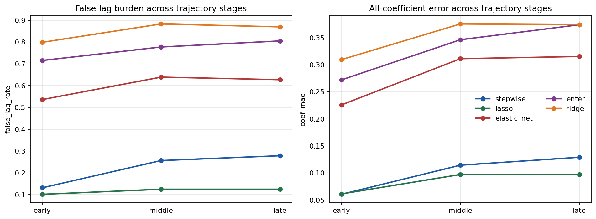

Следовательно, регуляризация не отменяет уже установленного в подразделах 2.4.2, 2.4.3 и 2.4.5 факта: режимная зависимость окна остаётся фундаментальной.

##### 7. Высокий `validation_r2` не решает проблему интерпретации

Контрольные метрики качества подгонки показали важный методологический эффект:

- у Elastic Net `validation_r2 = 0.998`;
- у Ridge `validation_r2 = 0.948`;
- у STEPWISE `validation_r2 \approx 1.000`;
- у Lasso `validation_r2 = 0.887`.

Несмотря на это, именно Ridge и Elastic Net дают очень плотную и засорённую структуру. Следовательно, даже добавление регуляризации не делает $R^2$ или hold-out fit достаточным критерием для чтения лаговой структуры. Этот вывод полностью согласуется с общей логикой всей главы: качество подгонки и структурная интерпретируемость — не одно и то же.

#### Интерпретация результатов

Подраздел 2.4.6 дал три основных научных вывода.

Во-первых, регуляризация действительно может быть полезна как санитарный контроль против ложных лагов. В этом смысле Lasso — не косметическое дополнение, а реальный рабочий инструмент.

Во-вторых, этот инструмент не универсален. Как только истинная структура становится двухфакторной и оба фактора начинают конкурировать в циклическом режиме, Lasso и Elastic Net уже могут разрушать сам предмет интерпретации, зануляя один из содержательных лаговых эффектов.

В-третьих, плотные процедуры шринкажа в данной задаче оказываются слабее, чем могло бы казаться по учебниковой статистической интуиции. Ridge хорошо стабилизирует знак, но почти не решает задачу отбора. Elastic Net в среднем оказался слишком близок к Ridge и не дал надёжного промежуточного решения.

Из этого следует прагматический методологический вывод:

- если цель состоит в очистке простой структуры, Lasso полезен как контрольный метод;
- если нужно сохранить конкурирующие истинные факторы в mixed-режиме, STEPWISE остаётся более надёжным;
- ENTER и Ridge стоит читать не как процедуры отбора, а как плотные референсные модели;
- ни один из этих методов не освобождает от предварительной режимной диагностики, введённой в подразделах 2.4.3 и 2.4.5.

#### Карта применимости методов

В качестве итогового методического вывода подраздел 2.4.6 позволяет зафиксировать компактную карту применимости.

| Ситуация | Предпочтительный контур | Интерпретация |
| --- | --- | --- |
| Простая структура с одним доминирующим фактором | Lasso | Лучший санитарный фильтр против ложных лагов при сохранении простой физической структуры |
| Сложная mixed-структура с конкурирующими истинными факторами | STEPWISE | Чаще сохраняет оба содержательных предиктора, даже если допускает часть статистического мусора |
| Плотный референсный baseline | ENTER или Ridge | Полезны как фоновые модели для сравнения, но не как основной инструмент чтения структуры |
| Любой регрессионный анализ короткого окна | Сначала подразделы 2.4.3 и 2.4.5, затем выбор метода | Сначала определяется режим окна и его интерпретируемость, и только затем выбирается конкретная процедура отбора |

Подраздел 2.4.6 непосредственно встраивается в уже полученный режимно-адаптивный алгоритм анализа:

1. подраздел 2.4.3 выбирает тип инструмента по режиму окна;
2. подраздел 2.4.5 проверяет, есть ли в окне вообще интерпретируемый регрессионный сигнал;
3. только затем выбирается конкретный регрессионный контур: Lasso, STEPWISE или плотная референсная модель.

#### Основной результат подраздела

1. Проверялось, способны ли регуляризованные методы улучшить структурную интерпретируемость коротких окон по сравнению с ENTER и STEPWISE.
2. Получено, что Lasso лучше других очищает простую структуру от статистического мусора, но в сложных mixed-режимах может терять часть истинной памяти; Ridge и Elastic Net универсального решения не дают.
3. Практически это означает, что регуляризация полезна как дополнительный контрольный слой, но не как самостоятельная замена routing и фильтра интерпретируемости.
4. В общей логике главы подраздел 2.4.6 уточняет, какой именно регрессионный контур выбирать после диагностики режима и проверки интерпретируемости окна.

### 2.4.7. Ортогонализация и PCA лагового пространства как вспомогательный диагностический контур

#### Постановка задачи

После результатов подразделов 2.4.2-2.4.6 стало ясно, что в коротких окнах одна из главных технических проблем связана с почти вырожденной геометрией лагового пространства. Соседние лаги в циклических и предтурбулентных режимах оказываются настолько близки друг к другу, что:

- коэффициенты ENTER-регрессии распределяются по большому числу взаимозаменяемых переменных;
- STEPWISE начинает подхватывать фантомные лаги;
- интерпретация отдельных коэффициентов зависит не только от физической структуры процесса, но и от способа параметризации коррелированного пространства признаков.

На этом фоне естественно проверить, помогает ли переход к ортогональным компонентам. Исходная гипотеза формулировалась так:

> если лаговое пространство сильно мультиколлинеарно, то переход к ортогональным компонентам должен уменьшать число ложных включений, но ценой потери физической интерпретируемости коэффициентов.

Проведённый эксперимент подтвердил эту гипотезу лишь частично. Более точный итоговый вывод подраздела 2.4.7 оказался таким:

> PCA действительно почти полностью устраняет численную неустойчивость и резко сжимает размерность лагового пространства, но это не приводит к улучшению структурной интерпретации в исходных лагах. После обратной проекции коэффициенты остаются плотными, масса влияния уходит с истинных предикторов на смешанные комбинации соседних лагов, а сами компоненты оказываются физически неоднозначными.

Именно в таком виде подраздел 2.4.7 методологически важен для всей главы: он показывает, что ортогонализация полезна как численный и диагностический инструмент, но не как прямая замена интерпретируемой структурной регрессии.

#### Математическая схема эксперимента

##### Исходная лаговая регрессия

Как и в предыдущих подразделах серии 2.4.1-2.4.6, в каждом окне анализировался темп прироста

$\omega_n = \frac{X_{n+1} - X_n}{X_n}$,

а вектор регрессоров имел вид

$X = (X_n, Lag_1, \ldots, Lag_{10})$.

Для исходного пространства в качестве базового сравнения использовалась ENTER-регрессия. Для неё вычислялись стандартизованные коэффициенты $\beta_j$, так как именно они наиболее корректно отражают распределение влияния между коррелированными лагами.

##### Переход к главным компонентам

Сначала лаговое пространство стандартизовалось на обучающей части окна:

$\tilde X_j = \frac{X_j - \bar X_j}{s_{X_j}}$.

Затем на матрице $\tilde X$ строилось разложение PCA:

$Z = \tilde X P$,

где столбцы матрицы $P$ являются ортонормированными направлениями главных компонент, а $Z$ содержит компонентные оценки.

Число компонент $k$ выбиралось как минимальное значение, для которого выполнялось условие

$\sum_{j=1}^{k}\lambda_j \bigg/ \sum_{j=1}^{p}\lambda_j \ge \rho$,

где $\lambda_j$ обозначает объяснённую дисперсию $j$-й компоненты. В базовом прогоне использовалось $\rho = 0.95$, а дополнительно был выполнен sweep по $\rho \in \{0.80, 0.90, 0.95, 0.99\}$.

После этого оценивалась компонентная регрессия

$\tilde \omega_n = \alpha + \sum_{j=1}^{k}\gamma_j PC_j + \varepsilon_n$.

##### Обратная проекция в исходные лаги

Чтобы сопоставить PCR с исходной структурой памяти, коэффициенты возвращались в лаговое пространство:

$\beta^{PCR} = P_k \gamma$.

Именно этот шаг принципиален для подраздела 2.4.7. Если ортогонализация действительно улучшает структурную интерпретацию, то после обратной проекции масса коэффициентов должна концентрироваться на физических предикторах $X_n$ и $Lag_1$. Если же компоненты представляют собой лишь смешанные линейные комбинации соседних лагов, то обратная проекция будет плотной и слабой с точки зрения физического смысла.

##### Метрики

Для каждого окна вычислялись:

- `validation_r2` и `validation_mae` на последней пятой части окна;
- `true_mass_share` — доля суммарной абсолютной массы коэффициентов, приходящаяся на истинные структурные предикторы;
- `support_90` — минимальное число переменных, необходимое для накопления $90\%$ абсолютной массы коэффициентов;
- `pairwise_score` — насколько истинные предикторы ранжируются выше ложных;
- `false_lag_rate` и `hit_rate` после пороговой активизации коэффициентов по правилу $|\beta_j| \ge 0.05$;
- `$cond(X_{scaled})$` и `$cond(PC)$` как характеристики численной устойчивости;
- `component_dominance` — средняя доля абсолютной массы, приходящаяся на самый крупный loading в каждой retained component;
- `component_true_loading_share` — средняя доля нагрузки retained components на физически значимые предикторы.

Последние две метрики вводились специально для подраздела 2.4.7. Они отвечают уже не на вопрос о качестве подгонки, а на вопрос о физической читаемости самих компонент.

#### Дизайн вычислительного эксперимента

Для подраздела 2.4.7 были взяты те режимы, где проблема мультиколлинеарности наиболее содержательна:

- `base_a_2_2`;
- `base_a_2_52`;
- `delay_g_1_25`;
- `mixed_q_1_5_gamma_0_5`;
- `mixed_q_2_8_gamma_0_5`.

Во всех случаях строились траектории длины $180$. По ним скользило окно длины $W = 25$. В каждом окне:

- формировалось лаговое пространство до `Lag_10`;
- вырожденные окна с почти нулевой вариацией отбрасывались;
- первые $80\%$ наблюдений использовались для обучения, последние $20\%$ — для контроля;
- сравнивались ENTER-регрессия в исходных лагах и PCR с выбранным числом компонент.

В итоговую выборку вошло $642$ информативных окна.

#### Основные результаты

##### 1. PCA почти уничтожает проблему кондиционирования и резко сжимает размерность

По этой части гипотеза подтвердилась очень сильно. В среднем по всем окнам:

- исходное стандартизованное лаговое пространство имело среднюю обусловленность порядка $1.63 \cdot 10^{113}$;
- компонентное пространство после PCA имело среднюю обусловленность всего $2.61$;
- для сохранения $98.6\%$ объяснённой дисперсии в среднем хватало $2.38$ компонент вместо $11$ исходных регрессоров.

Это означает, что с чисто численной точки зрения ортогонализация действительно решает проблему почти сингулярной лаговой матрицы.

Сводка по основным средним метрикам приведена в таблице.

| Метод | val R2 | true mass | support90 | pair score | false lags |
| --- | ---: | ---: | ---: | ---: | ---: |
| ENTER | $0.444$ | $0.423$ | $7.153$ | $0.839$ | $0.786$ |
| PCR, $\rho = 0.95$ | $0.082$ | $0.162$ | $8.098$ | $0.588$ | $0.871$ |

Следующий рисунок показывает этот компромисс наглядно.

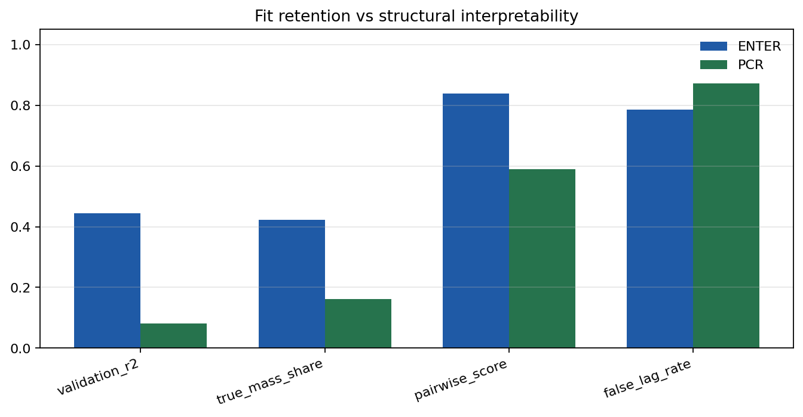

##### 2. Численная стабилизация не превратилась в структурное улучшение

Именно здесь находится главный результат подраздела 2.4.7. Несмотря на почти полное устранение мультиколлинеарности, обратная проекция PCR в лаговое пространство оказалась структурно слабее ENTER почти по всем содержательным метрикам:

- `true_mass_share` падает с $0.423$ до $0.162$;
- `pairwise_score` падает с $0.839$ до $0.588$;
- `support_90` растёт с $7.153$ до $8.098$;
- `false_lag_rate` не уменьшается, а растёт с $0.786$ до $0.871$.

Следовательно, PCA действительно убирает проблему почти совпадающих столбцов, но не возвращает физическую структуру памяти. После обратной проекции лаговый вектор остаётся ещё более размазанным, чем у исходной ENTER-регрессии.

Особенно показательно, что и `hit_rate` у PCR снижается с $0.999$ до $0.883$: ортогонализация не просто делает интерпретацию менее прозрачной, но и чаще уводит часть массы от истинных факторов.

Связь между устранением плохой кондиционности и сохранением плотной интерпретации видна на следующем рисунке.

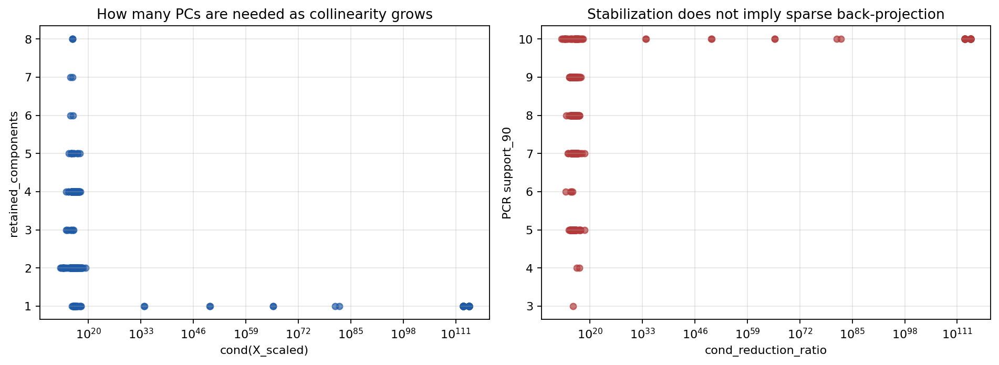

##### 3. В трудном mixed-цикле PCR даже улучшает fit, но разрушает физический смысл коэффициентов

Самый сильный кейс подраздела 2.4.7 — `mixed_q_2_8_gamma_0_5`. Для него:

- у ENTER: `validation_r2 = 0.960`, `true_mass_share = 0.613`, `pairwise_score = 0.992`;
- у PCR: `validation_r2 = 0.986`, `true_mass_share = 0.150`, `pairwise_score = 0.350`.

Это принципиальный результат. PCR даёт чуть лучший hold-out fit, но почти полностью теряет физическую читаемость лаговой структуры. Именно этот случай лучше всего иллюстрирует, почему максимум $R^2$ не может считаться достаточным критерием выбора метода.

По кейсам картина выглядит так.

Для компактности используются краткие обозначения кейсов: `b2.2`, `b2.52`, `d1.25`, `m1.5+`, `m2.8+`.

| Кейс | ENTER R2 | PCR R2 | ENTER mass | PCR mass | ENTER pair | PCR pair | PCR comps |
| --- | ---: | ---: | ---: | ---: | ---: | ---: | ---: |
| `b2.2` | $1.000$ | $1.000$ | $0.122$ | $0.094$ | $0.403$ | $0.132$ | $1.110$ |
| `b2.52` | $1.000$ | $0.984$ | $0.345$ | $0.183$ | $0.951$ | $0.900$ | $2.090$ |
| `d1.25` | $-1.263$ | $-2.765$ | $0.592$ | $0.206$ | $1.000$ | $0.969$ | $4.032$ |
| `m1.5+` | $1.000$ | $0.950$ | $0.558$ | $0.249$ | $0.904$ | $0.609$ | $2.682$ |
| `m2.8+` | $0.960$ | $0.986$ | $0.613$ | $0.150$ | $0.992$ | $0.350$ | $2.258$ |

Даже там, где PCR не обрушивает fit, он почти нигде не улучшает физическую концентрацию коэффициентов на истинных предикторах.

##### 4. Увеличение $\rho$ возвращает fit, но не возвращает интерпретацию

Отдельно был проверен вопрос, не связан ли плохой результат PCR лишь с тем, что для основной конфигурации взято слишком мало компонент. Для этого был выполнен sweep по $\rho$.

| rho | Число комп. | var share | val R2 | true mass | support90 | false lags |
| --- | ---: | ---: | ---: | ---: | ---: | ---: |
| $0.80$ | $1.579$ | $0.946$ | $-1.333$ | $0.122$ | $8.897$ | $0.886$ |
| $0.90$ | $1.866$ | $0.964$ | $-1.100$ | $0.128$ | $8.732$ | $0.884$ |
| $0.95$ | $2.383$ | $0.986$ | $0.082$ | $0.162$ | $8.098$ | $0.871$ |
| $0.99$ | $3.202$ | $0.998$ | $0.834$ | $0.189$ | $8.344$ | $0.877$ |

Здесь виден очень важный эффект:

- по мере роста $\rho$ fit действительно улучшается;
- однако `true_mass_share` растёт лишь с $0.122$ до $0.189$;
- `support_90` остаётся высоким;
- `false_lag_rate` почти не меняется и держится около $0.87$.

Иначе говоря, увеличение числа retained components возвращает качество подгонки, но не возвращает физически локализованную интерпретацию. Это сильный аргумент против наивной идеи, что PCA лишь "недобрал" нужное число компонент.

Этот результат показан на следующем рисунке.

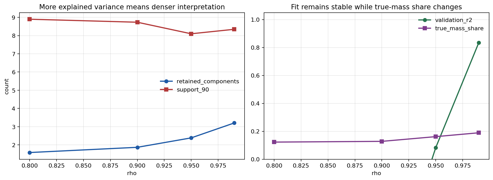

##### 5. Сами компоненты оказываются физически смешанными

Даже без обратной проекции интерпретировать retained components как отдельные лаги не получается. В среднем:

- `component_dominance = 0.128`;
- `component_true_loading_share = 0.117`.

Это означает, что в одной retained component крупнейший loading в среднем несёт лишь около $12.8\%$ абсолютной массы, а доля нагрузки именно на физически значимые предикторы составляет около $11.7\%$. Следовательно, каждая компонента является смесью многих соседних лагов, а не "очищенной" версией одного содержательного фактора.

Для hardest mixed-case `mixed_q_2_8_gamma_0_5` это видно особенно отчётливо. В первой компоненте наибольшие loading shares распределены так:

| Переменная | `loading_share` |
| --- | ---: |
| `Lag_3` | $0.119$ |
| `X_n` | $0.118$ |
| `Lag_6` | $0.116$ |
| `Lag_9` | $0.113$ |
| `Lag_1` | $0.112$ |
| `Lag_4` | $0.111$ |

То есть первая компонента не соответствует ни $X_n$, ни $Lag_1$, а представляет собой почти равномерную смесь нескольких фазовых сдвигов цикла.

Следующий рисунок показывает среднюю картину нагрузок в этом кейсе.

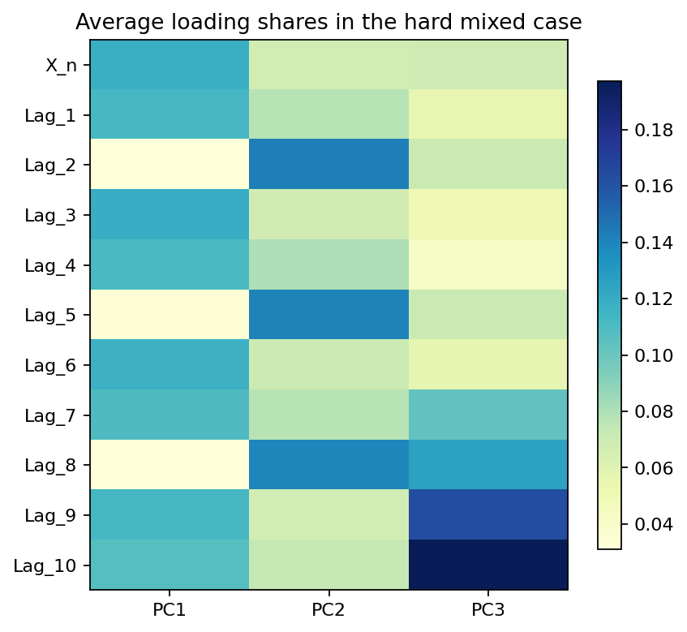

#### Интерпретация результатов

Подраздел 2.4.7 дал три основных вывода.

Во-первых, ортогонализация действительно работает как численный стабилизатор. Если бы задача состояла только в том, чтобы убрать сингулярность лаговой матрицы и перейти к компактному низкоразмерному описанию, то PCA оказался бы очень сильным инструментом.

Во-вторых, эта численная победа не означает победы содержательной. Главные компоненты организуются по направлениям максимальной дисперсии, а не по физическому смыслу механизма роста. Поэтому после обратной проекции в лаги структурная картина не очищается, а размывается ещё сильнее.

В-третьих, PCR хорошо демонстрирует фундаментальный тезис всей главы: хорошие свойства в одной системе координат не гарантируют интерпретируемости в содержательной системе координат. В подразделе 2.4.7 это проявилось особенно жёстко: conditioning почти идеален, а физическая структура памяти восстанавливается хуже.

#### Связь подраздела 2.4.7 с подразделами 2.4.3 и 2.4.5

Подраздел 2.4.7 не предлагает новый основной способ чтения лаговой структуры, а уточняет, в каком месте маршрута полезна ортогонализация.

- если окно относится к классу `low-dispersion`, что фиксируется в подразделе 2.4.5, регрессионную интерпретацию вообще не следует читать;
- если окно проходит фильтр информативности, но классифицируется как `collinearity-heavy`, PCA можно использовать как индикатор маломерности и численной вырожденности лагового пространства;
- однако содержательная интерпретация должна строиться не через PCR как конечную модель, а через связку подразделов 2.4.3, 2.4.5, 2.4.4 и 2.4.6: сначала режимная диагностика, затем проверка интерпретируемости окна, затем чтение структуры через `Beta`, `B_\Sigma`, STEPWISE или Lasso.

Даже после подтверждения маломерности окна переход в ортогональные координаты остаётся лишь вспомогательным шагом.

#### Научный и методологический итог подраздела

1. Проверялось, может ли ортогонализация лагового пространства уменьшить ложные структурные включения и улучшить интерпретацию короткой регрессии.
2. Получено, что PCA почти полностью снимает численную неустойчивость и сжимает размерность, но не улучшает физическую интерпретацию после возврата к исходным лагам.
3. Практически это означает, что PCA следует использовать как диагностический контур численной вырожденности и маломерности, а не как основной способ чтения памяти.
4. В общей логике главы подраздел 2.4.7 усиливает уже построенный маршрут, показывая пределы ортогонализации как средства содержательной интерпретации.

### 2.4.8. p-value, Stepwise и критерий интерпретируемости короткого окна

#### Постановка задачи

После результатов подразделов 2.4.2, 2.4.3, 2.4.5 и 2.4.6 стало ясно, что следующая естественная проверка должна быть методически более скромной. Речь идёт не о новом способе идентификации, а о простом вопросе: можно ли решить проблему ложных лагов простой настройкой порога значимости в STEPWISE.

Изначальная гипотеза подраздела 2.4.8 формулируется так:

> изменение порога значимости в Stepwise меняет количество ложных лагов и пропусков истинных предикторов, но не устраняет сам механизм ложной структуры; следовательно, $p$-value является только регулятором жёсткости отбора, а не заменой режимной диагностики и критерия интерпретируемости окна.

Эта гипотеза была дополнительно усилена замечаниями из подраздела 2.4.5. Если окно само по себе неинтерпретируемо, то ослабление или ужесточение $p$-порога может лишь перераспределять форму ошибки:

- либо появляются лишние лаги;
- либо модель становится пустой;
- либо сохраняется высокая вероятность пропуска физически значимого предиктора.

Поэтому подраздел 2.4.8 сознательно построен как контрольный sweep по $p$-порогам, а не как самостоятельная новая архитектура метода.

#### Математическая схема

Во всех окнах, как и ранее, рассматривался темп прироста

$\omega_n = \frac{X_{n+1} - X_n}{X_n}$,

а вектор объясняющих переменных имел вид

$X = (X_n, Lag_1, \ldots, Lag_{10})$.

Для STEPWISE использовался стандартный цикл включения и исключения переменных по $p$-value. Чтобы процедура оставалась устойчивой и не колебалась между включением и немедленным удалением одного и того же признака, использовалась небольшая гистерезисная пара порогов:

$p_{in} = \alpha, \qquad p_{out} = \min(1.5\alpha,\ 0.20)$.

Проверялись три уровня жёсткости:

- $\alpha = 0.01$;
- $\alpha = 0.05$;
- $\alpha = 0.10$.

В каждом окне вычислялись:

- `false_lag_rate` — доля ложных лагов в выбранной поддержке;
- `miss_rate = 1 - hit_rate` — доля пропущенной истинной структуры;
- `no_model_share` — доля пустых моделей;
- `exact_recovery` — доля окон, где выбранное множество предикторов в точности совпало с истинным;
- `mean_selected_count` — средний размер активной поддержки.

Подраздел 2.4.8 был сознательно связан с подразделом 2.4.5. Каждое окно предварительно относилось к одному из трёх классов интерпретируемости:

- `low_dispersion`, если $Var(\omega) \le 2.4 \cdot 10^{-8}$;
- `collinearity_heavy`, если $Var(\omega)$ уже не мало, но $cond(X_{scaled}) \ge 7 \cdot 10^{16}$;
- `interpretable` во всех остальных случаях.

Тем самым подраздел 2.4.8 проверяет не просто, что делает $\alpha$, а может ли настройка $\alpha$ заменить уже найденный критерий интерпретируемости.

#### Дизайн эксперимента

В sweep вошли девять режимов, уже использованных в предыдущих подразделах серии 2.4.1-2.4.7:

- `base_a_0_8`, `base_a_2_2`, `base_a_2_52`;
- `delay_g_0_2`, `delay_g_0_8`, `delay_g_1_25`;
- `mixed_q_1_5_gamma_0_5`, `mixed_q_2_8_gamma_0_5`, `mixed_q_1_5_gamma_neg_0_2`.

Во всех случаях строились траектории длины $180$, по которым скользило окно длины $W = 25$. Внутри каждого окна строилось лаговое пространство до `Lag_10`, а затем одна и та же STEPWISE-процедура запускалась для трёх значений $\alpha$.

Итоговая выборка составила:

- $1395$ окон для каждого значения $\alpha$;
- $4185$ stepwise-прогонов всего.

#### Основные результаты

##### 1. Изменение $\alpha$ действительно меняет жёсткость отбора, но не радикально

Общая сводка по всем окнам имеет вид:

| $\alpha$ | false lags | miss | no model | exact | selected |
| --- | ---: | ---: | ---: | ---: | ---: |
| $0.01$ | $0.240$ | $0.165$ | $0.131$ | $0.568$ | $3.368$ |
| $0.05$ | $0.281$ | $0.162$ | $0.130$ | $0.487$ | $3.482$ |
| $0.10$ | $0.307$ | $0.157$ | $0.130$ | $0.437$ | $3.558$ |

Картина здесь очень характерна:

- при ослаблении порога $\alpha$ ложные лаги возрастают с $0.240$ до $0.307$;
- `miss_rate` уменьшается лишь с $0.165$ до $0.157$;
- доля пустых моделей почти не меняется;
- `exact_recovery` монотонно падает с $0.568$ до $0.437$.

То есть настройка $p$-порога действительно регулирует жёсткость отбора, но улучшение одной метрики оплачивается ухудшением другой. Уже на этом уровне видно, что $\alpha$ не решает сам механизм ложных структурных включений.

Это соотношение показано на рисунке.

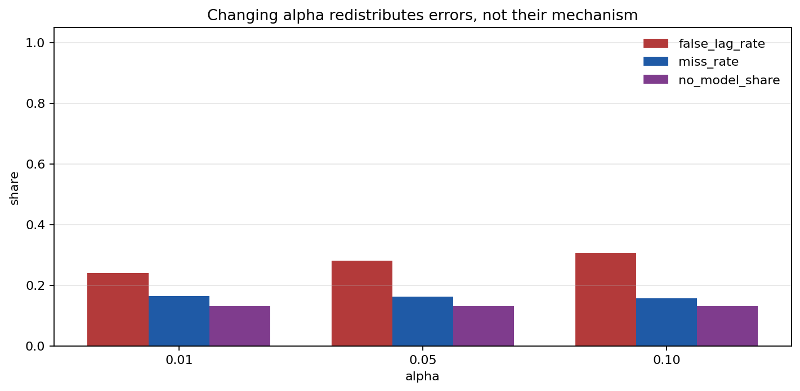

##### 2. Критерий интерпретируемости окна важнее, чем настройка $\alpha$

Ключевой результат подраздела 2.4.8 возникает после разбиения окон по классу интерпретируемости:

Для компактности используются сокращения классов: `interp` = интерпретируемое окно, `collin` = `collinearity_heavy`, `low disp` = `low_dispersion`.

| $\alpha$ | Класс окна | false lags | miss | no model | exact | selected |
| --- | --- | ---: | ---: | ---: | ---: | ---: |
| $0.01$ | `interp` | $0.043$ | $0.035$ | $0.000$ | $0.905$ | $1.414$ |
| $0.05$ | `interp` | $0.113$ | $0.032$ | $0.000$ | $0.763$ | $1.578$ |
| $0.10$ | `interp` | $0.157$ | $0.027$ | $0.000$ | $0.677$ | $1.688$ |
| $0.01$ | `collin` | $0.755$ | $0.002$ | $0.000$ | $0.128$ | $9.489$ |
| $0.05$ | `collin` | $0.762$ | $0.002$ | $0.000$ | $0.115$ | $9.502$ |
| $0.10$ | `collin` | $0.762$ | $0.002$ | $0.000$ | $0.115$ | $9.502$ |
| $0.01$ | `low disp` | $0.290$ | $0.443$ | $0.398$ | $0.265$ | $3.357$ |
| $0.05$ | `low disp` | $0.302$ | $0.439$ | $0.396$ | $0.246$ | $3.441$ |
| $0.10$ | `low disp` | $0.313$ | $0.435$ | $0.396$ | $0.226$ | $3.504$ |

Именно эта таблица даёт главный методологический смысл подраздела:

- в интерпретируемых окнах жёсткий порог $\alpha = 0.01$ действительно полезен: `exact_recovery = 0.905`, а ложные лаги минимальны;
- в `collinearity_heavy` окнах любой $\alpha$ почти бесполезен: `false_lag_rate` стабильно около $0.76$, поддержка почти максимальна, а точное восстановление структуры держится лишь на уровне $0.11$-$0.13$;
- в `low_dispersion` окнах никакая настройка $\alpha$ не лечит проблему: около $40\%$ окон остаются пустыми, а `miss_rate` около $0.44$.

Иначе говоря, сначала важен ответ на вопрос, можно ли вообще читать это окно, и только потом — насколько жёстко запускать отбор по $p$-value.

Этот результат виден и на следующем рисунке.

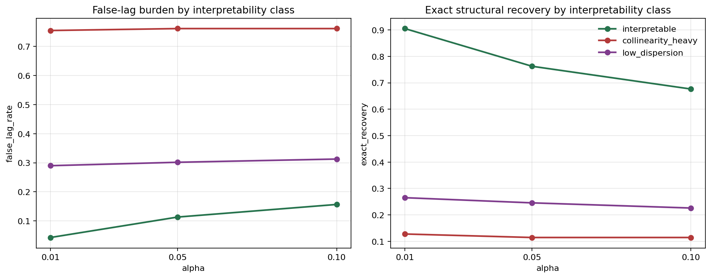

##### 3. Реакция на $\alpha$ сильно зависит от типа модели

Средняя картина по моделям такова:

| $\alpha$ | Модель | false lags | miss | no model | exact |
| --- | --- | ---: | ---: | ---: | ---: |
| $0.01$ | `base` | $0.269$ | $0.269$ | $0.269$ | $0.424$ |
| $0.05$ | `base` | $0.294$ | $0.269$ | $0.269$ | $0.374$ |
| $0.10$ | `base` | $0.309$ | $0.269$ | $0.269$ | $0.344$ |
| $0.01$ | `delay` | $0.141$ | $0.009$ | $0.004$ | $0.824$ |
| $0.05$ | `delay` | $0.233$ | $0.009$ | $0.004$ | $0.645$ |
| $0.10$ | `delay` | $0.301$ | $0.006$ | $0.004$ | $0.525$ |
| $0.01$ | `mixed` | $0.310$ | $0.216$ | $0.120$ | $0.456$ |
| $0.05$ | `mixed` | $0.316$ | $0.208$ | $0.118$ | $0.441$ |
| $0.10$ | `mixed` | $0.310$ | $0.197$ | $0.118$ | $0.441$ |

Отсюда следуют три разных режима чувствительности:

- для `delay` настройка $\alpha$ заметно влияет на чистоту модели: ложные лаги растут почти вдвое;
- для `base` изменение $\alpha$ влияет слабее, потому что часть окон всё равно относится к низкодисперсионным и почти не поддаётся регрессионному чтению;
- для `mixed` sweep по $\alpha$ почти не меняет картину в целом: часть окон остаётся хорошей, а часть структурно сложной вне зависимости от порога.

Это различие отражено на следующем рисунке.

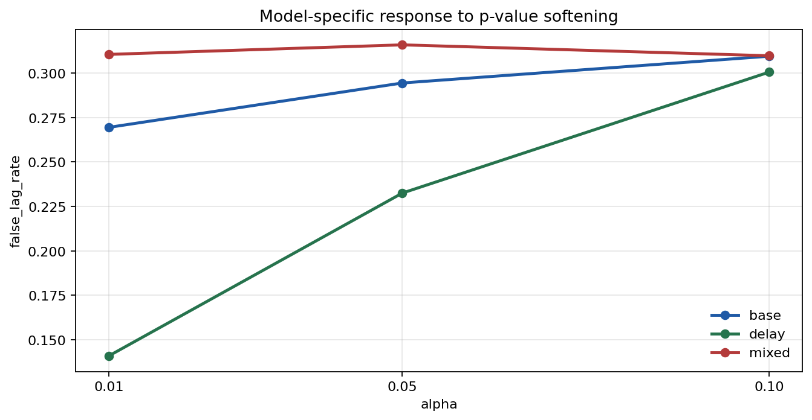

##### 4. Есть режимы, где $\alpha$ действительно важен, но и это не делает его универсальным решением

###### `base_a_2_52`

Это почти полностью интерпретируемый случай (`interpretable_share = 0.994`), и здесь жёсткий порог действительно помогает:

- при $\alpha = 0.01$: `false_lag_rate = 0.016`, `exact_recovery = 0.968`;
- при $\alpha = 0.05$: `false_lag_rate = 0.074`, `exact_recovery = 0.852`;
- при $\alpha = 0.10$: `false_lag_rate = 0.116`, `exact_recovery = 0.768`.

То есть в хороших окнах снижение $\alpha$ даёт реальный выигрыш. Но этот выигрыш основан на том, что окно уже интерпретируемо.

###### `delay_g_1_25`

Этот случай тоже целиком интерпретируем (`interpretable_share = 1.0`), и здесь эффект ещё более нагляден:

- при $\alpha = 0.01$: `false_lag_rate = 0.039`, `exact_recovery = 0.923`;
- при $\alpha = 0.05$: `false_lag_rate = 0.240`, `exact_recovery = 0.529`;
- при $\alpha = 0.10$: `false_lag_rate = 0.388`, `exact_recovery = 0.265`.

Здесь видно, что мягкий порог просто раздувает поддержку, хотя сама истинная структура остаётся однолаговой.

###### `base_a_2_2`

Это уже другой тип проблемы. При всех трёх значениях $\alpha$:

- `false_lag_rate` держится около $0.72$-$0.73$;
- `miss_rate` = $0$;
- `exact_recovery` остаётся только на уровне $0.17$-$0.19$;
- среднее число выбранных предикторов около $8.7$.

Следовательно, здесь $\alpha$ почти ничего не решает: механизм ложных лагов создаётся самой геометрией циклического окна, а не слишком мягким порогом значимости.

###### `mixed_q_1_5_gamma_0_5`

В этом кейсе лишь $12.3\%$ окон вообще интерпретируемы. Поэтому sweep по $\alpha$ почти ничего не меняет:

- `false_lag_rate` остаётся около $0.46$-$0.47$;
- `miss_rate` около $0.49$-$0.53$;
- `no_model_share` около $0.35$;
- `exact_recovery` около $0.08$.

Это один из самых сильных аргументов подраздела 2.4.8: если окно не проходит фильтр интерпретируемости, изменение $p$-порога не превращает его в содержательный объект анализа.

##### 5. Рост числа выбранных предикторов не ведёт к росту точного восстановления структуры

Дополнительная полезная диаграмма показывает, что по мере роста $\alpha$:

- `mean_selected_count` возрастает с $3.37$ до $3.56$;
- `exact_recovery` при этом падает с $0.568$ до $0.437$.

То есть более мягкий порог не "раскрывает скрытую истинную структуру", а главным образом раздувает активную поддержку.

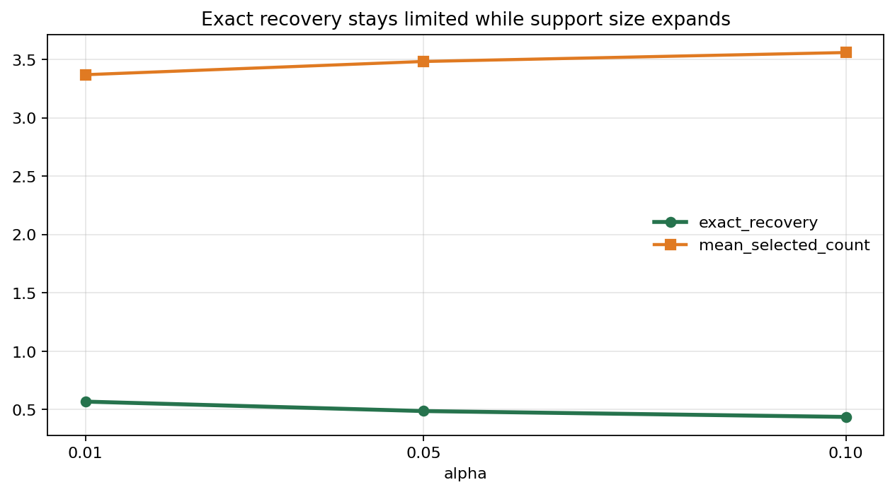

#### Интерпретация результатов

Подраздел 2.4.8 дал три главных результата.

Во-первых, $p$-порог действительно является рабочим регулятором жёсткости. Это не нулевая настройка: в хороших окнах, особенно для `base_a_2_52` и `delay_g_1_25`, переход к $\alpha = 0.01$ заметно уменьшает число ложных лагов.

Во-вторых, этот выигрыш работает только там, где окно уже прошло содержательный фильтр интерпретируемости. В `collinearity_heavy` окнах даже самый жёсткий порог оставляет `false_lag_rate` около $0.76$, а в `low_dispersion` окнах сохраняется высокая вероятность пустой модели и пропуска истинной структуры.

В-третьих, подраздел 2.4.8 показал, что $p$-value не заменяет предыдущие методологические результаты:

- подраздел 2.4.3 отвечает на вопрос, какой тип анализа вообще уместен в данном режиме;
- подраздел 2.4.5 отвечает на вопрос, можно ли интерпретировать короткую регрессию в данном окне;
- подраздел 2.4.8 лишь уточняет, насколько жёстко запускать stepwise-отбор внутри уже допущенного регрессионного контура.

Именно в этом смысле подраздел 2.4.8 методологически важен. Он не даёт нового "чуда-метода", но зато закрывает популярное возражение о том, что проблему ложных лагов можно было бы снять простой заменой $\alpha = 0.05$ на $\alpha = 0.01$. Эксперимент показал, что это неверно.

#### Практическое правило выбора $\alpha$

Из результатов подраздела 2.4.8 следует простое рабочее правило.

- после прохождения окна через связку подразделов 2.4.3 и 2.4.5 базовым режимом для интерпретируемых окон следует считать $\alpha = 0.01$;
- если окно не прошло фильтр, заданный подразделами 2.4.3 и 2.4.5, настройка $\alpha$ не должна рассматриваться как инструмент борьбы с ложными лагами, поскольку в таких окнах проблема определяется не порогом значимости, а самой геометрией данных.

Это правило не отменяет возможной чувствительности анализа к более мягким порогам, но задаёт корректный базовый режим для всей дальнейшей маршрутизации методов.

#### Научный и методологический итог подраздела

1. Проверялось, может ли настройка $\alpha$ в Stepwise заменить уже построенную маршрутизацию короткого окна.
2. Получено, что более жёсткий порог действительно помогает в хороших окнах, но не устраняет механизм ошибки в low-dispersion и collinearity-heavy режимах.
3. Практически это означает, что $\alpha$ является лишь регулятором жёсткости отбора и должен настраиваться только после прохождения окна через подразделы 2.4.3 и 2.4.5.
4. В общей логике главы подраздел 2.4.8 закрывает последнее естественное возражение и фиксирует итоговую схему анализа: режим, интерпретируемость, выбор контура и только затем чтение lag-структуры.

## 2.5. ЗАКЛЮЧЕНИЕ И ОБЩИЕ ВЫВОДЫ ПО РЕЗУЛЬТАТАМ МОДЕЛИРОВАНИЯ

Проведённая серия вычислительных экспериментов показала, что задача идентификации нелинейного процесса по коротким временным рядам не сводится к поиску "лучшей" регрессии. Результаты подразделов 2.4.1-2.4.8 последовательно уточнили саму постановку проблемы: необходимо различать восстановление параметров, диагностику режима, проверку интерпретируемости окна и выбор конкретной процедуры чтения лаговой структуры.

Итог главы состоит не только в наборе частных численных результатов, но и в построении целостной методологической схемы анализа. Если на первом этапе исследования было показано, что линейная регрессия действительно улавливает структурную форму нелинейных отображений на длинных траекториях, то серия дополнительных экспериментов позволила установить, в каких условиях этот вывод сохраняется на коротких окнах, где проходят границы интерпретируемости и какие именно ошибки нельзя устранять простой настройкой статистической процедуры.

### От прямой идентификации к режимно-зависимому анализу

Подраздел 2.4.1 показал, что прямая локальная идентификация параметров отображения теоретически возможна и на чистых траекториях действительно восстанавливает структуру базовой и запаздывающей моделей по минимальному числу точек. Однако уже очень слабый шум делает этот подход существенно менее устойчивым, чем структурная регрессия на окне. Следовательно, прямая идентификация не может рассматриваться как универсальная замена регрессионного анализа; её корректное место — локальная структурная диагностика и выявление редких информативных фрагментов.

Подраздел 2.4.2 уточнил следующую границу применимости: даже внутри регрессионного контура результат определяется не только способом отбора, но и соотношением между длиной окна, характерным периодом и размерностью лагового пространства. Из этого следует, что ложные лаги не являются исключительно дефектом Stepwise как алгоритма; во многом они порождаются самой геометрией короткого окна.

Подраздел 2.4.3 превратил этот вывод в практическое правило: перед запуском регрессии необходимо сначала определить тип режима. Эксперимент показал, что предварительная диагностика полезна прежде всего не как средство "вылечить" ложные лаги во всех случаях, а как способ отсечь окна, где выбранный инструмент заранее бессодержателен.

### Границы интерпретируемости короткого окна

Подразделы 2.4.4 и 2.4.5 показали, что после выбора регрессионного контура возникает вторая задача: понять, можно ли вообще интерпретировать коэффициенты данного окна. Стандартизованные $\beta$-коэффициенты в среднем лучше обычных $B$ восстанавливают структурное ядро модели в проблемных окнах, однако и они содержательны только там, где окно не вырождено.

Ключевой результат подраздела 2.4.5 состоит в том, что деградация окна имеет по меньшей мере два качественно разных механизма: исчезновение локального сигнала и коллинеарное разрушение лаговой структуры. Наиболее сильным диагностическим индикатором оказалось падение $Var(\omega)$, а стандартизованная кондиционность $\kappa(\widetilde{X})$ стала содержательно важной после отделения низкодисперсионных окон. Тем самым было получено рабочее правило: сначала проверяется, есть ли в окне ненулевой информативный сигнал, затем оценивается его геометрическая интерпретируемость, и только после этого допустимо читать лаговую структуру.

Этот результат существенно уточняет логику интерпретации коротких рядов. Изменение коэффициентов от окна к окну нельзя автоматически трактовать как структурный сдвиг процесса: оно может быть следствием выхода траектории на плато, потери дисперсии или локальной взаимозаменяемости лагов.

### Что можно и чего нельзя ожидать от статистических улучшений

Подраздел 2.4.6 показал, что регуляризация полезна, но не универсальна. Lasso действительно лучше других методов очищает простую структуру от статистического мусора, однако в сложных mixed-режимах он может терять часть истинной памяти. STEPWISE чаще сохраняет конкурирующие содержательные факторы, но платит за это большей чувствительностью к ложным включениям. ENTER и Ridge полезны как плотные референсные модели, а не как основной инструмент структурного чтения.

Подраздел 2.4.7 дал важный отрицательный результат, который сам по себе имеет самостоятельную ценность. Переход к PCA почти полностью устраняет численную проблему лагового пространства и резко сокращает его эффективную размерность, однако после обратной проекции физическая интерпретация коэффициентов не улучшается. Следовательно, ортогонализация полезна как диагностический контур численной вырожденности, но не как содержательная замена чтения лаговой структуры в исходных переменных.

Подраздел 2.4.8 закрыл ещё одно естественное возражение: проблему ложных лагов нельзя решить простой настройкой $p$-порога в Stepwise. Более жёсткий порог $\alpha = 0.01$ действительно полезен в уже интерпретируемых окнах, но вне фильтра, заданного подразделами 2.4.3 и 2.4.5, он не устраняет источник ошибки, а лишь меняет её форму: от лишних лагов к пустым моделям или к пропускам истинной структуры. Тем самым и этот отрицательный результат работает на усиление общей методологии: он показывает границу полезности локального статистического тюнинга.

### Итоговая схема интерпретации результатов

По итогам подразделов 2.4.1-2.4.8 можно сформулировать итоговый маршрут анализа короткого окна.

1. Сначала определяется режим процесса и решается вопрос, уместен ли вообще регрессионный контур.
2. Если регрессия допустима, проверяются локальная дисперсия сигнала и стандартизованная кондиционность окна.
3. Только после этого выбирается конкретный способ чтения структуры: $\beta$-коэффициенты, Stepwise, Lasso, агрегированный показатель памяти $B_\Sigma = \sum_{i=1}^{10} B(Lag_i)$ или, в специальных случаях, вспомогательная ортогонализация.
4. Прямая идентификация параметров используется не как основной оценщик, а как локальный структурный probe на чистых или редких информативных фрагментах.

Главным результатом всей серии экспериментов является переход от "универсальной" эконометрической интерпретации к режимно-зависимой процедуре анализа. В нелинейной динамике качество подгонки, численная устойчивость и физическая интерпретируемость не совпадают и должны оцениваться раздельно.

Именно поэтому такая последовательность необходима по существу, а не только как удобная исследовательская инструкция. Она продиктована режимной неоднородностью процесса, появлением ложных лагов в циклических и переходных окнах, существованием вырожденных фрагментов с исчезающим сигналом и принципиальным разрывом между качеством подгонки и содержательной интерпретацией коэффициентов. Иначе говоря, последовательность шагов в данном случае является следствием структуры самой задачи.

### Общий вывод главы

В главе подтверждено, что линейный регрессионный анализ действительно обладает высокой диагностической ценностью для исследования детерминированных нелинейных систем. Он позволяет выявлять наличие памяти, различать мгновенный и лаговый факторы, оценивать знак и масштаб инерционного эффекта и фиксировать изменение структуры при переходе между режимами.

Одновременно показано, что границы применимости этого подхода принципиально зависят от режима процесса и от локальной геометрии данных. На длинных траекториях структурная форма закона восстанавливается надёжно. На коротких окнах интерпретация становится корректной только после проверки режима, дисперсии и кондиционности. Следовательно, сама по себе регрессия не является ни универсальным инструментом, ни универсальным критерием.

Итоговый методологический вывод состоит в следующем: корректное исследование нелинейных процессов развития требует сочетания нелинейной динамики и эконометрии, в котором регрессия выступает не изолированным методом, а частью многошаговой диагностической процедуры. Только в таком виде она сохраняет научную и прикладную ценность при анализе процессов развития в условиях нестабильности.

# ГЛАВА 3. ПЕРЕНОС РЕЖИМНО-ЗАВИСИМОГО АППАРАТА НА РЕАЛЬНЫЕ ДАННЫЕ

## 3.1. Постановка задачи, источники данных и гипотезы эмпирической части

После проверки предложенного аппарата на синтетических данных следующим шагом является перенос режимно-зависимого алгоритма анализа на реальные социально-экономические ряды. Именно этот этап позволяет проверить, сохраняется ли построенная в главе 2 логика за пределами искусственно заданной среды, где известен закон генерации данных. На реальной эмпирике задача становится существенно сложнее: здесь отсутствует "истинная" модель, присутствуют шоки, разные уровни агрегирования, сглаживание, ошибки классификации и неоднородность самих наблюдаемых показателей.

В работе используются два эмпирических корпуса:

1. месячные индексы промышленного производства по видам экономической деятельности;
2. годовая панель выручки стабильных российских компаний за `2003–2022` годы.

Главная цель эмпирической части состоит не в механическом повторении synthetic-экспериментов, а в проверке того, сохраняется ли на реальных данных основной маршрут анализа, установленный в главе 2: сначала определяется режим окна, затем проверяется его интерпретируемость, затем выбирается допустимый аналитический контур, и только после этого читаются $\beta$-коэффициенты, $B_\Sigma$, ENTER и результаты отбора переменных.

На реальных данных отсутствует exact recovery в строгом смысле, поэтому вместо него используются другие критерии: устойчивость по окнам, по версиям ряда, по длине окна, по отраслевой структуре, по методу чтения и по характеру реакции на шоки. В этом смысле эмпирическая часть работы исследует не только коэффициенты и fit, но и саму допустимость интерпретации.

Иными словами, настоящая глава отвечает не на вопрос о том, какая модель лучше всего подгоняет реальный ряд, а на вопрос о том, какие реальные ряды и окна вообще допускают содержательное чтение и какой контур анализа для них допустим. Именно в этом состоит её центральная исследовательская задача.

### 3.1.1. Индексы промышленного производства

Файл "февраль 2026 OKVED.XLS" содержит `47` рядов за период `2013-01` — `2025-12`, причём каждый ряд представлен в трёх версиях:

1. `adj_smoothed` — скорректированный и сглаженный;
2. `adj_unsmoothed` — скорректированный, но не сглаженный;
3. `raw` — сырой.

Это делает промышленный массив естественным первым real-data proof-of-concept: он длинный, месячный, отраслевой и содержит сразу три слоя наблюдения одного и того же процесса.

Использованные таблицы индексов промышленного производства подготовлены Владимиром Аркадьевичем Бессоновым, начальником отдела анализа отраслей реального сектора и внешней торговли Института "Центр развития" НИУ ВШЭ, и переданы автору через Ю.А. Полунина. В работе они рассматриваются как специализированный исследовательский массив, содержательно близкий к логике публичного проекта НИУ ВШЭ по индексам интенсивности промышленного производства.

### 3.1.2. Выручка компаний

Файл "Данные по выручке 2003-2022.xlsx" содержит `23943` стабильные компании и годовой горизонт `2003–2022`. По своей логике этот корпус близок к эмпирическим постановкам Ю.А. Полунина: основной смысл здесь несут не отдельные фирмы как panel, а медианные траектории групп или отраслей.

При этом в файле есть важное ограничение: около `22.2%` строк не имеют заполненного отраслевого кода. Следовательно, линия выручки требует специальной фильтрации и не может сразу использоваться для мостика с промышленными индексами.

### 3.1.3. Почему эти два корпуса нельзя сразу склеивать

Индексы промышленного производства и выручка различаются по:

- экономическому смыслу: физический выпуск против номинального денежного показателя;
- частоте: месяц против года;
- классификатору: современная отраслевая сетка против старого ОКВЭД в файле выручки.

Поэтому на первом этапе они анализируются параллельно, а сравнение выполняется только на позднем шаге и только для ограниченного набора секторных пар. Такое разделение необходимо по существу. Если пытаться сразу объединить оба корпуса, возникнет ложное впечатление сопоставимости: месячная физическая динамика и годовая денежная динамика начнут сравниваться как будто это один и тот же объект. В действительности сначала нужно понять, как читается каждый из этих миров по отдельности, где в нём возможна структурная интерпретация, а где корректнее ограничиться фазовым или шоковым чтением.

### 3.1.4. Основные гипотезы эмпирической части

Эмпирическая часть строится вокруг пяти гипотез.

1. Для структурной интерпретации реальных окон наилучшим базовым слоем промышленного корпуса является календарно и сезонно скорректированный, но не сглаженный ряд `adj_unsmoothed`.
2. Маршрутизатор, проверенный на synthetic-данных, переносим на реальные окна прежде всего как механизм выбора допустимого инструмента, а не как классификатор ради классификатора.
3. На реальных данных главным риском является не "ложный лаг вообще", а неустойчивый лаг, возникающий из-за колебаний режима, низкой локальной дисперсии или коллинеарности.
4. Прямая идентификация параметров на реальных данных может использоваться только как local probe и не должна рассматриваться как универсальный оценщик.
5. Корректный мост между промышленными индексами и выручкой возможен только после агрегирования и селективного мэппинга, причём сравниваться должны не уровни, а режимы, допустимость чтения и шоковые переломы.

## 3.2. Дизайн эмпирической части

Эмпирическая линия была разделена на четыре последовательных шага:

1. `A` — месячные отраслевые индексы промышленного производства;
2. `B1` — годовые медианные траектории выручки broad growth-групп;
3. `B2` — отраслевой подкорпус выручки;
4. `C1` — bridge-case между `IPP` и выручкой.

Такая последовательность выбрана сознательно. Сначала рассматривается корпус, наиболее близкий по длине и структуре к synthetic setup, то есть месячные `IPP`-ряды. Затем аппарат переносится на принципиально другую реальность: годовые медианные траектории фирменной выручки. После этого broad growth-группы заменяются отраслевым денежным слоем, где появляется возможность сопоставлять уже не только тип траектории, но и различия между секторами. И только на последнем шаге строится селективный мост между двумя мирами, когда для каждого из них отдельно уже определены допустимые контуры чтения.

## 3.3. Месячные индексы промышленного производства

### 3.3.1. Подготовка корпуса

Оба исходных массива были переведены в long-format. Для промышленности была восстановлена иерархия серий и тройственная структура наблюдений одного и того же процесса. Для линии выручки параллельно были подготовлены wide- и long-представления, пригодные для группировки и оконного анализа.

Уже на этом этапе стало ясно, что работа с реальными данными не сводится к загрузке готовой таблицы. Для `IPP`-массива пришлось восстанавливать иерархию и различать три слоя одного процесса, а для выручки — разбирать структуру заголовков, нормализовать старый ОКВЭД и учитывать неполноту отраслевой разметки. Тем самым подготовка корпуса стала частью исследовательского результата, поскольку именно она определяет границы последующей интерпретации.

### 3.3.2. Выбор основного наблюдаемого ряда

На первом шаге сравнивались три версии одного и того же промышленного процесса: `adj_smoothed`, `adj_unsmoothed`, `raw`.

Базовая конфигурация `W = 24`, `L = 3` дала следующую интегральную картину:

| Вариант | mean Var($\omega$) | mean ACF1 | mean cond | mean $R^2$ |
|---|---:|---:|---:|---:|
| `adj_smoothed` | 0.000579 | 0.986223 | 69.862329 | 0.948516 |
| `adj_unsmoothed` | 0.006601 | 0.887660 | 3.452471 | 0.405905 |
| `raw` | 0.023603 | 0.730063 | 3.389284 | 0.502995 |

Полученный результат оказался однозначным:

1. `adj_smoothed` слишком инерционен и завышает структурную "гладкость" ряда;
2. `raw` слишком шумен;
3. `adj_unsmoothed` даёт лучший компромисс и потому принимается как основной рабочий слой.

Расширенный прогон по `W = 24, 36, 48` и `L = 3, 6` усилил этот вывод: сглаженный ряд при `L = 6` быстро уходит в экстремальную обусловленность, тогда как `adj_unsmoothed` остаётся наиболее пригодным для содержательного чтения.

Содержательный смысл этого шага состоит в том, что один и тот же процесс можно наблюдать по-разному, и выбор версии ряда меняет сам объект краткосрочной интерпретации. Сглаженный ряд создаёт ложную упорядоченность, а сырой — избыточную турбулентность. Поэтому выбор `adj_unsmoothed` означает не просто компромисс между двумя техническими представлениями, а выбор слоя наблюдения, на котором данные ещё сохраняют экономически содержательное движение и не превращаются в искусственно сглаженную или шумовую траекторию.

### 3.3.3. Перенос маршрутизатора и фильтр интерпретируемости

На реальных окнах был запущен routing, построенный по логике главы 2. Для `adj_unsmoothed` baseline дал:

- `turbulent_informative`: `0.820189`;
- `plateau_degenerate`: `0.172772`;
- `interpretable`: `0.649016`;
- `do_not_read_regression`: `0.246681`.

Следовательно, на живых рядах короткая структурная регрессия не является default-операцией. Значительная часть окон требует либо фазового чтения, либо прямого отказа от обычной регрессионной интерпретации.

Расширение окна до `36` и `48` месяцев дало следующий результат:

1. доля `interpretable` окон растёт;
2. plateau-деградация падает;
3. содержательная коллинеарность почти не исчезает.

Таким образом, увеличение окна помогает против исчезающего сигнала, но не снимает проблему содержательной коллинеарности. Это и делает routing необходимым фильтром перед любой регрессионной интерпретацией.

Первый рисунок следует читать как сравнение трёх способов наблюдать один и тот же промышленный процесс. На нём видно, что сглаженный ряд систематически смещается к более спокойным и "упорядоченным" режимам, тогда как сырой ряд чаще попадает в турбулентные состояния.

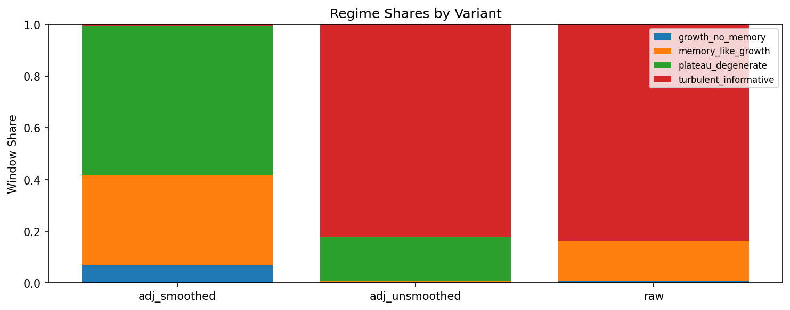

Второй рисунок отвечает уже на другой вопрос: какой из трёх слоёв чаще допускает содержательное чтение короткого окна. Он делает визуально очевидным, почему основной рабочий слой был выбран как `adj_unsmoothed`, а не как более гладкий или более шумный вариант.

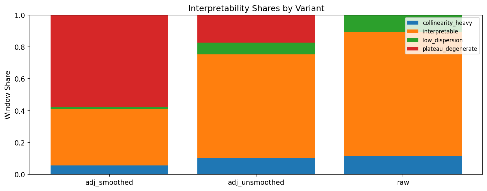

### 3.3.4. Структурное чтение и устойчивость маршрута

На `adj_unsmoothed` доминирующим режимом чтения оказался `phase_caution`, а не "чистая память". В baseline:

- `phase_caution`: `0.644697`;
- `do_not_read`: `0.246681`;
- `beta_bsum_caution`: `0.102064`;
- `memory_structure`: `0.004319`.

Наиболее важное содержательное наблюдение состоит в том, что лидером по $|\beta|$ чаще всего остаётся `X_n`, а суммарный лаговый эффект $B_\Sigma$ в среднем мал и концентрируется около нуля. Это означает, что в месячных отраслевых `IPP`-рядах текущий уровень чаще важнее, чем чистая и устойчивая memory-структура первого лага.

Consistency-анализ показал, что режим и допустимый тип чтения оказываются достаточно устойчивыми, особенно при более длинных окнах. Здесь важна не столько устойчивость отдельных коэффициентов, сколько устойчивость самого решения о том, допускает ли окно структурное чтение. Именно это позволило перейти от общей карты маршрутизации к отраслевым кейсам.

### 3.3.5. Отраслевые карточки

Отраслевые карточки показали, что:

- агрегаты вроде ПРОМ, `06`, `06.1` чаще вырождаются в `plateau / do_not_read`;
- отрасли `10`, `21`, `26`, `35.1+35.3`, `38` оказываются заметно более информативными;
- при этом и у них доминирует не "чистая память", а `phase_caution`.

Отдельно шоки `2020` и `2022` проявились не одинаково:

- для агрегатов и нефтяного контура `2022` чаще закрывает окно;
- для пищевой, фармацевтической, электронной и отходной отраслей оба шока чаще остаются турбулентными, но ещё интерпретируемыми эпизодами.

Обзорная карта кейсов показывает, как в разных секторах сочетаются интерпретируемость, доминирующий контур чтения и чувствительность к шокам.

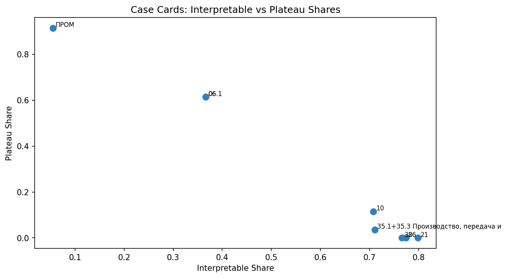

Следовательно, линия `A` решила свою основную задачу. Она показала, что маршрутизатор из главы 2 переносим на реальную промышленную эмпирику и действительно работает как фильтр неправильных чтений. При этом результат оказался не только методологическим, но и содержательным: реальные месячные ряды не допускают единой модели чтения, а отрасли систематически различаются по типу интерпретируемости.

**Методологический результат.** Для реальных `IPP`-окон подтверждена переносимость маршрутизатора из главы 2: до запуска регрессии необходимо определить режим и проверить интерпретируемость окна.

**Эмпирический результат.** В качестве основного слоя наблюдения выбран `adj_unsmoothed`, а сами отрасли показали устойчивое различие по режиму, читаемости и чувствительности к шокам.

**Практический смысл.** Перед чтением коэффициентов или обсуждением краткосрочной динамики необходимо сначала выбрать рабочий слой данных и отделить отрасли, где short-window анализ допустим, от отраслей, где он заранее бессодержателен.

## 3.4. Broad growth-groups по выручке

### 3.4.1. Постановка и главные результаты

В `B1` режимно-зависимый аппарат переносится на годовые медианные траектории трёх broad growth-групп, сформированных по темпам роста `2010–2014`:

- `high_90_50`;
- `low_10_50`;
- `middle_45_55_50`.

Во всех трёх группах получилось по `2394` фирмы.

Интегральная таблица сразу показывает, что группы действительно различаются:

| Группа | median 2010 | median 2014 | median 2022 | cumulative 2010-2014 |
|---|---:|---:|---:|---:|
| High growth | 43,525.0 | 165,765.0 | 183,985.0 | 2.8085 |
| Low growth | 66,144.5 | 20,991.0 | 20,566.5 | -0.6826 |
| Middle growth | 72,347.5 | 90,732.0 | 100,853.0 | 0.2541 |

Перенос на выручку принципиален, поскольку здесь меняется не только частота данных, но и сама экономическая природа величины: денежная динамика особенно легко создаёт высокий fit без структурной читаемости.

На полных интервалах `2014–2019` и `2014–2022` получен важный результат:

1. высокий fit не равен структурной читаемости;
2. большинство полных интервалов broad growth-групп оказывается `plateau_like / low_dispersion`;
3. только middle group на `2014–2022` выходит в `oscillatory / interpretable`.

Короткие окна `5` и `7` дали уже настоящее различение групп:

- high group чаще допускает интерпретируемое чтение;
- low group почти целиком остаётся в `do_not_read`;
- middle group занимает промежуточное положение и становится читаемой на части окон.

Следовательно, broad growth-группы годовой выручки нельзя читать единым способом; routing нужен и здесь. Одновременно `B1` дал и самостоятельный эмпирический результат: группы различаются не только траекториями, но и типом аналитического доступа к ним.

График медианных траекторий фиксирует сам объект анализа `B1`: различие между high, low и middle группами выражается не в одном агрегированном показателе роста, а в форме самих посткризисных траекторий.

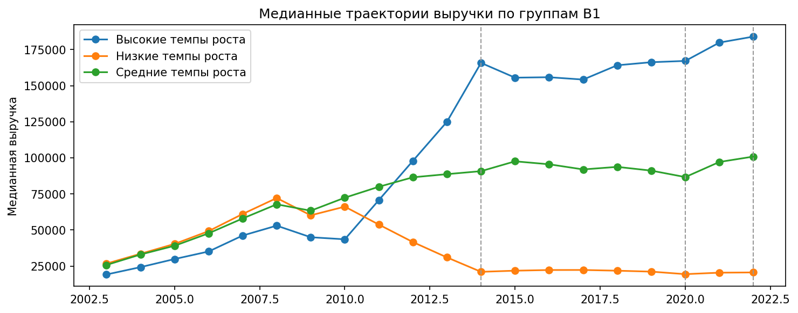

Barplot по доле интерпретируемых окон показывает уже аналитическое различие: даже внутри одного и того же корпуса стабильных фирм разные broad growth-группы по-разному открываются для short-window анализа.

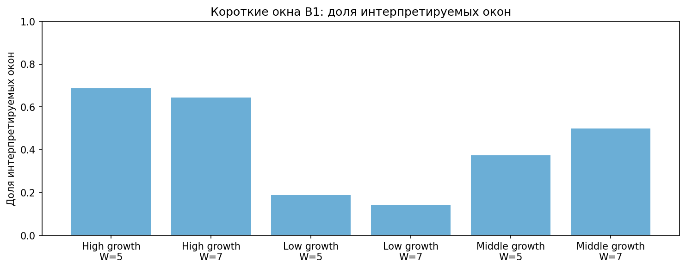

Тем самым `B1` подтвердил, что режимно-зависимый аппарат переносим и на денежную годовую реальность. Одновременно оказалось, что полные интервалы broad growth-групп оказываются чаще менее читаемыми, чем короткие окна.

**Методологический результат.** Для годовых медианных траекторий broad growth-групп подтверждено, что routing нужен не меньше, чем для месячных рядов, а высокий fit не отменяет фильтр интерпретируемости.

**Эмпирический результат.** Группы `high`, `low` и `middle` различаются не только формой траектории, но и типом допустимого short-window чтения.

**Практический смысл.** Даже внутри одного корпуса стабильных фирм нельзя одинаково читать все траектории; сначала требуется разделить группы по допустимому аналитическому контуру, а уже затем обсуждать коэффициенты и локальную память.

## 3.5. Отраслевой подкорпус выручки

### 3.5.1. Формирование корпуса

Если `B1` работал с broad growth-группами, то `B2` переводит линию выручки на отраслевой уровень. Единицей анализа становится `2-digit` сектор старого ОКВЭД.

В `B2` использовался жёсткий фильтр:

- заполненный и нормализуемый код;
- устойчивое присутствие в годовой панели;
- не менее `100` фирм в секторе.

После фильтра получен основной отраслевой слой:

| total firms | firms with OKVED | included firms | included sectors |
|---:|---:|---:|---:|
| 23943 | 18628 | 17497 | 29 |

Линия выручки здесь упирается не только в моделирование, но и в качество кодировки. Полученный компромисс позволил сохранить и масштаб, и интерпретируемость, а значит, сделал `B2` полноценной отраслевой линией, а не приложением к `B1`.

### 3.5.2. Полные интервалы и короткие окна

На полном интервале `B2` оказался менее закрытым, чем `B1`:

| Интервал | structural_m1_m2 | phase_trajectory | enter_beta_bsum | do_not_read_regression |
|---|---:|---:|---:|---:|
| `2014-2019` | 15 | 1 | 2 | 11 |
| `2014-2022` | 20 | 4 | 1 | 4 |

Содержательный смысл этого результата состоит в различии двух типов агрегации: broad growth-группы смешивают разные механизмы внутри общего роста, тогда как отрасли чаще объединяют фирмы с более близкой экономической логикой. Поэтому отраслевой денежный слой оказался более читаемым на полном интервале.

Именно на коротких окнах `5` и `7` `B2` превратился в полноценную отраслевую карту читаемости. При `W = 7` наиболее читаемыми оказались:

- `28`, `36`, `63` с `interpretable_share = 0.9286`;
- `26`, `60`, `72`, `29`, `31`, `24`, `21` с `interpretable_share = 0.8571`.

Наиболее закрытыми оказались:

- `52` с `interpretable_share = 0.0000`;
- `70`, `41`, `93` и некоторые другие сектора, где доминирует `do_not_read_regression`.

Следовательно, `B2` дал уже не broad-group analysis, а именно отраслевую карту читаемости выручки.

Первый рисунок важно понимать не как витрину "лучших $R^2$". Его задача состоит только в демонстрации неоднородности полного интервала: даже высокий fit сам по себе не означает структурной читаемости.

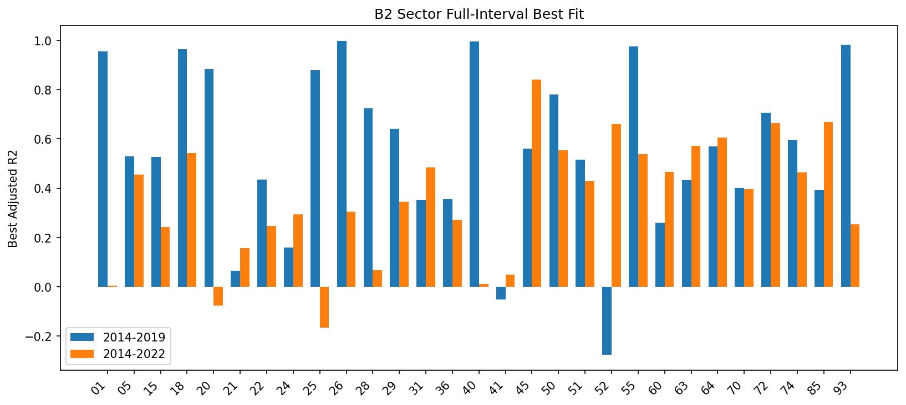

Второй рисунок является центральной иллюстрацией всего `B2`, поскольку именно он превращает результаты блока в карту читаемости отраслевой выручки.

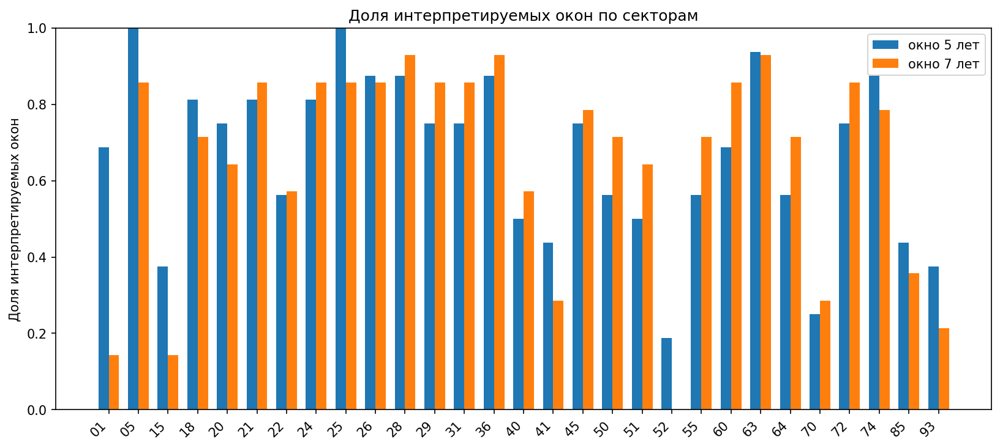

Именно `B2` переводит денежную линию из proof-of-concept в самостоятельный прикладной корпус. Здесь линия выручки впервые становится не просто подтверждением переносимости метода, а самостоятельной отраслевой картой допустимого и недопустимого short-window чтения.

**Методологический результат.** Routing на отраслевой выручке оказался необходим не меньше, чем на broad growth-группах: full-interval fit не заменяет проверку интерпретируемости.

**Эмпирический результат.** Получена устойчивая карта отраслевой читаемости, в которой одни сектора допускают структурное чтение, другие требуют фазового контура, а третьи почти всегда должны уходить в `do_not_read`.

**Практический смысл.** Появляется возможность заранее приоритизировать отрасли для аналитического внимания и не тратить усилия на сектора, где выбранный тип окна систематически не даёт содержательной интерпретации.

### 3.5.3. Шоки 2020 и 2022

По отраслевой выручке уже проявились содержательные before/after patterns:

- `20`: сильный восстановительный отклик после `2020`;
- `22`: падение перед шоком и восстановление после;
- `24`: положительный вход в `2020` и ещё более сильный выход;
- `26`, `28`, `29`: выраженный восстановительный паттерн после `2020`;
- `40`: шок заметен, но по амплитуде слабее.

Следовательно, `B2` состоялся как отраслевая карта читаемости выручки. Даже внутри одной годовой денежной реальности разные отрасли радикально различаются по допустимому контуру чтения. Именно это и создало основу для bridge-case.

## 3.6. Мост между промышленными индексами и выручкой

### 3.6.1. Постановка bridge-case

В `C1` сравнивались не уровни, а:

- dominant regime;
- dominant interpretability;
- dominant tool;
- shock-переломы `2020` и `2022`.

Такая постановка принципиальна. Сопоставление уровней между `IPP` и выручкой почти неизбежно породило бы ложные выводы, поскольку физическая динамика выпуска и номинальная денежная динамика обладают разной чувствительностью к ценам, структуре спроса и институциональным шокам.

Для первого круга были выбраны только четыре пары:

| bridge id | revenue sector | IPP series | mapping quality |
|---|---|---|---|
| `food` | `15` | `10` | high |
| `pharma` | `24` | `21` | medium |
| `energy_heat` | `40` | `35.1+35.3` | high |
| `water` | `41` | `36` | medium |

### 3.6.2. Главный результат и типология соответствий

Мост оказался селективным и режимно-зависимым, а не универсальным.

По полным интервалам:

| Pair | 2014-2019 match score | 2014-2022 match score |
|---|---:|---:|
| `food` | 0.000 | 0.000 |
| `pharma` | 0.000 | 0.333 |
| `energy_heat` | 1.000 | 0.000 |
| `water` | 1.000 | 1.000 |

Отсюда следует типология bridge-case:

1. `energy_heat` — clean high-quality match;
2. `water` — strongest empirical match with medium mapping quality;
3. `food` — shock match stronger than routing match;
4. `pharma` — mixed mapping / partial match case.

График со score совпадения показывает, что между парами существуют качественно разные сценарии мостика: от почти полного совпадения до случаев, где routing почти не совпадает вовсе.

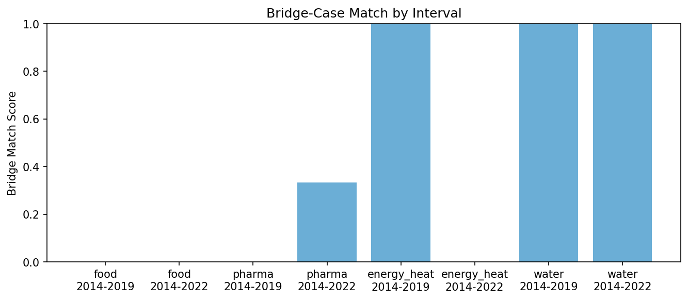

Эта типология переводит мостик из бинарной логики "совпало/не совпало" в более зрелую исследовательскую форму. Для `water` корректно говорить о самом сильном текущем эмпирическом совпадении при `mapping quality = medium`, а кейс `pharma` важен именно как частичное соответствие при неоднозначном mapping старого кода `24`.

### 3.6.3. Шоковые переломы

Сравнение shock-patterns показало, что `2020` чаще создаёт согласованные переломы между `IPP` и выручкой, чем `2022`.

Особенно важно:

- для `food`, `pharma`, `energy_heat` шок `2020` совпадает по направлению и до, и после точки;
- для `2022` согласованность заметно слабее.

Последний рисунок этого раздела нужно читать не как сопоставление уровней физического выпуска и выручки, а как сравнение формы переломов.

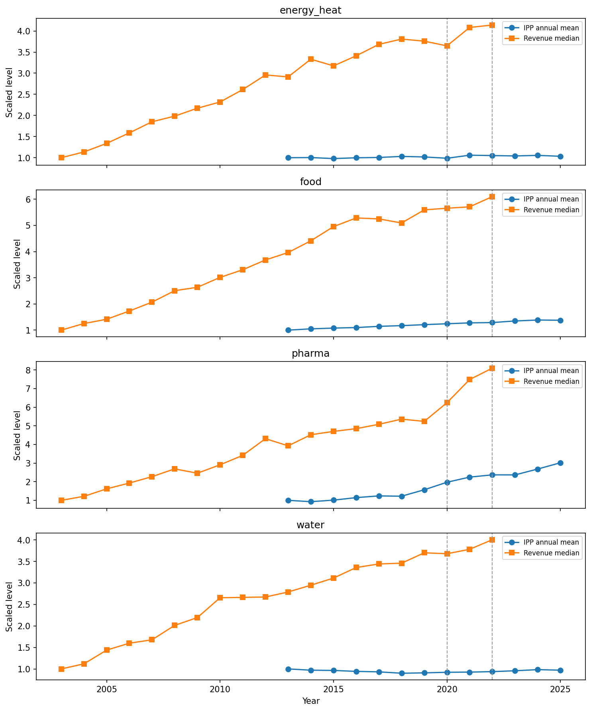

Следовательно, `2020` работает как более общий shock-transition для физической и денежной реальности, тогда как после `2022` физический выпуск и номинальная выручка расходятся по чувствительности сильнее.

`C1` не подтвердил наличие единого универсального режимного изоморфизма между промышленным индексом и выручкой. Но это не слабость, а сильный вывод:

> физический выпуск и номинальная выручка демонстрируют частично согласованные режимные переломы, но различаются по амплитуде, интерпретируемости и чувствительности к шокам.

Следовательно, bridge-case работает не универсально, а селективно — и именно это является его корректной научной формой.

**Методологический результат.** Корректный bridge-case между `IPP` и выручкой возможен только в режимно-зависимой и селективной форме; прямое сопоставление уровней методологически неверно.

**Эмпирический результат.** Получена типология четырёх исходов мостика: от clean high-quality match до частичного соответствия при неоднозначном mapping и случаев, где шоковое совпадение сильнее routing-match.

**Практический смысл.** Физический выпуск и денежную динамику можно сравнивать не по уровням, а по режимам, допустимости чтения и форме шоковых переломов, что существенно снижает риск ложного отраслевого сравнения.

## 3.7. Общие выводы по главе реальных данных и практическая значимость

Реальная эмпирическая часть дала несколько взаимосвязанных результатов. Для наглядности общая логика главы может быть сведена в одну таблицу.

| Линия | Корпус | Исходная проблема | Главный результат | Что нельзя читать напрямую | Что допустимо читать | Практический смысл |
|---|---|---|---|---|---|---|
| `A` | Месячные `IPP` | Один и тот же процесс наблюдается в трёх версиях ряда, и выбор слоя меняет сам объект интерпретации | Выбран рабочий слой `adj_unsmoothed`; routing переносим на отраслевые окна | `plateau`, `low signal`, часть агрегатов и шоковых окон | short-window режимы, отраслевые различия, осторожное `phase`-чтение | позволяет выбрать слой наблюдения до обсуждения коэффициентов |
| `B1` | Broad growth-группы выручки | Полные интервалы дают высокий fit, но не гарантируют читаемость групповой денежной траектории | Группы различаются не только траекториями, но и читаемостью коротких окон | полные интервалы как готовую лаговую структуру | short-window различие `high / low / middle`, локальную допустимость чтения | позволяет различать группы по допустимому аналитическому контуру |
| `B2` | Отраслевой подкорпус выручки | Broad groups слишком грубо описывают денежную реальность и скрывают отраслевые различия | Получена карта читаемости отраслевой выручки | отрасли с устойчивым `do_not_read`, full-interval fit как критерий структуры | sector-level short-window routing, шоковые паттерны `2020/2022` | позволяет приоритизировать сектора для анализа и мониторинга |
| `C1` | Селективные пары `IPP`–выручка | Физический выпуск и выручку нельзя корректно сравнивать по уровням и амплитудам | Мост возможен только в режимно-зависимой и селективной форме | уровни рядов и прямое тождество амплитуд | совпадение режимов, интерпретируемости и shock-patterns | позволяет корректно сопоставлять физическую и денежную реальность |

### 3.7.1. Главные результаты главы

По итогам проведённого анализа можно сформулировать несколько общих выводов.

Во-первых, маршрутизатор из главы 2 действительно переносим на реальные данные. Это подтверждено и на месячных `IPP`, и на годовой выручке, и на отраслевом подкорпусе, и на bridge-case. Аппарат работает как фильтр допустимости чтения, а не как генератор "красивых коэффициентов".

Во-вторых, short-window анализ остаётся правильной единицей чтения. И на `IPP`, и на broad growth-группах выручки, и на отраслевой выручке полные интервалы часто оказываются менее читаемыми, чем короткие окна.

В-третьих, fit и интерпретируемость — это разные вещи. Высокий $R^2$ может появляться и в low-dispersion окне, которое нельзя читать как содержательную lag-структуру. Этот вывод устойчиво воспроизводится на всех real-data слоях.

В-четвёртых, линия выручки не сводится к broad group-analysis. После `B2` она превращается в полноценную отраслевую карту читаемости. Следовательно, денежная реальность оказывается не менее содержательной, чем физические индексы, если к ней применять корректный routing.

В-пятых, мост между `IPP` и выручкой существует, но только селективно. Bridge-case не даёт права говорить о прямом соответствии уровней или о полном совпадении режимов, но позволяет выделять пары, где совпадают режимные переломы, допустимость чтения и тип реакции на `2020` и частично на `2022`.

В-шестых, реальная эмпирика не была поставлена как соревнование прогнозных моделей. Её результат состоит в построении условий допустимости краткосрочного чтения: сначала определяется, можно ли вообще интерпретировать окно, и только затем обсуждается возможность осторожного short-window вывода.

### 3.7.2. Практическая значимость

Практическая ценность проведённого анализа состоит не столько в построении "ещё одной" краткосрочной регрессии, сколько в снижении риска неверного чтения реальных экономических рядов. В прикладной работе аналитик почти всегда имеет дело с короткими, шумными и режимно неоднородными траекториями, где высокий fit легко создаёт иллюзию содержательного результата. Настоящее исследование показывает, что перед любой интерпретацией необходимо сначала ответить на более фундаментальный вопрос: допускает ли данное окно вообще содержательное чтение.

В этом смысле предложенный аппарат работает как практический фильтр против ложных выводов. Он позволяет заранее отделять окна, где краткосрочная регрессия отражает исчезающий сигнал, сильную коллинеарность или вырожденный plateau-режим, от окон, где структурная интерпретация действительно допустима. Тем самым уменьшается риск ситуации, в которой формально красивая модель становится основанием для ошибочного отраслевого, управленческого или инвестиционного вывода.

Его прикладное значение проявляется в четырёх направлениях, которые затем конкретизируются в сценариях применения: в выборе рабочего слоя данных, в построении карты отраслевой читаемости, в различении шоковых режимов и в корректном сопоставлении физической и денежной динамики.

### 3.7.3. Практические сценарии применения

Практическое применение полученного аппарата может быть сведено к нескольким типовым сценариям.

1. В отраслевом мониторинге он позволяет заранее отделять сектора и окна, где short-window анализ вообще допустим, от секторов, где данные требуют отказа от прямой регрессионной интерпретации.
2. В банковской и макроэкономической аналитике он даёт более корректный способ сопоставлять физический выпуск и денежную динамику, не подменяя совпадение режимов наивным сравнением уровней.
3. В корпоративной стратегии он позволяет различать инерционные, шоковые и structurally readable траектории отрасли, а значит, снижает риск принятия решений по формально красивой, но бессодержательной модели.
4. В управленческой аналитике он работает как предварительный фильтр, не позволяющий превращать случайно высокий fit в основание для ошибочного вывода о памяти, переломе или устойчивом тренде.

Таким образом, работа даёт не универсальную модель прогноза, а рабочую процедуру предварительного отбора и допустимого чтения коротких экономических рядов.

### 3.7.4. Границы прогностической интерпретации и ограничения исследования

Необходимо специально отметить границы полученных результатов. В synthetic-части работы проверялась и прогностическая сторона задачи, причём было показано, что в неустойчивых режимах высокий $R^2$ не гарантирует качественного прогноза. В настоящей real-data главе ставилась другая цель: отделить окна, где осторожное краткосрочное чтение вообще допустимо, от окон, где оно методологически не оправдано. Поэтому результаты главы 3 нельзя понимать как доказательство сильной прогностической способности на реальных данных; корректнее говорить о построении условий допустимости краткосрочной интерпретации.

Для снятия возможного недоразумения был выполнен и короткий sanity-check на baseline-окнах `adj_unsmoothed`: одношаговый local forecast на основе простой модели по текущему уровню и первому лагу сравнивался с наивным прогнозом `X_{t+1}=X_t`. Устойчивого выигрыша над наивным baseline получено не было: например, для интерпретируемых окон средняя абсолютная ошибка составила `5.91` против `5.86` у наивного прогноза, а для окон `phase_short_forecast` — `5.95` против `5.92`. Тем самым дополнительная проверка подтверждает общий вывод главы: real-data часть работы строит не универсальный прогностический benchmark, а процедуру отбора окон, где краткосрочное чтение вообще методологически допустимо.

У исследования есть и другие ограничения. Во-первых, на реальных данных отсутствует истинная модель, поэтому анализ строится на устойчивости, согласованности и повторяемости результатов, а не на exact recovery. Во-вторых, bridge-case сознательно ограничен малым числом пар и селективным mapping между `IPP` и выручкой. В-третьих, старый ОКВЭД и пропуски отраслевых кодов ограничивают полноту денежного отраслевого корпуса. Наконец, short-window анализ остаётся чувствительным к выбору длины окна и потому требует routing как обязательного предварительного шага.

Для устранения возможных неверных трактовок итог real-data части можно дополнительно свести к следующей таблице.

| Утверждение | Статус | Комментарий |
|---|---|---|
| Маршрутизатор из главы 2 переносим на реальные данные | Да | Подтверждено на `IPP`, broad growth-группах, отраслевой выручке и селективном bridge-case |
| Высокий fit сам по себе достаточен для структурной интерпретации | Нет | На реальных данных устойчиво показано, что fit и интерпретируемость не совпадают |
| Short-window routing необходим на реальных рядах | Да | Это главный методологический вывод всей real-data части |
| Линия выручки после `B2` даёт самостоятельный отраслевой результат | Да | Получена карта читаемости отраслевой выручки |
| Между `IPP` и выручкой существует универсальный bridge-case | Нет | Мостик носит селективный и режимно-зависимый характер |
| На реальных данных доказана сильная прогностическая способность моделей | Нет | В главе 3 показаны условия допустимости краткосрочного чтения, а не универсальный forecast benchmark |

### 3.7.5. Итоговый вывод главы

Итог главы 3 состоит в следующем. Реальный социально-экономический ряд нельзя читать единой моделью. Корректный порядок анализа должен быть таким:

1. сначала определяется режим;
2. затем проверяется интерпретируемость окна;
3. после этого выбирается аналитический контур;
4. и только затем интерпретируются $\beta$, $B_\Sigma$, ENTER и краткосрочная структура.

Следовательно, изюминка эмпирической части работы состоит не просто в переносе ранее построенного аппарата на новую эмпирику, а в том, что этот аппарат позволил превратить разнородные реальные корпуса в карту допустимых и недопустимых интерпретаций. Именно это и составляет как главный методологический, так и главный прикладной результат главы.
