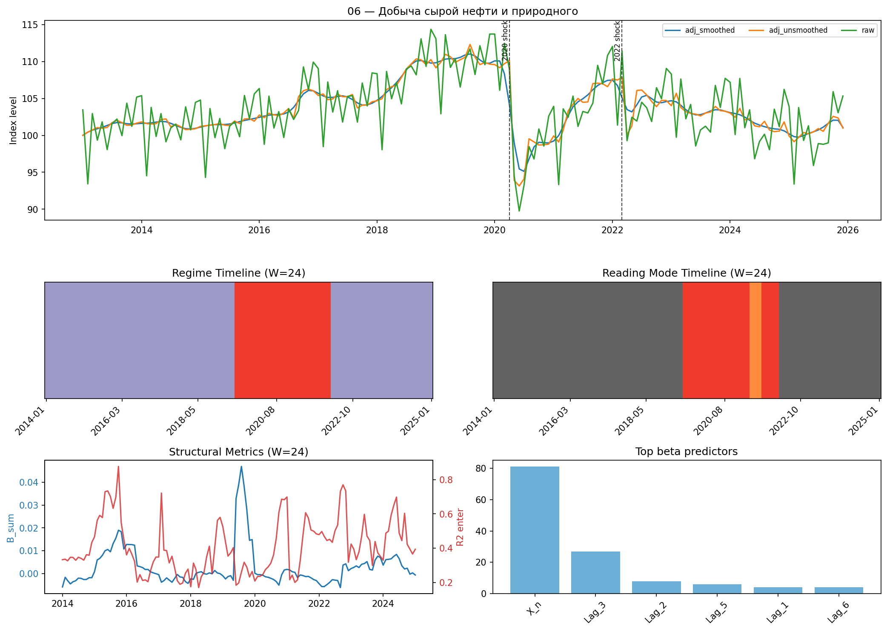
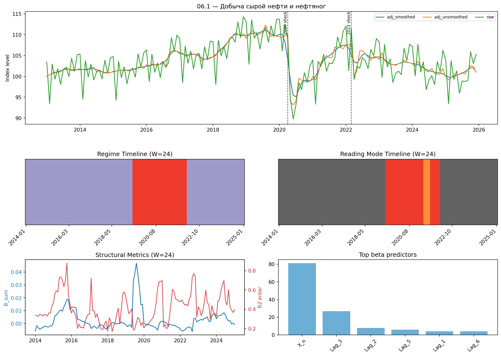
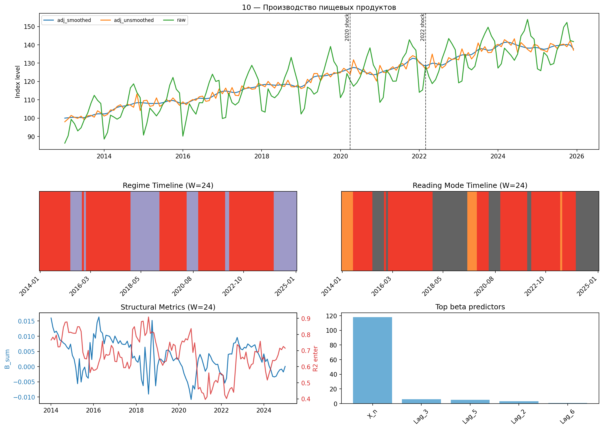
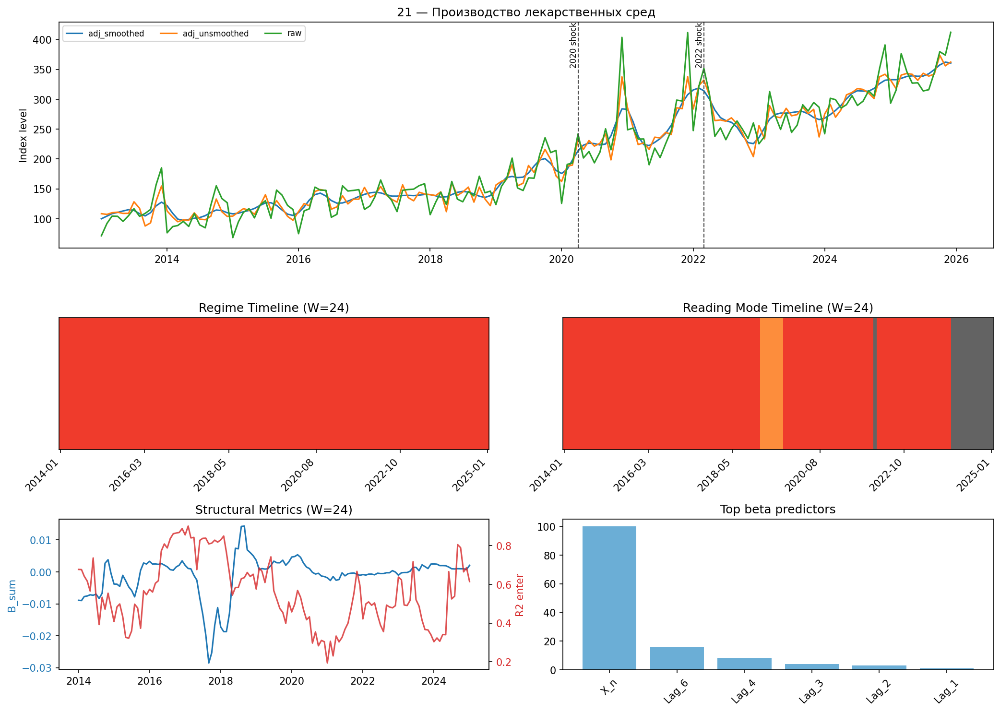
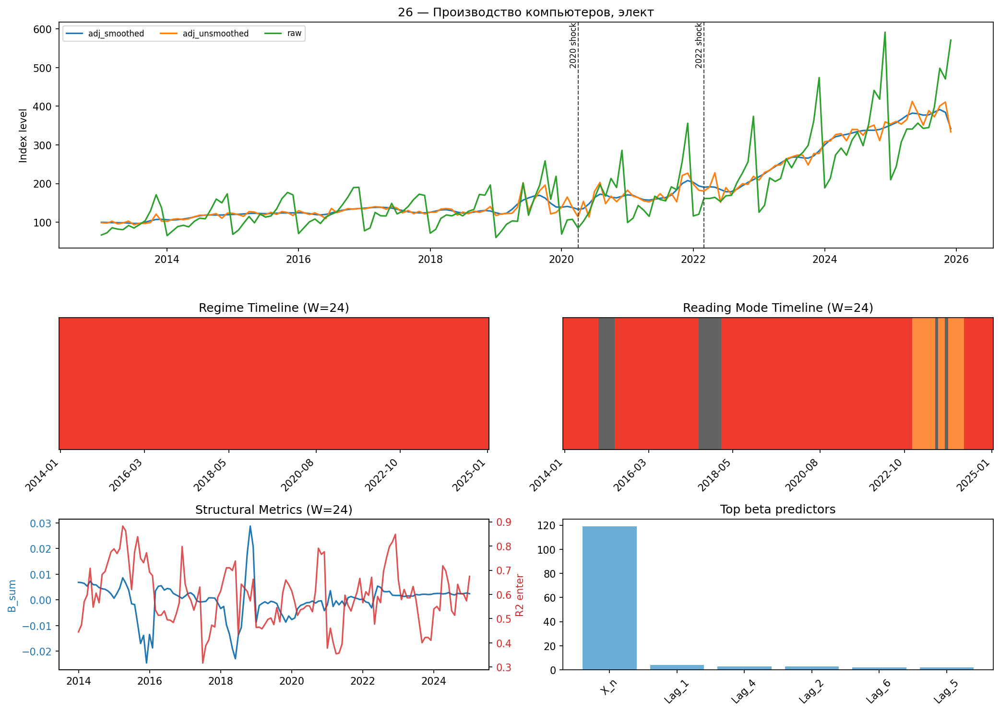
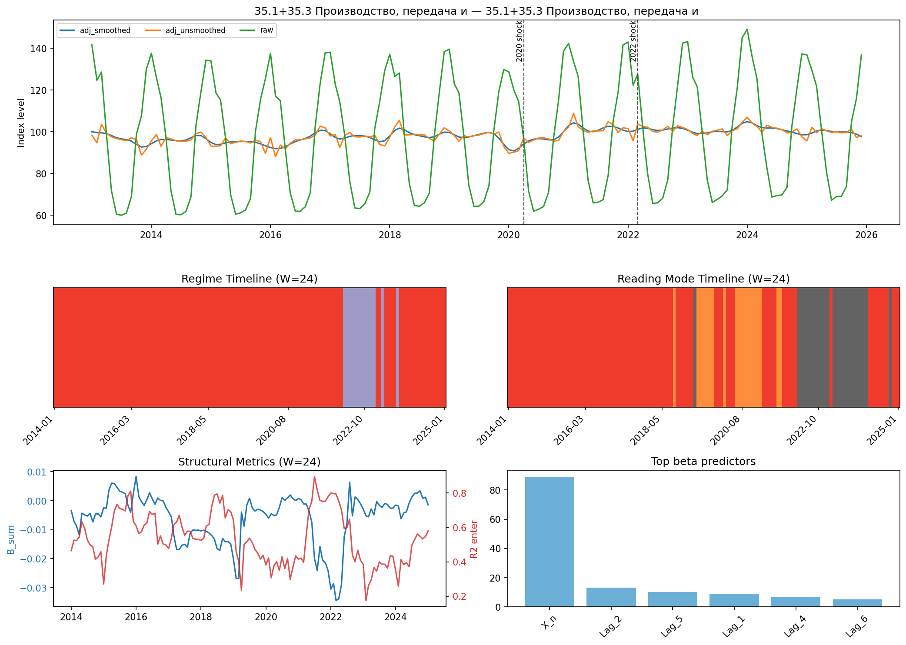
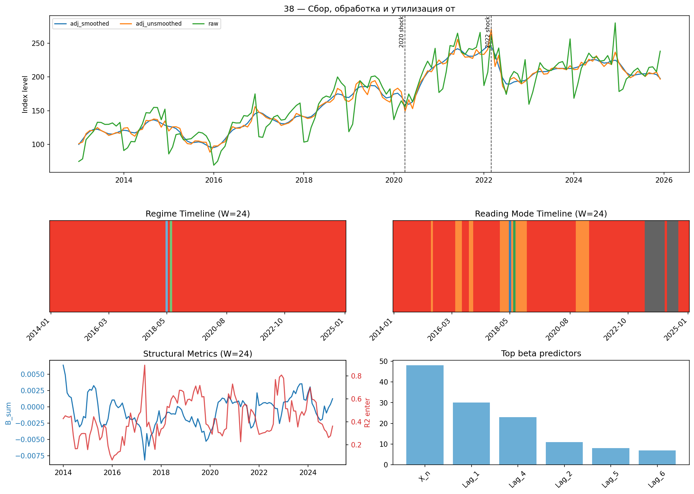
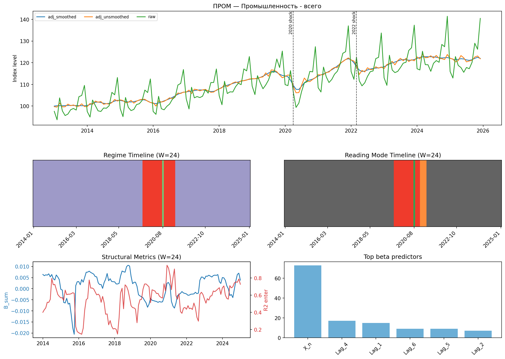

# Кейсовые отраслевые карточки

| Код | Серия | Интерпрет. | Plateau | Дом. режим | Дом. контур | Дом. beta |
|---|---|---:|---:|---|---|---|
| 06 | Добыча сырой нефти и природного | 0.366 | 0.614 | plateau_degenerate | do_not_read | X_n |
| 06.1 | Добыча сырой нефти и нефтяног | 0.366 | 0.614 | plateau_degenerate | do_not_read | X_n |
| 10 | Производство пищевых продуктов | 0.708 | 0.116 | turbulent_informative | phase_caution | X_n |
| 21 | Производство лекарственных сред | 0.799 | 0.000 | turbulent_informative | phase_caution | X_n |
| 26 | Производство компьютеров, элект | 0.774 | 0.000 | turbulent_informative | phase_caution | X_n |
| 35.1+35.3 | 35.1+35.3 Производство, передача и | 0.711 | 0.036 | turbulent_informative | phase_caution | X_n |
| 38 | Сбор, обработка и утилизация от | 0.766 | 0.000 | turbulent_informative | phase_caution | X_n |
| ПРОМ | Промышленность - всего | 0.055 | 0.915 | plateau_degenerate | do_not_read | X_n |

## 06 — Добыча сырой нефти и природного

Родитель: `B` Добыча полезных ископаемых; интерпретируемая доля `0.366`, plateau `0.614`, доминирующий контур `do_not_read`.

## 06.1 — Добыча сырой нефти и нефтяног

Родитель: `06` Добыча сырой нефти и природного; интерпретируемая доля `0.366`, plateau `0.614`, доминирующий контур `do_not_read`.

## 10 — Производство пищевых продуктов

Родитель: `C` Обрабатывающие производства; интерпретируемая доля `0.708`, plateau `0.116`, доминирующий контур `phase_caution`.

## 21 — Производство лекарственных сред

Родитель: `C` Обрабатывающие производства; интерпретируемая доля `0.799`, plateau `0.000`, доминирующий контур `phase_caution`.

## 26 — Производство компьютеров, элект

Родитель: `C` Обрабатывающие производства; интерпретируемая доля `0.774`, plateau `0.000`, доминирующий контур `phase_caution`.

## 35.1+35.3 — 35.1+35.3 Производство, передача и

интерпретируемая доля `0.711`, plateau `0.036`, доминирующий контур `phase_caution`.

## 38 — Сбор, обработка и утилизация от

Родитель: `E` Водоснабжение, водоотведение...; интерпретируемая доля `0.766`, plateau `0.000`, доминирующий контур `phase_caution`.

## ПРОМ — Промышленность - всего

интерпретируемая доля `0.055`, plateau `0.915`, доминирующий контур `do_not_read`.

