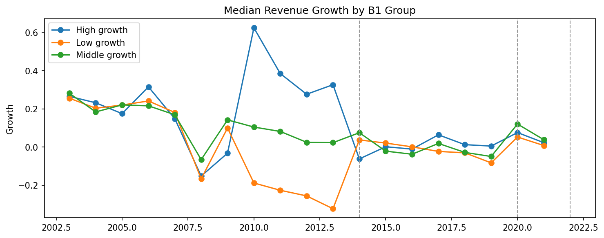
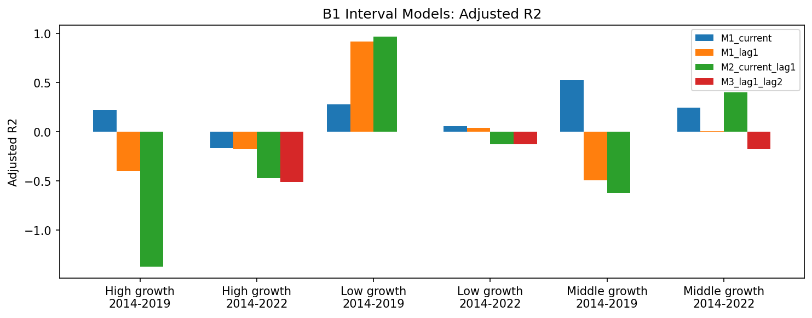

# Результаты эксперимента B1 по выручке

## Постановка

В эксперименте `B1` режимно-зависимый аппарат из главы 2 и блока `A` переносится на годовые медианные траектории выручки групп стабильных компаний.

Цель `B1` состоит не в построении единой "лучшей" модели выручки, а в проверке трёх вещей:

1. можно ли воспроизвести полунинскую группировку по темпам роста `2010–2014`;
2. различаются ли полученные группы по режиму и допустимому контуру чтения;
3. сохраняется ли смысл короткого routing-подхода на очень коротких годовых рядах.

Весь расчёт выполнен на корпусе [revenue_wide.csv](/Users/v.l.gukasyan/Desktop/DIPLOM/experiments/real_data/processed/revenue_wide.csv) и [revenue_long.csv](/Users/v.l.gukasyan/Desktop/DIPLOM/experiments/real_data/processed/revenue_long.csv). Артефакты `B1` сохранены в [outputs/real_data/revenue_b1](/Users/v.l.gukasyan/Desktop/DIPLOM/experiments/outputs/real_data/revenue_b1).

---

## B1.1. Формирование групп по росту `2010–2014`

### Группировка

Использована дисциплинированная трёхгрупповая схема:

- `high_90_50` — верхние `10%` компаний по росту `2010–2014`;
- `low_10_50` — нижние `10%`;
- `middle_45_55_50` — центральная "средняя" группа около медианы.

Во всех трёх группах получилось по `2394` компании, что практически воспроизводит конструкцию Полунина.

### Интегральная таблица групп

Источник: [group_summary.csv](/Users/v.l.gukasyan/Desktop/DIPLOM/experiments/outputs/real_data/revenue_b1/group_summary.csv)

| Группа | firms | median 2010 | median 2014 | median 2022 | cumulative 2010-2014 | cumulative 2014-2022 |
|---|---:|---:|---:|---:|---:|---:|
| High growth | 2394 | 43,525.0 | 165,765.0 | 183,985.0 | 2.8085 | 0.1099 |
| Low growth | 2394 | 66,144.5 | 20,991.0 | 20,566.5 | -0.6826 | -0.0202 |
| Middle growth | 2394 | 72,347.5 | 90,732.0 | 100,853.0 | 0.2541 | 0.1115 |

### Что видно сразу

1. Полунинская группировка на этом файле действительно работает: high- и low-группы расходятся радикально уже по медианам.
2. High growth group показывает очень сильный подъём в `2010–2014`, после чего переходит в гораздо более спокойный пост-2014 режим.
3. Low growth group, наоборот, резко сжимается к `2014` и затем почти не восстанавливается.
4. Middle growth group даёт умеренную и более устойчивую траекторию.

Именно эта таблица показывает, что `B1` уже не "вторая копия A", а другой real-data слой с собственной структурой.

### Графики траекторий

---

## B1.2. Полные интервалы `2014–2019` и `2014–2022`

Для каждого группового ряда оценивались короткие модели:

- `M1_current`: $\omega_{t+1} = \alpha + b_0 X_t + \varepsilon_t$
- `M1_lag1`: $\omega_{t+1} = \alpha + b_1 X_{t-1} + \varepsilon_t$
- `M2_current_lag1`: $\omega_{t+1} = \alpha + b_0 X_t + b_1 X_{t-1} + \varepsilon_t$
- `M3_lag1_lag2`: контрольная модель по двум лагам, только где она вообще допустима

Основная сводка приведена в [interval_summary.csv](/Users/v.l.gukasyan/Desktop/DIPLOM/experiments/outputs/real_data/revenue_b1/interval_summary.csv).

| Группа | Интервал | Режим | Интерпретируемость | Контур | Лучший spec | best adj R2 |
|---|---|---|---|---|---|---:|
| High growth | 2014-2019 | plateau_like | low_dispersion | do_not_read_regression | M1_current | 0.2250 |
| Low growth | 2014-2019 | plateau_like | low_dispersion | do_not_read_regression | M2_current_lag1 | 0.9674 |
| Middle growth | 2014-2019 | plateau_like | low_dispersion | do_not_read_regression | M1_current | 0.5268 |
| High growth | 2014-2022 | plateau_like | low_dispersion | do_not_read_regression | M1_current | -0.1667 |
| Low growth | 2014-2022 | plateau_like | low_dispersion | do_not_read_regression | M1_current | 0.0578 |
| Middle growth | 2014-2022 | oscillatory | interpretable | structural_m1_m2 | M2_current_lag1 | 0.4017 |

### Главный результат полного интервального слоя

Он получился сильным и довольно жёстким:

1. На полном интервале `2014–2019` все три группы попадают в `plateau_like / low_dispersion`.
2. На полном интервале `2014–2022` только middle group выходит в `oscillatory / interpretable`.
3. Это означает, что годовые групповые медианы ещё более требовательны к routing, чем месячные `IPP`: высокий `adj R2` сам по себе не делает окно структурно читаемым.

Иначе говоря, `B1` подтверждает главный тезис блока `A`:

> короткая регрессия не должна читаться по умолчанию даже тогда, когда на полном интервале модель формально даёт высокий fit.

Самый показательный пример здесь — low group на `2014–2019`: `best adj R2 = 0.9674`, но routing всё равно маркирует этот интервал как `do_not_read_regression`, потому что основная проблема не в fit, а в low-dispersion геометрии.

### Сравнение моделей по качеству fit

---

## B1.3. Короткие окна `5` и `7`

Чтобы не зависеть только от двух полных интервалов, дополнительно были рассчитаны скользящие окна длины `5` и `7` лет.

Сводка лежит в [window_summary.csv](/Users/v.l.gukasyan/Desktop/DIPLOM/experiments/outputs/real_data/revenue_b1/window_summary.csv).

| Группа | Окно | Дом. режим | Дом. интерпретируемость | Дом. контур | interpretable share | do-not-read share | best spec mode |
|---|---:|---|---|---|---:|---:|---|
| High growth | 5 | monotone_growth | interpretable | structural_m1_m2 | 0.6875 | 0.3125 | M1_current |
| Low growth | 5 | plateau_like | low_dispersion | do_not_read_regression | 0.1875 | 0.8125 | M1_current |
| Middle growth | 5 | plateau_like | low_dispersion | do_not_read_regression | 0.3750 | 0.6250 | M1_current |
| High growth | 7 | shock_transition | interpretable | phase_trajectory | 0.6429 | 0.2143 | M1_current |
| Low growth | 7 | collapse_like | low_dispersion | do_not_read_regression | 0.1429 | 0.7857 | M1_lag1 |
| Middle growth | 7 | oscillatory | interpretable | structural_m1_m2 | 0.5000 | 0.4286 | M1_current |

### Что это значит

Это, пожалуй, самый важный результат `B1`.

1. High growth group на коротких окнах уже не выглядит plateau-like. Для `W=5` она чаще читается как `monotone_growth / interpretable`, а для `W=7` как `shock_transition`.
2. Low growth group остаётся самой "закрытой": и при `W=5`, и при `W=7` у неё доминирует `do_not_read_regression`.
3. Middle growth group занимает промежуточное положение: на `W=7` она становится `oscillatory / interpretable`, то есть именно здесь появляется пространство для допустимого структурного чтения.

Именно это и показывает, что routing на выручке действительно нужен: три группы нельзя читать одинаково.

---

## B1.4. Stability и шоки

### Sign stability

Сводка лежит в [sign_stability.csv](/Users/v.l.gukasyan/Desktop/DIPLOM/experiments/outputs/real_data/revenue_b1/sign_stability.csv).

Ключевое наблюдение:

- `top_beta` почти везде остаётся стабильным между `2014–2019` и `2014–2022`;
- а вот знак lag-компоненты и диапазон `adj R2` по интервалам меняются гораздо сильнее.

Это важный методологический вывод: на коротких годовых рядах можно рассчитывать на относительную устойчивость доминирующего фактора, но не на устойчивость детальной лаговой структуры.

### Shock summary: `2020` и `2022`

Источник: [shock_summary.csv](/Users/v.l.gukasyan/Desktop/DIPLOM/experiments/outputs/real_data/revenue_b1/shock_summary.csv)

| Группа | Шок | change before | change after |
|---|---:|---:|---:|
| High growth | 2020 | 0.0054 | 0.0761 |
| High growth | 2022 | 0.0231 | 0.0000 |
| Low growth | 2020 | -0.0824 | 0.0528 |
| Low growth | 2022 | 0.0082 | 0.0000 |
| Middle growth | 2020 | -0.0491 | 0.1208 |
| Middle growth | 2022 | 0.0386 | 0.0000 |

Здесь видно следующее:

1. `2020` действительно играет роль переломной точки, но по-разному для разных групп.
2. Для low- и middle-group шок 2020 сопровождается отрицательным входом в точку и положительным выходом из неё, то есть даёт более выраженную transition-логику.
3. High growth group переносит `2020` заметно мягче, чем low и middle.

---

## Итоговый вывод по B1

Эксперимент `B1` получился успешным.

Причины:

1. Полунинская группировка по росту `2010–2014` на этом корпусе воспроизводится и даёт три действительно разные медианные траектории.
2. Routing-подход переносится и на годовые денежные ряды: группы требуют разных контуров чтения.
3. Полные интервалы `2014–2019` и `2014–2022` чаще оказываются low-dispersion, чем месячные `IPP`, поэтому их нельзя читать как обычную лаговую структуру только по fit.
4. Короткие окна `5` и `7` уже дают содержательное различение: high growth group чаще допускает интерпретируемое чтение, low growth group остаётся почти целиком в `do_not_read`, а middle group становится читаемой на части окон.

То есть `B1` подтвердил главную методологическую идею всей работы:

> даже на годовых медианных траекториях выручки сначала нужно определить режим окна и его интерпретируемость, а уже затем решать, допустимо ли структурное лаговое чтение.

Следующий логичный шаг после `B1` — `B2`: отраслевой подкорпус выручки и затем bridge-case между выручкой и `IPP`.
