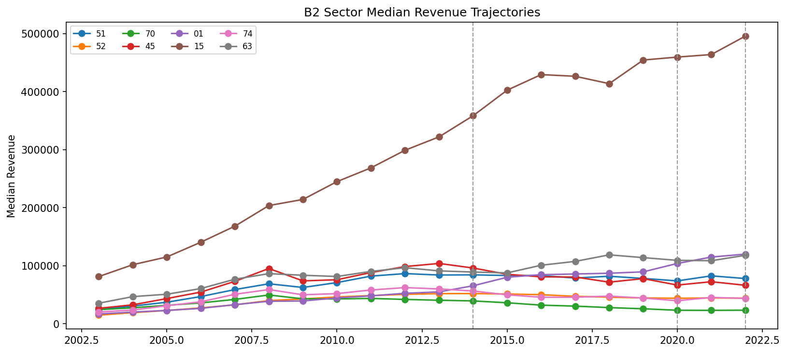

# Результаты эксперимента B2 по отраслевому подкорпусу выручки

## Постановка

Эксперимент `B2` переводит линию выручки от групп компаний к отраслевому подкорпусу. Единицей анализа здесь является уже не группа фирм по росту `2010–2014`, а `2-digit` сектор старого ОКВЭД с устойчивой медианной годовой траекторией выручки.

Задача `B2`:

1. выделить надёжный отраслевой подкорпус из файла выручки;
2. построить по нему годовые медианные траектории;
3. перенести на отрасли тот же routing, который уже сработал в `A` и `B1`;
4. выделить отрасли, которые допускают структурное чтение, и отрасли, которые в основном остаются `do_not_read`.

Артефакты эксперимента лежат в [outputs/real_data/revenue_b2](/Users/v.l.gukasyan/Desktop/DIPLOM/experiments/outputs/real_data/revenue_b2).

---

## B2.1. Отбор отраслевого подкорпуса

### Правило отбора

На первом круге использовались только фирмы с:

- заполненным старым кодом ОКВЭД;
- корректно нормализуемым `2-digit` кодом;
- устойчивым присутствием в годовой панели;
- отраслью, где число фирм не меньше `100`.

Это сознательно жёсткий фильтр: `B2` строится не на всей экономике, а на том подкорпусе, который допускает содержательное агрегирование.

### Итог покрытия

Источник: [coverage_summary.csv](/Users/v.l.gukasyan/Desktop/DIPLOM/experiments/outputs/real_data/revenue_b2/coverage_summary.csv)

| total firms | firms with OKVED | included firms | included sectors |
|---:|---:|---:|---:|
| 23943 | 18628 | 17497 | 29 |

То есть:

1. из всей панели `23943` стабильных компаний `18628` имеют пригодный код;
2. после фильтра `min_firms >= 100` в основной отраслевой корпус вошли `17497` фирм;
3. основной `B2`-слой составили `29` отраслей.

### Верхушка включённого подкорпуса

Источник: [sector_summary.csv](/Users/v.l.gukasyan/Desktop/DIPLOM/experiments/outputs/real_data/revenue_b2/sector_summary.csv)

| sector | firms | representative name | included |
|---|---:|---|---|
| `51` | 2957 | Прочая оптовая торговля | yes |
| `52` | 2468 | Розничная торговля в неспециализированных магазинах | yes |
| `70` | 2321 | Сдача внаем собственного нежилого недвижимого имущества | yes |
| `45` | 1323 | Строительство зданий и сооружений | yes |
| `01` | 1035 | Смешанное сельское хозяйство | yes |
| `15` | 865 | Пищевые продукты | yes |
| `74` | 694 | Архитектура и инженерное проектирование | yes |
| `63` | 493 | Хранение и складирование зерна | yes |
| `40` | 440 | Электроэнергия, газ, пар | yes |
| `24` | 245 | Фармацевтика и химия | yes |

Главный вывод этого шага: отраслевой `B2`-корпус получился достаточно большим, чтобы анализировать выручку уже не только по broad growth-группам, но и по секторам.

---

## B2.2. Полные интервалы `2014–2019` и `2014–2022`

На полном интервале по каждому сектору оценивались те же короткие модели, что и в `B1`:

- `M1_current`
- `M1_lag1`
- `M2_current_lag1`
- `M3_lag1_lag2` как контрольная вариация

### Общая картина по контурам чтения

Источник: [interval_summary.csv](/Users/v.l.gukasyan/Desktop/DIPLOM/experiments/outputs/real_data/revenue_b2/interval_summary.csv)

| Интервал | structural_m1_m2 | phase_trajectory | enter_beta_bsum | do_not_read_regression |
|---|---:|---:|---:|---:|
| `2014-2019` | 15 | 1 | 2 | 11 |
| `2014-2022` | 20 | 4 | 1 | 4 |

Это уже очень сильный результат.

По сравнению с `B1` отраслевой слой оказался **менее закрытым**, чем broad growth-groups:

1. на `2014–2019` почти половина отраслей всё ещё уходит в `do_not_read_regression`, но `15` отраслей уже допускают `structural_m1_m2`;
2. на `2014–2022` картинка становится ещё более содержательной: `20` отраслей переходят в `structural_m1_m2`, а `phase_trajectory` встречается уже `4` раза.

То есть отраслевой подкорпус выручки оказывается не просто приложением к `B1`, а более богатым объектом для режимного чтения.

### Примеры по полным интервалам

На `2014–2019` уже видно разделение:

- `15`, `21`, `25`, `26`, `28`, `29`, `36`, `45` чаще попадают в `structural_m1_m2`;
- `40`, `41`, `50`, `51`, `52`, `24` чаще уходят в `low_dispersion / do_not_read`;
- `31` выделяется как `shock_transition / phase_trajectory`.

Это важный результат: даже на полном интервале отрасли нельзя читать единым способом.

---

## B2.3. Короткие окна `5` и `7`

Как и в `B1`, основное различение структуры происходит не только на полном интервале, но и на коротких окнах.

Источник: [window_summary.csv](/Users/v.l.gukasyan/Desktop/DIPLOM/experiments/outputs/real_data/revenue_b2/window_summary.csv)

### Наиболее читаемые сектора при `W = 7`

| sector | interpretable share | dominant regime | dominant contour |
|---|---:|---|---|
| `28` | 0.9286 | oscillatory | structural_m1_m2 |
| `36` | 0.9286 | oscillatory | structural_m1_m2 |
| `63` | 0.9286 | oscillatory | structural_m1_m2 |
| `26` | 0.8571 | oscillatory | structural_m1_m2 |
| `60` | 0.8571 | oscillatory | structural_m1_m2 |
| `05` | 0.8571 | shock_transition | phase_trajectory |
| `72` | 0.8571 | oscillatory | structural_m1_m2 |
| `29` | 0.8571 | oscillatory | structural_m1_m2 |
| `31` | 0.8571 | oscillatory | structural_m1_m2 |
| `24` | 0.8571 | oscillatory | structural_m1_m2 |

### Наиболее закрытые сектора при `W = 7`

| sector | interpretable share | dominant regime | dominant contour | do_not_read share |
|---|---:|---|---|---:|
| `52` | 0.0000 | plateau_like | do_not_read_regression | 0.6429 |
| `01` | 0.1429 | monotone_growth | enter_beta_bsum | 0.0000 |
| `15` | 0.1429 | monotone_growth | enter_beta_bsum | 0.4286 |
| `93` | 0.2143 | plateau_like | do_not_read_regression | 0.5000 |
| `70` | 0.2857 | plateau_like | do_not_read_regression | 0.6429 |
| `41` | 0.2857 | monotone_growth | do_not_read_regression | 0.5000 |

### Главный вывод по окнам

Короткие окна снова оказываются информативнее, чем единый способ чтения полного интервала.

1. Есть отрасли, которые при `W=7` почти целиком становятся читаемыми: `28`, `36`, `63`, `26`, `60`, `72`.
2. Есть отрасли, которые остаются почти закрытыми даже на коротких окнах: `52`, `70`, `41`, `93`.
3. Есть промежуточные кейсы, где routing выбирает не `do_not_read`, а `phase_trajectory` или `enter_beta_bsum`.

Именно это и делает `B2` ценным для будущего bridge-case: теперь можно выделять не только "массовые" отрасли, но и **режимно читаемые** отрасли.

---

## B2.4. Шоки `2020` и `2022`

Источник: [shock_summary.csv](/Users/v.l.gukasyan/Desktop/DIPLOM/experiments/outputs/real_data/revenue_b2/shock_summary.csv)

По ряду отраслей уже видны содержательные before/after patterns:

- `20` (деревообработка и плитные материалы): `2020` даёт отрицательный вход и очень сильный положительный выход;
- `22` (полиграфия): `2020` сопровождается заметным падением перед шоком и положительным восстановлением после;
- `24` (фармацевтическо-химический сектор): положительный вход в `2020` и ещё более сильный выход;
- `26`, `28`, `29` (строительные материалы, металлоконструкции, машиностроение): после `2020` просматривается восстановительный паттерн;
- `40` (энергетика и тепло): шок заметен, но амплитуда слабее, чем в более волатильных производственных секторах.

Это означает, что `2020` и `2022` на отраслевой выручке действительно работают как точки режимного различения, а не просто как внешние даты на графике.

---

## B2.5. Методологический вывод

Эксперимент `B2` подтвердил четыре вещи.

1. Отраслевой подкорпус выручки можно построить достаточно чисто даже при старом ОКВЭД и больших пропусках, если использовать жёсткий фильтр пригодных секторов.
2. Routing на отраслевой выручке нужен не меньше, чем на `B1`-группах: fit по полному интервалу не является достаточным условием содержательной интерпретации.
3. Короткие окна `5` и `7` снова оказываются наиболее полезным слоем для различения читаемых и нечитаемых траекторий.
4. Уже на уровне старого `2-digit` ОКВЭД можно выделить отрасли, которые выглядят перспективно для будущего bridge-case с `IPP`.

В этом смысле `B2` состоялся: он превратил линию выручки из broad group-analysis в отраслевую карту читаемости.

### Что делать дальше

Следующий шаг теперь уже естественный:

1. выбрать `4–6` наиболее перспективных отраслей из `B2`;
2. подготовить для них bridge-case с `IPP`;
3. сравнивать уже не уровни, а даты переломов, тип режима, допустимость чтения и роль `2020/2022`.

